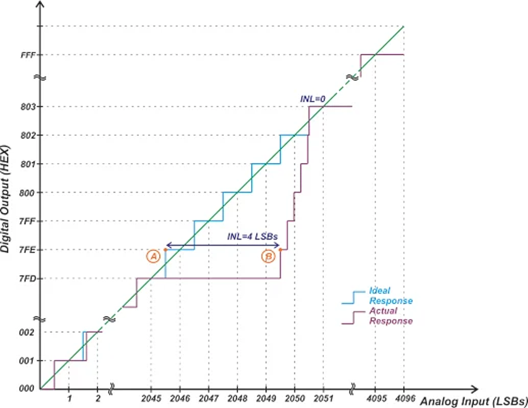
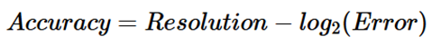
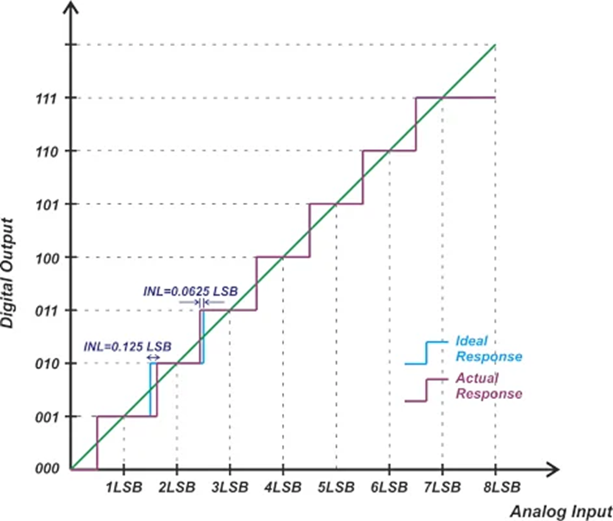
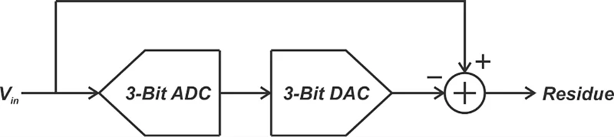
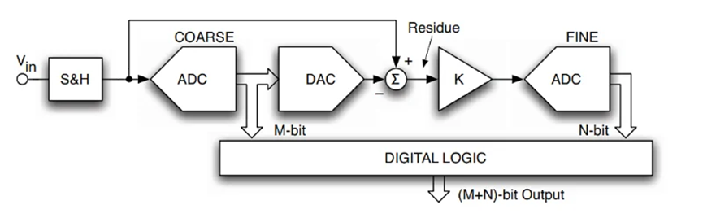
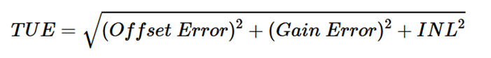

# ADC的分辨率与精度

原创 付存敬 电磁散人 2025-08-26 21:42 广东

> 原文地址: [https://mp.weixin.qq.com/s/rz8fRTDqqttLSFQAiLpq6w](https://mp.weixin.qq.com/s/rz8fRTDqqttLSFQAiLpq6w)

今天我们来讲讲电子技术里一个容易混淆的概念：模数转换器（ADC）的**分辨率**（**Resolution**）和**精度**（**Accuracy**）。别看这两个词听起来差不多，它们代表的含义可是天差地别，就像一把尺子，刻度精细不代表量得准！

**一、 ADC****的分辨率（Resolution****）：类似于尺子上的最小刻度**

**定义：**分辨率指的是ADC能把输入电压分成多少“级”。就像一把尺子有多少个最小刻度。

**表示**：通常用比特（bit）数表示。比如，一个**12-bit**的ADC，意味着它能输出**4096**（也就是2的12次方）个不同的数字代码。就像一把有4096个刻度的尺子。

**作用：**它决定了ADC理论上能检测到的最小电压变化。对于12-bit ADC，满量程电压被分成4096份，所以它能分辨的最小电压变化是满量程的**1/4096** **≈ 0.024%**。

**关键点（重点！）：**

-   **分辨率是**设计参数**，是理想情况下的能力。**
    
-   **它**只告诉你尺子刻了多少格，但完全不保证这些刻度刻得准不准！****
    
-   ****它****不反映**实际的转换误差有多大。误差是由后面要讲的非理想因素（比如积分非线性**INI、偏移）决定的。
    

**分辨率 = 最小刻度数 = 理论分辨能力**

**二、****精度（Accuracy****）：尺子刻得准不准，量得准不准**

**定义：**精度指的是ADC转换出来的数字值，和真实的模拟输入值之间，到底差了多少。简单说，就是**转换误差**有多大。

**表示：**在数据转换领域，也常用比特数来表示精度。比如，说一个ADC是“**12-bit****精度**”，通常意味着它的最大转换误差小于 **1LSB**（Least Significant Bit，最低有效位，相当于最小刻度代表的电压）。

**与分辨率的关系（核心难点！）：**

-   **精度可能远低于分辨率！**想象一把刻度很细（分辨率高）但刻歪了的尺子。
    

案例1（图1）：一个12-bit的ADC，因为存在[积分非线性误差（](https://mp.weixin.qq.com/s?__biz=MzE5MTYzNjgzOA==&mid=2247483720&idx=1&sn=bf4cecf365148440fefe5df8ff545d3e&scene=21#wechat_redirect)[INL](https://mp.weixin.qq.com/s?__biz=MzE5MTYzNjgzOA==&mid=2247483720&idx=1&sn=bf4cecf365148440fefe5df8ff545d3e&scene=21#wechat_redirect)[）](https://mp.weixin.qq.com/s?__biz=MzE5MTYzNjgzOA==&mid=2247483720&idx=1&sn=bf4cecf365148440fefe5df8ff545d3e&scene=21#wechat_redirect)，某个AD输出码的误差达到了4LSB。

图1 12-bit ADC示例

根据公式（误差值Error以LSB为单位）：

计算结果为：

12 - log₂(4) = 12 - 2 = 10 bits

这说明，虽然它标称是12-bit的尺子（刻度细），但实际量东西的误差水平只相当于一把10-bit的尺子（刻度粗但准）的最大误差（1 LSB）。**高分辨率带来的小量化噪声优势，被大的积分非线性误差淹没了。**

-   **精度也可能高于分辨率！**想象一把刻度不多（分辨率低）但刻得极其精准的尺子。
    

案例2（图2）：一个3-bit的ADC（只有8个码），它的最大INL误差只有0.125 LSB。

图2 分辨率为3 bit的ADC曲线示例

用同样的公式计算其精度：

3 - log₂(0.125) = 3 - (-3) = 6 bits

哇！这意味着这把只有8个刻度的“粗”尺子，量东西的误差水平竟然和一把有64个刻度的6-bit尺子（最大误差1LSB）一样好！这说明它的线性度做得非常好，每一步都踩得极准。

**精度** **=** **实际测量误差水平。**

**公式：精度** **(bits) =** **分辨率** **(bits) - log₂(****误差****(LSB)**

**精度和分辨率都可以用比特（bit****）来表示**，但它们代表的是**完全不同的概念：**

-   **分辨率（**bit**）：**表示 ADC 的**理论量化能力**（有多少个离散电平）。
    
-   **精度（bit****）：**表示 ADC 的**实际性能水平**（转换误差相当于多少位的理想 ADC），这个比特数是根据实际误差计算出来的等效值。
    
      
    

**三、****精度 >** **分辨率有什么用？两级ADC****的奥秘**

看图3和图4，有一种高效的ADC结构叫**两级****ADC**（也叫Sub-range或Two-step ADC）。它的工作原理很有意思：

1.**第一级 -** **粗量化 (Coarse ADC)****：**像一个快速的“侦察兵”，用较少的位数（比如3-bit）快速确定输入电压的大致范围（高位码MSB）。这会产生一个较大的“量化误差”（也叫残余信号）。

2.**第二级 -** **细量化 (Fine ADC)****：**像一个精细的“测量员”，专门负责测量第一级留下的那个残余信号（低位码LSB）。

图3 从 ADC 输入信号中减去 DAC 输出信号所得到的“残余”信号示意图

**关键点来了！**

第一级那个“侦察兵”（Coarse ADC）的**精度必须非常高**（远高于它的分辨率）！

为什么？因为如果第一级在确定大范围时就产生了较大的误差（非线性），那么它产生的残余信号本身就是**失真**的。第二级再厉害，测量的也是错误的东西，最终结果肯定不准。

同样，把第一级的数字结果变回模拟电压的DAC，以及做减法的电路（Subtractor），它们的精度也必须非常高，否则残余信号也会出错。

将图3的概念扩展，可以得到图4的完整的系统结构：

图4 Sub-range或Two-step ADC的系统框图

**该种ADC****电路结构的优点**：这种结构可以用比全闪存ADC（Flash ADC）少得多的比较器（如12位ADC仅需两级共几十个比较器，而非4096个）来实现高分辨率，省面积、省功耗、速度快（相对逐次逼近型）。但前提就是第一级和相关电路必须“**踩点准**”（高精度）！

**四、****如何综合评估精度？使用“总未调整误差（TUE****）”**

实际ADC的误差来源很多：零点不准（Offset Error）、放大倍数不准（Gain Error）、[积分非线性误差（](https://mp.weixin.qq.com/s?__biz=MzE5MTYzNjgzOA==&mid=2247483720&idx=1&sn=bf4cecf365148440fefe5df8ff545d3e&scene=21#wechat_redirect)[INL](https://mp.weixin.qq.com/s?__biz=MzE5MTYzNjgzOA==&mid=2247483720&idx=1&sn=bf4cecf365148440fefe5df8ff545d3e&scene=21#wechat_redirect)[）](https://mp.weixin.qq.com/s?__biz=MzE5MTYzNjgzOA==&mid=2247483720&idx=1&sn=bf4cecf365148440fefe5df8ff545d3e&scene=21#wechat_redirect)。怎么把它们合起来看总的精度呢？工程师们常用一个指标：**总未调整误差（****Total Unadjusted Error, TUE****）**。

计算公式为（单位通常为LSB）：

计算举例：一个12-bit ADC：Offset Error = 2.5LSB，Gain Error = 3LSB，INL = 3LSB，则有：

TUE = √(2.5² + 3² + 3²) = √(6.  25 + 9 + 9) = √24.25 ≈ 4.92 LSB

再用上文使用的精度计算核心公式计算精度：

精度 = 12 - log₂(4.92) ≈ 12 - 2.3 ≈ 9.7 bits 

这说明，考虑所有主要误差后，这个标称12-bit的ADC，实际精度大约是9.7-bit。

**校准的作用：**我们可以通过校准电路或软件算法把Offset和Gain Error基本消除掉（调到接近零）。这样，剩下的主要误差就是INL了，它就成了精度的瓶颈。高精度ADC设计必须攻克INL！

**五、****重要提醒：系统级思考**

-   **ADC****不是唯一误差源！**要记住，给ADC提供信号的输入缓冲器（Input Driver）、提供基准电压的电压源（Voltage Reference）等外围电路，都会引入额外的误差。设计高精度系统时，**整个信号链**都需要优化。
    
-   **校准是关键：**为了达到最佳性能，校准Offset和Gain几乎是必须的，这样才能让INL这个“硬骨头”暴露出来并被解决。
    

**六、****总结：分辨率与精度的辩证关系**

至此，我们彻底搞清楚了：

-   **分辨率 (Resolution)**：是理论能力，代表“尺子的最小刻度有多细”。它决定了**量化噪声**的大小（刻度越细，四舍五入误差越小）。
    
-   **精度 (Accuracy)**：是**实际表现**，代表“尺子刻得准不准，量得准不准”。它主要由**积分非线性误差** **(INL)** 等非理想因素决定。
    
-   **两者关系：**可以独立变化！高分辨率不等于高精度（案例1），低分辨率也可能实现高精度（案例2）。
    
-   **设计启示：**
    
    追求高分辨率？主要是为了**降低量化噪声**。
    
    追求高精度？核心是**抑制积分非线性误差** **(INL)**，尤其是在多级ADC（如两级ADC）中，第一级的精度至关重要。
    
-   **评估工具：**使用**TUE**来综合评估ADC的总误差，并推广到评估整个信号链的性能。
    

  

下次看到ADC的位数（分辨率），一定要多问一句：它的精度（尤其是INL）到底怎么样？**别被“高分辨率”的标签迷惑了！**就像买尺子，不能只看刻度密不密，关键得看刻度准不准！

（原文出处：https://www.allaboutcircuits.com/technical-articles/adc-resolution-vs-adc-accuracy-subrange-adc-two-step-adc-and-total-unadjusted-error/）