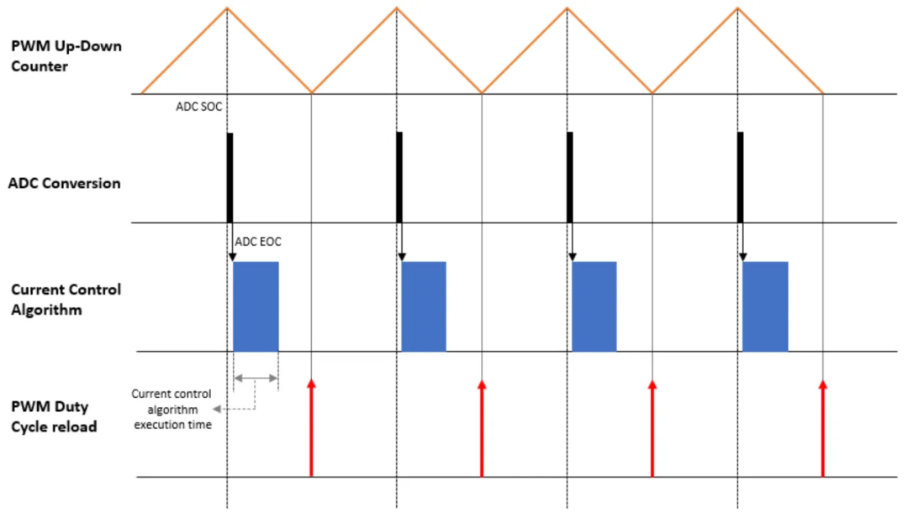
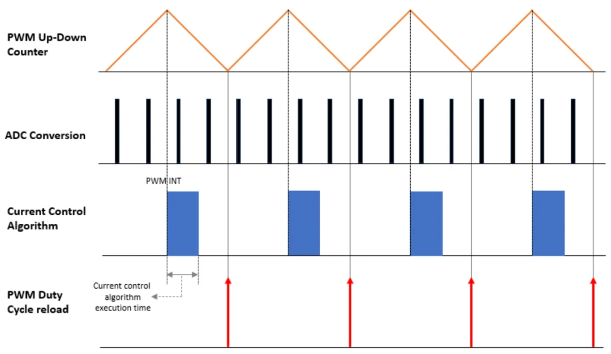
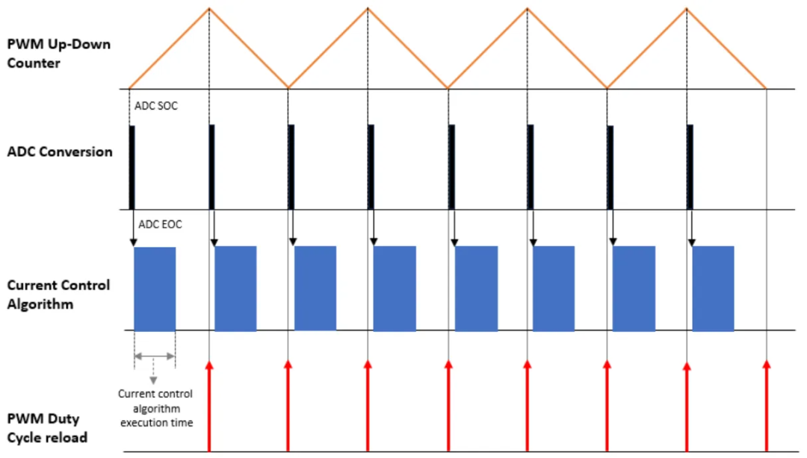
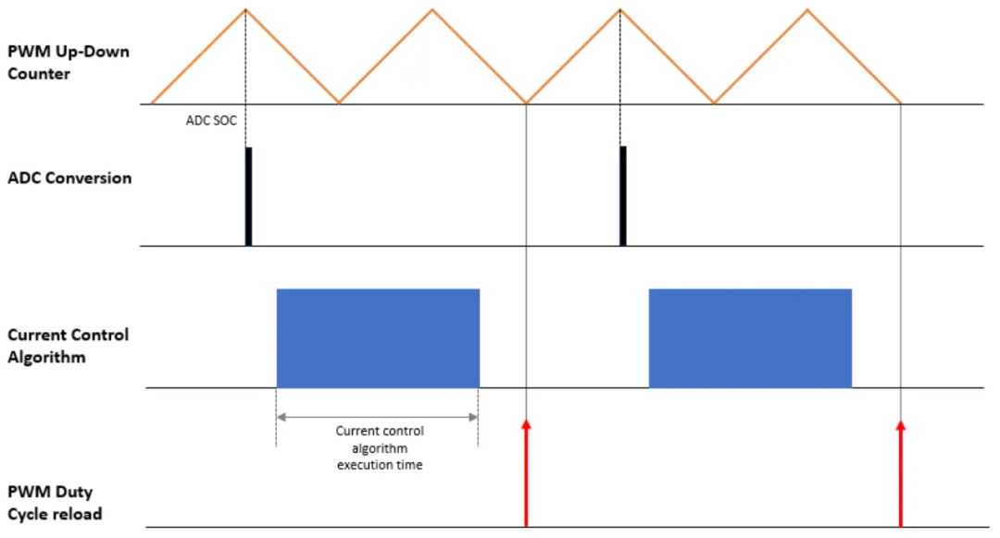
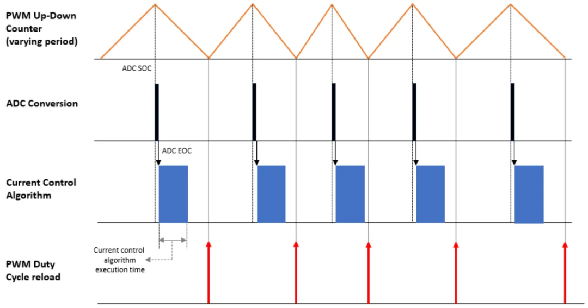
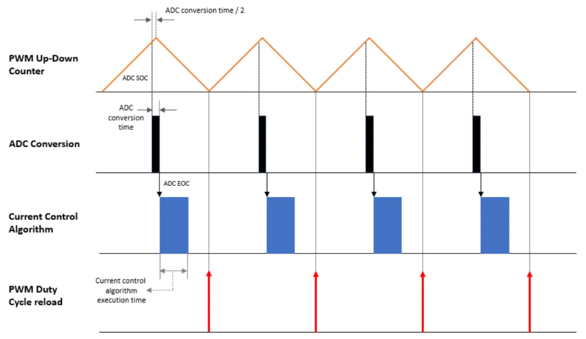
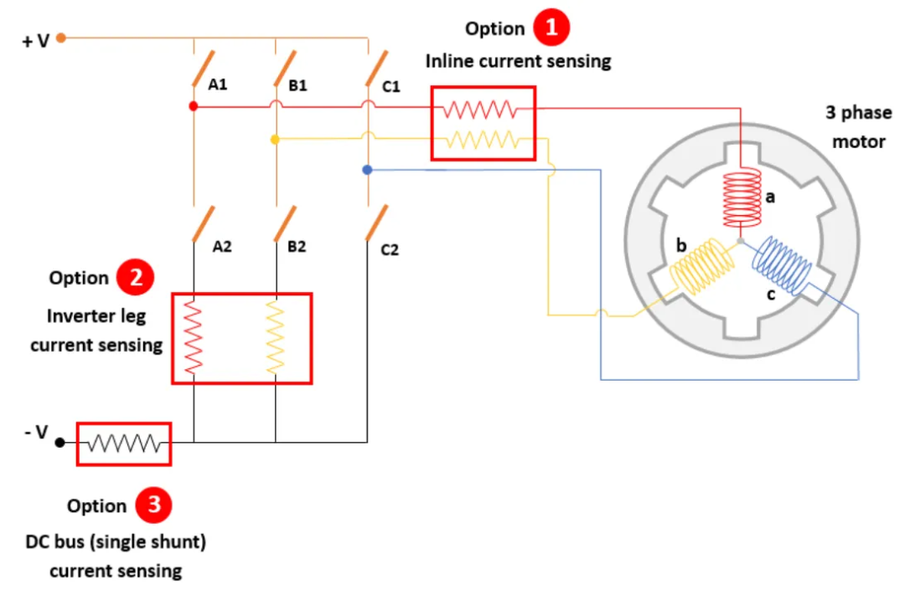

# PMSM磁场定向控制下 7 种ADC采样架构对比

原创 傅存敬 电磁散人 2025-08-28 21:11 广东

> 原文地址: [https://mp.weixin.qq.com/s/OCL5n\_LOxiIIPATl4UjObQ](https://mp.weixin.qq.com/s/OCL5n_LOxiIIPATl4UjObQ)

今天我们来讲一讲永磁同步电机（PMSM）的调速问题，用的是非常主流的方法——磁场定向控制（FOC）。就像要让一台精密的机器跑得又稳又快，关键是给它下达指令的时间和方式要恰到好处。这篇文档就好比是工程师们的实验笔记，详细比较了7种不同的“发号施令”方式！它们核心的区别就在于：采样电流、更新PWM波形的时机、以及计算指令的速度是怎么配合的。我们一起来盘一盘！

1\. 标准套餐型：同步ADC-PWM

**做法：** 这是最基础、最常用的方法，像标准流水线作业。

**节奏：** PWM波像一个来回晃的钟摆（上下计数），每次晃到中间点（Center），就立刻采样一次电流和位置（ADC触发）；采完样结果一出来（ADC EOC），控制算法马上计算，然后立刻设定下一个周期PWM波的“占空比”（Duty Cycle）。就像在钟摆荡到中点时精准测量和调整下一次的幅度。

**优点：** 好理解、好预测、系统同步性好，不容易混乱。

**缺点****：** 采样、计算都卡在这个节奏上，稍微复杂点的任务就显得有些笨拙。好比每个动作都要严格踩点，没有多少灵活调整的空间。

2\. 精打细算型：ADC过采样

**做法：** 不想花钱买更贵的传感器（高精度ADC）？那就勤快点，多量几次算平均！

**节奏：** PWM波的“钟摆”还是按自己原来的速度晃。但是！在一个完整的PWM周期内，它会多次触发ADC采样（比如晃2下、3下都测量一次）。最后，控制算法在周期中心点启动，把这一大堆采样数据平均一下，算出下一个周期的占空比。

**优点****：**

-   **省钱****了！** 提高测量分辨率，“放大”了小信号的变化（比如微弱电流波动）。
    
-   **降噪了！** 多次平均能抵消一些随机干扰。
    
-   **能分工！** 采样、计算、PWM更新这几个步骤可以在不同核心或多处理器上同时干（并行），效率变高。
    

**缺点：**

-   **只能用“高端电流计”（相位线电流测量）**，不能用更简单便宜的下桥臂电流检测方式了（因为后者要求特殊的采样时机）。
    

3\. 勤快管家型：PWM双更新

**做法：** 感觉一个周期调一次不够精细？那就拆成两半！中间再插一次调整。

**节****奏：**PWM波的“钟摆”速度没变。但是，ADC采样和算法计算的频率是它的**两****倍**！这意味着：在每个PWM周期的**起****点**和**中心点**都会采样一次。每次采样结果出来，算法立刻计算，然后分别更新**下一个半周期**的占空比。相当于一个周期内发两次指令。

**优点：**

-   **控制更细腻****！** 相当于把一个大动作拆成两个小动作，电机速度和位置控制得更准、响应更快。
    
-   **运行更平稳****！** 动作拆分后，过渡更顺滑，速度变化不突兀。
    
-   **电流更平了！** 电流纹波小了，电机出力更稳，噪音振动也小了。
    

**缺点：**

-   **同****样只能用“高端电流计”**。
    
-   **活变多了！** 计算量翻倍，对处理器要求高了（相当于管家要跑两趟）。
    

4\. 速度狂魔型：超快PWM

**做法：** 想让电机响应更快、开关损耗更低？那就拼命提高PWM频率呗！但计算跟不上怎么办？让它少算点！

**节奏：** PWM波的“钟摆”晃得飞快（频率**加倍**）。但是，ADC采样和计算算法的频率**保持原样（减半）** 。算法在每**两个**完整PWM周期里才跑一次（跑的时候采样），设定下两个周期的占空比。

**优点：**

-   **省钱（硬件层面）！** 用相对弱一点的廉价处理器，也能实现高频率的PWM输出（硬件开关速度快）。
    
-   **干活压力小了！** 算法有更多时间（两个周期）去算复杂的东西，或者用更便宜的芯片。
    

**缺****点：**

-   **耗电大户！** 开关次数加倍，能量损耗在开关管上的也多了（费电）。
    

5\. 神秘隐身型：PWM抖动（PWM Dithering**）**

**做法：** 想降低电路干扰（EMI）或者减少电机嗡嗡声？试试把“钟摆”的晃动节奏故意变一变！

**节奏：** PWM波的频率（“钟摆”速度）不是固定的，是在一定**范围内变化**的（抖动）。但是，每一次周期中心点（Center）还是会触发ADC采样和算法计算（与基础同步一样）。

**优点：**

-   **干扰变小****了！** 分散了电磁干扰能量，降低了特定频率的噪音和EMI。
    

**缺点：**

-   **太烧脑！** 实现起来比较复杂，对硬件和软件要求高，不是随便一个处理器都能搞好。而且抖动范围受算法计算时间限制。
    

6\. 时间魔术师型：提前ADC触发（补偿延迟）

**问题来源：** 标准方法里，ADC采样本身是需要时间的！等它把数据采集完，中心点可能都过了，限制了能调整的最小占空比（比如不能把油门踩得太小），也给算法预留的时间变短了。

**做法：**“我预判你的预判”！在标准中心点触发时间**往前挪一点**（提前约ADC转换时间的一半）。这样，ADC转换过程刚好能“跨坐”在中心点上完成，结果刚好在算法需要的时候出来。

**优点：**

-   **油门能踩得****更小了！** 最小可实现占空比变大（控制范围下限提升）。
    
-   **干活时间充****裕了！** 算法有更多时间来执行复杂任务。
    

**缺点：**

-   **硬件/****软件要有点本事！** 需要支持设置特定的触发比较点（不一定是0或最大值）。

-   **提前量****不好算！** 精确算出需要提前多少（补偿值）需要知道ADC转换时间，这个时间有时不那么固定。

7\. 抠门老板型：单电阻电流检测

**做法：** 电流采样太费钱（三个独立的传感器或电阻）？工程师说：能省则省！只用**一个电阻**接在公共回路上（DC link），通过聪明的**数学算法（单电阻重构）**，反推算出三相电流！然后用这个“算出来”的电流去做FOC控制。

**优点：**

-   **真省钱！** 硬件大大简化，成本哗啦哗啦地降。
    
-   **布线也简单了！** 电路板上少了好多线。
    

**缺点****：**

-   **低速****迷糊！** 电机跑得很慢时，这种“算”出来的电流特别不准，位置也难算准。控制效果可能就差了。
    
-   **动作****慢了、喘气了！** 动态响应不如双/三电阻方式快。扭矩可能有“波动”（扭矩脉动），电机出力没那么稳。
    
-   **算不好会“抖”**：重构算法做得不好，扭矩波动会更明显。
    

所以你看，工程师们为了驯服一台永磁同步电机，真是操碎了心！就像指挥一个精密乐团，采样电流是耳朵在听（收集信息），PWM是乐手的手（输出指令），控制算法是整个指挥的大脑（做决定）。这7种架构，核心就是调整这三者的**节奏配合、工作频率和实现方法**，追求的目标各不相同：

-   **图省****事好理解？** 选**同步****ADC** (基础) 或 **超快****PWM** (高频PWM需求+低成本处理器)。
    
-   **电流测准点、干扰小****点？** 考虑 **ADC过采样**。
    
-   **控制得更精细、响应****更快？****PWM双更新** 值得一试（就是处理器累）
    
-   **被高频干扰/噪音困****扰？** 试试 **PWM抖动** (实现有门槛)。
    
-   **想尽量压榨控****制范围、给算法多点时间？** 试试 **提前ADC触****发** (算提前量要花功夫)。
    
-   **只想省成本？****单电阻电流检测** 是真省钱，但在低速和动态性能上就要有牺牲，还可能有点噪声（扭矩波动），“一分钱一分货”在这里适用。[这就是工程上的平衡与取舍啊！选择哪种方式，就看你的钱包、你的处理器、你的控制器和电机到底需要啥！](https://mp.weixin.qq.com/s?__biz=MzE5MTYzNjgzOA==&mid=2247483772&idx=1&sn=87e75ec510ae9378ee0fa23ef51193c9&scene=21#wechat_redirect)
    

  

（原文出处： https://www.mathworks.com/help/mcb/gs/motor-control-using-different-current-sampling-pwm-frequencies.html）