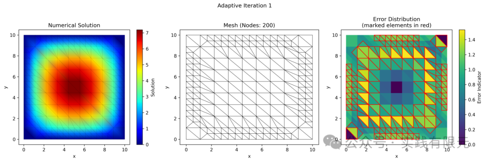
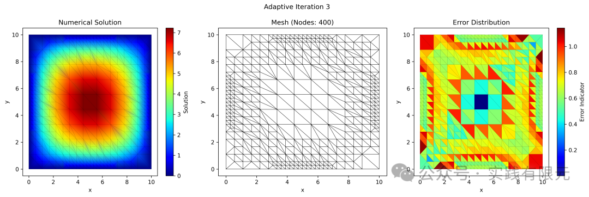
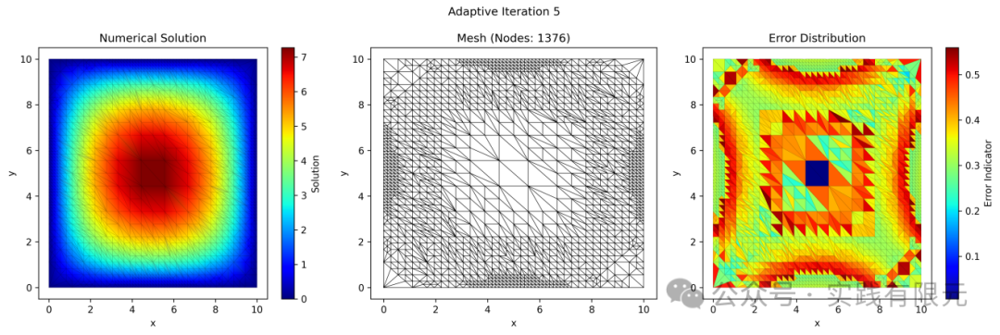
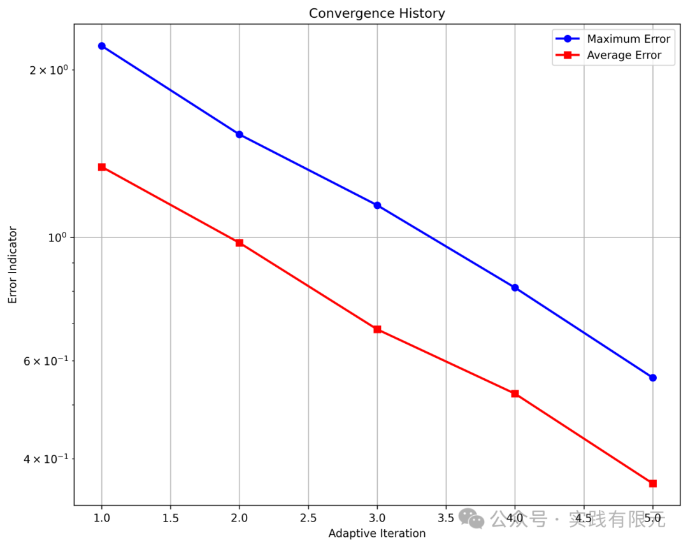
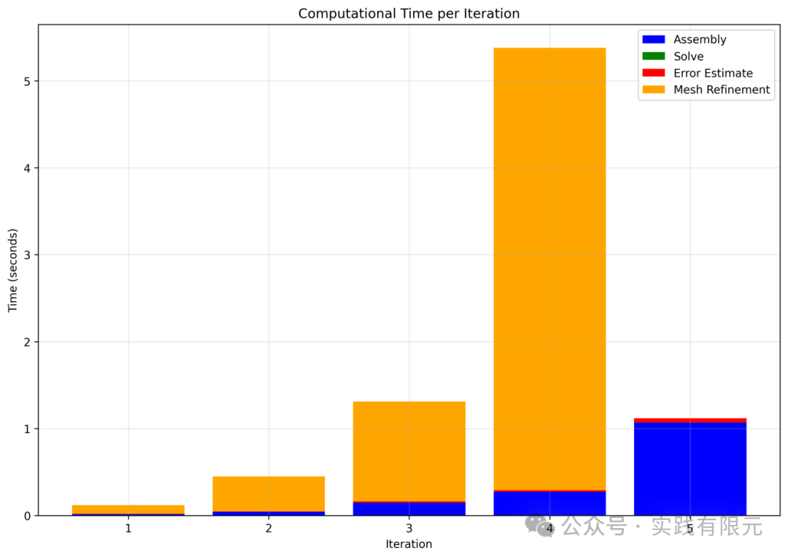
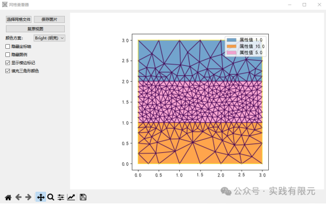

# AI-cusor实现二维泊松方程的自适应有限元

> 原文地址: [https://mp.weixin.qq.com/s/q5GnfnOkzoPSIHGsDhQybA](https://mp.weixin.qq.com/s/q5GnfnOkzoPSIHGsDhQybA)

**简介**  

**最近深感AI的强大，学习了如何使用，实战了二维泊松方程太容易，十多分钟就搞定，又加了自适应网格，这才花了半天的时间，确实感觉cursor很牛逼。**

**以下全部为AI-cusor生成内容，代码使用python实现，全程没有敲过一个代码，全部复制粘贴，最后让cusor帮我写了个word文档，包括公式、各种绘图，全部都可以实现。**

**\-------------------------------------**  

Adaptive Finite Element Method for Poisson Equation

Generated on: 2024-11-19 11:08:14

Theoretical Background

Problem Statement

The Poisson equation is a second-order elliptic partial differential equation:

\-Δu = f    in Ω

u = 0      on ∂Ω

where Ω is the computational domain, ∂Ω is its boundary, and f is the source term.

Variational Formulation

The variational form of the Poisson equation is:          Find u ∈ H¹₀(Ω) such that:            
a(u,v) = (f,v)    ∀v ∈ H¹₀(Ω)            
where:            
a(u,v) = ∫\_Ω ∇u·∇v dx            
(f,v) = ∫\_Ω fv dx

Finite Element Discretization

The domain is triangulated and we use piecewise linear functions (P1 elements):          • The solution is approximated as: u\_h = Σᵢ Uᵢφᵢ            
• Test functions are: v\_h = φⱼ            
This leads to the linear system:            
AU = b            
where:            
Aᵢⱼ = ∫\_Ω ∇φᵢ·∇φⱼ dx            
bⱼ = ∫\_Ω fφⱼ dx    

Adaptive Strategy

The adaptive procedure follows these steps:          

·SOLVE: Compute the finite element solution u\_h

·ESTIMATE: Compute error indicators η\_T for each element T

·MARK: Select elements for refinement using Dörfler strategy

·REFINE: Refine marked elements while maintaining mesh conformity

Error Estimation

We use residual-based error estimators:          η\_T² = h\_T² ‖f + Δu\_h‖²\_T + Σₑ h\_s ‖\[∂\_n u\_h\]‖²\_s            
where:            
• h\_T is the element diameter            
• h\_s is the edge length            
• \[∂\_n u\_h\] is the jump of normal derivatives across edges

\_\_\_\_\_\_\_\_\_\_\_\_\_\_\_\_\_\_\_\_\_\_\_\_\_\_\_\_\_\_\_\_\_\_\_\_\_\_\_\_\_\_\_\_\_\_\_\_\_\_

Numerical Results

Iteration History

Iteration 1

Number of nodes: 200          Maximum error: 2.21e+00          Average error: 1.34e+00          Computation time:            
Assembly: 0.014s          Solve: 0.000s          Error Estimate: 0.003s          Mesh Refinement: 0.103s    

Final Solution and Mesh:

Convergence History:    

Computation Time Statistics:    

Total iterations: 5          Final number of nodes: 1376

Convergence History

Iteration

Maximum Error

Average Error

1

2.21e+00

1.34e+00

2

1.53e+00

9.78e-01

3

1.14e+00

6.83e-01

4

8.12e-01

5.24e-01

5

5.59e-01

3.61e-01

Timing Statistics

Stage

Average Time (s)

Total Time (s)

Assembly

0.309

1.544

Solve

0.001

0.005

Error Estimate

0.017

0.087

Mesh Refinement

1.685

6.742

Total

1.892

9.460

**\---------------  
**

**使用总结**

1.cursor确实很强大，整个流程基本上不需要会编程，之所以选择python就是因为我本身不太熟悉。全程包括安装，使用，安装库，全部给出指令、代码，只需要按照提示流程来执行；

2.对于简单的小程序而言，cursor非常快速，但是如果修改次数过多，会导致上下文较多，有时候会比较慢，比如我做了一个二维网格可视化的小工具，最后就直接不回答了。小工具的结果也秀一把吧（整个过程花了2个小时）。

3.可以不会编程，但是必须得知道如何实现，比如实现泊松方程的过程非常容易，使用结构化的三角形网格实现，但是在自适应过程中，cursor在局部加密网格中始终错误，最终是一步一步给他说如何局部加密成有效网格，多次迭代后才得到如上的结果。

4.可能使用技巧还有很多没有挖掘，接下来会逐步尝试用cursor实现更加复杂的编程。