# AI学习-快速实现二维曲边有限元-Possion方程

> 原文地址: [https://mp.weixin.qq.com/s/AXqVVEuYg98F7JPzgVK26w](https://mp.weixin.qq.com/s/AXqVVEuYg98F7JPzgVK26w)

简述

本文通过AI的帮助，快速实现了二维曲边有限元案例的实践与学习。

相比于直边有限元，曲边有限元能够更好地贴合复杂几何形状的边界，尤其是在处理曲线或曲面边界时，能够显著提高几何描述的精度，减少几何离散化误差。

下面通过AI的帮助，总结曲边有限元的实现流程。

1.边值问题

边值问题依然采用最常见的二维泊松方程。

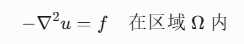

边界条件可以根据需求，添加第一类边界条件进行约束。其有限元方法与直边有限元推导结果一致：

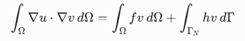

当处理为第一类边界条件时，第三项可以不考虑。将连续空间离散到每个三角形网格中，可以得到：

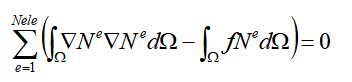

2.gmesh生成曲边三角形网格

对于曲边有限元，为了能表示其曲边性质，一般采取二阶三角形网格来描述，其本质是原本直边三角形中三个高阶点不再落在棱边上，而是根据原有几何模型，落在该棱边的实际几何模型上。    

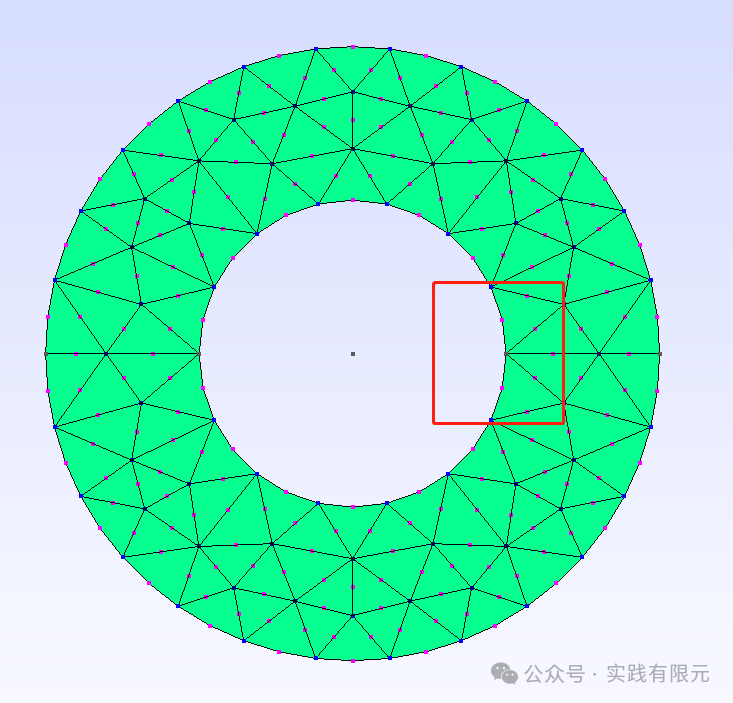

如图生成的曲边有限元，三角形的高阶点在几何模型是曲边的地方并不落在三角形的直边上，而是契合几何模型的位置。

因此，生成的网格每个单元需要有六个节点来描述，即：

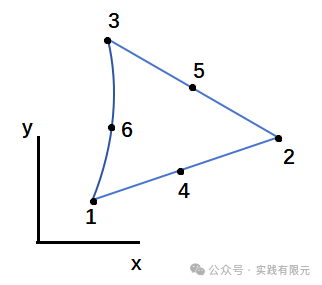

3.曲边单元基函数

相对于直边三角形，可以直接通过面积坐标在原坐标系中直接求解线性基函数而言，曲边三角形直接在原始坐标系中处理相对麻烦。

因此，首先将曲边三角形映射到参考直角三角形中，通过雅可比坐标转化矩阵连接实际曲边三角形与参考直角三角形。

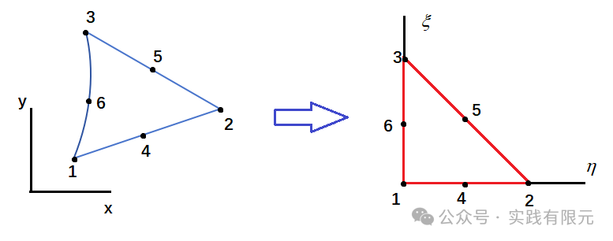    此时，对于右边的参考标准三角形，其二阶形函数很容易获得，与直边三角形一致：

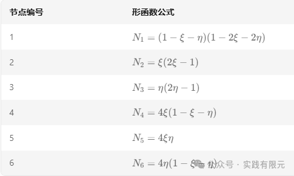

其基函数，满足任意点落在节点位置时，对应形函数为1，其他形函数为零。对应的梯度也很容易获得:

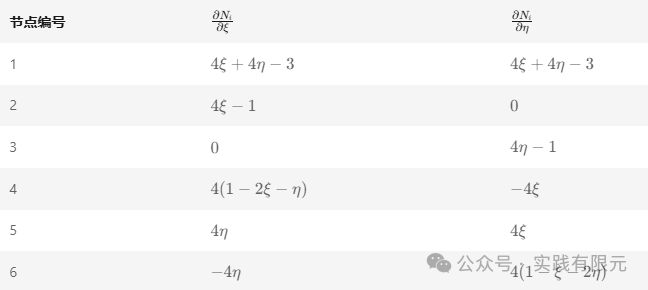

接下来是雅可比矩阵的推导，对于任意实际坐标系中的（x,y）,其均可通过形函数Ni和节点坐标（xi,yi）表示为：

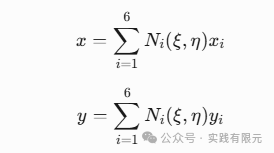

其中形函数是关于参考坐标系的函数，因此（x,y）是参考坐标系  
的函数，对x,y坐标系求导，

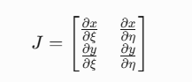    

将x表示为插值形函数形式，带入：

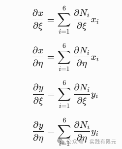

因此，雅可比矩阵可以写成：

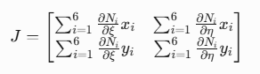

4.单元系数矩阵 

已知的系数矩阵实在xy坐标系中，因此需要对参考形函数和实际形函数进行转化：

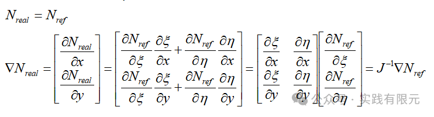

对于微分子的映射，将雅可比矩阵的行列式看成三角形面积，如此就很容易得到：

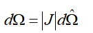

将上述推导带入到单元系数矩阵与右端项中，最终得到：

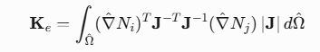

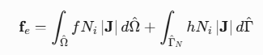

观察可以发现，曲边三角形的信息完全存在了雅可比矩阵中，参考形函数仅仅需要使用直边坐标系的方式就可以获得获得形函数。并且参考直边三角形是一个标准三角形，可以通过高斯积分求解获得，从而也避免了对单元矩阵系数的直接推导。    

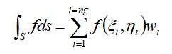

对于二阶三角形高斯积分的积分权重与积分点为：

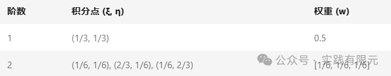

至于组装与边界条件加载均和直边三角形有限元一致，将单元系数矩阵根据节点到全局节点的映射关系一一组装起来。

对于边界条件加载采用赋值1或者乘以大数的方法均可以实现。

5.结果

测试模型内半径=1，外半径=2，剖分得到环状网格：

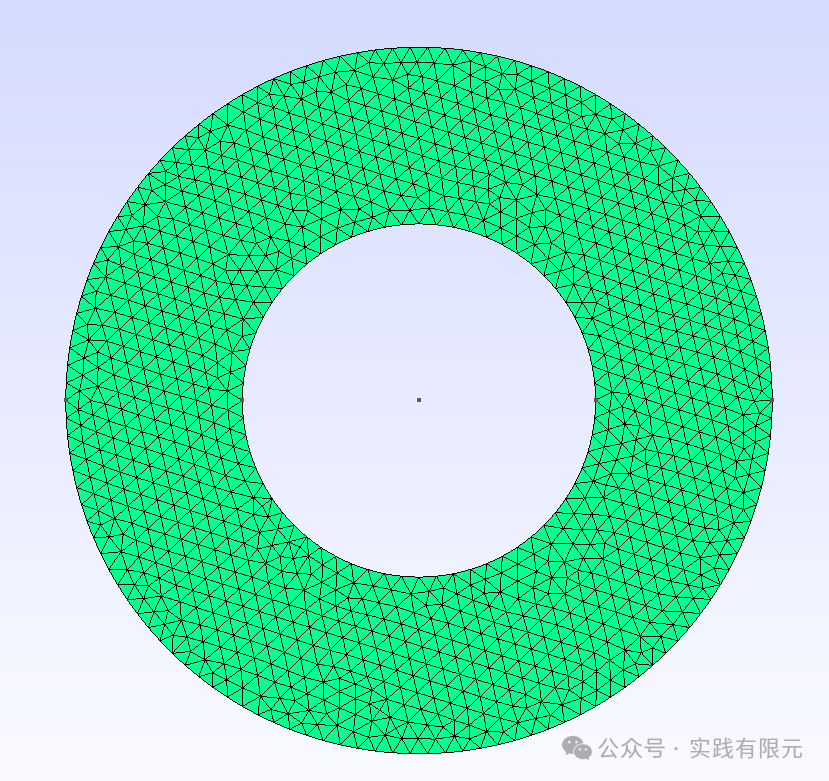

Eg1.当具体边值问题为泊松方程：

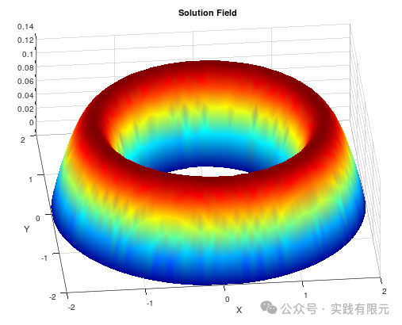

Eg2.当具体边值问题为拉普拉斯方程

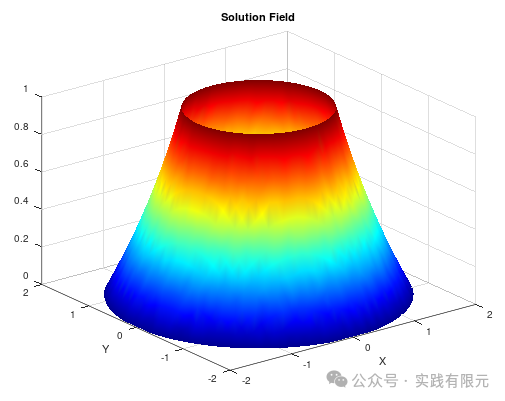

对于拉普拉斯方程的通解，在r=1,u=1，r=2,u=0的边界条件下，其具有理论公式：

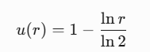

对比数值解，二者是完全一致的。  

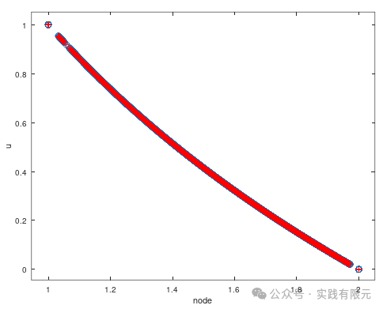

从二者的图形结果来看，求解结果是正确的。

总结

1.整个实现流程代码，全部基于AI帮助写，更多的是一步步告诉它我要做什么，例如首先让它帮我生成gmsh网格，然后让他读网格信息，最后写曲边有限元的泊松方程。过程中不明白的地方直接截图为AI，理论公式什么的全部让AI推导，直到推导到能看懂为止。

2.代码中，除了修改了几个小bug之外，基本上没有动手写。但是自己要明白每个子函数地方大致是怎么回事，结果错误的时候除了问AI，如果自己能分析出来最好。

3.做该例子的缘由是想要熟悉曲边有限元的实现过程，尤其是想要深入了解下雅可比矩阵在两个坐标系中的转化过程，通过AI也确实快速深入学习了的这部分内容。

* * *

博主长期深入实践电磁学领域的有限元技术，感兴趣的朋友可以添加博主公众号，欢迎共同探讨与有限元相关的技术知识。