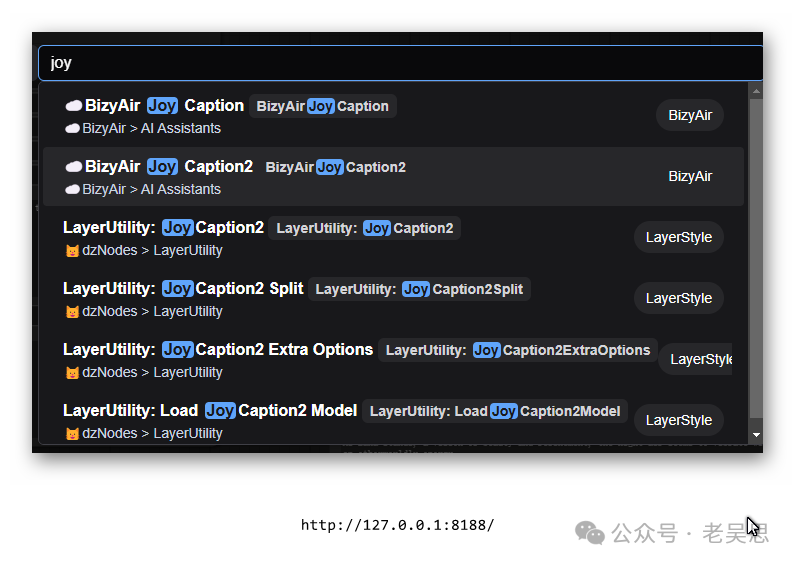
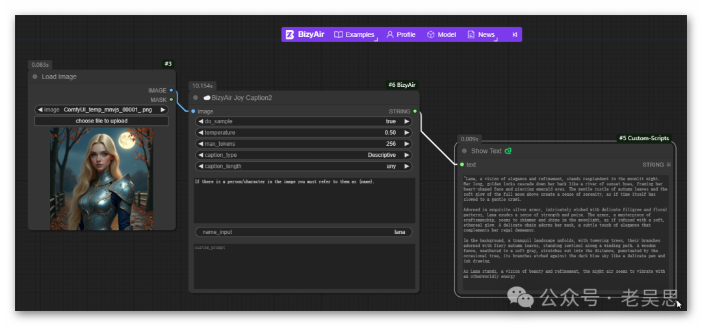
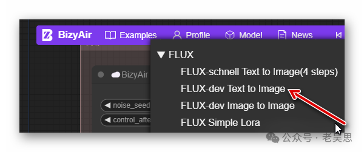
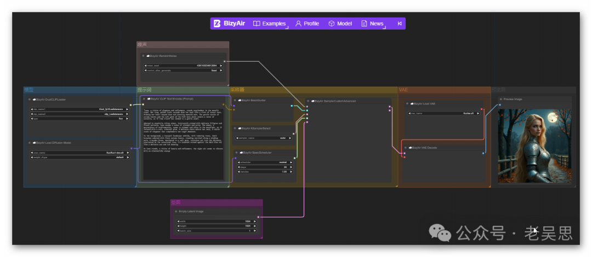
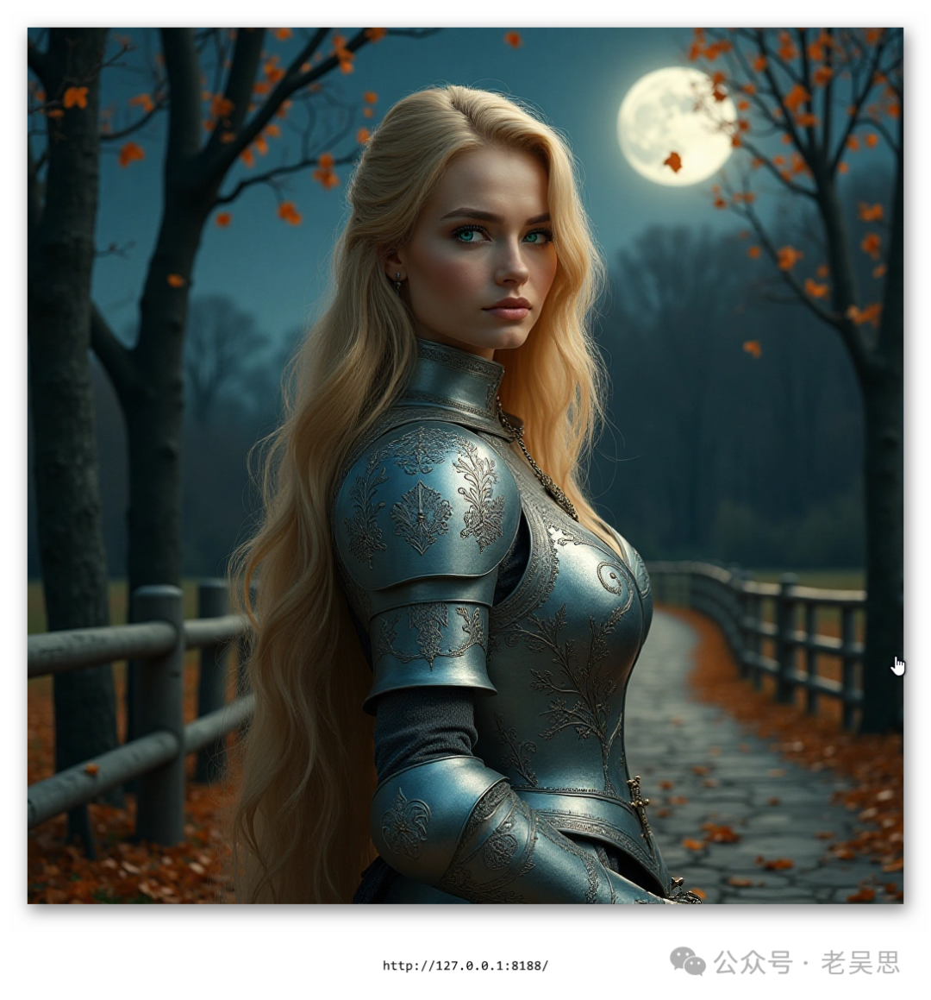

# BizyAir极速体验文生图和提示词反推


> 原文地址: [https://mp.weixin.qq.com/s/rr5sA-UJf9bdILGR7OnZVA](https://mp.weixin.qq.com/s/rr5sA-UJf9bdILGR7OnZVA)

1、下载安装

直接从https://github.com/siliconflow/BizyAir下载安装。

重启comfyui

2、添加joy caption2节点  

在空白区双击，输入joy，选择第二个  



再添加两个节点：  



对图片的女主角取名lana，运行得到提示词

```
"Lana, a vision of elegance and refinement, stands resplendent in the moonlit night. Her long, golden locks cascade down her back like a river of sunset hues, framing her heart-shaped face and piercing emerald eyes. The gentle rustle of autumn leaves and the soft glow of the full moon above create a sense of serenity, as if time itself has slowed to a gentle crawl.
```

```
“拉娜，优雅精致的化身，在月夜中光彩夺目。她金色的长发像落日的河流一样倾泻而下，勾勒出她心形的脸庞和翠绿色的双眼。秋叶的沙沙声和头顶上满月的柔和光芒营造出一种宁静的感觉，仿佛时间本身也慢了下来。
```

把反推的提示词再用于文生图：





原图：


文生图：  



可以看出FLUX.1模型在背景，服装，人物造型上非常稳定