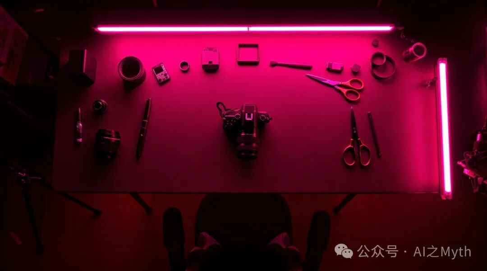
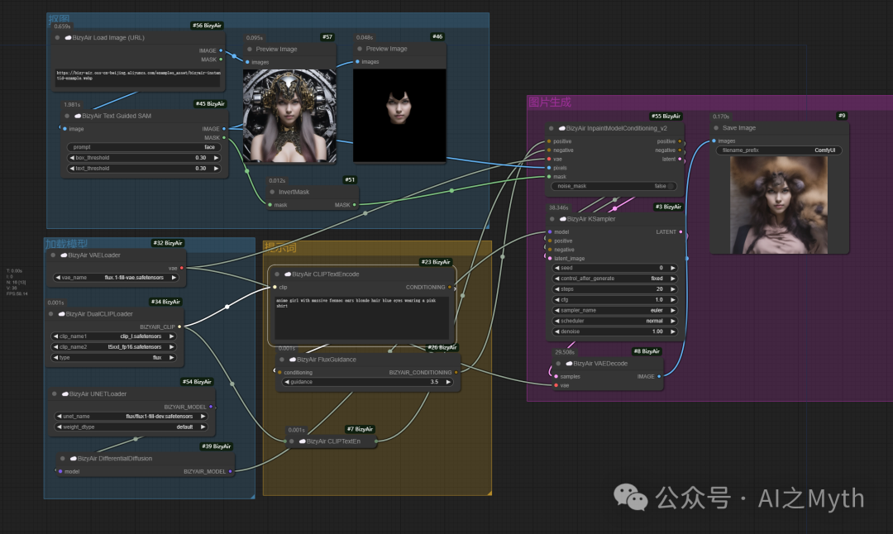
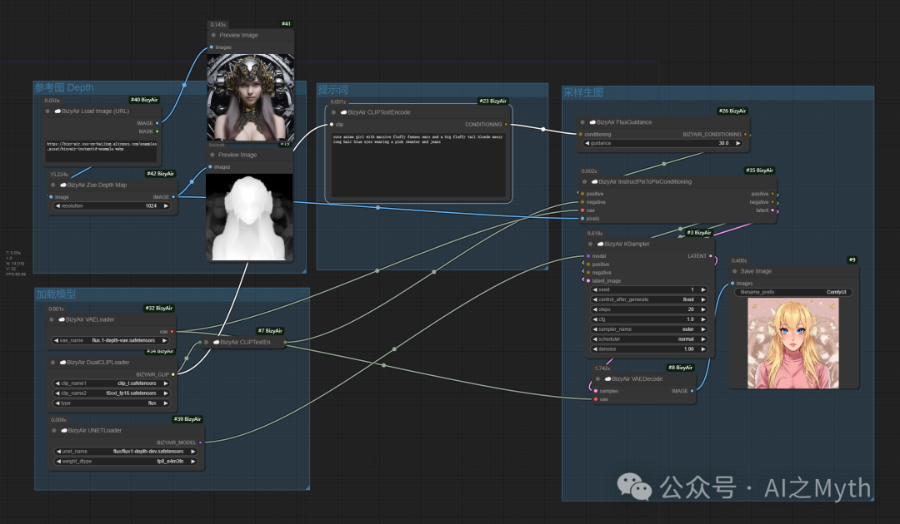
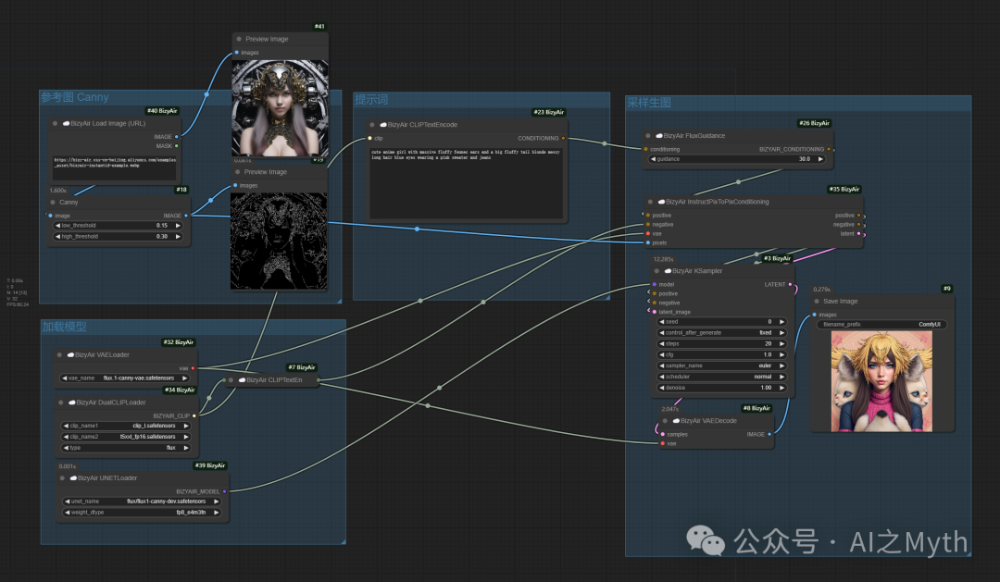
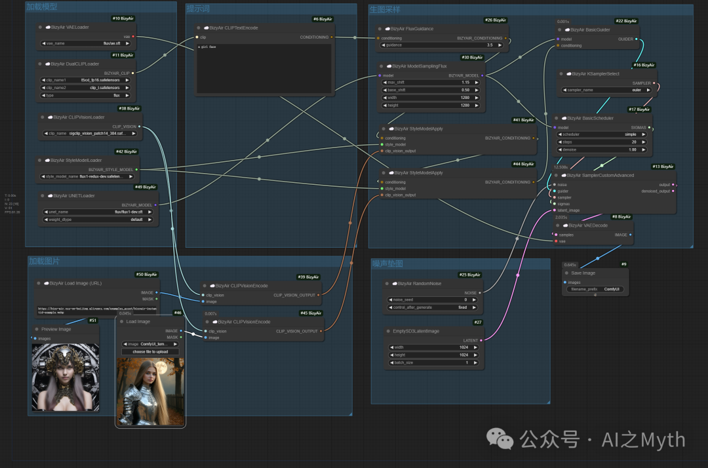
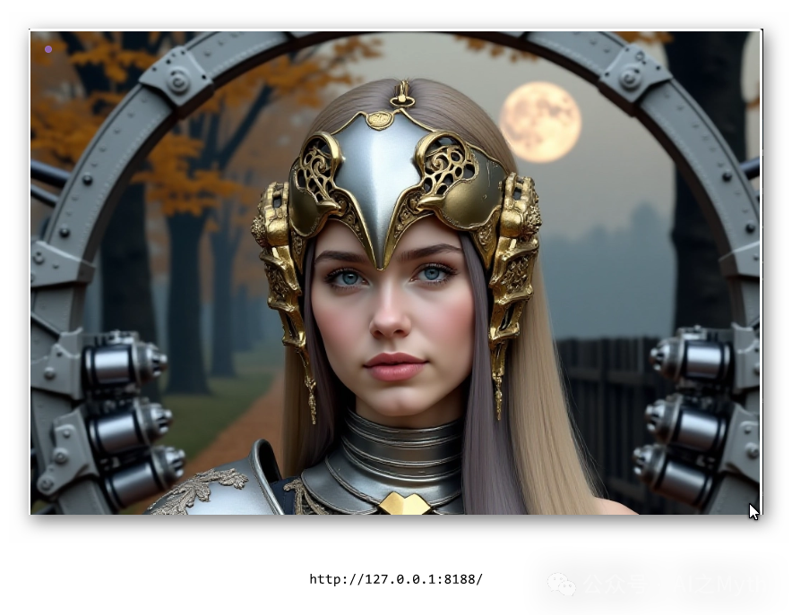

# FLUX.1-Tools简介


> 原文地址: [https://mp.weixin.qq.com/s/Z9g0piARPA05F4KkKmfpkA](https://mp.weixin.qq.com/s/Z9g0piARPA05F4KkKmfpkA)



下面将深入介绍 FLUX.1 Tools 中与图像结构化编辑、结构引导生成相关的高级模块，包括 **FLUX.1 Fill**、**FLUX.1 Depth**、**FLUX.1 Canny** 以及 **FLUX.1 Redux**。这些功能代表了FLUX.1 Tools的高阶应用场景，它们不仅侧重于参数控制与流程逻辑，还让你能够直接对图像结构进行操控、编辑和扩展，从而实现更高层次的创意表达。

请想象以下内容中描述的流程、节点与结果：

-   通过这些节点，你可以对已有图像进行局部修补（inpainting）、在图像外添加新内容（outpainting）、根据深度图或边缘图来保证图像结构的一致性，还能将输入图像和文本提示的特征综合再现为新作品。
    
      
    

* * *

## 一、FLUX.1 Fill：高级的Inpainting与Outpainting

**功能概述**：  
FLUX.1 Fill 提供了最先进的图像填补（inpainting）和扩展（outpainting）功能。传统的inpainting能在已生成图或真实图像中，根据用户提供的遮罩区域和文本描述，智能填补空白或修补不想要的元素；outpainting则能在图像边缘以超出原图范围的扩展方式，创建新的视觉内容，仿佛为图像“加宽”画布。

**关键点**：

-   **State-of-the-art模型**：FLUX.1 Fill使用的模型训练精良，能在修补或扩展时匹配原有图像的光照、风格和纹理，使修补区域无缝融入整体画面。
    
-   **Text-driven guidance**：不仅是简单的修补，还可用文本来指定在填补或扩展区域中出现的内容，例如：“在左上角的空白处补上一个奇幻的飞龙”或“在右侧扩展出郁郁葱葱的森林”。
    
-   **Binary Mask Input**：通过一个二进制遮罩图指定需要修改的区域（1表示需要填补或修改的区域，0表示保持原貌的区域）。
    

**应用场景**：

-   修复生成图中局部不满意的细节，如改善人脸的眼睛部分。
    
-   给现有的摄影作品增加新元素，如在街景照片的空白区域填入树木、建筑或艺术元素。
    
-   对原有图像进行横向或纵向扩展，将一张局部图像扩展为更广阔的风景。
    

**示例流程**：



## 在这个工作流中，先从原图人物抠出脸蛋，再通过提示词来合成：

“长着巨大耳廓耳的金发蓝眼动漫女孩，身穿粉色衬衫”

```
anime girl with massive fennec ears blonde hair blue eyes wearing a pink shirt
```

## 二、FLUX.1 Depth：基于深度图的结构引导

**功能概述**：  
FLUX.1 Depth 模型通过参考输入图像的深度信息（Depth Map）来作为结构化引导。这意味着生成的新图像会在整体构图中尽可能地保持与原图相似的空间布局与物体前后关系。同时，你可以再加上一条文本Prompt描述新的场景变化，从而在保持结构基础上改变内容或风格。

**关键点**：

-   **Depth Map作为结构约束**：Depth Map是从输入图像中提取的深度信息（通常是一张灰度图，亮度决定距离相机的远近）。FLUX.1 Depth通过参考这个深度信息生成新的图像，保证生成结果的透视关系、物体层级与原图一致。
    
-   **灵活的风格变换**：在保持空间结构不变的前提下，你可改变图像的纹理、风格、材质或添加新元素。例如，将一张室内照片的场景保持不变，但将风格转换为古典油画，或者将普通街道变为赛博朋克风格的街巷。
    
-   **兼容文本描述**：通过加入文本指令，你能在相似空间布局下，轻松更换主体物品、场景元素或整体氛围。
    

**应用场景**：

-   将现实照片中的结构保持不变，仅改变风格或材质用于原型设计、艺术创作。
    
-   利用深度图约束保证建筑、风景等场景的透视和空间布局合理性，在此基础上生成更符合创作需求的版本。
    

**示例流程**：



在这里，原图作为参考图，通过提示词：

“可爱的动漫女孩，有着巨大的蓬松耳廓耳朵和一条蓬松的大尾巴，金色凌乱的长发，蓝眼睛，穿着粉色毛衣和牛仔裤”

```
cute anime girl with massive fluffy fennec ears and a big fluffy tail blonde messy long hair blue eyes wearing a pink sweater and jeans
```

原图的深度信息保证了透视关系，而文本提示词使整体风格转变为动漫风格。

* * *

## 三、 FLUX.1 Canny：基于边缘图的结构引导

**功能概述**：  
FLUX.1 Canny 使用由Canny边缘检测算法提取的轮廓线作为结构约束。Canny边缘图捕捉了图像中物体的关键轮廓和形状。通过FLUX.1 Canny模型，你可以在保持轮廓结构的前提下对图像进行内容与风格重塑。例如，将一幅线稿式的轮廓图转化为精美的绘制场景。

**关键点**：

-   **Canny Edges**：Canny算法生成的边缘图呈现出明确的物体轮廓，减少了颜色与纹理的干扰。
    
-   **形状保持，内容重塑**：在保证轮廓大致不变的条件下，你可用Prompt添加风格、材质、装饰或细节，使最终图像既满足你设定的结构框架，又富有艺术创造力。
    
-   **从线稿到完整图像**：这特别适合将草图转化为精致插画、为建筑蓝图加上真实感的贴图，或从简单的线条轮廓生成复杂精美的场景。
    

**应用场景**：

-   将摄影图像先提取Canny边缘，然后通过FLUX.1 Canny生成类似漫画风格的插图。
    
-   对一张简单的草图（线条图）应用生成，使之变成惟妙惟肖的艺术作品。
    
-   在结构不变的前提下改变风格：如保留建筑轮廓，将画风变成水彩、油画或卡通。
    

**示例流程**：



## 这个工作流只是把vaeloader变成canny

## 提示词：  

```
cute anime girl with massive fluffy fennec ears and a big fluffy tail blonde messy long hair blue eyes wearing a pink sweater and jeans
```

## 四、FLUX.1 Redux：混合与再现输入图像和文本提示

**功能概述**：  
FLUX.1 Redux 是一种“适配器”（Adapter），可将输入图像和文本Prompt的特征进行混合与重现。这意味着Redux不仅是简单地将Prompt应用于某张图像，也不是仅对图像添加元素，而是能对图像特征进行解构与重组，再以文本描述引导生成新的图像。它是一种深度的“特征重构与再创造”的工具。

**关键点**：

-   **再现与混合特征**：Redux会从输入图像中提取特征向量，然后根据文本描述重新组合这些特征，从而在不丢失图像原有精髓的情况下，创造出新的表现形式。
    
-   **增强创意灵活度**：你可以将一张原创绘画与某种描述组合，使输出在保留原图精髓的同时朝着你希望的方向进化。
    
-   **多图与多Prompt交织**：Redux能处理多输入图像与多文本描述的复杂组合，为你提供更高级的特征混合操作。
    

**应用场景**：

-   将一幅摄影作品与一段描述相结合，输出一张既有原图氛围又符合描述要求的全新图像。
    
-   对已有概念图进行风格再现：先通过Redux提取概念草图特征，然后用文本规定的风格（如赛博朋克、蒸汽波）对特征再整合，得到新奇且原创的图像。
    

**示例流程**：



```
提示词：a girl face
```



## 五、整合实例

假设你有一张现实世界的都市街景摄影（Input Image），你想要对其进行如下创作：

1.  使用 **FLUX.1 Depth** 将其整体空间结构保持不变，但用文本描述将街景变成奇幻维度城市（如中世纪建筑耸立在繁华街道上）。
    
2.  若某些区域不满意，可使用 **FLUX.1 Fill** 对局部进行inpainting，用文本描述和遮罩重新绘制那些区域，让其添加如奇幻生物、魔法纹饰。
    
3.  若想要对基本形状和线条进行更彻底的重塑，可提取Canny边缘图，用 **FLUX.1 Canny** 模型从轮廓出发，再利用文本提示赋予全新风格。
    
4.  最后通过 **FLUX.1 Redux** 将原图特征与你的文本再综合，创造一种既保留原本街景氛围、又体现全新幻想风格的混合图像。
    

通过这些工具，你不仅能控制参数和Prompt，更能直接指定图像结构、细节和风格，从深度（Depth）、轮廓（Canny）到局部修补（Fill），最后再用Redux的特征混合赋予作品新的生命。FLUX.1 Tools让你的创作从单纯的“风格迁移”上升到“结构与内容全面掌控”的层面。

* * *

## 六、总结

FLUX.1 Fill、Depth、Canny与Redux节点为FLUX.1 Tools带来了更多维度的创作可能性：

-   **FLUX.1 Fill**：在已有图像上进行智能修补与扩展（inpainting/outpainting），无需从头生成，让现有作品焕然一新。
    
-   **FLUX.1 Depth**：利用深度图保持空间结构一致的前提下，对内容与风格进行改变，实现透视合理且创意十足的图像生成。
    
-   **FLUX.1 Canny**：以轮廓边缘为基础，既保留基本结构，又能大幅改变风格和细节，将线稿转化为精美艺术品。
    
-   **FLUX.1 Redux**：深层次特征混合器，将输入图像与文本描述的特征进行重组再现，创造全新形态的艺术作品。
    

这些模块的加入，使得ComfyUI不仅是一个“节点式参数调优器”，还是一个“高阶图像编辑与重塑平台”。无论你是艺术家希望精细打磨作品，还是研究者需要结构化控制生成过程，FLUX.1 Tools都为你的创意提供了强大的工具箱。