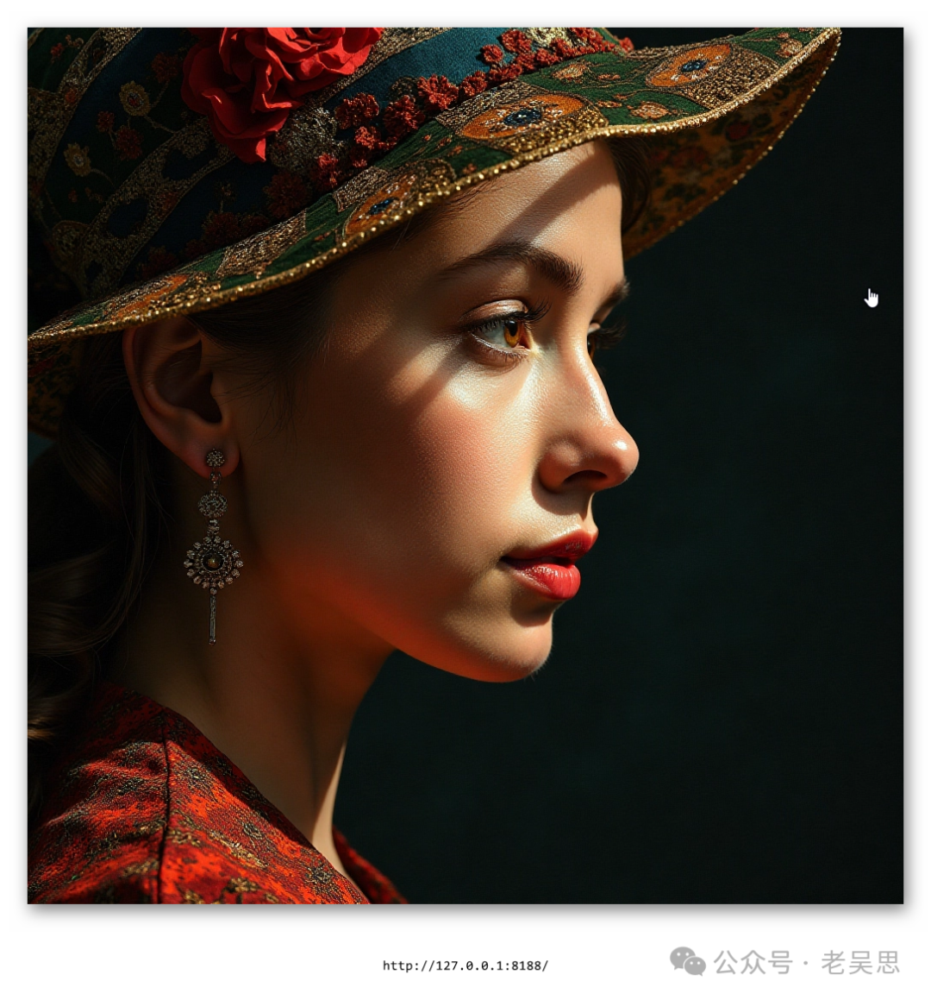

# FLUX.1文生图出现bug


> 原文地址: [https://mp.weixin.qq.com/s/1Na3b3Sid-XzVoWyKXPSIA](https://mp.weixin.qq.com/s/1Na3b3Sid-XzVoWyKXPSIA)

今天使用BizyAir测试文生图


提示词：市中心街道上的三名女子的电影照片，她们举着手

```
filmic photo of a group of three women on a street downtown, they are holding their hands up the camera
```


试了几次，都是出这张图

试下另一个提示词：一位美丽的女人，侧面拍摄，马克·夏加尔风格，（精致的细节杰作最佳品质），三星 Galaxy，伦勃朗灯光

```
a beautiful woman,shot from side,style by Marc Chagall,(intricate details masterpiece best quality),Samsung Galaxy,Rembrandt lighting
```



效果确实惊艳！