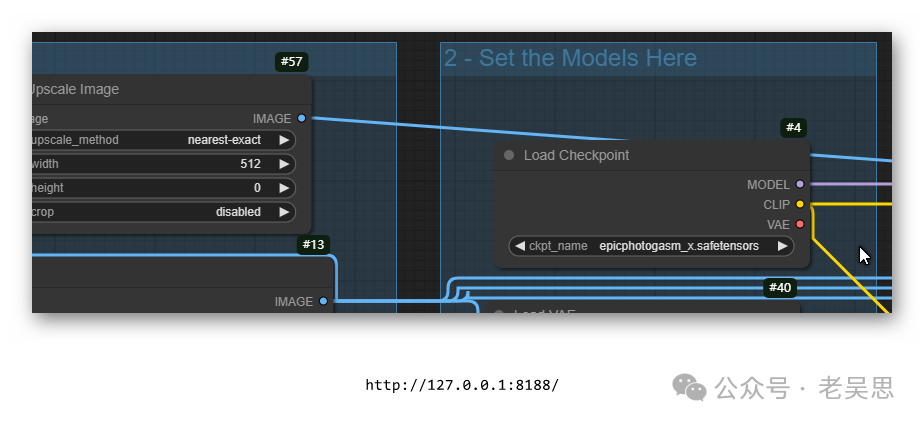

# comfyui中用到的\*.safetensors，\*.pth， \*.bin文件有什么差别？


> 原文地址: [https://mp.weixin.qq.com/s/LEMLGKtJtsimGy5RJBTi7w](https://mp.weixin.qq.com/s/LEMLGKtJtsimGy5RJBTi7w)



在 **ComfyUI** 以及其他深度学习框架（例如 PyTorch）中，`*.safetensors`、`*.pth`、`*.bin` 文件都是用于存储模型权重和配置的数据文件。然而，它们的格式和具体用途有一些差别。以下是对每种文件类型的详细说明：

### 1\. `*.safetensors`

-   **概述**：`*.safetensors` 是一种新的、专门为存储深度学习权重设计的格式，它的一个重要特点是 **安全性**。与 `.pth` 和 `.bin` 文件相比，`.safetensors` 文件通过结构化的方式存储模型权重，确保模型加载时不会执行意外的代码，从而避免潜在的安全风险。
    
-   **特点**：
    

-   **安全性**：它的设计确保文件的内容只包含模型权重数据，而不会包含任何可执行代码，防止模型加载时被恶意利用。
    
-   **速度**：读取 `.safetensors` 文件的速度通常更快，因为它们是零拷贝加载的，这意味着数据可以直接从文件中映射到内存中而无需进行大量拷贝操作。
    
-   **兼容性**：`.safetensors` 文件主要是为了弥补传统 `.pth` 或 `.bin` 文件可能存在的安全漏洞，适合在共享模型或需要高度安全环境中使用，例如在公开的 AI 项目中。
    

-   **使用场景**：如果你的项目需要在一个可能不完全受信的环境中加载模型，例如从网络下载的权重，`*.safetensors` 是一个更安全的选择。
    

### 2\. `*.pth`

-   **概述**：`*.pth` 是 **PyTorch** 默认的模型权重文件格式。这种格式使用了 Python 的 **pickle** 序列化机制，适合存储整个模型或模型的权重。`pth` 文件包含了张量数据，用于存储模型训练后的所有参数。
    
-   **特点**：
    

-   **灵活性**：`pth` 格式可以存储整个 PyTorch 模型，包含模型的结构、参数、以及任何自定义的数据。这种灵活性使它非常适合开发和调试过程中使用。
    
-   **不安全性**：因为它使用了 `pickle`，所以它存在一定的安全隐患。如果从不受信任的来源加载 `.pth` 文件，可能会执行恶意代码。对于在线共享或敏感环境中，建议避免直接使用 `pth` 文件。
    
-   **常用场景**：通常用来存储 PyTorch 模型的权重和状态，可以通过如下命令来保存和加载：
    
      
    
-   ```
    # 保存模型
    ```
    
-   `# 保存模型   torch.save(model.state_dict(), 'model_weights.pth')      # 加载模型   model.load_state_dict(torch.load('model_weights.pth'))   `
    

-   **使用场景**：`*.pth` 文件非常适合在开发环境中快速保存和加载模型，并适合只在可信环境中使用。
    

### 3\. `*.bin`

-   **概述**：`*.bin` 文件常用于 Hugging Face 的 **Transformers** 库中来保存模型的权重。`bin` 是一种广义的二进制文件扩展名，这种文件类型不限定于某一种工具，但是在深度学习领域，尤其在 Hugging Face 中，`.bin` 文件经常被用来存储模型权重。
    
-   **特点**：
    

-   **与 Transformers 库兼容**：大多数 Hugging Face 提供的预训练模型（例如 BERT、GPT）都是以 `.bin` 格式存储的。文件内部包含的是 PyTorch 模型权重，因此可以使用 PyTorch 的函数来读取和加载这些权重。
    
-   **保存权重**：与 `pth` 文件相似，`.bin` 也用来存储权重参数，但通常它不包含模型的结构信息，结构信息一般通过其他配置文件（例如 `config.json`）来提供。
    
-   **加载方式**：可以通过 Hugging Face 提供的 `from_pretrained()` 函数来加载 `.bin` 权重文件：
    
    python
    

```
from transformers import AutoModel
```

  

-   `from transformers import AutoModel      model = AutoModel.from_pretrained("path/to/weights.bin")   `
    

-   **使用场景**：`*.bin` 文件通常用于分发或分享预训练模型，特别是在使用 Hugging Face 的生态系统时，它是标准的权重文件格式。
    

### 对比总结

文件类型

安全性

灵活性

常用场景

特点

**`*.safetensors`**

高

中

公共环境，下载的权重

安全且加载速度快

**`*.pth`**

低

高

PyTorch 开发、调试、自定义模型

使用 `pickle`，灵活性高但有安全隐患

**`*.bin`**

中

中

Hugging Face 生态系统、预训练模型

标准的二进制权重文件

### 使用建议

-   **`*.safetensors`**：如果你需要共享模型权重或从互联网上下载第三方模型权重，推荐使用 `safetensors`，因为它更安全。
    
-   **`*.pth`**：如果你是在本地开发，且需要保存 PyTorch 的模型结构和权重，使用 `pth` 格式更为方便。适合在可信任的环境中使用，比如自己的服务器。
    
-   **`*.bin`**：如果你在使用 Hugging Face Transformers，通常会遇到 `.bin` 文件。它是与该生态系统兼容的标准格式，适合用于加载预训练模型。
    

通过理解这些文件类型的区别和使用场景，你可以根据需求选择最合适的格式来存储和加载模型权重，从而提高安全性和加载效率。

