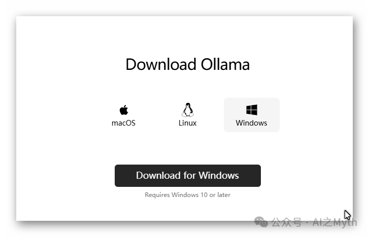
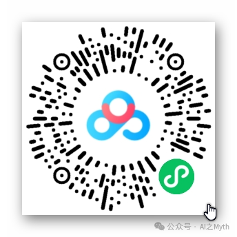
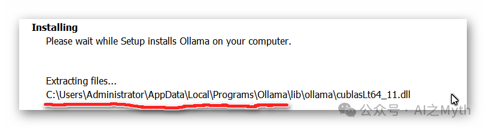
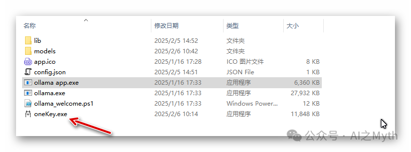
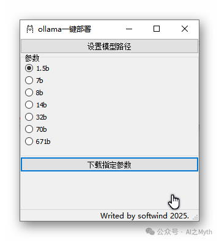
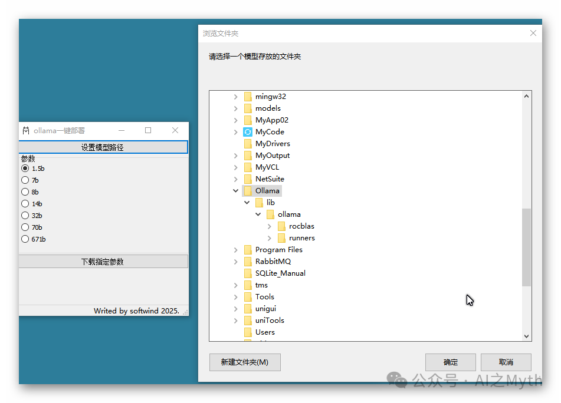
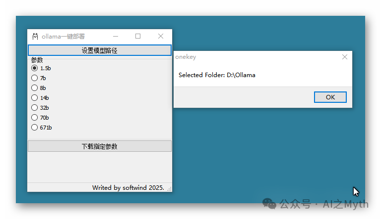
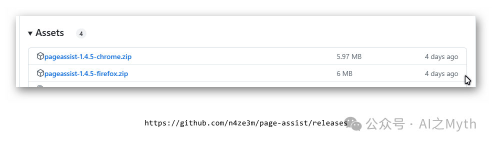
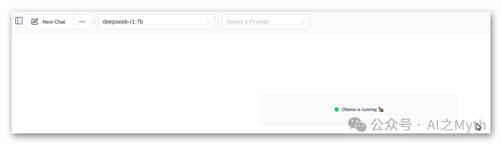

# windows下一键部署deepseek

> 原文地址: [https://mp.weixin.qq.com/s/ePDghiWrUD92QyqICRiQqg](https://mp.weixin.qq.com/s/ePDghiWrUD92QyqICRiQqg)

## **1、本地部署，****我们可以通过Ollama来进行安装**

## **Ollama 官方版：**【https://ollama.com/】

## 下载Ollamasetup.exe，约745M，当前版本是0.5.7，安装很简单，一路点下一步。

## 2\. 下载onekey.exe

## 把onekey.exe复制到ollama的目录：

ollama的安装目录不可选择，默认在这个位置，onekey要做的就是改变默认模型的下载位置。

##   

## 双击运行

## 点【设置模型路径】

## 选择一个存放模型的目录：

## 这是笔者自建的目录。

根据自己电脑配置，点选合适的参数选项，然后点【下载指定参数】，下载完模型，进行最后一步。

**3.安装Web UI 控制端**

打开https://github.com/n4ze3m/page-assist/releases

**选择适配浏览器的压缩包，解压后安装插件，在浏览器中打开就可以和deepseek对话了**

