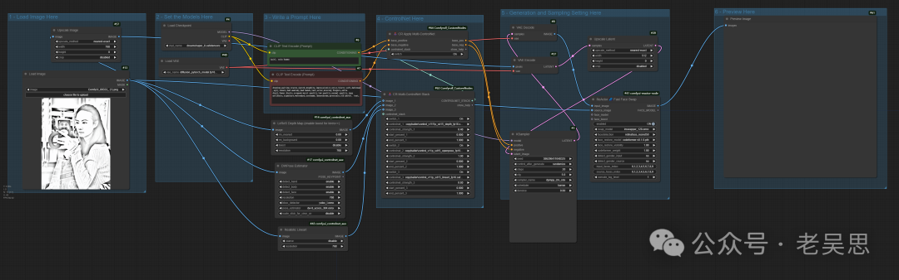

# 一个老照片修复工作流的流程分析

> 原文地址: [https://mp.weixin.qq.com/s/8ERapZYssbyXlesArfFs-A](https://mp.weixin.qq.com/s/8ERapZYssbyXlesArfFs-A)

下面是对此工作流文件进行更为细致的分析，解释从头到尾各个节点的执行顺序，以及它们之间的相互关系。

工作流节点顺序与关系

工作流涉及多个节点，它们按照特定的顺序处理输入图像，逐步实现从图像加载、处理、生成、放大到保存的完整流程。以下是具体的执行步骤及节点之间的关系：

1.  **加载图像 (`LoadImage`)**:
    

-   **节点 `id: 1`**：加载图像（例如 `"Tokan-Tada_Print_32.jpg"`）。
    
-   **输出**：加载后的图像会作为后续图像处理和修复步骤的输入。
    

3.  **面部修复模型加载 (`FaceRestoreModelLoader`)**:
    

-   **节点 `id: 3`**：加载 `codeformer-v0.1.0.pth` 作为面部修复模型。
    
-   **输出**：该模型用于后续面部修复操作。
    

5.  **面部修复 (`FaceRestoreCFWithModel`)**:
    

-   **节点 `id: 104`**：对加载的图像进行面部修复，使用 `YOLOv5n` 作为检测模型。
    
-   **输入**：来自 `LoadImage` 节点的图像。
    
-   **输出**：面部修复后的图像。
    

7.  **图像约束 (`ConstrainImage`)**:
    

-   **节点 `id: 105`**：对图像进行大小约束，设置为 `1024x1024`。
    
-   **输入**：来自面部修复节点的图像。
    
-   **输出**：约束后的图像用于后续的生成和预处理。
    

9.  **线条艺术预处理 (`LineArtPreprocessor`)**:
    

-   **节点 `id: 53`**：将约束后的图像进行线条艺术预处理，生成线条图用于进一步处理。
    
-   **输入**：来自 `ConstrainImage` 节点的图像。
    
-   **输出**：线条化的图像。
    

11.  **深度图生成 (`Zoe-DepthMapPreprocessor`)**:
     

-   **节点 `id: 114`**：生成图像的深度图信息，用于进一步的生成控制。
    
-   **输入**：约束后的原图。
    
-   **输出**：包含深度信息的图像数据。
    

13.  **多 ControlNet 堆栈 (`CR Multi-ControlNet Stack`)**:
     

-   **节点 `id: 5`**：管理多个 ControlNet 操作的堆栈。
    
-   **输入**：来自深度图生成和线条艺术预处理的图像数据。
    
-   **输出**：为后续 ControlNet 操作准备的控制数据。
    

15.  **CLIP 文本编码 (`CLIPTextEncode`)**:
     

-   **节点 `id: 65, 122, 123`**：将文本提示编码为特征向量，用于生成过程中的文本条件输入。
    
-   **输入**：正面和负面的文本提示词，例如 `"1girl"`。
    
-   **输出**：文本编码结果，用于图像生成的正负面条件控制。
    

17.  **加载 Checkpoint (`CheckpointLoaderSimple`)**:
     

-   **节点 `id: 66`**：加载模型检查点（`dreamshaper_8.safetensors`），用于生成图像。
    
-   **输出**：用于后续节点生成的模型权重。
    

19.  **VAE 编码 (`VAEEncode`)**:
     

-   **节点 `id: 4`**：将输入图像编码为潜在表示，用于进一步的生成。
    
-   **输入**：经过约束后的图像。
    
-   **输出**：潜在空间的表示。
    

21.  **图像生成分辨率调整 (`ImageGenResolutionFromImage`)**:
     

-   **节点 `id: 119`**：从原图生成目标分辨率，用于接下来生成的图像处理。
    
-   **输入**：输入图像。
    
-   **输出**：分辨率数据。
    

23.  **应用多 ControlNet (`CR Apply Multi-ControlNet`)**:
     

-   **节点 `id: 120`**：应用多个 ControlNet，使用前面的正面和负面条件来指导图像生成。
    
-   **输入**：来自文本编码和堆栈节点的数据。
    
-   **输出**：融合多种输入条件的潜在表示，用于图像生成。
    

25.  **KSampler 采样器 (`KSampler`)**:
     

-   **节点 `id: 121, 280`**：使用扩散采样器生成图像潜在表示。
    
-   **输入**：从多 ControlNet 节点获取的潜在表示。
    
-   **输出**：经过采样后的潜在表示。
    

27.  **VAE 解码 (`VAEDecode`)**:
     

-   **节点 `id: 124, 269`**：将潜在表示解码为实际图像。
    
-   **输入**：来自 KSampler 节点的潜在表示。
    
-   **输出**：生成的图像。
    

29.  **缩放图像 (`ImageScale`)**:
     

-   **节点 `id: 118`**：对生成的图像进行缩放，调整为目标宽度和高度。
    
-   **输入**：解码后的图像。
    
-   **输出**：缩放后的图像。
    

31.  **高分辨率放大 (`SUPIR_Upscale`)**:
     

-   **节点 `id: 507`**：对图像进行高质量的上采样。
    
-   **输入**：来自 `ImageScale` 节点的缩放后的图像。
    
-   **输出**：高分辨率的图像。
    

33.  **保存图像 (`SaveImage`)**:
     

-   **节点 `id: 508, 498`**：保存最终生成和放大后的图像。
    
-   **输入**：上采样后的图像。
    
-   **输出**：图像被保存到指定的目录。
    

35.  **ControlNet 模型加载 (`ControlNetLoader`)**:
     

-   **节点 `id: 511`**：加载特定的 ControlNet 模型（例如 `ioclab_sd15_recolor.safetensors`），用于指导图像生成。
    
-   **输出**：提供给上游节点使用的控制权重。
    

### 总结：节点顺序和相互关系

-   **初始处理阶段**：首先加载图像 (`LoadImage`)，然后进行面部修复 (`FaceRestoreCFWithModel`) 和约束图像大小 (`ConstrainImage`)。
    
-   **预处理阶段**：对图像进行线条化 (`LineArtPreprocessor`) 和深度图生成 (`Zoe-DepthMapPreprocessor`)，这些数据为 ControlNet 的多种条件控制提供支持。
    
-   **多条件生成阶段**：多个 ControlNet 操作堆栈 (`CR Multi-ControlNet Stack`) 收集条件控制数据。随后，文本提示通过 CLIP 编码 (`CLIPTextEncode`) 为图像生成提供内容方向。加载模型检查点 (`CheckpointLoaderSimple`) 并进行 VAE 编码 (`VAEEncode`) 以处理潜在表示。
    
-   **图像生成阶段**：应用多 ControlNet (`CR Apply Multi-ControlNet`) 将各类条件结合，使用扩散采样器 (`KSampler`) 生成潜在表示，并通过 VAE 解码 (`VAEDecode`) 转换为实际图像。
    
-   **图像后处理阶段**：对图像进行缩放 (`ImageScale`)、高分辨率放大 (`SUPIR_Upscale`)，最终保存 (`SaveImage`)。
    

### 节点相互关系

-   每个节点的输出通常作为下一个节点的输入，以实现逐步加工图像的目的。
    
-   **面部修复**、**深度图生成**、**线条化预处理**、**多 ControlNet** 等节点之间密切合作，以确保生成图像满足用户的具体条件要求。
    
-   **VAE 编码/解码** 和 **采样器** 的结合构成了生成的核心，将输入条件映射到潜在空间，再解码为最终图像。
    

通过这些节点的紧密协作，该工作流能够从输入图像、文本提示、条件控制等信息中生成高质量且符合要求的图像。每一步都为后续处理奠定基础，最终输出期望的结果。

  

工作流地址

https://www.liblib.art/modelinfo/7952a904a5674407a89c16075f33f4c8?from=search&versionUuid=f57dc628545c48cf9ac0eaca687bd8de