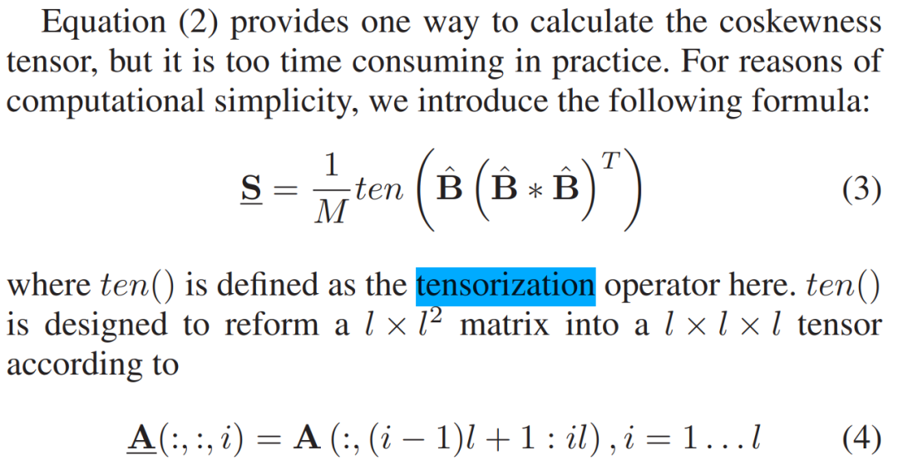

# 多年前我们创造的英文单词，如今成了AI圈的顶流

> 原文地址: [https://mp.weixin.qq.com/s/RTt\_uRCd3lCoCeJy7zWmVQ](https://mp.weixin.qq.com/s/RTt_uRCd3lCoCeJy7zWmVQ)

如果你去查阅《牛津英语词典》或者《韦氏词典》，输入“Tensorization”（张量化） 这个词，系统大概率会弹出一个冰冷的提示：“抱歉，未找到该词条。”

但有趣的是，由于过去十来年来自世界各国的科学家们在论文里高频、顽强地使用它，它如今已经被维基词典（Wiktionary）等国际权威开放词典作为标准的数学/计算机学术词条正式收录。

早在2013年前后，当普通大众对这个词还一无所知、甚至连学术界都还没把它作为固定方法学命名的时候，它就已经被我们团队亲手“创造”出来，并写进了IEEE的遥感期刊论文里。

**一、 字典里没有的词：科学前沿的被动命名**

故事要回到2013年。当时，我们团队正在将经典的主成分分析（PCA）从二阶统计推广到高阶统计情形。

众所周知，主成分分析虽然经典，但它只能处理二阶统计量（也就是协方差矩阵）。当数据分布呈现复杂的非高斯、非对称结构时，主成分分析往往收效甚微、甚至无能为力。

为了打破局限，我们团队创造性提出了三阶统计分析的标准工具——主偏度分析（PSA），并将数据极值偏度方向的确定转化为数据协偏度张量的特征值与特征向量问题。

然而，在计算协偏度张量的时候，为了避开外积法的高时间消耗，我们引入了Khatri–Rao积这一操作，将协偏度张量的构建转化为便捷的矩阵乘积操作。但是，这个计算结果仍是矩阵，而我们最终想要的是三阶协偏度张量。

此时，自然想到需要将这个矩阵乘积结果再转化为三阶张量，但是当时，并没有张量化这个英语词汇，于是，我们就临时发明了“Tensorization”这个词。一个当时生僻、现在流行的单词就这样诞生了（见下图）。

2014年，这篇题为_《Principal Skewness Analysis: Algorithm and Its Application for Multispectral/Hyperspectral Images Indexing》_的论文在_IEEE GRSL_正式发表。**“Tensorization” 作为我们主偏度分析体系的关键数学操作，被正式留在了人类的学术文献库里。**

**二、 科学史中的浪漫：相隔万里的“异地同时发明”**

在科学史上，有一个非常迷人的现象叫“多点独立起源”（Multiple Discovery）。当一个学科发展到到特定的历史关口时，不同国家、互不相识的顶尖学者，往往会爆发出完全一致的科学直觉。

多年后，当我们再次检索这个词时，惊奇地发现了一场跨越时空的“学术共振”：

（1）**老牌概率论与信息论的视角（1980-1990年代）**：这是该词在人类学术史上的最早痕迹。当时Michel Ledoux等法国数学家在研究概率测度集中不等式时，发现高维空间的某种整体性质（如熵、变分距离），可以由各个一维边缘分布的张量积直接叠加或控制。他们为此发明了“Tensorization property of entropy”（熵的张量化性质）。但此时，它还只是一个纯粹的、抽象的数学物理属性。

（2）**我们的视角（2014年）**：在主偏度分析算法中，我们将大耗时的协偏度张量外积计算转化为矩阵乘积，然后再将其转化为三阶张量。为了完成“矩阵转三阶张量”这一操作，我们独立创造了Tensorization这一词汇。

（3）**欧洲信号处理界（2014-2015年）**：比利时鲁汶大学的张量分解泰斗DeLathauwer团队在开发著名的Tensorlab工具箱时，也独立用Tensorization来命名“向量/矩阵转张量”的信号处理技术。

（4）**人工智能与大模型界（2015年至今）**：好玩的是，2015年AI圈的Novikov团队在NIPS上发了篇大火的论文《Tensorizing Neural Networks》。他们新创造的这个词“Tensorizing”，正是我们所发明的名词“Tensorization” 的动词呼应。时至今日的大模型时代，这个词在网络压缩文献里几乎已经泛滥。

一时间，在2014年前后的数据科学转折点上，全世界不同领域的科学家不约而同地意识到：**传统的矩阵不够用了，必须全面向高维张量进军！**而我们，正是那批最早根据实际需求为这种数学行为“命名”的同行者之一。

**三、 从PSA到RPSA：我们的“张量”之路仍在继续**

虽然到今天为止，Tensorization依然只是前沿科学家的“专业黑话”，没有破圈进入普通人的日常词典。

然而，对于我们团队而言，这个词承载了当年在主偏度分析（PSA）上破局的兴奋与记忆。从 2014年初创的PSA，到后来的动量主偏度分析（MPSA）、非正交主偏度分析（NPSA），快速主偏度分析（FPSA）、再到如今的黎曼PSA（RPSA），我们在三阶统计张量理论与应用这条路上也越走越深，越走越远。

如今回看，当年在论文初稿里敲下“Tensorization”这个单词的瞬间，竟无意间成了那个跨学科张量思潮大爆发的序章。而我们也将在高维张量的世界里，继续书写属于我们的下一个篇章。