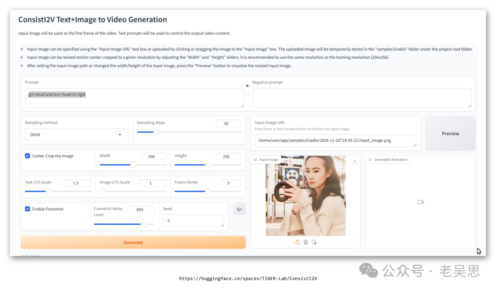
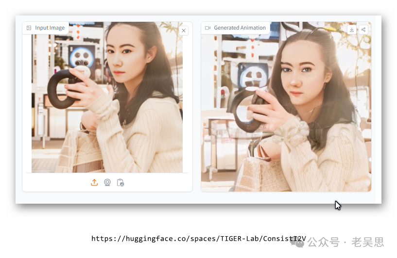

# 实测ConsistI2V


> 原文地址: [https://mp.weixin.qq.com/s/93T6r3ZEm9EXh3RJs7SbJQ](https://mp.weixin.qq.com/s/93T6r3ZEm9EXh3RJs7SbJQ)

https://github.com/TIGER-AI-Lab/ConsistI2V

这是国人团队研发的一个开源项目，根据上面介绍，ConsistI2V是一种基于扩散的方法，用于增强 I2V 生成的视觉一致性。具体来说，引入 (1) 对第一帧的时空注意以保持空间和运动一致性，(2) 从第一帧的低频带进行噪声初始化以增强布局一致性。这两种方法使 ConsistI2V 能够生成高度一致的视频。

在线实测地址

https://huggingface.co/spaces/TIGER-Lab/ConsistI2V

上传照片  




提示词：女孩微笑着，然后把头转向右边

```
girl smile and turn head to right
```

30秒内生成2秒视频，速度还是不错的，输出视频是这样的

