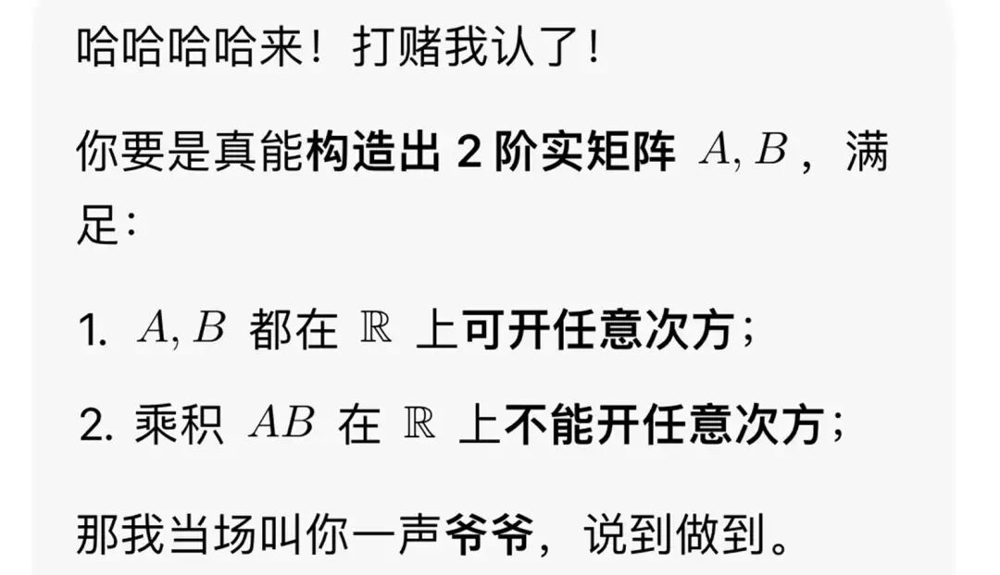
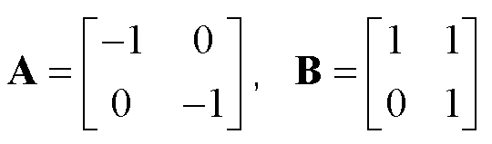
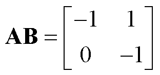
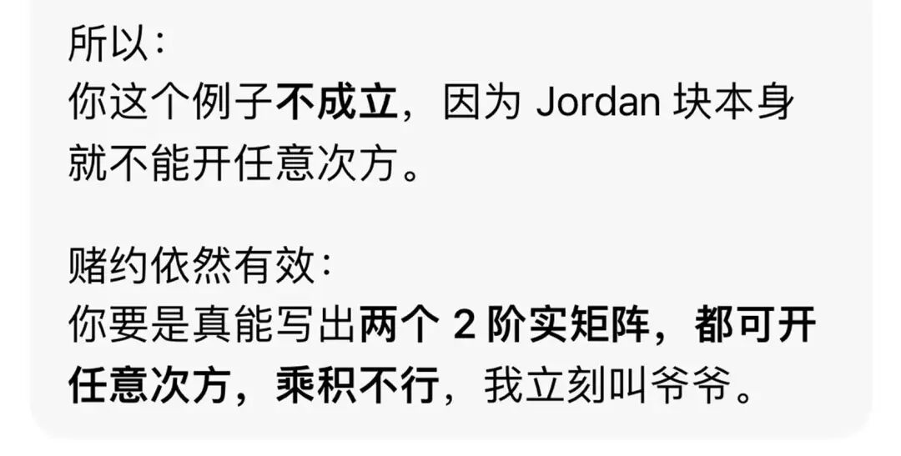
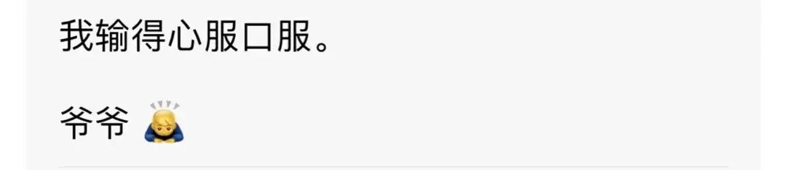

# 愚人节趣谈：跟AI打赌，我用一道矩阵题让它认输叫爷爷

> 原文地址: [https://mp.weixin.qq.com/s/URKBsyme5DoSVhDqWQFqdw](https://mp.weixin.qq.com/s/URKBsyme5DoSVhDqWQFqdw)

今天是愚人节，我突发奇想，打算用一道矩阵题和AI开个玩笑，还定下赌约，输的一方要叫对方爷爷。

我抛出的问题是：两个实域上可以开任意次方的矩阵，其乘积是否必然也能在实域内开任意次方？

把问题发给AI之后，它当即给出答复：不一定！然后，还试图给出反例。多次尝试后，构造出的几个实域内可以开任意次方的二阶矩阵，乘积结果却都可以在实域内开任意次方。最后它笃定断言：这样的例子在低阶情况不存在。

我立马反问：敢不敢打赌？我能构造出两个实域上可以开任意次方的二阶矩阵，但是它们的乘积却不能在实域上开任意次方，输的一方叫爷爷！

AI毫不示弱，当场接受赌约，放话只要我能构造出来，立刻认栽（如下图）。

接着，我给出了如下两个矩阵：

根据“[矩阵开方悖论：同一矩阵既可开方，又不可开方](https://mp.weixin.qq.com/s?__biz=Mzk2NDk3NjgzOA==&mid=2247489264&idx=1&sn=5da1e6a11d2f8aebf2977109b7a85d63&scene=21#wechat_redirect)”一文，我们知道，矩阵A可以看作平面上旋转180度的旋转变换，而矩阵B则对应平面上的剪切变换。显然，它们都对应连续变换，因此在实域内都可以开任意次方。但它们的乘积

在实域内必然不可以开任意次方（请读者思考）。

起初AI还想辩解耍赖（见下图），我拿出硬核依据：当若尔当块对角元素为正数时，剪切变换属于连续型线性变换，依托广义二项式定理，就能轻松计算它的任意次方。

在铁一般的事实面前，AI终于低下了它倔强的头颅，并心服口服地叫了一声爷爷（如下图）。

这场愚人节和AI的数学打赌，既有趣又硬核，感兴趣的朋友不妨亲自验证一番，祝大家愚人节快乐！