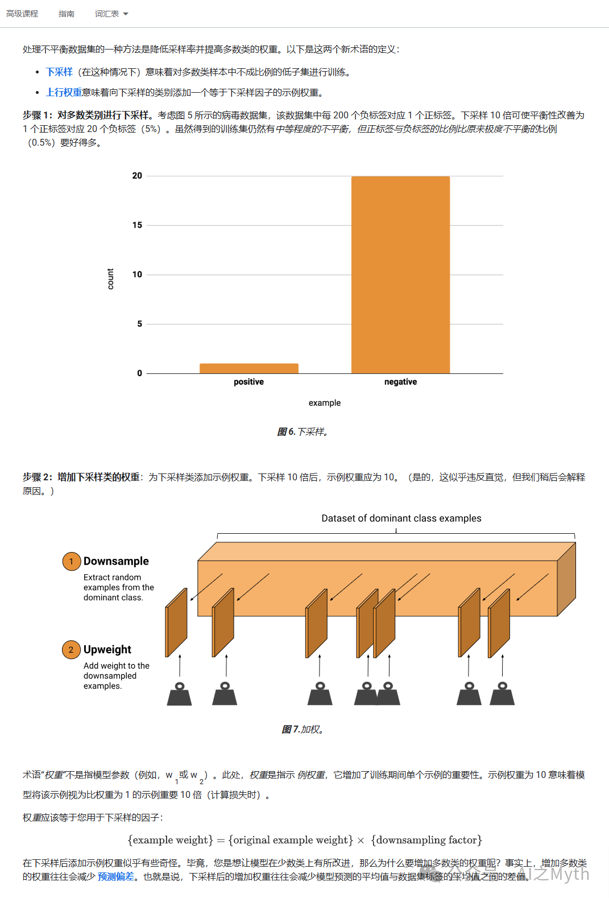

# 机器学习——不平衡数据集

> 原文地址: [https://mp.weixin.qq.com/s/LkfK\_w2GzKWQYJ8wBHDw8A](https://mp.weixin.qq.com/s/LkfK_w2GzKWQYJ8wBHDw8A)

### 1. **不平衡数据集的定义**

不平衡数据集是指某些类别的样本数量远多于其他类别的数据集。例如，在一个二分类问题中，正类样本占 90%，负类样本占 10%。

* * *

### 2. **不平衡数据集对模型的影响**

不平衡数据集可能导致以下问题：

-   **模型偏向多数类**：模型可能会倾向于预测多数类，导致少数类的预测性能较差。
    
-   **过拟合**：模型可能会过度拟合多数类，而忽略少数类。
    

* * *

### 3. **处理不平衡数据集的方法**

为了处理不平衡数据集，可以采取以下方法：

#### 3.1 **重采样（Resampling）**

-   **过采样（Oversampling）**：增加少数类的样本数量，使其与多数类的样本数量接近。
    
-   **欠采样（Undersampling）**：减少多数类的样本数量，使其与少数类的样本数量接近。
    

#### 3.2 **数据增强（Data Augmentation）**

-   **数据增强**：通过对少数类的样本进行变换（如旋转、缩放、翻转等），增加少数类的样本数量。
    

#### 3.3 **加权损失函数（Weighted Loss Function）**

-   **加权损失函数**：在损失函数中为少数类的样本赋予更高的权重，使模型更关注少数类。
    

#### 3.4 **合成少数类样本（Synthetic Minority Oversampling Technique, SMOTE）**

-   **SMOTE**：通过生成合成样本增加少数类的样本数量。具体来说，SMOTE 在少数类的样本之间进行插值，生成新的样本。
    

* * *

### 4. **不平衡数据集的示例**

假设我们有一个信用卡欺诈检测的数据集，其中：

-   **正类（欺诈）**：占 1%。
    
-   **负类（正常交易）**：占 99%。
    

#### 4.1 **重采样**

-   **过采样**：通过复制欺诈样本，使其数量接近正常交易样本。
    
-   **欠采样**：通过随机删除正常交易样本，使其数量接近欺诈样本。
    

#### 4.2 **数据增强**

-   对欺诈样本进行变换，生成新的欺诈样本。
    

#### 4.3 **加权损失函数**

-   在损失函数中为欺诈样本赋予更高的权重，使模型更关注欺诈样本。
    

#### 4.4 **SMOTE**

-   在欺诈样本之间进行插值，生成新的欺诈样本。
    

* * *

### 5. **总结**

-   不平衡数据集是指某些类别的样本数量远多于其他类别的数据集。
    
-   不平衡数据集可能导致模型偏向多数类，并导致过拟合。
    
-   处理不平衡数据集的方法包括重采样、数据增强、加权损失函数和 SMOTE。
    
      
    
-   
    

1.  **图6. 下采样**：
    

-   该图展示了在下采样过程中，正标签和负标签的比例变化。原始数据集中，每200个负标签对应1个正标签（0.5%的正标签比例）。通过下采样10倍，正标签与负标签的比例改善为1:20（5%的正标签比例）。
    
-   图表可能显示了正标签和负标签的数量变化，以及下采样后的比例调整。
    

3.  **图7. 加权**：
    

-   该图展示了在下采样后，如何通过增加下采样类的权重来平衡数据集。下采样10倍后，示例权重应为10。
    
-   图表可能展示了从主导类中随机提取示例的过程，以及如何为下采样的示例添加权重。
    

5.  **示例权重的解释**：
    

-   示例权重用于增加训练期间单个示例的重要性。权重为10意味着模型在计算损失时将该示例视为比权重为1的示例重要10倍。
    
-   权重的计算公式为：example weight\=original example weight×downsampling factorexample weight=original example weight×downsampling factor  
    

7.  **下采样和加权的目的**：
    

-   下采样和加权的目的是减少模型预测的偏差，使模型在少数类上的表现更好。通过增加下采样类的权重，可以减少模型预测的平均值与数据集标签的平均值之间的差值。
    

总结来说，这些图表和解释展示了在处理不平衡数据集时，如何通过下采样和加权来改善模型的性能，特别是在少数类上的表现。

  

我来用一个通俗易懂的例子来解释“下采样”。

* * *

### 例子：班级里的男生和女生

假设你是一个老师，班上总共有 **100 名学生**，其中：

-   **男生**：90 名（占大多数）
    
-   **女生**：10 名（占少数）
    

现在，你想训练一个模型来预测学生的成绩，但问题是：**男生的数据太多了，女生的数据太少了**。这会导致模型更关注男生的数据，而忽略女生的数据，最终预测结果可能会对女生不公平。

* * *

### 下采样的作用

为了让模型更公平地学习男生和女生的数据，你可以对男生的数据进行**下采样**。具体步骤如下：

1.  **从男生的数据中随机删除一部分**：
    

-   男生：10 名
    
-   女生：10 名
    

-   比如，你从 90 名男生中随机删除 80 名，只保留 10 名男生。
    
-   现在，你的数据集变成了：
    

4.  **调整数据比例**：
    

-   原本男生和女生的比例是 **90:10**（极度不平衡）。
    
-   下采样后，比例变成了 **10:10**（完全平衡）。
    

* * *

### 下采样的意义

通过下采样，你让模型在训练时看到的男生和女生的数据量是相同的。这样，模型就不会偏向于男生的数据，而是更公平地学习男生和女生的特征，从而做出更准确的预测。

* * *

### 需要注意的地方

虽然下采样可以让数据更平衡，但它也有一些缺点：

1.  **丢失数据**：你删除了很多男生的数据，可能会丢失一些有用的信息。
    
2.  **可能过拟合**：如果女生的数据太少，模型可能会过度关注女生的数据，导致过拟合。
    

因此，下采样通常需要结合其他方法（比如加权）来进一步优化模型的表现。

* * *

### 总结

下采样就像是从一个班级里随机去掉一些男生，让男生和女生的数量变得差不多。这样，模型在训练时就不会只关注男生的数据，而是更公平地学习所有人的特征。

  

我来详细解释一下“图7. 加权”的内容，尽量用通俗易懂的方式来说明。

* * *

### 背景回顾

在“图6. 下采样”中，我们通过减少多数类（比如男生）的样本数量，让数据集变得更平衡。但是，下采样有一个问题：**我们丢掉了很多数据**，这可能会导致模型丢失一些有用的信息。

为了解决这个问题，我们可以使用“加权”的方法。加权的意思是：**给少数类（比如女生）的样本赋予更高的权重**，让模型在训练时更关注这些样本。

* * *

### 图7. 加权的具体内容

1.  **下采样后的数据**：
    

-   男生：10 名
    
-   女生：10 名
    

-   假设我们下采样后，数据集中有：
    
-   虽然数量上平衡了，但男生的数据被大量删除了，可能会导致模型对男生的学习不够充分。
    

4.  **加权的操作**：
    

-   为了弥补下采样的不足，我们可以给**男生的样本增加权重**。
    
-   比如，如果下采样了 10 倍（即删除了 90% 的男生数据），那么我们可以给剩下的男生样本赋予一个权重 **10**。
    
-   这个权重的作用是：**告诉模型，每个男生的样本相当于 10 个样本**。
    

6.  **权重的意义**：
    

-   在训练模型时，模型会计算每个样本的损失（即预测值和真实值的差距）。
    
-   如果一个样本的权重是 10，那么模型在计算损失时，会把这个样本的损失放大 10 倍。
    
-   这样，模型会更关注这些高权重的样本，从而更好地学习它们的特征。
    

* * *

### 举个例子

假设我们有一个数据集：

-   原始数据：
    

-   男生：100 名
    
-   女生：10 名
    

-   下采样后：
    

-   男生：10 名（下采样了 10 倍）
    
-   女生：10 名
    

如果我们不给男生样本加权，模型可能会认为：

-   男生和女生的样本数量相同，所以它们的“重要性”是一样的。
    

但实际上，男生的原始数据量更大，下采样后丢失了很多信息。因此，我们需要通过加权来弥补这一点：

-   给每个男生样本赋予权重 **10**。
    
-   这样，模型在训练时会认为：**每个男生样本相当于 10 个样本**，从而更关注男生的数据。
    

* * *

### 为什么加权能减少偏差？

加权的作用是让模型在训练时更关注那些被下采样的样本（比如男生）。这样，模型不会因为下采样而忽略多数类的信息，从而减少预测的偏差。

* * *

### 总结

“图7. 加权”展示的是：

1.  在下采样后，给被下采样的样本（比如男生）赋予更高的权重。
    
2.  这个权重的作用是让模型在训练时更关注这些样本，从而减少下采样带来的信息丢失。
    
3.  加权可以帮助模型更公平地学习所有类别的数据，减少预测偏差。