# 机器学习中的逻辑回归

> 原文地址: [https://mp.weixin.qq.com/s/pfEHJcrmtj\_viVfOnpteOw](https://mp.weixin.qq.com/s/pfEHJcrmtj_viVfOnpteOw)

### 什么是逻辑回归？

想象一下，你在玩一个游戏：根据一些线索，猜一个人是“猫派”还是“狗派”。机器学习里的逻辑回归（Logistic Regression）就是这样一个“猜分类”的算法。它不是用来预测连续的数字（比如房价），而是用来预测“属于哪一类”的概率，比如“是”或“否”、“ spam邮件”还是“正常邮件”。

它叫“回归”，但其实是分类算法，因为它基于线性回归，但加了个“魔法”来处理分类问题。简单说，它先用一条直线拟合数据，然后把结果挤压成0到1之间的概率。

### 线性回归 vs 逻辑回归：为什么需要区别？

线性回归就像画一条直线来预测连续值，比如根据房子大小预测价格。但如果用它来分类，比如预测“是否会下雨”（0或1），它可能会给出负数或大于1的值，这没意义。

逻辑回归解决了这个问题：它用同样的直线，但输出不是直接的数值，而是概率。

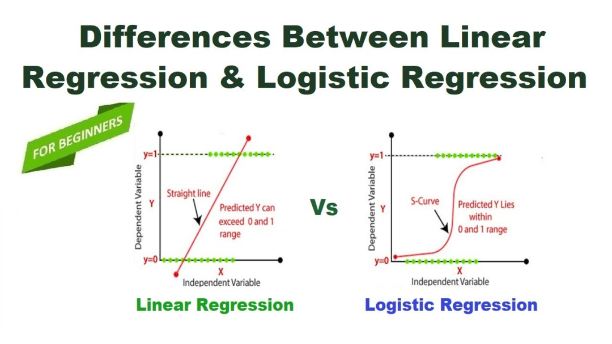编辑

如上图所示，线性回归的线可以无限延伸，而逻辑回归的输出被限制在0和1之间，看起来像一条S形的曲线。

### Sigmoid函数：逻辑回归的核心“魔法”

逻辑回归的秘密武器是Sigmoid函数。它把线性方程的输出（叫z = w\*x + b，其中w是权重，x是特征，b是偏置）转化成概率。

公式简单：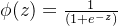

-   如果z很大正数，ϕ(z)接近1（比如“很可能属于这一类”）。
    
-   如果z很大负数，ϕ(z)接近0。
    
-   如果z=0，ϕ(z)=0.5（不确定）。
    

这就像一个“挤压机”，把无限的直线输出挤成0-1的概率曲线。

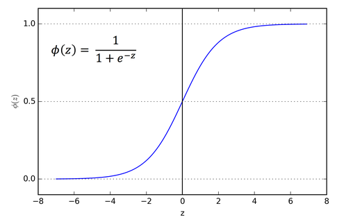编辑

这张图画的是 **Sigmoid（逻辑）函数**：

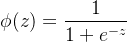

-   横轴是 z（可以取任意实数，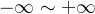）
    
-   纵轴是 ϕ(z)（被“压缩”到 0∼1之间）
    
-   曲线是典型的 **S 型**：  
      z 很大时输出接近 1；z 很小时输出接近 0；在 z=0 时刚好 ϕ(0)=0.5
    

这正是机器学习里 **逻辑回归（Logistic Regression）** 的核心：把“线性打分”变成“概率”。

* * *

## 1) 逻辑回归在做什么？

逻辑回归用于 **二分类**（比如：垃圾邮件/非垃圾邮件，违约/不违约）。

它先算一个线性组合：

-   x：特征向量（比如邮箱里“中奖”“免费”等词出现次数）
    
-   w：权重（每个特征的重要性）
    
-   b：偏置（整体阈值）
    

然后把这个 z 丢进图里的 Sigmoid：

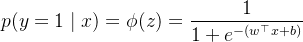

于是输出就成了一个概率：

-   接近 1：更像正类 y=1
    
-   接近 0：更像负类 y=0
    

* * *

## 2) 决策边界：为什么图里 z=0 很关键？

因为 ϕ(0)=0.5。常见分类规则是：

-   若 p≥0.5 判为 1
    
-   若 p<0.5 判为 0
    

而 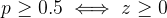。  
所以逻辑回归的 **决策边界** 就是：

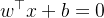

这是一条“直线/平面/超平面”——也就是说逻辑回归本质上学的是 **线性可分的边界**（在原特征空间里）。

* * *

## 3) 它为什么叫“回归”，但在做“分类”？

因为它不是直接输出类别，而是回归一个 **概率值** 。  
最后再用阈值把概率切成 0/1。

* * *

## 4) 训练时学什么？用什么损失函数？

目标是让训练数据在“正确类别”上的概率尽量大（最大似然）。等价地，我们最常用 **交叉熵损失**（log loss）：

![$\mathcal{L}=-\Big[y\log p+(1-y)\log(1-p)\Big]$](https://mmbiz.qpic.cn/mmbiz_png/jlXjovro0trKRPCNoZEyBEJ0R9O1ibntIiaomN0z2crQHzpYH7vwDsllvViac3XRQ1o35aDu2SeqcDuytgm0Rv2Pg/640?wx_fmt=png&from=appmsg)

-   如果真实 y=1，就惩罚log p（希望 p 越大越好）
    
-   如果真实 y=0，就惩罚 log⁡(1−p)（希望 p 越小越好）
    

然后用梯度下降或其变体（SGD、Adam 等）去优化 w,b。

* * *

## 5) 图里“S型”还暗示了两个很重要的性质

1.  概率压缩：再大的正负数，都被压进 (0,1)。适合做概率。
    
2.  饱和：当 z 很大或很小时，曲线变平，梯度会变小——这会让极端自信（接近 0 或 1）的样本对参数更新影响变弱。
    

* * *

## 6) 正则化：防止“权重太极端”

实际训练常加正则化：

-   L2：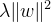（更常用，权重更平滑）
    
-   L1：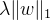（会做特征选择，让很多权重变 0）
    

* * *

## 7) 多分类怎么办？

二分类用 Sigmoid；多分类常用 **Softmax 回归**（多项逻辑回归）：

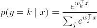

我们用一个**超小、可手算**的逻辑回归例子，把“线性打分 → Sigmoid → 概率 → 分类 → 损失”完整走一遍。

* * *

## 例子设定（二分类：垃圾邮件=1，正常邮件=0）

假设我们只用两个特征：

-   x1：邮件里“免费”出现次数
    
-   x2：邮件里“会议”出现次数
    

模型参数（随便举一组）：

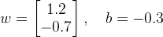

逻辑回归做两步：

1.  线性打分
    

1.  Sigmoid 变概率
    

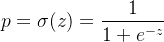

* * *

## 样本 A：x=\[2,1\]（“免费”2次，“会议”1次）

### 1) 算 z

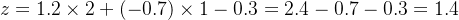

### 2) 算概率 p=σ(1.4)

用近似：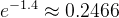

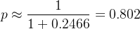

**解释**：模型认为“是垃圾邮件”的概率约 **80.2%**。

### 3) 做分类（阈值 0.5）

-   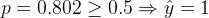（判为垃圾邮件）
    

* * *

## 顺便算一下“这次预测有多好”：交叉熵损失

交叉熵（log loss）：

![$\mathcal{L}=-\big[y\log p+(1-y)\log(1-p)\big]$](https://mmbiz.qpic.cn/mmbiz_png/jlXjovro0trKRPCNoZEyBEJ0R9O1ibntIL8DjwgibQKppgW7EzoxVwmViaUazgFShC85ND4qKicgNorXEK4vAJZOSg/640?wx_fmt=png&from=appmsg)

-   如果真实 y=1：
    

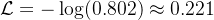

（损失小，说明预测不错）

-   如果真实 y=0：
    

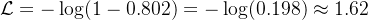

（损失大，说明“把正常邮件当垃圾”会被狠狠惩罚）

* * *

## 样本 B：x=\[0,3\]（“免费”0次，“会议”3次）

### 1) 算 z

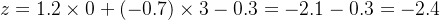

### 2) 算概率

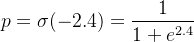

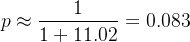

**解释**：是垃圾邮件概率 **8.3%**，所以判为正常邮件。

* * *

## 这张图里“z=0 对应 0.5”的意义（决策边界）

因为 σ(0)=0.5，所以分类阈值 0.5 等价于看 z的正负：

-   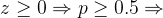判1
    
-   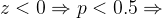判0
    

本例的边界就是：

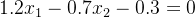

这是一条直线（高维里是超平面），逻辑回归本质学到的就是这条线/面。

我们继续把**训练（参数怎么更新）**也用刚才那两个样本，做一遍“可手算”的 SGD/梯度下降示范。

* * *

## 1) 关键结论：逻辑回归的梯度特别简单

对单个样本 (x,y)：

-   
    
-   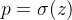
    

交叉熵损失对参数的梯度是：

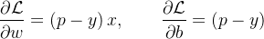

这里的 (p−y) 可以理解成：**“预测概率 - 真实标签”**

-   如果 y=1 但 p<1，则 p−y<0：更新会让 z 变大（把概率推向 1）
    
-   如果 y=0 但 p>0，则 p−y>0：更新会让 z 变小（把概率压向 0）
    

* * *

## 2) 对样本 A 做一次 SGD（假设真实是垃圾邮件 y=1）

样本 A：x=\[2,1\]  
我们之前算过：z=1.4，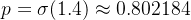

### (1) 误差项

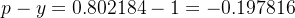

### (2) 梯度

![$\frac{\partial \mathcal L}{\partial w}=(p-y)x = -0.197816 \cdot [2,1] = [-0.395632,\,-0.197816]$](https://mmbiz.qpic.cn/mmbiz_png/jlXjovro0trKRPCNoZEyBEJ0R9O1ibntI1JZOROguiaebIVVCDXX9cgYdVQdibbE4pj3udmzC8hfic0tRYTWOWiaqRA/640?wx_fmt=png&from=appmsg)

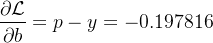

### (3) 用学习率 η=0.1 更新（SGD）

初始参数：![$w=[1.2,-0.7],\ b=-0.3$](https://mmbiz.qpic.cn/mmbiz_png/jlXjovro0trKRPCNoZEyBEJ0R9O1ibntIZjyWtzcl1oNxAwHFtuc2HwHaxlaeln9LuTiafRq6wahG6XBicia7P75nQ/640?wx_fmt=png&from=appmsg)

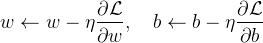

逐项算：

-   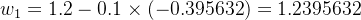
    
-   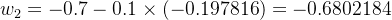
    
-   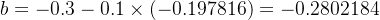
    

**直觉解释**：真实是 1，但模型只给了 0.80，还不够自信，所以更新把 w1 提高、把 w2 变得“没那么负”、把 b 往上推——目的都是让这个样本的 z 更大，从而 p 更接近 1。

* * *

## 3) 对样本 B 做一次 SGD（假设真实是正常邮件 y=0）

样本 B：x=\[0,3\]  
我们算过：z=−2.4，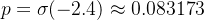

### (1) 误差项

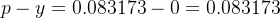

### (2) 梯度

![$\frac{\partial \mathcal L}{\partial w}=(p-y)x=0.083173\cdot[0,3]=[0,\ 0.249519]$](https://mmbiz.qpic.cn/mmbiz_png/jlXjovro0trKRPCNoZEyBEJ0R9O1ibntI48Of4KGCbRlDu1HkxqZo6RMVg0YoAsH4StZeicehy9bWpNPYDecS5Hg/640?wx_fmt=png&from=appmsg)

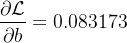

### (3) 学习率 η=0.1 更新（从原始参数出发演示）

从 ![$w=[1.2,-0.7],\ b=-0.3$](https://mmbiz.qpic.cn/mmbiz_png/jlXjovro0trKRPCNoZEyBEJ0R9O1ibntIZjyWtzcl1oNxAwHFtuc2HwHaxlaeln9LuTiafRq6wahG6XBicia7P75nQ/640?wx_fmt=png&from=appmsg)：

-   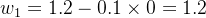
    
-   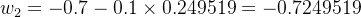
    
-   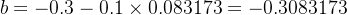
    

**直觉解释**：真实是 0，但模型给了 0.083（还不够接近 0），所以更新会让 zzz 更负：把 w2w\_2w2 更往负方向推、把 bbb 也往下拉，让这个样本的概率更贴近 0。

* * *

## 4) 你现在可以把训练想成一句话

> 每个样本都会产生一个“推动力” (p−y)，它会沿着特征 x 的方向去推 w，让正确类别的概率更接近 1（或 0）。

我们把 **样本 A、B 放在一起做一次 mini-batch（batch size=2）**，用“**平均梯度**”更新一次参数。

> 继续沿用我们前面的设定：  
> 初始 ![$w=[1.2,\,-0.7],\ b=-0.3$](https://mmbiz.qpic.cn/mmbiz_png/jlXjovro0trKRPCNoZEyBEJ0R9O1ibntIdEn7MoAY7UmRw9PfSiaT0j1Byy0Q8xyjZOk1UofIQ5brzY5qrl79F6A/640?wx_fmt=png&from=appmsg)，学习率 η=0.1  
> 样本 A 标签 yA=1，样本 B 标签 yB=0

* * *

## 1) 先回顾：单个样本的梯度公式

* * *

## 2) 两个样本各自的梯度（我们前面已算过 p）

### 样本 A

-   ![$x_A=[2,1]$](https://mmbiz.qpic.cn/mmbiz_png/jlXjovro0trKRPCNoZEyBEJ0R9O1ibntIUb9Y3FRQjKUQsCibTs6FQicg3K80cJCufmN9IpyqB2TdAqd7icol2qtCA/640?wx_fmt=png&from=appmsg)
    
-   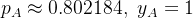
    
-   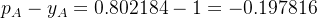
    

所以：

![$g_w^{(A)}=(p_A-y_A)x_A=-0.197816\cdot[2,1]=[-0.395632,\,-0.197816]$](https://mmbiz.qpic.cn/mmbiz_png/jlXjovro0trKRPCNoZEyBEJ0R9O1ibntIh4A8xBmGBqaw5iaSqXF3gWEb0s03p6L33JTpFlq5n3hcRuJETUZsfkA/640?wx_fmt=png&from=appmsg)

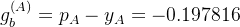

### 样本 B

-   ![$x_B=[0,3]$](https://mmbiz.qpic.cn/mmbiz_png/jlXjovro0trKRPCNoZEyBEJ0R9O1ibntIibpQcEluoxgc2rwFYRicqrVqP2IZvibHIlCwhxndQTMMt51OlCia2VIXcw/640?wx_fmt=png&from=appmsg)
    
-   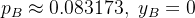
    
-   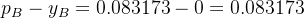
    

所以：

![$g_w^{(B)}=(p_B-y_B)x_B=0.083173\cdot[0,3]=[0,\ 0.249519]$](https://mmbiz.qpic.cn/mmbiz_png/jlXjovro0trKRPCNoZEyBEJ0R9O1ibntIODzoCic83y1954sibPrDEqh4nGH7U5qIdnBicD95iacJqx9ayWtWUY3RmQ/640?wx_fmt=png&from=appmsg)

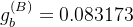

* * *

## 3) mini-batch：求平均梯度

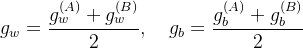

### 平均的 gwg\_wgw

-   第一维：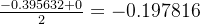
    
-   第二维：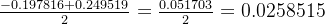
    

所以：

![$g_w=[-0.197816,\ 0.0258515]$](https://mmbiz.qpic.cn/mmbiz_png/jlXjovro0trKRPCNoZEyBEJ0R9O1ibntIdxxZIHib6ZwdpJYNx4cNfbbxLMocZLFWUEntfHUcJfAHL35U5xRZkmw/640?wx_fmt=png&from=appmsg)

### 平均的 gb

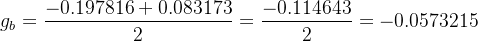

* * *

## 4) 用平均梯度更新一次参数

带入 η=0.1：

-   
    
-   
    
-   
    

**更新后：**

![$w'=[1.2197816,\ -0.70258515],\quad b'=-0.29426785$](https://mmbiz.qpic.cn/mmbiz_png/jlXjovro0trKRPCNoZEyBEJ0R9O1ibntIZhfzWotsAaxC2kfbWsCsIdeRaLI4ZNmh6NgWJ4tbTeW4bopx4v0KOg/640?wx_fmt=png&from=appmsg)

* * *

## 5)（可选验证）更新后概率有没有“往对的方向走”？

### 样本 A（希望更接近 1）

z 从 1.4 增到约 1.4427，所以 pA′ 会从 **0.802** 稍微上升到大约 **0.809**（更像 1 ✅）

### 样本 B（希望更接近 0）

z 从 -2.4 变得更负一点点，所以 pB′ 会从 **0.08317** 稍微下降（更像 0 ✅）

#### 1\. 整体原理：像一个天气预报App

想象逻辑回归是一个智能天气App。它不会简单说“今天下雨”或“不下雨”，而是根据风速、湿度、气压等线索，给你一个概率，比如“下雨概率70%”。如果你设个阈值（比如50%以上就带伞），它就帮你决定行动。这比线性回归（像直接预测雨量多少）更适合分类，因为概率总在0-100%之间，不会乱来。

  
编辑

上图对比了线性回归（直线无限延伸，像预测无限雨量）和逻辑回归（S形曲线，像概率预报），生动地展示了为什么逻辑回归更“靠谱”于分类。

#### 2\. Sigmoid函数：像一个懒洋洋的开关灯

Sigmoid是逻辑回归的“心脏”，它把原始计算结果（一个无限的数字）转化成0-1的概率。比喻成一个懒开关：当输入小（负数大）时，灯几乎不亮（概率近0）；输入中等时，灯慢慢亮起（概率0.5左右）；输入大时，灯全亮（概率近1）。不像普通开关“啪”一下，它是渐变的，不会突然跳跃。这让预测更平滑，像现实中事情的“可能性”过渡。

  
编辑

看看这张图：Sigmoid曲线像一个伸懒腰的S形，输入从左到右，输出从暗到亮，完美捕捉“渐变”的本质。

#### 3\. 决策边界：像球场上的中场线

在数据空间里，逻辑回归画一条“边界线”，一边是A类（概率>0.5），一边是B类。比喻成足球场的中场线：根据球员位置、速度等，判断球是进攻还是防守区。如果数据点“越界”，概率就翻转。这条线是线性的，但如果数据乱七八糟，可以想象成弯曲的草坪边缘（不过标准逻辑回归假设它直）。

  
编辑

这张卡通图像一个搞笑的回归指南，把决策边界画得像分蛋糕的刀子，一刀切开两类数据点，超级直观！

#### 4\. 损失函数和训练：像打高尔夫找洞

训练逻辑回归就是最小化“损失”——错得多惨。交叉熵损失像高尔夫分数：如果预测“肯定不下雨”（概率0.01）但实际下大雨，罚分超高（因为你太自信错了）；预测准，就低分。训练过程用梯度下降，像推高尔夫球下坡：从随机起点开始，计算最陡方向，一推一推，直到球进洞（损失最小）。如果坡太陡，可能卡在小坑（局部最小），但通常够用。

另一个比喻：像调吉他弦。开始音调乱（随机权重），弹错音（高损失），慢慢拧紧（更新参数），直到和弦完美。

#### 5\. 优点与局限：像一把瑞士军刀

逻辑回归像瑞士军刀：小巧、多功能、易用（解释每个特征的影响，像刀刃的用途），适合二分类如“邮件是垃圾吗”。但它不万能——如果数据像迷宫（非线性），它就力不从心，得换更高级的“工具箱”如神经网络。优点是快如闪电，局限是假设世界太“直线”。

### 总结：逻辑回归的优点和局限

优点：简单、快、解释性强（能看到每个特征的影响）。

局限：假设数据线性可分；多分类需扩展（比如One-vs-Rest）。

用在哪？信用卡欺诈检测、医疗诊断等二分类问题。