# 机器学习基础：欧氏范数的应用

> 原文地址: [https://mp.weixin.qq.com/s/pNudNtWZyuVAOQZk7UM9ww](https://mp.weixin.qq.com/s/pNudNtWZyuVAOQZk7UM9ww)

     “||x||”符号在机器学习算法中随处可见，但它背后的实际直觉是什么呢？勾股定理是一个很好的切入点。这当然是每个人在几何课上都学过的内容，但这里还是简单回顾一下，方便大家入门：

  

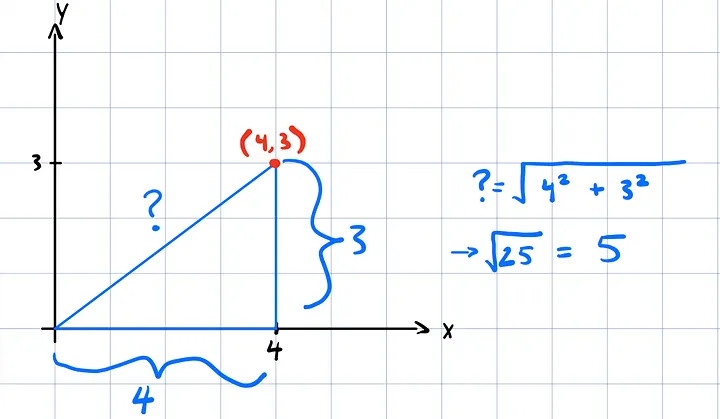  
编辑

图中高亮显示的点 (4,3) 被分解成两个方向分量 -> (4,0) 和 (0,3)：

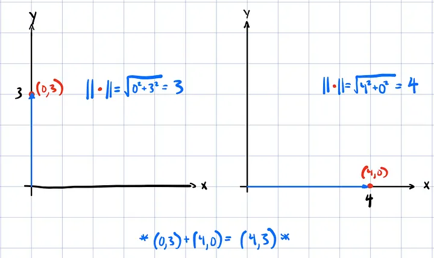  
编辑

这些方向分量使量级的概念更容易理解。这些分量的大小就是它们到原点的距离，而这正是量级公式有效的原因。

通过将这些分解分量相加，我们得到了原点 (4,3)。因此，从 (0,0) 到 (4,3) 的线段长度就是各个分量之和的模！虽然这段描述略显冗长，但它完美地过渡到了欧几里得范数（也称为 L2 范数）的正式定义：

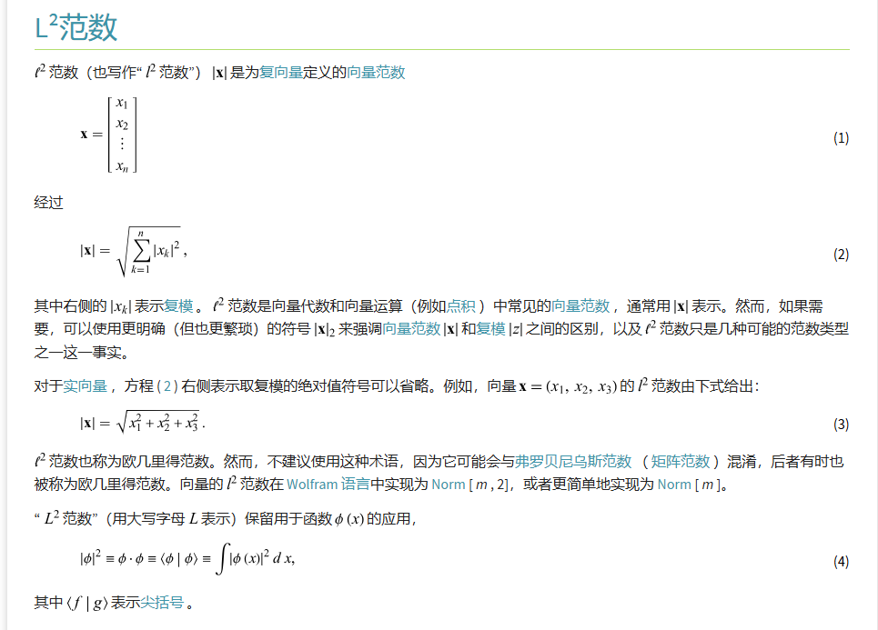  
编辑

  

这张图在讲   **范数**，而在**实数向量空间 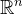**  里，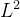 范数就是我们常说的 **欧氏范数（Euclidean norm）**——也就是“向量的长度”。

* * *

## 1) 图里在做什么：从向量到“长度”

图中先把向量写成列向量：

然后给出它的 L2 范数（也写作 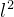 范数、2-范数）：

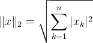

这就是**欧氏范数的定义**（在实数情况下就是最常见的“勾股定理推广”）。

  

-   如果 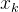 是**实数**，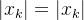 就是普通绝对值，于是变成：
    

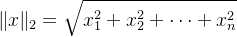

图里用三维举例：

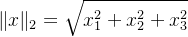

这就是三维空间里“点到原点的直线距离”。

  

* * *

## 2) 为什么叫“欧氏”：它对应我们熟悉的几何距离

在二维平面里，点 (x1,x2) 到原点的距离是：

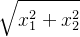

三维是：

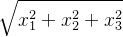

推广到 n 维就是图里的式子。所以它叫“欧氏”（Euclid）——对应我们直觉里的**直线距离**。

更一般地，两点 a,b 的欧氏距离就是：

  

* * *

## 3) 图里提到复数：为什么要写 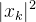 

如果向量分量是复数 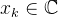，直接平方会出“方向/相位”的麻烦，所以用**模长平方**：

-   若 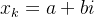，则 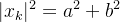 
    

因此

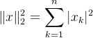

也可以写成（更线性代数的形式）：

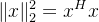

其中 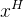 是共轭转置（实数情况下就是 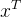）。

  

* * *

## 4) 图最后的“函数版 L2”：从求和变积分

图里还说“大写 L2”常保留给**函数空间**：

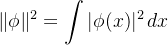

你可以把它理解成：

-   离散向量：把每个分量的“能量”  加起来（求和）
    
-   连续函数：把每一点的“能量密度” 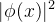 在全域加起来（积分）
    

所以它们本质上是同一件事：**平方 → 累加 → 开方**。

  

## 5)在正交矩阵中的应用

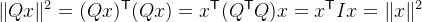

该公式是正交矩阵最核心的性质之一：**它保持向量的长度（欧氏范数）不变。**

这看起来一串矩阵运算，其实超级简单，就是在证明“旋转或反射后，向量长度没变”。就像你拿一根棒子转来转去，或者照镜子，棒子长度始终一样。

我们一步步拆开，每步都解释为什么：

  

#### 步骤1：向量长度平方怎么算？

  

-   一个向量 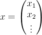 的长度（欧氏范数）是 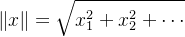 
    
      
    
-   长度平方就是 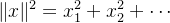 
    
      
    
-   用矩阵写法：这就是 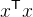（x 的转置乘 x，自己和自己的点积）。
    
      
    
-   同理，变换后的向量 Qx 的长度平方是 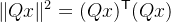 
    

-   这步就是定义：任何向量的长度平方 = 它转置乘它自己。
    
      
    

#### 步骤2：矩阵转置的“反向”规则

-   矩阵乘法的转置有个重要性质：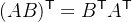（顺序反过来）
    
-   所以 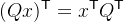（Q 和 x 换序，转置掉）
    
-   代入得：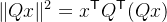
    
-   再把 Qx 带进去：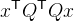
    

-   这里用了结合律：矩阵乘法可以“括号移动”。
    
      
    

#### 步骤3：正交矩阵的“杀手锏”——  

-   正交矩阵的定义就是 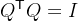（单位矩阵，对角线1，其他0）
    
-   所以直接代入：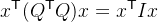
    
-   单位矩阵乘任何东西都不变：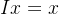
    
-   所以 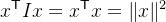 
    

完事！整个证明就靠这三步：定义 + 转置规则 + 正交定义。

#### 用最简单的2D例子算一遍（旋转矩阵）

拿经典旋转矩阵（转 θ 角）：

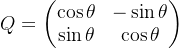

随便拿个向量，比如 （长度5，因为3-4-5直角三角形）

-   原长度平方：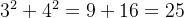
    
-   变换后 Qx：假设 θ=90°（cos90=0, sin90=1）
    
    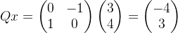
    
-   新长度平方：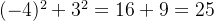，还是25！长度没变。
    

不管转多少度，都一样（因为 cos²θ + sin²θ = 1 的恒等式在起作用）。

#### 反射也一样（带镜像的正交矩阵）

比如沿x轴反射：

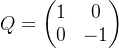

  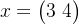  →   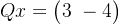   

长度平方还是 9 + 16 = 25。就像镜子里的你，身高没变，只是左右翻了。

  

#### 为什么这个性质这么重要？

-   几何上：旋转、反射就是“刚体运动”，不拉伸、不压缩。
    
-   实际用：图形学里转模型不走样；数值计算里正交矩阵不会放大误差（保持数值稳定）；量子力学里能量（长度平方）守恒。
    
-   扩展：它不只保持长度，还保持角度（内积不变，证明类似：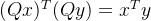）。
    

脑补画面：想象一根箭头（向量），乘上正交矩阵后，只是方向变了（旋转或翻转），箭头长短完全一样。非正交矩阵就会把箭头拉长或压短。

一句话：**正交变换不会改变欧氏长度**。

  

* * *

## 6) 不只是“长度不变”，连“距离”和“角度”都不变

### 距离不变

两点距离是 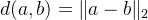。  
正交变换后：

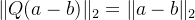

所以 **所有点与点的距离都保持**，这就是“刚体运动”的数学版本。

### 角度不变

角度来自点积公式：

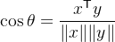

正交变换后点积也保持：

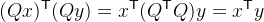

同时长度也保持，所以 cos⁡θ 不变，角度就不变。

> 结论：**正交矩阵 = 保距离 + 保角度** 的变换（旋转或旋转+镜像）。