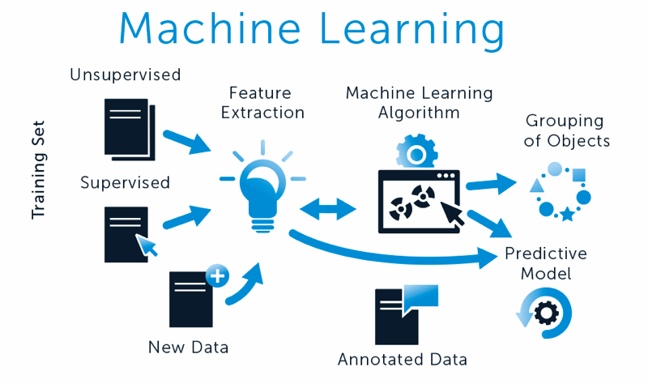
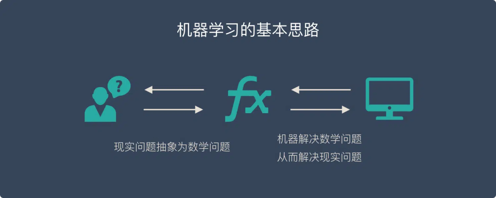
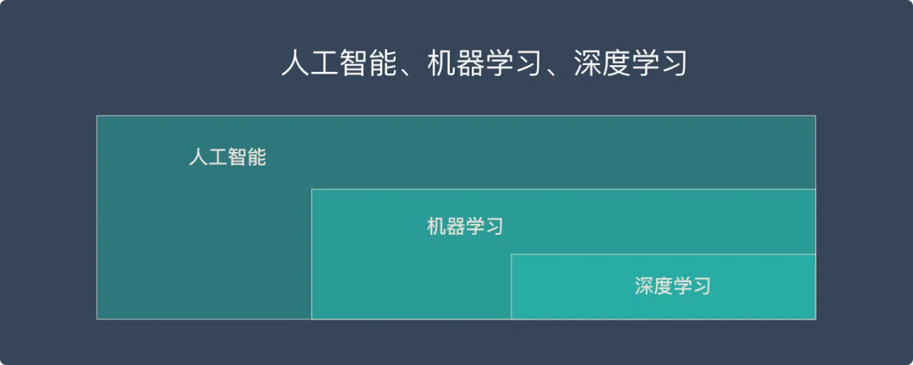
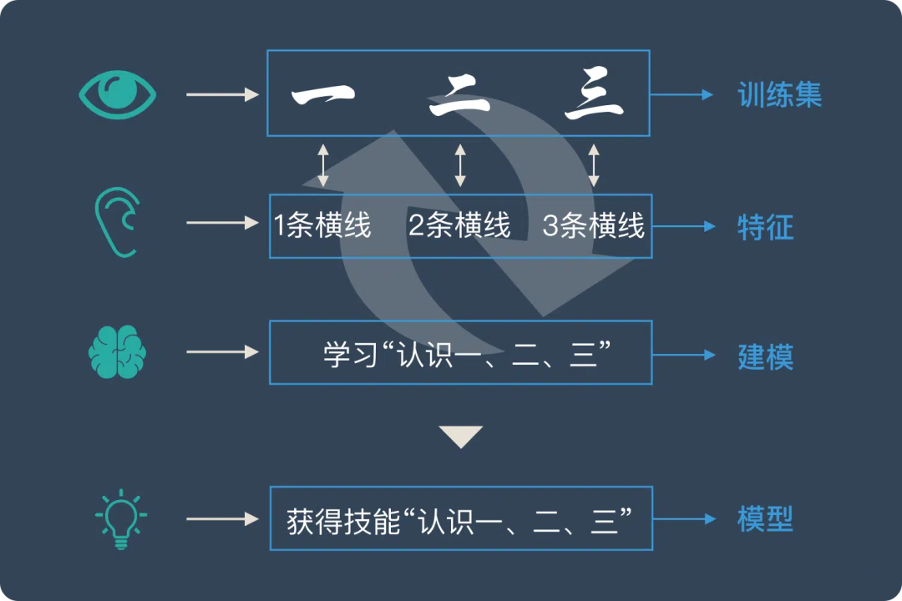
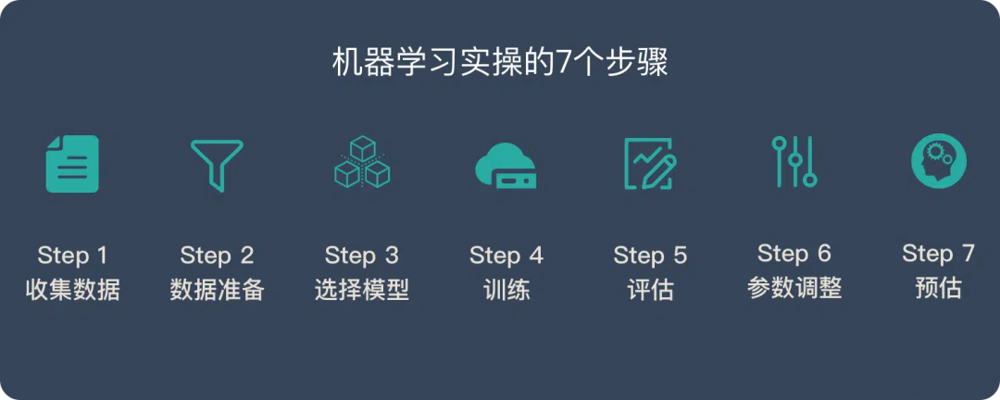
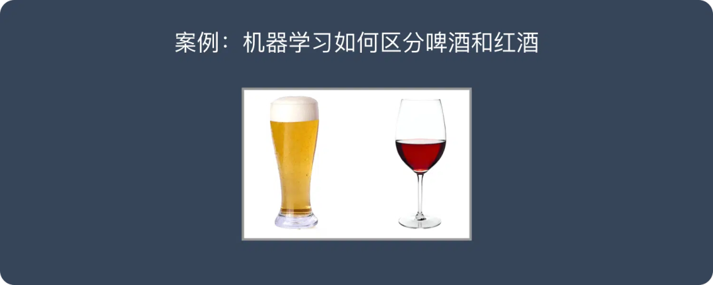

# 机器学习算法 - 一文搞懂ML（机器学习）

> 原文地址: [https://mp.weixin.qq.com/s/fJqemuqvpn7jFU3QMcjA4w](https://mp.weixin.qq.com/s/fJqemuqvpn7jFU3QMcjA4w)

本文将从**_****_机器学习_**的本质、机器学习**_的原理、分类与算法_****_**三个方面，带您一文搞懂机器学习**Machine Learning | ML**。

**__**一、机器学习**__**_****_的本质_****_

****基本思路**：********无论使用什么样的算法和数据，机器学习的基本思路都可以归结为以下三个核心步骤。******

-   问题抽象与数学建模：把现实生活中的问题抽象成数学模型，并且很清楚模型中不同参数的作用
    
-   模型求解与学习：利用数学方法对这个数学模型进行求解，从而解决现实生活中的问题
    
-   模型评估与反馈：评估这个数学模型，是否真正地解决了现实生活中的问题，以及解决的效果如何？
    

**AI、ML、DL三者的关系：********人工智能是最广泛的概念，机器学习是实现人工智能的一种方法，而深度学习则是机器学习中的一种特定技术。******

-   人工智能（AI）：这是最广泛、最上层的概念。人工智能的目标是让计算机能够执行需要人类智能才能完成的复杂任务。
    
-   机器学习（ML）：作为人工智能的一个子领域，机器学习是实现人工智能目标的一种方法。它研究如何通过算法使计算机能够从数据中学习并做出预测或决策，而无需进行明确的编程。
    
-   深度学习（DL）：深度学习是机器学习领域中的一种特定技术，它受到了人脑结构的启发，使用人工神经网络来模拟人类神经网络的工作原理。深度学习通过构建多层神经网络来处理和分析复杂的数据，能够自动地提取数据中的高层次特征。
    

_**二、**__**机器学习**__**_**_**_**_****_的原理_****_**_**_**_**_

**机器学习的原理：********机器学习是通过使用带有标签的训练集数据，识别和提取特征，建立预测模型，并将所学规律应用于新数据进行预测或分类的过程。******

-   训练集：提供标签化的数据，用于训练模型。例如，识字卡片帮助小朋友了解汉字与特征的关系。
    
-   特征：数据中的可测量属性，用于区分不同类别。如“一条横线”帮助区分汉字“一”。
    
-   建模：通过算法从数据中学习，构建预测模型。小朋友通过重复学习建立汉字认知模型。
    
-   模型应用：学习到的规律用于新数据预测或分类。学会识字后，小朋友能识别并区分不同汉字。
    

**机器学习的步骤********：************收集数据、数据准备、选择模型、训练、评估、参数调整和预测。******

************

案例：机器学习通过酒精度和颜色来区分红酒和啤酒。  

-   步骤1：收集数据
    
-   任务：购买多种啤酒和红酒，并使用设备测量其颜色和酒精度。
    
-   输出：创建一个包含颜色、酒精度和种类的数据表格。
    
-   步骤2：数据准备
    
-   任务：检查数据质量，可能需要进行数据清洗。
    
-   数据划分：将数据分为训练集（60%）、验证集（20%）和测试集（20%）。
    
-   步骤3：选择模型
    
-   任务：根据问题的性质和数据特征选择一个合适的模型。
    
-   示例：在本例中，由于只有两个特征（颜色和酒精度），可以选择一个简单的线性模型。
    
-   步骤4：训练
    
-   任务：使用训练集数据对模型进行训练。
    
-   自动化：训练过程由机器自动完成，类似于解决数学问题。
    
-   步骤5：评估
    
-   任务：使用验证集和测试集评估模型的性能。
    
-   评估指标：主要关注准确率、召回率和F值等指标。
    
-   步骤6：参数调整
    
-   任务：根据评估结果对模型参数进行调整，以优化性能。
    
-   方法：通过人为地调整参数来改善模型表现。
    
-   步骤7：预测
    
-   任务：利用训练好的模型对新数据进行预测。
    
-   应用场景：在本例中，可以输入新酒的颜色和酒精度，模型将预测其为啤酒或红酒。
    

_**三、****___**_******___**_**分类与算法**_**___******_**___******_

****机器学习的分类：**********根据训练方法可以分为3大类，************监督学习、非监督学习、强化学习。******

-   监督学习
    
-   定义：提供带有正确答案标签的数据集，让机器学习如何计算正确答案。
    
-   示例：通过标记猫和狗的照片来训练机器识别猫和狗。
    
-   特点：需要人工标签，学习效果较好，但成本较高。
    
-   非监督学习
    
-   定义：提供没有标签的数据集，让机器挖掘潜在的数据结构或分类。
    
-   示例：将未标记的猫和狗照片给机器，让其自行分类。
    
-   特点：无需人工标签，机器自行发现数据规律，但结果解释性较弱。
    
-   强化学习
    
-   定义：智能体通过与环境互动，学习在不同状态下采取最佳行为以获得最大累积回报。
    
-   示例：AlphaStar 通过强化学习训练，在星际争霸游戏中战胜职业选手。
    
-   特点：模拟生物学习过程，有望实现更高智能，关注智能体的决策过程。
    

********机器学习的算法：**************15种经典机器学习算法******

-   监督学习算法：
    
-   线性回归：一种用于预测连续数值型输出的统计方法，通过找到最佳拟合直线来描述自变量和因变量之间的关系。
    
-   逻辑回归：虽然名字中有“回归”，但它实际上是一种分类算法，用于预测二分类或多分类的结果，通过逻辑函数将线性回归的输出映射到概率空间。
    
-   线性判别分析：一种降维技术，同时也用于分类，它通过找到最能区分不同类别的方向来投影数据。
    
-   决策树：一种直观易懂的分类与回归算法，通过树状结构对数据进行划分，每个节点代表一个属性判断，最终到达叶节点得到预测结果。
    
-   朴素贝叶斯：基于贝叶斯定理和特征之间独立的假设来进行分类的算法，简单高效但有时会受限于其独立性假设。
    
-   K邻近：一种基于实例的学习，它的思想是如果一个样本在特征空间中的k个最相邻的样本中的大多数属于某一个类别，则该样本也属于这个类别。
    
-   学习向量量化：一种基于神经网络的聚类方法，通过训练来优化码本（即聚类中心），使得每个输入样本都能被最近邻的码字所代表。
    
-   支持向量机：在高维空间中寻找一个超平面来分隔不同类别的数据，并且使得分隔的间隔最大化，对于非线性问题也可以通过核函数映射到高维空间来解决。
    
-   随机森林：通过构建多个决策树并结合它们的预测结果来提高整体预测性能的集成学习方法。
    
-   AdaBoost：一种自适应增强算法，通过组合多个弱分类器来构建一个强分类器，每个弱分类器都关注之前分类器错误分类的样本。
    
-   非监督学习算法：
    
-   高斯混合模型：假设所有数据点都是由一定数量的高斯分布混合而成的，通过EM算法来估计每个高斯分布的参数以及它们的权重。
    
-   限制波尔兹曼机：一种生成式随机神经网络，可用于降维、特征学习、预训练和分类等任务，是深度学习领域的重要组件之一。
    
-   K-means 聚类：一种简单且广泛使用的聚类算法，它将数据划分为K个不同的簇，每个簇的中心是所有属于这个簇的数据点的均值。
    
-   最大期望算法：一种迭代优化技术，用于在统计模型中找到可能性最大的参数估计，常用于处理数据中的缺失值或隐藏变量。