# 梯度下降法的迭代步骤

> 原文地址: [https://mp.weixin.qq.com/s/skbE9WG5Hf8BauV5FJIZog](https://mp.weixin.qq.com/s/skbE9WG5Hf8BauV5FJIZog)

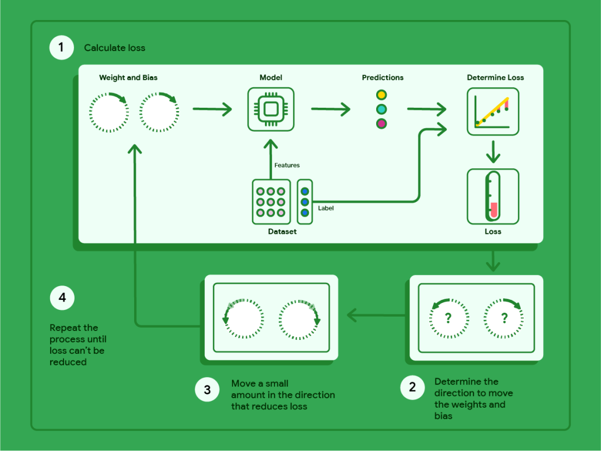

这张图其实把\*\*梯度下降（Gradient Descent）\*\*的训练过程画成了一个“循环流水线”，核心就是：**用当前参数做预测 → 算误差（loss）→ 计算往哪边改参数会让误差变小 → 小步更新参数 → 重复**。

下面我按图里的 1→2→3→4，把每一步讲清楚，并配上线性回归最常见的公式。

* * *

## 图里每个模块在说什么

  

-   **Dataset（数据集）**：分成两部分
    

-   Features：输入特征 x
    
-   Label：真实答案 y
    
      
    

  

-   **Weight and Bias（权重和偏置）**：就是要训练的参数
    

-   权重 w（可能是向量）
    
-   偏置 b
    
      
    

  

-   **Model（模型）**：用 w,b 把 x 变成预测值
    
-   Predictions（预测）：y^
    
-   Determine Loss（计算损失）：把 y^ 和 y 做对比得到 loss（温度计越高说明错得越多）
    

* * *

## 1) Calculate loss：前向计算 + 算损失

以**线性回归**为例：

### ① 用当前参数做预测（前向）

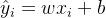

（多特征时：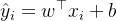）

### ② 用预测和真实值算损失（比如 MSE）

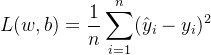

这一步对应图中：Dataset → Model → Predictions → Determine Loss → Loss。

* * *

## 2) Determine direction：算“往哪边改参数才会让 loss 下降”（梯度）

这里的“方向”就是**梯度**：对参数求偏导。

对单变量线性回归（）：

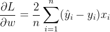

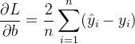

直观理解：

-    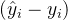 是“预测偏高/偏低”的方向与幅度
    
-   乘上 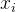 会告诉你“斜率 w”该怎么调
    
-   对 b 来说就是整体偏移量该怎么调
    

图里右下角两个带问号的圈，就是在问：**w 和 b 应该往哪边拧？**

* * *

## 3) Move a small amount：按这个方向“小步走”（参数更新）

梯度指向的是 **loss 增长最快**的方向，所以要想下降，要走反方向：

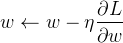

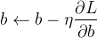

  

-   η 叫**学习率（learning rate）**：步子大小
    

-   太大：可能来回震荡甚至发散
    
-   太小：下降很慢
    
      
    

这一步就是图中第 3 步：“Move a small amount in the direction that reduces loss”。

* * *

## 4) Repeat：重复直到 loss 不能再明显降低（停止条件）

你不断循环 1→2→3，直到满足某个停止条件，例如：

-   loss 的下降小于阈值：∣Lt−Lt−1∣<ϵ
    
-   梯度很小：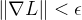
    
-   达到最大迭代次数（epochs / steps）
    

这就是图里第 4 步：“Repeat the process until loss can’t be reduced”。

* * *

## 把整套流程写成“训练循环”（你一眼就能对照图）

1.  初始化 w,b（随机或 0）
    
2.  循环：
    

-   用 w,b 算 y^
    
-   算 loss：L(w,b)
    
-   算梯度：
    
-   更新：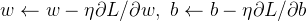
    
      
    

4.  直到满足停止条件
    

我用一个**超小数据集**，把图里的 **1→2→3→4** 跑两三轮给你看，保证每一步都能对上号。

* * *

## 例子数据（线性回归）

我们希望学到 y≈wx+b。

数据集（3 个点）：

i

Xi

Yi

1

1

2

2

2

4

3

3

6

损失函数用 **MSE**：

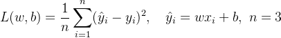

梯度（你在第 2 步会用到）：

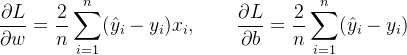

学习率取 η=0.1。

* * *

# 第 0 轮（初始化）

设 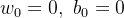 

### 1) 预测 + 算 loss

![$\hat y=[0,0,0]$](https://mmbiz.qpic.cn/mmbiz_png/jlXjovro0traMPNUrroYicsiaKficpWTmXREXFC1N39aubWucicpuzBWJlWnMYcY9pMadLMxzdT7t0B2ucN1UlucsA/640?wx_fmt=png&from=appmsg)

误差 ![$e_i=\hat y_i-y_i=[-2,-4,-6]$](https://mmbiz.qpic.cn/mmbiz_png/jlXjovro0traMPNUrroYicsiaKficpWTmXRDliaQBlzglBC2fkK2NQLnxWNFiaYIp8OUwrz2Q46TOgibzeDlvPKrFstQ/640?wx_fmt=png&from=appmsg) 

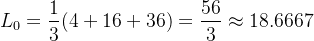

### 2) 算梯度（方向）

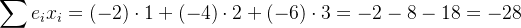

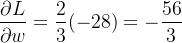

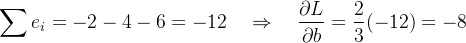

### 3) 小步更新参数（走“负梯度”）

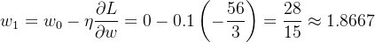

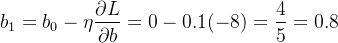

* * *

# 第 1 轮（用 w1,b1 再来一次）

### 1) 预测 + 算 loss

-   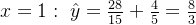, 误差 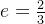 
    
-   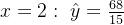, 误差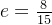
    
-   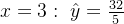, 误差 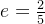 
    

loss：

![$L_1=\frac{1}{3}\left[\left(\frac{2}{3}\right)^2+\left(\frac{8}{15}\right)^2+\left(\frac{2}{5}\right)^2\right] =\frac{1}{3}\left(\frac{4}{9}+\frac{64}{225}+\frac{4}{25}\right) =\frac{8}{27}\approx 0.2963$](https://mmbiz.qpic.cn/mmbiz_png/jlXjovro0traMPNUrroYicsiaKficpWTmXRxtfia3VULC69X8b5zML4AGT3E0s8U9Rmr9zsTUXvzccTa5HnzUSqq4Q/640?wx_fmt=png&from=appmsg)

（你看：从 18.67 直接掉到 0.296，说明“方向 + 小步更新”有效。）

### 2) 算梯度

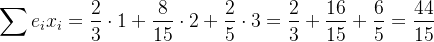

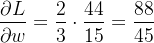

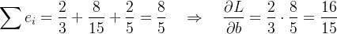

### 3) 更新

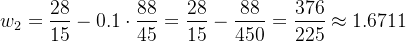

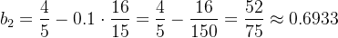

* * *

# 第 2 轮（再看一次 loss）

用 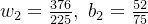：

-     
    
-   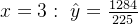, 误差 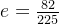 
    
-     
    
-   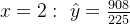, 误差 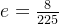 
    
-     
    
-   , 误差 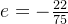 
    

![$L_2=\frac{1}{3}\left[\left(\frac{82}{225}\right)^2+\left(\frac{8}{225}\right)^2+\left(\frac{22}{75}\right)^2\right] =\frac{11144}{151875}\approx 0.0734$](https://mmbiz.qpic.cn/mmbiz_png/jlXjovro0traMPNUrroYicsiaKficpWTmXRbgVCf5m2RXfA62fwcTlKl58W6Yq2obBtJWM3uHrDcqclIkZa7aSgXw/640?wx_fmt=png&from=appmsg)

loss 继续下降 ✅

* * *

## 这和图里 1→2→3→4 的对应关系

  

-   **1 Calculate loss**：算 y^ 和 L
    
      
    
-   **2 Determine direction**：算梯度 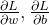 
    
      
    
-   **3 Move a small amount**：w,b 用学习率 η 小步更新
    
      
    
-   **4 Repeat**：loss 不怎么降了就停
    

我也可以把 loss 看成“温度”，梯度看成“哪个旋钮（w/b）往哪拧会降温”，再用同一组数据画出 loss 曲线（迭代次数 vs loss），你会更直观看到下降过程。

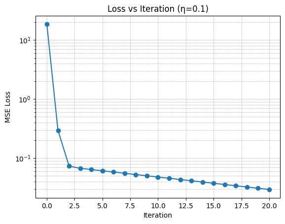  
编辑

我把刚才那组“玩具数据”继续往下迭代了 **20 次**（学习率 η=0.1），并把每一轮的：

-   参数：w,b
    
-   当前损失：MSE loss
    
-   梯度：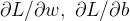
    

都列成了一张表（你现在应该能在界面里看到 **Gradient Descent Iterations** 的表格），同时画了一张 **Loss vs Iteration** 曲线图。

你可以从图上直观看到这件事：

### 1) loss 一开始下降非常快

-   第 0 轮 loss 很大（18.67）
    
-   第 1 轮直接降到 0.296
    
-   第 2 轮再降到 0.0734
    

这对应你图里第 1 步的“温度计”，温度快速降下来了。

### 2) 后面下降变慢（接近最优点）

当 w,bw,bw,b 已经很接近最优解时，梯度会变小（表格里你会看到 dL/dw、dL/db 逐步变小），于是每次更新带来的改进也变小——这就是曲线后半段“变平”的原因。

### 3) 为什么要用对数坐标（log）

我在 loss 曲线用的是 **log 纵轴**，这样你能同时看清：

-   前期的“断崖式下降”
    
-   后期的“缓慢逼近”
    

* * *

也可以把它和图片里的 4 个步骤更强绑定，按**指定的某一轮**（比如第 1 轮），把那一轮的：

-   y^（预测点）
    
-   误差 e
    
-   loss
    
-   梯度
    
-   更新后的 w,b
    

一项项拆开写出来，让你像“走迷宫”一样对照图里的箭头走一圈。

我们就把**第 1 轮**、**第 2 轮**按图里的 **1→2→3**（算预测/损失 → 算方向(梯度) → 小步更新）完整走一遍。  
（这里“第 1 轮”指：用 (w1,b1) 去算 loss/梯度并更新到 (w2,b2)；“第 2 轮”指：用 (w2,b2) 更新到 (w3,b3)。）

数据：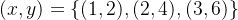，学习率 η=0.1，损失 MSE

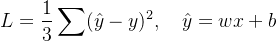

梯度：

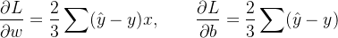

* * *

## 先给出上一轮结果（第 0 轮更新后）

初始化 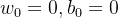 更新后得到：

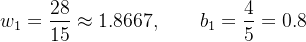

* * *

# 第 1 轮（用 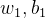 → 更新到 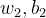）

## 1) 预测 y^ + loss

对 3 个点逐个算：

### 点 1：x=1,y=2

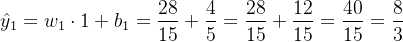

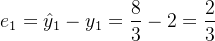

### 点 2：x=2,y=4

### 点 3：x=3,y=6

loss：

![$L_1=\frac{1}{3}\left[\left(\frac{2}{3}\right)^2+\left(\frac{8}{15}\right)^2+\left(\frac{2}{5}\right)^2\right] =\frac{1}{3}\left(\frac{4}{9}+\frac{64}{225}+\frac{4}{25}\right) =\frac{8}{27}\approx0.2963$](https://mmbiz.qpic.cn/mmbiz_png/jlXjovro0traMPNUrroYicsiaKficpWTmXRxtfia3VULC69X8b5zML4AGT3E0s8U9Rmr9zsTUXvzccTa5HnzUSqq4Q/640?wx_fmt=png&from=appmsg)

> 这一步就是图里的：Dataset → Model → Predictions → Determine Loss → Loss。

* * *

## 2) 计算方向（梯度）

先算两个求和项：

### 

### 

> 这一步就是图里的第 2 步：“Determine the direction to move the weights and bias”。

* * *

## 3) 小步更新参数（梯度下降）

> 这一步就是图里的第 3 步：“Move a small amount …”。

* * *

# 第 2 轮（用 w2,b2 → 更新到 w3,b3）

现在从：

开始。

## 1) 预测 + loss

### 点 1：x=1,y=2

### 点 2：x=2,y=4

### 点 3：x=3,y=6

loss：

![$L_2=\frac{1}{3}\left[\left(\frac{82}{225}\right)^2+\left(\frac{8}{225}\right)^2+\left(-\frac{22}{75}\right)^2\right] \approx 0.0734$](https://mmbiz.qpic.cn/mmbiz_png/jlXjovro0traMPNUrroYicsiaKficpWTmXR72QZ0cNQMWkdvkpYuvVSrlNUeHmoEEVWwEo5zXyyLyWqdq0TRfxGVg/640?wx_fmt=png&from=appmsg)

（注意：第 3 个点误差变成负的，意思是它开始“预测偏低”了。）

* * *

## 2) 梯度

### 

### 

* * *

## 3) 更新到 w3,b3

* * *

## 你现在能读懂“方向”了吗？

看第 2 轮的梯度很关键：

-     是**负数**  
      更新 w←w−η(负数)就会让 **w 增大**  
      （我们确实看到 w 从 1.6711 → 1.7007）
    
-     是**正数**  
      更新后 **b 变小**  
      （0.6933 → 0.6862）
    

这就是图里第 2 步“决定往哪边拧旋钮”，第 3 步“拧一点点”。