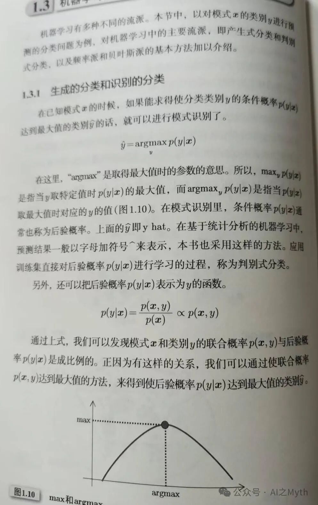

# 生成式分类和判别式分类

> 原文地址: [https://mp.weixin.qq.com/s/mEtBsXN7ALatNMAVcZkbdA](https://mp.weixin.qq.com/s/mEtBsXN7ALatNMAVcZkbdA)

我们来通俗地解读这段文字以及其中涉及的数学概念，重点解释生成式分类和判别式分类的区别。

**核心思想：** 这段文字讨论的是机器学习中如何进行分类，也就是如何判断一个事物属于哪个类别。它介绍了两种主要的分类方法：生成式分类和判别式分类。

**1\. 条件概率 p(y|x)：**

-   `x` 代表一个事物的特征（例如，一张照片的像素、一封邮件的文字）。
    
-   `y` 代表事物的类别（例如，照片是猫还是狗、邮件是垃圾邮件还是正常邮件）。
    
-   `p(y|x)` 读作“在已知 x 的条件下，y 的概率”。简单来说，就是“看到这个事物（x），它属于某个类别（y）的可能性有多大”。这个概率也称为**后验概率**。
    

**例子：**

-   `x`：一张照片，有很多毛、四条腿、会叫。
    
-   `y`：类别可以是“狗”、“猫”、“狼”等等。
    
-   `p(狗|x)`：看到这张照片，它是狗的可能性。
    
-   `p(猫|x)`：看到这张照片，它是猫的可能性。
    

分类的目标就是找到使 `p(y|x)` 最大的那个类别 `y`，也就是可能性最大的类别。

**2\. argmax：**

-   `argmax p(y|x)` 表示“使 `p(y|x)` 达到最大值时，`y` 的取值”。简单来说，就是“哪个类别 y 使得可能性最大？”。
    

**例子：** 如果 `p(狗|x) = 0.8`，`p(猫|x) = 0.1`，那么 `argmax p(y|x)` 的结果就是“狗”，因为 0.8 比 0.1 大。

**3\. 判别式分类：**

-   直接学习 `p(y|x)`，也就是直接学习“看到什么特征，它最可能是什么类别”。
    
-   **关注点：** 类别之间的**分界线**在哪里。
    
-   **例子：** 支持向量机 (SVM)、逻辑回归等算法就是判别式分类。它们试图找到一条线（或一个面），把不同类别的数据尽可能分开。
    

**4\. 生成式分类：**

-   不直接学习 `p(y|x)`，而是学习**联合概率 p(x, y)**，也就是“同时看到这个特征 x 和这个类别 y 的概率”。
    
-   然后通过贝叶斯公式计算 `p(y|x)`：`p(y|x) = p(x, y) / p(x)`。
    
-   **关注点：** 每个类别**本身长什么样**，以及**特征是如何产生的**。
    
-   **例子：** 朴素贝叶斯、隐马尔可夫模型等算法就是生成式分类。它们试图建立每个类别的模型，然后看看新来的数据更符合哪个模型。
    

**举个更形象的例子：**

假设我们要区分香蕉和苹果。

-   **判别式方法：** 观察它们的颜色、形状、大小，然后直接学习一个规则：“如果又长又黄，那就是香蕉；如果又圆又红，那就是苹果”。它只关心如何区分它们。
    
-   **生成式方法：** 分别研究香蕉和苹果的生长过程、基因构成等等，建立香蕉和苹果各自的模型。然后拿来一个水果，看看它更像是按照哪个模型“生成”出来的。它不仅关心如何区分它们，还关心它们是怎么来的。
    

**总结：**

-   **判别式：** 直接学习分类边界，更直接、更高效，通常在分类任务中表现更好。
    
-   **生成式：** 学习数据本身的分布，可以用于生成新的数据，提供更多信息，但在分类任务中可能不如判别式方法直接。
    

希望以上解释能够帮助你理解这段文字和相关的数学概念。简单来说，这段文字介绍了两种不同的分类方法，它们的核心区别在于学习的目标不同：一个是直接学习类别之间的分界线（判别式），另一个是学习每个类别本身的样子（生成式）。

**什么是贝叶斯公式？**

贝叶斯公式是一个用来更新我们对某个事件发生概率的认知的公式。简单来说，就是当我们获得新的信息后，如何调整我们之前对某个事件发生概率的估计。

**公式长什么样？**

P(A|B) = P(B|A) \* P(A) / P(B)

看起来有点复杂，我们来逐个解释：

-   **P(A|B)：** 在 B 事件发生的条件下，A 事件发生的概率。也称为“后验概率”，是我们获得新信息后对 A 事件概率的更新。
    
-   **P(B|A)：** 在 A 事件发生的条件下，B 事件发生的概率。
    
-   **P(A)：** A 事件发生的先验概率，也就是在我们获得新信息之前，我们对 A 事件发生概率的估计。
    
-   **P(B)：** B 事件发生的概率。
    

**用一个比喻来解释：**

想象一下，你是一位侦探，正在调查一起盗窃案。

-   **A：** 嫌疑人是小明。
    
-   **B：** 在犯罪现场发现了小明的指纹。
    
-   **P(A)：** 在没有任何其他线索的情况下，你认为小明是小偷的概率（先验概率）。比如，你觉得小明平时挺老实的，这个概率可能比较低，比如 10% (P(A) = 0.1)。
    
-   **P(B|A)：** 如果小明真的是小偷，那么在犯罪现场发现他指纹的概率（可能性）。这个概率应该比较高，比如 90% (P(B|A) = 0.9)。
    
-   **P(B)：** 在犯罪现场发现指纹的概率。这个概率可能比较高，因为通常罪犯都会留下一些痕迹，比如 80% (P(B) = 0.8)。
    

现在，你根据贝叶斯公式计算：

P(A|B) = (0.9 \* 0.1) / 0.8 = 0.1125

也就是说，在犯罪现场发现了小明的指纹之后，你认为小明是小偷的概率从原来的 10% 提高到了 11.25%。（虽然提升不多，但说明指纹这个新证据确实增加了小明是嫌疑人的可能性。）

**几个更实际的例子：**

1.  **医学诊断：**
    
    医生会根据该疾病的患病率（P(A)）、检测的准确率（P(B|A)）以及检测结果呈阳性的概率（P(B)），使用贝叶斯公式来计算某人实际患病的概率（P(A|B)）。即使检测结果呈阳性，也不一定代表真的患病，因为可能存在假阳性。贝叶斯公式可以帮助医生更准确地判断。
    

-   **A：** 某人患有某种疾病。
    
-   **B：** 某项医学检测结果呈阳性。
    

3.  **垃圾邮件过滤：**
    
    垃圾邮件过滤器会根据以往的经验（P(A)）、垃圾邮件中包含这些关键词的概率（P(B|A)）以及邮件中包含这些关键词的概率（P(B)），使用贝叶斯公式来判断一封邮件是否是垃圾邮件（P(A|B)）。
    

-   **A：** 邮件是垃圾邮件。
    
-   **B：** 邮件中包含某些关键词（例如“免费”、“中奖”）。
    

5.  **搜索引擎：**
    
    搜索引擎会根据用户的历史搜索记录（P(A)）、用户在查找该信息时输入该关键词的概率（P(B|A)）以及用户输入该关键词的概率（P(B)），使用贝叶斯公式来预测用户的搜索意图（P(A|B)），从而返回更相关的搜索结果。
    

-   **A：** 用户搜索的意图是查找某个信息。
    
-   **B：** 用户输入了某个关键词。
    

**总结：**

贝叶斯公式的核心思想是利用新信息来更新我们对事件概率的认知。它在很多领域都有广泛的应用，例如医学、工程、人工智能等。理解贝叶斯公式的关键在于理解公式中各个概率的含义，以及它们之间的关系。

补充：

内容涉及生成式分类与判别式分类中的数学公式和条件概率的解释。让我用通俗的语言为您解读其中的数学内容：

### 1\. **公式的含义**

公式中提到的核心公式是：

y^\=arg⁡max⁡yp(y∣x)\\hat{y} = \\arg\\max\_y p(y|x)y^\=argymaxp(y∣x)

-   **p(y∣x)p(y|x)p(y∣x)**：这表示在已知 xxx（比如某个特定条件或观测值）时，类别 yyy 出现的条件概率。
    
-   **arg⁡max⁡\\arg\\maxargmax**：这是一个数学运算符，意思是“找到让后面的公式（这里是 p(y∣x)p(y|x)p(y∣x)）达到最大值的 yyy”。
    

**简单解释**：在分类任务中，机器会根据给定的数据 xxx（比如一张图片），找到最有可能的类别 yyy，即 p(y∣x)p(y|x)p(y∣x) 最大的那个类别。

* * *

### 2\. **图解的含义**

图中的“max”和“argmax”：

-   **max**：找到函数（概率） p(y∣x)p(y|x)p(y∣x) 的最大值（比如某个概率的数值）。
    
-   **argmax**：找到让这个最大值对应的 yyy 值（比如具体是哪一类，比如猫、狗等）。
    

**类比**：假如 yyy 是一个分类（比如猫、狗、鸟），p(y∣x)p(y|x)p(y∣x) 是每个分类的可能性。我们要找出哪种动物的可能性最大，以及这个最大值的概率是多少。

* * *

### 3\. **分子分母的公式**

进一步解释公式：

p(y∣x)\=p(x,y)p(x)p(y|x) = \\frac{p(x, y)}{p(x)}p(y∣x)\=p(x)p(x,y)

-   **分子 p(x,y)p(x, y)p(x,y)**：表示 xxx 和 yyy 同时出现的概率。
    
-   **分母 p(x)p(x)p(x)**：表示 xxx 单独出现的概率（不考虑分类）。
    

公式的意思是： “已知 xxx 的情况下，属于某个类别 yyy 的概率”是由“ xxx 和 yyy 同时发生的概率”除以“ xxx 的总概率”得到的。

* * *

### 4\. **通俗总结**

整个内容讲的是分类问题的数学基础：

-   **目标**：机器学习要根据已知条件（比如图片数据）预测一个类别（比如这是一只猫还是狗）。
    
-   **方法**：
    

-   通过计算每个类别的概率 p(y∣x)p(y|x)p(y∣x)，找到概率最大的那个类别（即最可能的类别）。
    
-   这个过程叫“生成式分类”或“判别式分类”。