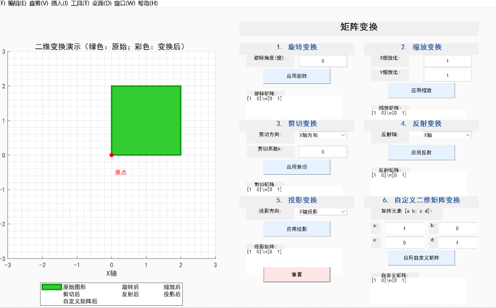
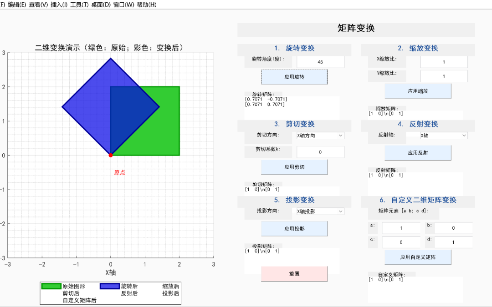
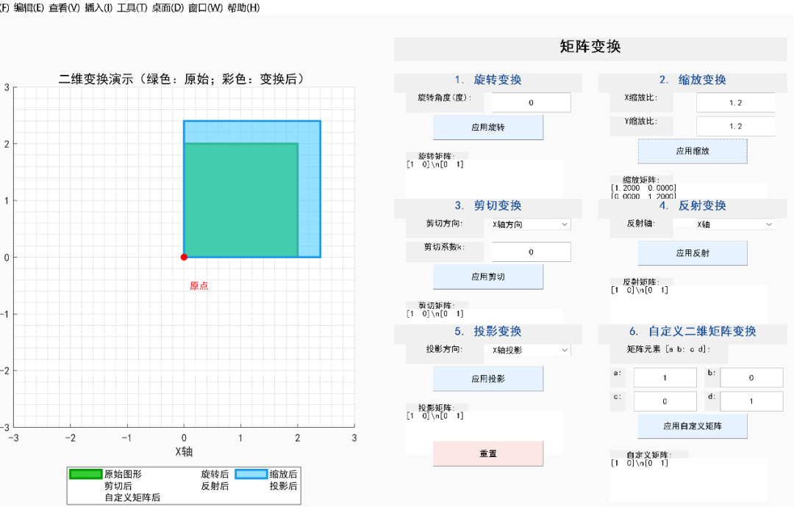
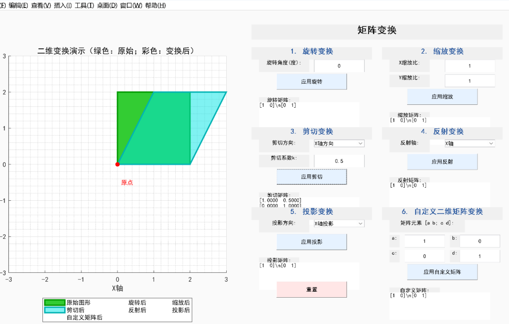
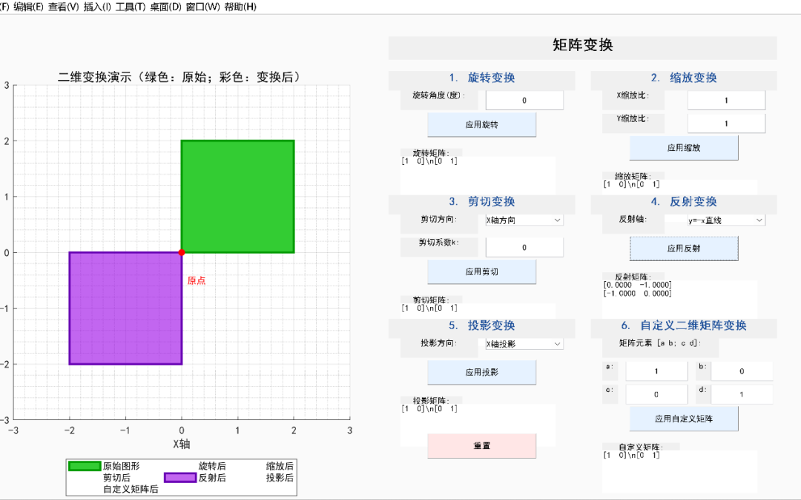
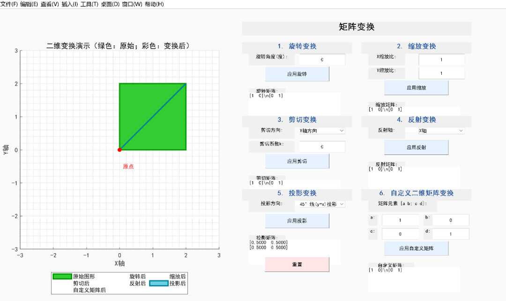
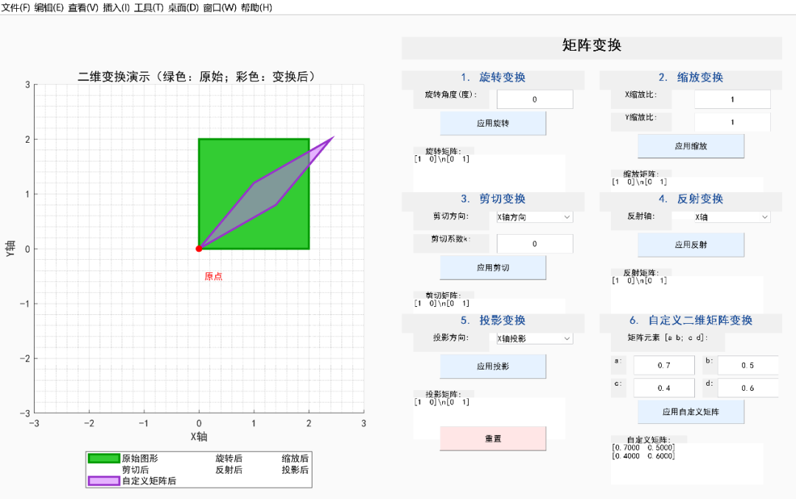

# 用AI生成矩阵变换教学演示软件，助力课堂教学直观化

> 原文地址: [https://mp.weixin.qq.com/s/YFcKRJ3fQKBZfbYmR4orpA](https://mp.weixin.qq.com/s/YFcKRJ3fQKBZfbYmR4orpA)

在矩阵相关课程的教学过程中，矩阵变换的抽象性往往成为学生理解的难点。传统教学中，教师多通过静态效果图展示旋转变换、缩放变换、剪切变换、反射变换、投影变换等常见类型的效果，但静态演示无法动态呈现参数变化与变换结果的关联，难以帮助学生建立直观认知。如今，借助AI技术，我们可快速开发一款集成多种矩阵变换的动态演示小软件，实现 “参数可调、效果实时可视化”，显著提升教学效率与学生的理解能力。以下为该软件的详细介绍与演示说明。

一、软件核心功能

软件以 “直观展示矩阵变换效果” 为核心，集成5种常见矩阵变换类型，支持参数自定义输入，实时生成变换图形与对应矩阵，具体功能如下：

1.旋转变换：支持输入旋转角度（单位：度），实时展示正方形旋转后的图形，并显示对应的旋转矩阵；

2.缩放变换：支持分别输入X轴、Y轴缩放比，展示图形缩放效果与缩放矩阵；

3.剪切变换：可选择剪切方向（X轴方向 / Y轴方向），输入剪切系数k，呈现剪切后的图形与剪切矩阵；

4.反射变换：支持选择反射轴（X轴 / Y轴 / 原点 /y=x直线 /y=-x直线），展示反射效果与反射矩阵；

5.投影变换：可选择投影方向（X轴投影 / Y轴投影 / 45° 线 (y=x) 投影），呈现投影效果与投影矩阵；

6.自定义矩阵变换：支持输入2×2矩阵的4个元素（a、b、c、d），自定义矩阵变换效果，同步显示输入矩阵与变换图形。

二、软件演示界面说明

软件界面分为 “左侧图形展示区” 与 “右侧控制区”，布局清晰，操作便捷，以下为关键演示场景解析：

（1）初始界面（图 1）

·左侧图形区：显示初始正方形（绿色，边长为 2）、坐标轴与原点标记，清晰呈现图形位置；

·右侧控制区：按 “2 列 ×3 行” 布局，依次排列6种变换的控制模块，每个模块包含 “参数输入框”“应用按钮”“矩阵显示框”，初始状态下所有矩阵均显示为单位矩阵 \[1 0; 0 1\]。

（2）典型变换演示

1.旋转变换（图 2）：输入旋转角度（如 45°），点击 “应用旋转”，左侧图形区显示旋转后的彩色正方形，右侧自动更新旋转矩阵（如 \[cos45° -sin45°; sin45° cos45°\]），直观体现角度与矩阵、图形的关联；

2.缩放变换（图 3）：输入X轴、Y轴缩放比（如均为 1.2），点击 “应用缩放”，图形按比例放大，缩放矩阵同步更新为 \[1.2 0; 0 1.2\]；

3.剪切变换（图 4）：选择 “X轴方向” 剪切，输入系数k=0.5，点击 “应用剪切”，图形沿X轴方向产生剪切变形，剪切矩阵显示为 \[1 0.5; 0 1\]；

4.反射变换（图 5）：选择反射轴 “y=-x直线”，点击 “应用反射”，图形沿指定直线反射，反射矩阵更新为 \[0 -1; -1 0\]；

5.投影变换（图 6）：选择 “45° 线 (y=x) 投影”，点击 “应用投影”，图形投影至 y=x直线，投影矩阵显示为\[0.5 0.5; 0.5 0.5\]；

6.自定义矩阵变换（图 7）：输入自定义矩阵元素（如 a=0.7、b=0.5、c=0.4、d=0.6），点击 “应用自定义矩阵”，左侧显示自定义变换后的图形，右侧同步展示输入矩阵。

 

图1. 初始界面

图2. 旋转变换 

图3. 缩放变换

图4. 剪切变换 

图5. 反射变换 

图6. 投影变换

图7. 自定义变换 

（3）辅助功能

·图例说明：左侧图形区下方标注 “原始图形”“旋转后”“缩放后” 等标签，对应不同颜色的图形，便于区分；

·重置功能：底部 “重置” 按钮可一键恢复初始状态（所有参数归零、矩阵恢复为单位矩阵、变换图形隐藏），方便重复演示。

三、教学应用价值

1.化解抽象难点：将抽象的矩阵运算转化为直观的图形变化，帮助学生快速建立 “矩阵参数-变换效果” 的对应关系，降低理解门槛；

2.提升互动性：支持实时调整参数（如旋转角度、缩放比），学生可自主操作观察效果变化，激发学习兴趣；

3.高效备课工具：教师无需手动绘制多张静态图，通过软件可快速演示多种变换场景，节省备课时间，提升课堂效率；

4.AI 赋能教学：体现AI在教育领域的实用价值——快速开发定制化教学工具，将技术与教学需求精准结合，实现 “事半功倍” 的教学效果。

总结

这款由 AI 生成的矩阵变换教学演示软件，以其功能全面、操作便捷、可视化效果清晰的特点，有效弥补了传统教学的不足。在课堂中引入此类 AI 生成工具，不仅能提升矩阵教学的直观性与互动性，更能为抽象数学概念的教学提供新的思路，助力教学质量与学生学习效率的双重提升。