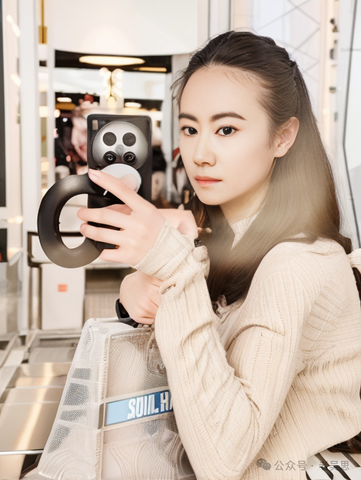

# 略谈comfyui里的controlnet

> 原文地址: [https://mp.weixin.qq.com/s/937vPqxQuuRsH57YG5FLJw](https://mp.weixin.qq.com/s/937vPqxQuuRsH57YG5FLJw)

在 **ComfyUI** 中，**ControlNet** 是一个扩展工具，它为 **Stable Diffusion** 等图像生成模型增加了额外的控制功能。ControlNet 允许用户在生成图像时施加更加具体的引导和控制，使用额外的信息（如边缘检测、姿势、深度图等）来影响生成过程，从而精确控制生成图像的结构、构图或风格。

### ControlNet 的核心概念

**ControlNet** 是一种模型架构，它允许在扩散模型（如 Stable Diffusion）的生成过程中引入外部条件或指导信息。通过这些额外的条件，用户可以生成更加符合特定要求的图像，或者对生成过程进行更加精细的控制。

通常情况下，Stable Diffusion 是根据文本提示词（prompt）生成图像的，但在某些场景下，单靠文本难以生成符合预期的图像。ControlNet 通过引入图像指导信息，让用户可以在提示词之外，利用其他输入（如轮廓、姿态、深度图等）来影响生成结果。

### ControlNet 的用途

1.  **基于边缘或轮廓的控制**：
    

-   ControlNet 可以根据用户提供的边缘检测图或轮廓图，生成符合这些轮廓的图像。比如，您可以提供一个简单的手绘线条或边缘检测结果，ControlNet 会生成与这些线条相匹配的高质量图像。
    
-   **应用场景**：例如，用手绘草图生成细节丰富的图像，或者用轮廓图生成具体物体的图像。
    

3.  **姿态控制（Pose Control）**：
    

-   ControlNet 还可以根据人体姿态信息来生成图像。用户可以提供人体骨骼姿态（通过 OpenPose 等工具生成），然后 ControlNet 会生成与这种姿态相匹配的人物图像。
    
-   **应用场景**：可以用来生成特定姿势的人物图像，适合设计或动画工作流。
    

5.  **深度图控制**：
    

-   ControlNet 支持基于深度图的图像生成。深度图包含了场景中物体的距离信息，使用这些深度图可以生成具有逼真立体感和空间关系的图像。
    
-   **应用场景**：用于精确控制生成图像中的透视效果和空间深度。
    

7.  **图像到图像转换**：
    

-   ControlNet 可以用作从低分辨率或简单草图生成更复杂的高分辨率图像的工具。用户可以上传一张简化的草图或模糊图像，然后让 ControlNet 将其转换为高细节、精美的图像。
    
-   **应用场景**：用于修复或增强图像，或者将简单的草图转化为完整的绘画作品。
    

### ControlNet 在 ComfyUI 中的使用

在 ComfyUI 中，ControlNet 模块通常用于精确控制生成图像的内容。具体操作包括：

1.  **加载 ControlNet 模型**：
    

-   您需要首先下载和加载合适的 ControlNet 模型文件（通常是 `.ckpt` 或 `.safetensors` 格式）。这些模型文件需要放在 `ComfyUI/models/controlnet/` 目录中。
    

3.  **配置 ControlNet**：
    

-   **Canny 边缘检测**：用于根据边缘生成图像。
    
-   **OpenPose**：用于基于人体姿态生成图像。
    
-   **Depth**：用于基于深度图生成图像。
    

-   在 ComfyUI 中，用户可以通过创建并配置 **ControlNetLoader** 节点，加载和使用不同类型的 ControlNet 模型。这些模型可以根据用户的需求选择，例如：
    

6.  **输入控制图像**：
    

-   在使用 ControlNet 时，除了文本提示词（positive prompt）外，您还需要提供一张控制图像。例如，您可以上传一张轮廓图、姿态图或深度图，作为 ControlNet 的输入条件，指导模型生成与之匹配的图像。
    

8.  **组合提示词与图像引导**：
    

-   ControlNet 的强大之处在于，它允许同时使用文本提示词和控制图像。模型不仅会根据提示词生成图像，还会根据控制图像的结构或特征进行生成。
    

### ControlNet 的常见模型类型

1.  **ControlNet Canny**：
    

-   基于边缘检测的 ControlNet 模型，使用边缘图作为输入，生成与边缘匹配的图像。
    

3.  **ControlNet OpenPose**：
    

-   使用人体姿态信息（OpenPose 数据）来生成特定姿态的人物图像。
    

5.  **ControlNet Depth**：
    

-   使用深度图（Depth Map）来生成具有立体感和空间感的图像。
    

7.  **ControlNet Scribble**：
    

-   使用简单的手绘涂鸦作为输入，生成符合涂鸦形状的高质量图像。
    

### ControlNet 在图像生成中的优势

1.  **精确控制**：
    

-   ControlNet 允许您在生成图像时引入更加具体的条件控制，让生成的图像符合特定的轮廓、姿势或结构。相对于只依赖提示词的图像生成，ControlNet 提供了更高的精确度。
    

3.  **高自由度与创意性**：
    

-   通过提供手绘草图或姿态图等简单输入，用户可以快速探索和实现各种图像创意。
    

5.  **与提示词结合**：
    

-   ControlNet 并不替代提示词，而是与提示词协同工作。您可以通过提示词定义图像的风格、颜色或情感，通过 ControlNet 控制图像的结构或细节。
    
      
    

### 总结

在 **ComfyUI** 中，**ControlNet** 是一个强大的工具，它扩展了 Stable Diffusion 模型的控制能力。通过引入外部控制图像（如边缘检测图、姿态图或深度图），用户可以精确地引导图像生成过程，生成更加符合特定需求的图像。ControlNet 为图像生成提供了更高的精确性、灵活性和创意空间。

