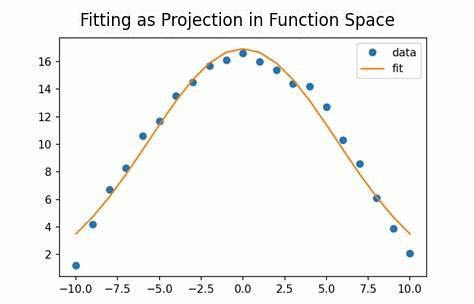
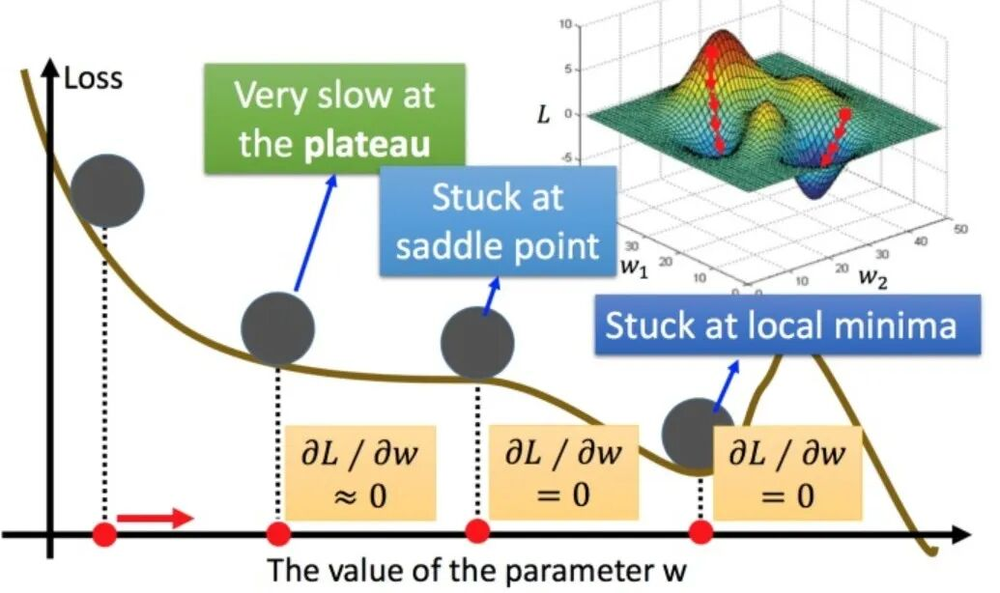
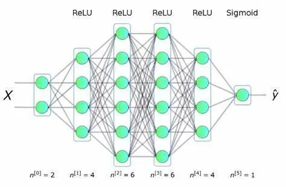
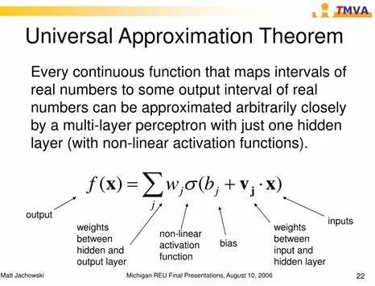
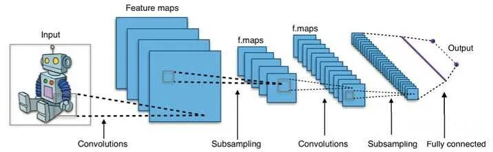
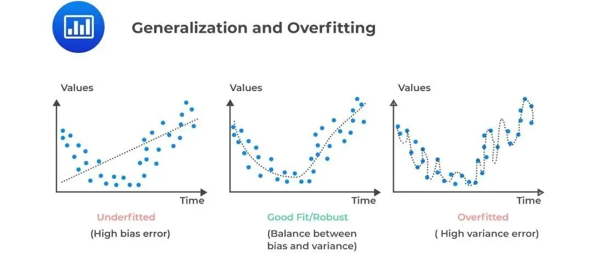
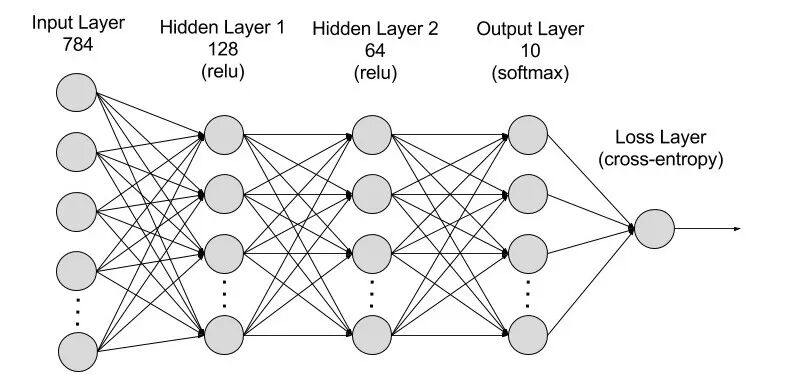
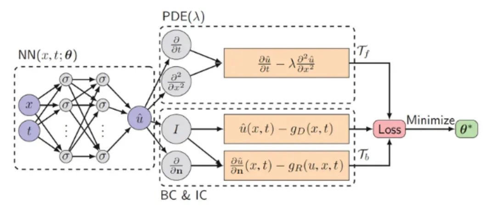

# 神经网络本质上是一种非线性拟合器吗？

> 原文地址: [https://mp.weixin.qq.com/s/1ufuOvRJOEDHRUrsxxW\_HQ](https://mp.weixin.qq.com/s/1ufuOvRJOEDHRUrsxxW_HQ)

在人工智能领域，神经网络（Neural Networks, NNs）已经成为处理复杂问题的核心工具之一。从图像识别到自然语言处理，从游戏智能体到推荐系统，其应用范围之广令人瞩目。但当深入探讨其本质时，一个基本的问题浮现出来：神经网络是否可以被视为一种高级的非线性拟合器？本文将基于数学原理、结构特性以及物理意义，探讨这一问题，并分析神经网络与传统拟合方法之间的根本差异。

## 拟合的本质：从函数空间中的最优投影说起

### 数学定义与拟合目标

任何拟合器的目标都是通过有限数据集构建数据规律的数学模型。给定数据集 ，拟合问题可形式化为：

其中， 是假设空间，如多项式函数集或神经网络函数族； 代表损失函数，比如均方误差；而  控制模型复杂度，例如L2正则化。这个表达式揭示了**拟合过程的本质是在函数空间中找到数据的最佳投影**。

### 哲学意义：奥卡姆剃刀与归纳偏置

拟合过程中，奥卡姆剃刀原则提倡选择能解释数据的最简单模型。而在机器学习中，归纳偏置指的是模型对未知数据的先验假设。对于传统拟合而言，这种偏置通常是显式的，如多项式拟合假定数据由多项式生成。相比之下，神经网络则隐式地偏好低复杂度的平滑函数，这主要归因于梯度下降的隐式正则化效果。

## 神经网络的数学本质：复合非线性逼近

### 形式化表达与关键特性

神经网络可以被看作是多层嵌套的非线性变换，具体表示为：

这里， 和  分别是权重矩阵和偏置向量，而  则是非线性激活函数。值得注意的是，虽然单层网络仅实现线性变换，但多层叠加后整体表现为非线性映射。即便使用分段线性的激活函数如 ReLU，网络依然能够根据通用逼近定理逼近任意连续函数。

### 通用逼近定理与参数效率

通用逼近定理指出，单隐藏层神经网络（采用 Sigmoid 激活函数）可以以任意精度逼近紧集上的连续函数。而深层网络相比浅层网络具有更高的参数效率，在逼近高维函数时所需参数远少于后者。这意味着，深层网络不仅在理论上具备更强的表达能力，而且在实际应用中也更高效。

## 神经网络与传统拟合的本质区别

### 特征工程的革命

在传统拟合中，特征工程依赖人工设计基函数，而神经网络通过自适应权重和激活函数自动学习基函数。此外，神经网络采用分布式表示，有效克服了传统方法中的“维度灾难”问题。例如，在图像识别任务中，浅层网络检测边缘，深层组合则用于识别物体部件；自然语言处理中，词向量层学习语义信息，注意力机制捕捉长程依赖关系。

### 隐式正则化：从过拟合到泛化

传统拟合需要显式控制模型复杂度来避免过拟合，而神经网络通过梯度下降过程中的隐式正则化效应实现了这一点。即使在过参数化的条件下，即参数数量远超样本数，神经网络也能展现出强大的泛化能力。例如，实验表明，ResNet-50 在 ImageNet 上训练误差为 0.5% 时，测试误差为 23%，而传统 10 次多项式拟合训练误差为 0 时，测试误差通常则会爆炸增长。

## 超越拟合：从数据驱动到因果推理

### 流形学习：数据内在结构的展开

神经网络通过逐层非线性变换，将输入空间的复杂流形逐步展开为线性可分空间。例如，在 MNIST 手写数字分类任务中，784 维像素空间被转换为 10 维类别概率空间，同时保留了数字的拓扑结构。

### 物理规律的融合

新一代神经网络不仅仅局限于数据驱动的方法，而是开始整合物理机制。例如，AlphaFold 2 结合蛋白质的物理约束与进化数据预测蛋白质结构；PINN（物理信息神经网络）则在损失函数中加入微分方程约束，从而提高模型的准确性和可靠性。

## 结论

综上所述，神经网络可以从数学角度视为一种高度复杂的非线性拟合器，其独特之处在于自动特征生成、高效维度约简以及隐式因果推理的能力。这些特性使得神经网络不仅是传统的拟合工具，更是理解复杂系统的计算显微镜，重新定义了“拟合”的边界。未来的研究可能会进一步探索如何更好地结合物理知识与数据驱动的方法，以推动人工智能技术的发展。

  

## 推荐阅读

  

  

  

  

‍

  

  

  

**给我一组控制方程，还你一套专业软件。**我们长期从事多场耦合有限元算法和软件的研发工作，掌握全流程的 CAE 软件开发技能。如果您需要相关的技术服务，非常欢迎私信交流和扫码咨询。

**喜欢****作者******，请点********赞********和在看********

****