# 线性回归中的损失函数

> 原文地址: [https://mp.weixin.qq.com/s/pBqeXe7t-OU\_5GmOCdRYhg](https://mp.weixin.qq.com/s/pBqeXe7t-OU_5GmOCdRYhg)

### 什么是线性回归？

线性回归是一种简单却强大的机器学习方法，用来预测两个变量之间的关系。想象一下，你想根据房子的面积来预测房价：面积越大，房价越高。这时候，我们可以用一条直线来**“拟合”**这些数据点，让这条线尽可能靠近所有点，从而做出预测。

简单来说，线性回归的模型就是：y = mx + b，其中：

-   y 是预测值（比如房价），
    
-   x 是输入（比如面积），
    
-   m 是斜率（表示变化率），
    
-   b 是截距（起始点）。
    

我们的目标是找到最佳的 m 和 b，让预测尽可能准确。

### 损失函数的作用

要找到最佳直线，我们需要一个“裁判”来衡量这条线拟合得“好不好”。这就是损失函数（Loss Function）的角色。它计算预测值和真实值之间的差距，通常用“均方误差”（Mean Squared Error, MSE）作为损失函数。

通俗解释：

-   对于每个数据点，计算预测值减去真实值的“误差”（也叫残差）。
    
-   把误差平方（这样正负误差不会抵消，还能放大大误差）。
    
-   然后取所有误差平方的平均值。
    

MSE 公式（别怕，很简单）： 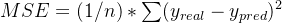 

-   n 是数据点数量，
    
-   Σ 是求和，
    
-   y\_real 是真实值，y\_pred 是预测值。
    

损失函数越小，说明直线拟合得越好。我们通过优化算法（比如梯度下降）不断调整 m 和 b，来最小化这个损失。

下面是一个例子：假设我们有一些随机生成的数据点（x 和 y），用线性回归拟合一条直线。

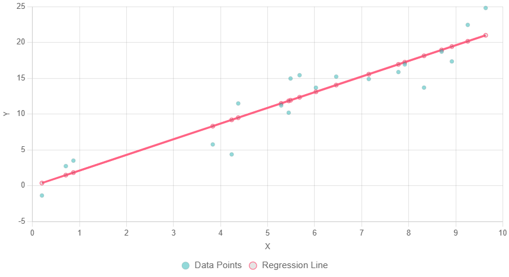  
编辑

上图中，绿色点是真实数据，红色线是拟合的直线。损失函数就是基于这些点到线的垂直距离（残差）来计算的。

为了更直观地看误差，我们可以画出残差图：每个点的残差（y\_real - y\_pred）分布在零线附近。如果残差随机分布，说明模型不错；如果有模式，可能需要改进。

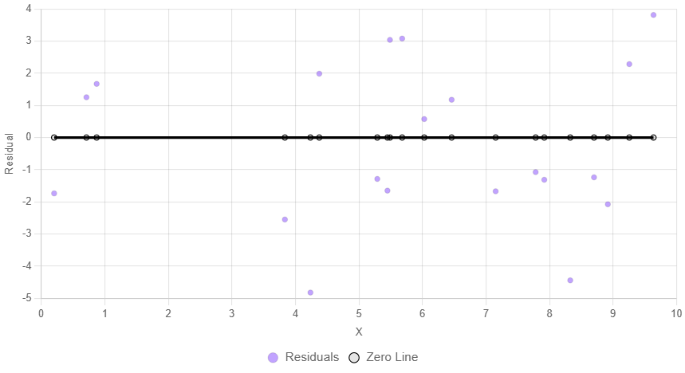  
编辑

在这个残差图中，紫色点是每个数据的误差，黑色线是零误差线。损失函数就是这些点平方后平均的值。通过最小化损失，我们让这些点尽量靠近零线。

总之，损失函数是线性回归的**“核心裁判”**，帮助我们训练出可靠的模型。在实际应用中，如果你有数据，可以用Python的scikit-learn库轻松计算！

下面这张图的核心信息很直观：

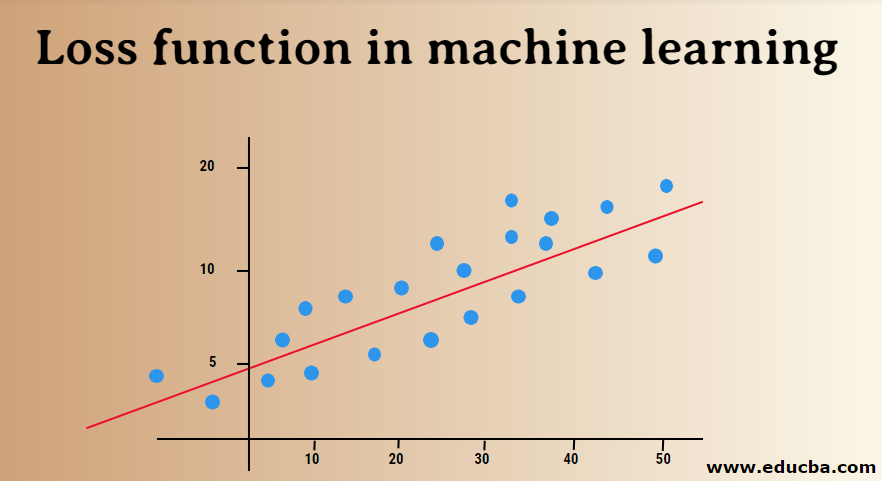  
编辑

  

-   蓝点：训练数据样本 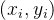 
    
-   红线：一个线性模型的预测  
    
-   损失（loss）：每个蓝点到红线的“偏差”，在回归里通常就是**纵向残差**
    
    
    
-   把所有样本的偏差“汇总成一个数”，就是**损失函数**，训练就是让这个数尽量小，从而把红线“调到最贴近蓝点的一条”。
    

* * *

## 1) 损失函数到底是什么（一句话）

**损失函数 = 用一个数字衡量“模型预测有多错”，并用它来指导参数更新。**

它回答的是：

> “我这条红线（模型）画得好不好？差了多少？”

* * *

## 2) 回归任务里最常见的损失（对应这张图）

### (1) 平方损失 / MSE（最经典）

对每个点的误差平方后再平均：

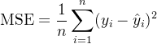

直觉：

-   误差越大，平方后惩罚**急剧变大**（对离群点更敏感）
    
-   数学性质好（可导、常见情况下可凸），优化方便
    
-   在线性回归 + MSE 的情况下，最小化 MSE 就是大家熟悉的  ****[OLS 最小二乘](https://mp.weixin.qq.com/s?__biz=MzkzODgwODczMw==&mid=2247484824&idx=1&sn=6158f2e6bb26e5e597aee0c2934d745e&scene=21#wechat_redirect)****
    

### (2) 绝对值损失 / MAE

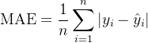

直觉：

-   对离群点更“温和”（更鲁棒）
    
-   但在 0 附近不可导（实践中也能用次梯度/平滑近似解决）
    

### (3) Huber 损失（折中：小误差像 MSE，大误差像 MAE）

-   小误差：用平方（稳定、可导）
    
-   大误差：用线性（抗离群点）
    

* * *

## 3) 分类任务里常见的损失（图里没画，但同一思想）

分类不是“点到线的距离”，而是“你把正确类别的概率给得够不够高”。

### (1) 交叉熵（Cross-Entropy / Log Loss）

二分类常写成：

![$L = -\big[y\log p + (1-y)\log(1-p)\big]$](https://mmbiz.qpic.cn/mmbiz_png/jlXjovro0tokXM7Evic6TL8hGYiaufr57QoIYsic0yYlBhoj42kpEk5L3icL29AsFibER0HhBA49sFmxXGFKKlTJXWA/640?wx_fmt=png&from=appmsg)

直觉：

-   预测得越自信但越错，惩罚越大（“错得离谱”惩罚最重）
    
-   与最大似然等价：最小化交叉熵 ≈ 最大化数据在模型下的概率
    

* * *

## 4) 损失函数在训练里怎么“驱动模型变好”

训练就是解一个优化问题：

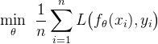

-   θ：模型参数（这张图里就是 w,b）
    
-   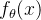：模型输出（红线给出的 ）
    

常用做法：梯度下降

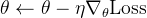

直觉：  
损失函数像“地形高度”，参数更新像“往山谷最低处走”。

* * *

## 5) 损失函数 ≠ 评估指标（经常被混用）

-   损失函数：训练时用（需要可优化，通常要可导/稳定）
    
-   评估指标：报告效果用（比如 Accuracy、F1、AUC、R² 等）
    

比如分类里，训练用交叉熵，但你最后可能更关心 Accuracy/F1。

* * *

## 6) 进阶：正则化也是“损失的一部分”

为了防止过拟合，常把“模型复杂度惩罚”加进来：

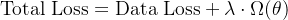

-   L2 正则：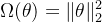（让参数别太大）
    
-   L1 正则：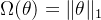（促稀疏）
    

* * *

我们可以拿这张图“假设一组点坐标”，手算一次：

-   给定某条红线 y=wx+b
    
-   逐点算残差  
    
-   算 MSE/MAE/Huber  
      你会立刻明白“损失”为什么能把线一步步推向更合理的位置。
    

就用一组“长得像图里那样”的小数据，带你把 **残差 → 损失（MSE/MAE/Huber）→ 用损失推动红线移动** 走一遍。

* * *

## 0) 造一组小数据（5个点）

我们取 5 个样本（大致呈上升趋势）：

i

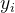

1

10

6

2

20

9

3

30

13

4

40

15

5

50

18

模型用直线：

* * *

## 1) 先随便画一条线：w=0.20,  b=4

### (1) 逐点算预测值、残差

残差我用： 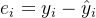 

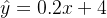

i

x

y

残差

1

10

6

6

0

0

2

20

9

8

1

1

3

30

13

10

3

9

4

40

15

12

3

9

5

50

18

14

4

16

### (2) 汇总成损失

-   MSE：
    

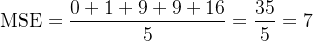

-   MAE：
    

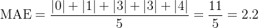

直觉：第 5 个点离得很远（误差 4），MSE 因为平方会更“介意”。

* * *

## 2) 换一条更像的线：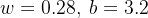

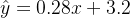

i

x

y

残差 e

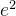

1

10

6

6.0

0.0

0

2

20

9

8.8

0.2

0.04

3

30

13

11.6

1.4

1.96

4

40

15

14.4

0.6

0.36

5

50

18

17.2

0.8

0.64

-   MSE：
    

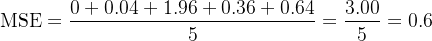

-   MAE：
    

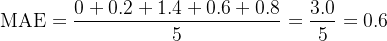

你看到没：同一批点，换了 w,b，损失立刻从 7 掉到 0.6——这就是训练要做的事：**找让损失最小的那条红线**。

* * *

## 3) 再看 Huber（更抗离群点）

取 δ=1，Huber 对单个误差：

-   若 ∣e∣≤1：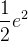
    
-   若 ∣e∣>1：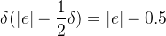
    

### 线1（w=0.2,b=4）误差：0,1,3,3,4

Huber 和：

-   0 → 0
    
-   1 → 0.5
    
-   3 → 2.5（因为 3-0.5）
    
-   3 → 2.5
    
-   4 → 3.5
    

总和 =9.0，平均 =9/5=1.8

### 线2（w=0.28,b=3.2）误差：0,0.2,1.4,0.6,0.8

-   0 → 0
    
-   0.2 → 0.5·0.04=0.02
    
-   1.4 → 1.4-0.5=0.9
    
-   0.6 → 0.5·0.36=0.18
    
-   0.8 → 0.5·0.64=0.32
    

总和 =1.42，平均 =1.42/5=0.284

Huber 的感觉：大误差不会像 MSE 那样被“平方放大得离谱”。

* * *

## 4) 损失怎么“推着红线走”（用一次梯度下降演示）

用 MSE（更好算），但梯度通常用 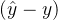这个差：

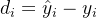

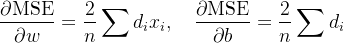

对线1：w=0.2,b=4 时  
 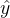 是 6,8,10,12,14  
所以 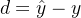 为：0, -1, -3, -3, -4

-   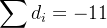
    
-   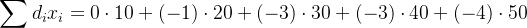
    
    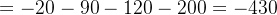
    

于是（n=5）：

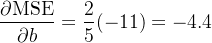

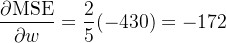

做一步梯度下降（学习率取小点 η=0.0005）：

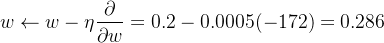

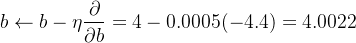

直觉解释：现在多数点是 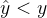（所以 d<0），梯度是负数，更新后 w,b 增大，红线整体“抬高/变陡”，更贴近点云。

（这一步更新后的 MSE 会大幅下降，确实更接近我们上面那条“更好线”。）

我们把这 5 个点用 **OLS（最小二乘）闭式解**把最优直线一次算出来。

数据（同前）：

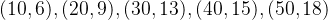

模型：

目标（OLS）：

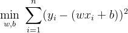

* * *

## 1) OLS 的闭式解公式（简单线性回归）

常用两种等价写法：

**写法A（用均值/离差）：**

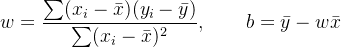

**写法B（用各种求和）：**

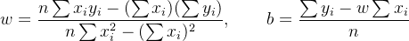

* * *

## 2) 先把必要的求和算出来

样本数 n=5

-   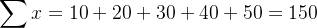
    
-   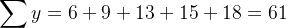
    
-   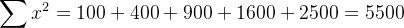
    
-   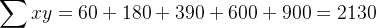
    

* * *

## 3) 代入闭式解直接得到 w,b

### (1) 算斜率 w

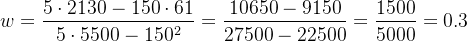

### (2) 算截距 b

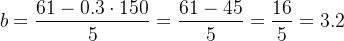

✅ **最优直线：**

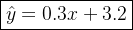

* * *

## 4) 验证一下这条线的误差有多小

预测值：

-   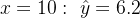
    
-   
    
-   
    
-   
    
-   
    

残差 ：

平方和（SSE）：

MSE（按 n平均）：

我们把 **闭式解从“最小化平方和”一步步推导出来**。你会看到它本质上就是：让“误差平方和”对 w,b的斜率为 0（到达最低点）。

* * *

## 1) 目标函数：平方误差和（SSE）

线性回归模型：

残差：

要最小化的函数（SSE）：

> 为什么用平方？  
> 因为平方能把正负误差都变成正数，并且“大错惩罚更重”，而且数学上可导，方便求最小值。

* * *

## 2) 对 b 求偏导（找到最优截距条件）

令

则

对 b求偏导：

而

所以：

最小值点满足偏导为 0：

代回：

展开：

得到第一条 **正规方程**：

直觉：**最优时残差的总和为 0**（正负误差相互抵消）。

你可以把它理解成：**把整条红线整体上下挪一点点，看看总误差平方是变大还是变小；最优的那一下就是“再挪也不变好”的位置。**

* * *

## (2.1) 先把 b 看成“上下平移旋钮”

直线：

-   w 决定“斜不斜”（转动）
    
-   b 决定“整体上移/下移”（平移）
    

当你把 b 增加一点点 Δb，所有预测值  都会 **同时加 Δb**：

所以，b 的作用非常简单：**让整条线整体往上或往下挪。**

* * *

## (2.2) 残差  跟 b 的关系

残差（真实值减预测值）：

你看这里的 b 是 **减号**：

-   b 变大 ⇒  变大 ⇒  变小（更负）
    
-   b 变小 ⇒  变小 ⇒  变大（更正）
    

更直接地写：

这说明   **是关于 b 的一条斜率为 -1 的直线**。

所以：

这一步是关键：

> 误差对 b 的变化率，就是 -1（因为  里有 −b）。

* * *

## (2.3) 为什么会出现 （链式法则）

我们优化的是平方误差和：

先看单项：。  
对 e 求导：

这就是你看到的 **“2”从哪来**。

但我们要对 b 求导，不是对 e 求导，所以要用链式法则：

而刚才我们知道 ，所以：

* * *

## (2.4) 把所有点加起来：得到  

因为 ，所以：

到这里就完全解释清楚了：

* * *

## (2.5) “最优截距条件”为什么是  

最优点（最小值点）满足“导数为 0”（坡度为 0）：

代入上式：

也就是：

直觉翻译：

> 如果红线太低，大多数点在红线上方 ⇒ 残差  多数为正 ⇒ ，此时把 b 调大（上移）能让误差更小。  
> 如果红线太高，残差多数为负 ⇒ ，此时把 b 调小（下移）更好。  
> **只有当正负残差刚好“平衡”，总和为 0 时，上下挪都不会更好，才是最优。**

  的意义可以用一句话抓住：

**它表示：当你把截距 b 轻轻调大一点点时，总损失 J 会往哪个方向、以多快的速度变化。**

* * *

## (2.6) 它到底在“问”什么

把 J(w,b) 看成一个地形高度（损失地形）：

-   w：控制斜率（线的倾斜）
    
-   b：控制上下平移
    

那么

就是在当前 (w,b)位置上，**沿着 “只改变 b” 这条方向走，地形是往上还是往下、坡有多陡**。

* * *

## (2.7) 更“微分”的定义（最精确的意思）

它等价于下面这个极限：

也就是：

> b 增加一个极小量 Δb，损失 J改变多少；再除以 Δb，得到“单位 b 改变引起的 J 改变”。

* * *

## (2.8) 符号怎么读（非常重要的直觉）

-   ：**你把 b 调大一点，J 反而变大**  
      ⇒ 要让 J 变小，你应该把 b 往小调（下移）。
    
-   ：**你把 bbb 调大一点，J 会变小**  
      ⇒ 要让 J 变小，你应该把 b 往大调（上移）。
    
-   ：**上下挪一点都不会让 J 继续变小**  
      ⇒ 在 b 方向上已经到“最低点”（最优截距条件之一）。
    

* * *

## (2.9) 为什么它最后会变成  

如果 ，且 ，那么我们推过：

这句话的直觉翻译是：

> **若大多数点在红线之上（多），，导数为负，说明“把线往上抬”（增大 b）能降低损失。**  
> **若大多数点在红线之下（多），，导数为正，说明“把线往下压”（减小 b）能降低损失。**

* * *

## (2.10) 一句“训练更新”里的作用

梯度下降更新截距就是：

所以  本质上是：  
**“告诉你：截距应该往上调还是往下调，以及调多少更合适（步子大小由 η 决定）”。**

* * *

## 3) 对 w 求偏导（找到最优斜率条件）

同理：

而

所以：

令其为 0：

代回：

展开：

得到第二条 **正规方程**：

直觉：这是“带 x 权重的残差和为 0”，保证斜率方向也达到最优。

* * *

## 4) 两条正规方程联立，解出 w,b

我们现在有：

为了写起来更清爽，记：

则：

从第一式解 b：

代入第二式：

两边乘 n：

把 w 的项合并：

所以：

再带回：

这就是你刚才看到的闭式解公式来源。

* * *

## 5) 把我们的具体数据代进去（快速复现一次）

前面我们算过：

-   n=5
    
-   
    
-   
    
-   
    
-   
    

斜率：

截距：

* * *

## 6) 一个很重要的“几何直觉”（帮你记住截距怎么来）

我们还可以从

推出：

也就是说：**最小二乘的回归直线一定经过点**（样本均值点）。  
这是一个特别好用的直觉。