# 线性回归中的梯度下降


> 原文地址: [https://mp.weixin.qq.com/s/GU15dUoEgsyfkWUmwNciLg](https://mp.weixin.qq.com/s/GU15dUoEgsyfkWUmwNciLg)

###  什么是梯度下降？

梯度下降（Gradient Descent）是一种优化算法，用来找到函数的最小值。想象你在一个山谷里，想找到最低点：你看当前脚下的坡度（梯度），然后朝最陡的下坡方向迈一步，重复这个过程，直到到达谷底。

数学上，对于一个函数 f(θ)，θ 是参数（可以是一个数或向量），梯度 ∇f(θ) 告诉你函数在当前点上升最快的方向。所以，要下降，就往负梯度方向走：新θ = 旧θ - η \* ∇f(θ)，其中 η 是学习率（步长），太大会越过最低点，太小会很慢。

常见变体：

-   批量梯度下降：用所有数据计算梯度。
    
-   随机梯度下降（SGD）：随机选一个数据点计算。
    
-   小批量：介于两者。
    

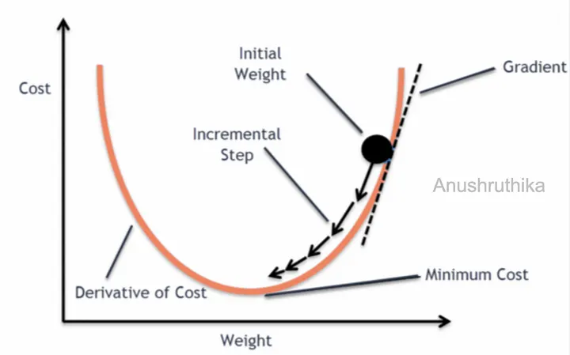  
编辑

这张图是在用\*\*一维线性回归（只有一个权重 weight）\*\*来直观解释“梯度下降”怎么把损失（Cost）一步步降到最小。

## 1) 图里每个标注在说什么

  

-   横轴 **Weight（权重 w）**：线性回归里参数的一部分（这里先只画 w，不画截距 b）。
    
      
    
-   纵轴 **Cost（代价/损失 J）**：通常是均方误差 MSE 形式的目标函数。
    
      
    
-   橙色 “U” 型曲线：表示 **J(w)** 随着 w 变化的形状。对线性回归的 MSE 来说，这是一个**凸函数**（碗状），所以只有一个全局最小值。
    
      
    
-   黑点 **Initial Weight**：初始权重（随机或设为 0）。
    
      
    
-   虚线/切线 **Gradient**：在当前 w 处的切线斜率，表示 **梯度（导数）**。
    
      
    
-   “Derivative of Cost”：强调我们用的是 **dJ/dw**（一维时梯度就是导数）。
    
      
    
-   一串小箭头 **Incremental Step**：每次沿着“让 J 变小”的方向走一小步。
    
      
    
-   底部 **Minimum Cost**：曲线最低点，那里 **导数为 0**（梯度为 0），到达或接近就停止。
    

## 2) 线性回归的“损失函数/代价函数”长什么样？

以一元线性回归为例（可推广到多维）：

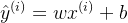

常用代价函数（MSE 的一半，方便求导）：

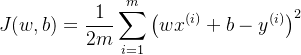

> 图里只画了 w，因此可以把 b 暂时当常数或先忽略，得到 J(w) 的碗状曲线。

## 3) “梯度下降”更新的核心公式

### 一维（只更新 w）

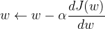

  

-   α 是**学习率**（步子大小）。
    
      
    
-     是当前点的**斜率/梯度**。
    

这正对应图里的逻辑：

  

-   如果当前点切线斜率 **\> 0**（右边上坡），说明“往右走 J 更大”，所以要 **往左走**：减去一个正数。
    
      
    
-   如果斜率 **< 0**（左边上坡，右边下坡），说明“往右走 J 更小”，所以要 **往右走**：减去一个负数等于加。
    

### 带截距的标准线性回归（同时更新 w 和 b）

对上面的 J(w,b) 求偏导：

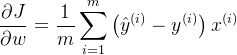

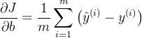

更新规则：

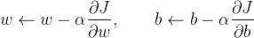

## 4) 为什么图里的箭头会“越走越平”？

因为靠近最低点时：

-    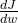 的绝对值变小（切线越来越平）
    
-   所以步长 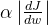 也变小  
      这就会出现图里那种“快到谷底时步子变短”的效果。
    

## 5) 实战里最关键的两个点

  

-   **学习率 α**：太大容易在谷底两边来回跳甚至发散；太小收敛很慢。
    
      
    
-   **特征缩放（标准化）**：多维线性回归时，不同特征尺度差异大会让“碗”变得很扁（像狭长峡谷），梯度下降会走得很慢、很抖；标准化能明显改善。
    

我们用一个**可手算的玩具线性回归例子**，把图里的“黑点→切线斜率（梯度）→一步步走向谷底”完整走一遍。

* * *

## 0) 玩具数据 & 模型

数据 3 个点：

(1,2), (2,3), (3,5)

线性回归模型：

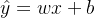

代价函数（常用写法，方便求导）：

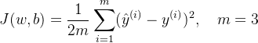

梯度（偏导）：

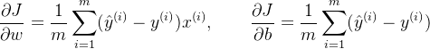

梯度下降更新（图里“Incremental Step”）：

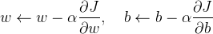

取学习率 α=0.1，初始点（图里黑点）：


* * *

## 1) 第 0 步：从初始点出发（对应图里的 Initial Weight）

先算预测与误差：

-   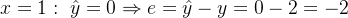
    
-   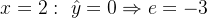
    
-   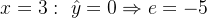
    

代价：

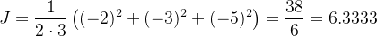

梯度：

![$\frac{\partial J}{\partial w}=\frac{1}{3}\left[(-2)\cdot1+(-3)\cdot2+(-5)\cdot3\right] =\frac{-23}{3}=-7.6667$](https://mmbiz.qpic.cn/mmbiz_png/jlXjovro0traMPNUrroYicsiaKficpWTmXRLZF86fic257IbpbwK83VzmMsfRWdXaL2vbeqDibjHnhNLXbrQKEK7wYQ/640?wx_fmt=png&from=appmsg)

![$\frac{\partial J}{\partial b}=\frac{1}{3}\left[(-2)+(-3)+(-5)\right]=\frac{-10}{3}=-3.3333$](https://mmbiz.qpic.cn/mmbiz_png/jlXjovro0traMPNUrroYicsiaKficpWTmXRg7HoC1REgtU3HyWNCk1Ur8PXqbfABCl8Cm6eNd9EIfFLEp2OZyAKNg/640?wx_fmt=png&from=appmsg)

更新：

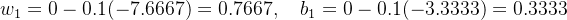

**关键对照图理解：**  
此时 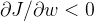，表示在当前点的“切线斜率为负”（图里 Gradient 指的就是它）。梯度下降做 w−α(负数)，等于 **w 增大**，也就是“往右走”，就像图里箭头沿着碗壁滑向谷底。

* * *

## 2) 连续迭代几步（你会看到：梯度越来越小、J 越来越低）

下面是每一步的 (w,b)、代价 J、梯度，以及更新后的下一步参数（四舍五入到 6 位）：

iter

w

b

J(w,b)

∂J/∂w

∂J/∂b

w\_next

b\_next

0

0.000000

0.000000

6.333333

\-7.666667

\-3.333333

0.766667

0.333333

1

0.766667

0.333333

1.282593

\-3.422222

\-1.466667

1.108889

0.480000

2

1.108889

0.480000

0.280733

\-1.531852

\-0.635556

1.262074

0.543556

3

1.262074

0.543556

0.081927

\-0.689877

\-0.265630

1.331062

0.570119

4

1.331062

0.570119

0.042401

\-0.314808

\-0.101091

1.362543

0.580228

5

1.362543

0.580228

0.034469

\-0.147679

\-0.028021

1.377310

0.583030

你会发现两件事正好对应图形直觉：

1.  J 一路下降：6.33 → 1.28 → 0.28 → 0.081 → 0.042 → 0.034
    
2.  梯度绝对值越来越小：-7.66 → -3.42 → -1.53 → -0.69 → -0.31 → -0.15  
      所以“步子越来越短”，就像图里靠近谷底时箭头变密、变短。
    

* * *

## 3) 把它和图“完全对上”的一句话

-   橙色碗：J(w) 或 J(w,b)（线性回归 + MSE 是凸的）
    
-   虚线切线斜率：∇J（一维就是 ）
    
-   走一步：参数减去梯度乘学习率
    
    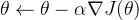
    
-   到谷底：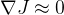（“Minimum Cost”附近）
    

### 一个简单例子

假设我们想最小化函数 f(x) = x²。这是一个抛物线，最小值在 x=0，f(0)=0。

-   梯度：f'(x) = 2x。
    
-   从 x=10 开始，学习率 η=0.1。
    
-   第一步：grad=2_10=20，新x=10 - 0.1_20=8。
    
-   第二步：grad=2_8=16，新x=8 - 0.1_16=6.4。
    
-   重复，直到 x 接近0。
    

经过多次迭代，x 会收敛到0附近。

### Python 代码实现

下面是一个简单的 Python 实现，使用 NumPy。我们定义一个梯度下降函数，针对这个例子运行它。

```
import numpy as npdefgradient_descent(gradient_func, start, learning_rate, n_iter=100, tolerance=1e-6):    x = start    history = [x]  # 记录路径for _ inrange(n_iter):        grad = gradient_func(x)        new_x = x - learning_rate * gradifabs(new_x - x) < tolerance:  # 如果变化很小，停止break        x = new_x        history.append(x)return x, history# 示例：最小化 f(x) = x^2，梯度 = 2xdefgradient(x):return2 * xstart = 10.0learning_rate = 0.1minimum, path = gradient_descent(gradient, start, learning_rate)print(f"Minimum at: {minimum}")print("Path:", path)
```

  

运行这个代码的输出示例：

Minimum at: 4.017345110647478e-06 Path: \[10.0, 8.0, 6.4, 5.12, 4.096, 3.2768, 2.62144, 2.0971520000000003, 1.6777216000000004, 1.3421772800000003, 1.0737418240000003, 0.8589934592000003, 0.6871947673600002, 0.5497558138880001, 0.43980465111040007, 0.35184372088832006, 0.281474976710656, 0.22517998136852482, 0.18014398509481985, 0.14411518807585588, 0.11529215046068471, 0.09223372036854777, 0.07378697629483821, 0.05902958103587057, 0.04722366482869646, 0.037778931862957166, 0.030223145490365734, 0.024178516392292588, 0.01934281311383407, 0.015474250491067256, 0.012379400392853806, 0.009903520314283045, 0.007922816251426436, 0.006338253001141149, 0.00507060240091292, 0.0040564819207303355, 0.0032451855365842686, 0.002596148429267415, 0.002076918743413932, 0.0016615349947311456, 0.0013292279957849164, 0.001063382396627933, 0.0008507059173023465, 0.0006805647338418772, 0.0005444517870735017, 0.0004355614296588014, 0.0003484491437270411, 0.00027875931498163285, 0.00022300745198530628, 0.00017840596158824503, 0.00014272476927059603, 0.00011417981541647683, 9.134385233318146e-05, 7.307508186654517e-05, 5.846006549323614e-05, 4.676805239458891e-05, 3.741444191567113e-05, 2.9931553532536903e-05, 2.3945242826029522e-05, 1.9156194260823618e-05, 1.5324955408658896e-05, 1.2259964326927117e-05, 9.807971461541694e-06, 7.846377169233355e-06, 6.277101735386684e-06, 5.021681388309347e-06, 4.017345110647478e-06\]

你可以看到路径从10逐步接近0。这就是梯度下降在行动！如果想可视化路径，可以用 Matplotlib 画图，但这里保持简单。