# 逻辑回归中的条件概率

> 原文地址: [https://mp.weixin.qq.com/s/lFJWazERz7rvb\_htjkDTQA](https://mp.weixin.qq.com/s/lFJWazERz7rvb_htjkDTQA)

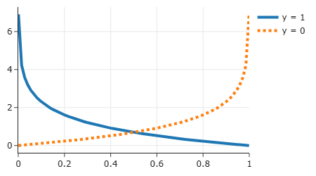

这个式子

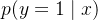

读作：**“在已知 x 的条件下，y=1 的概率”**。

* * *

## 1) 每个符号分别是什么意思？

-   **y**：要预测的“标签/结果”。  
    在二分类里通常 y∈{0,1}。  
    例：垃圾邮件 y=1，正常邮件 y=0。
    
-   **x**：输入特征（你观察到的信息）。  
    例：词频、长度、是否包含链接等。
    
-   **∣**：条件符号，意思是“在……条件下 / 已知……”。
    
-   **p(⋅)**：概率（probability）。
    

所以整体就是：

> **给定这个样本的特征 x，它属于正类 1 的概率是多少。**

* * *

## 2) 为什么要写成“条件概率”？

因为同一个结果 y 的概率会随着你看到的信息 x 不同而改变。

比如：

-   如果 x 表示“出现‘免费’次数=2、出现‘会议’次数=0”，那更像垃圾邮件：p(y=1∣x)可能很大。
    
-   如果 x 表示“会议=3、免费=0”，那更像正常邮件：p(y=1∣x) 可能很小。
    

**x 是条件，决定概率大小。**

* * *

## 3) 和 p(y=1) 有什么区别？

-   p(y=1)：**不看任何特征**时，随机抽一封邮件是垃圾邮件的概率（总体比例）。  
    例：全站 10% 是垃圾邮件，那 p(y=1)=0.1。
    
-   p(y=1∣x)：**看了这封邮件的特征 x** 后，它是垃圾邮件的概率。  
    例：如果这封邮件“免费、中奖”很多，那可能 p(y=1∣x)=0.85。
    

所以：

> p(y=1) 是“平均概率”，  
> p(y=1∣x) 是“针对某个样本的个性化概率”。

* * *

## 4) 在逻辑回归里它怎么计算？

逻辑回归认为：

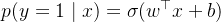

-   先算线性打分  
    
-   再用 Sigmoid 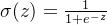 把它变成 0∼1 的概率
    

* * *

## 5) 直觉版理解（很像“打分→转成信心”）

-   z 是“垃圾倾向的打分”（正：偏垃圾；负：偏正常）
    
-   Sigmoid 把打分变成“信心/概率”：
    

-   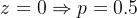（五五开）
    
-   z 越大 ⇒p 越接近 1
    
-   z 越小 ⇒p 越接近 0
    

### 讲解表达式 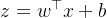 

这个表达式是逻辑回归（以及许多机器学习模型）的基础公式，看起来像数学，但其实超级简单！它计算一个“分数”或“信号”，然后逻辑回归用它来预测概率。我们用之前的生动风格来拆解它，配上比喻和图示，让它像故事一样易懂。

#### 1\. 整体意思：像计算一个“总分”

想象你在评判一个水果是不是“熟了”（分类问题：熟或不熟）。你会看几个特征：颜色（x1）、软硬度（x2）、气味（x3）。每个特征都有“重要性”权重（w1, w2, w3），比如颜色更重要，权重高点。最后加个基础分（b）。

-   z：总分或“线性组合结果”。它是一个数字，代表所有特征加权后的“强度”。在逻辑回归中，这个z会被Sigmoid函数“挤压”成0-1的概率。
    
-   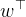
    
    ：权重向量w的转置（上标T表示转置，让向量能相乘）。w像“评委打分表”，每个元素wi对应一个特征的重要性（正数=正面影响，负数=负面影响）。
    
-   x：输入特征向量，比如\[颜色, 软硬度, 气味\]的数值列表。
    
-   b：偏置或截距，像“起始分”，即使所有特征是0，也有个基础值（防止模型太偏）。
    

公式就是：z = (w1 \* x1) + (w2 \* x2) + ... + (wn \* xn) + b。简单说，先每个特征乘权重求和，再加偏置。

它就是逻辑回归里最核心的“**线性打分**（linear score）”。你可以把它理解成：**把一堆特征按重要性加权求和，再整体平移一下**。

* * *

## 1) 各个符号是什么意思？

-   x：特征向量（输入）
    
    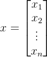
    
    例如：词频、身高体重、是否点击过某链接……都可以是特征。
    
-   w：权重向量（模型要学习的参数）
    
    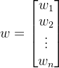
    
    每个  表示“第 i 个特征对结果有多重要、影响方向是什么”。
    
-   ：向量内积（点积）
    
    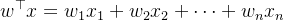
    
    这是“加权求和”。
    
-   b：偏置/截距（bias/intercept）  
    它是一个常数，用来把整体阈值往左/往右平移。
    
-   z：线性组合得到的一个实数分数（可以是任意正负数）  
    之后会丢进 Sigmoid 变成概率。
    

* * *

## 2) 用一个具体数字例子（手算）

假设：

![$x=[2,1],\quad w=[1.2,-0.7],\quad b=-0.3$](https://mmbiz.qpic.cn/mmbiz_png/jlXjovro0trKRPCNoZEyBEJ0R9O1ibntIWfyhiaoNSDGUo59OkSQic7FgibCDH9BxUNg3pnq7VbXVTAoxBoIRhrKPA/640?wx_fmt=png&from=appmsg)

先算点积：

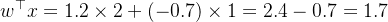

再加偏置：

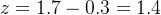

所以这个样本的线性打分 z=1.4。

* * *

## 3) w 的正负号代表什么？

-   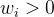：特征  越大，z 越大 → 更倾向预测 y=1
    
-   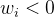：特征  越大，z 越小 → 更倾向预测 y=0
    
-    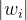 越大：影响越强（同样的  变化会带来更大的 z 变化）
    

比如上例：

-   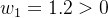：出现“免费”越多，越像垃圾邮件
    
-   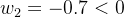：出现“会议”越多，越不像垃圾邮件
    

* * *

## 4) 为什么要加 b（偏置）？

没有 b 时：

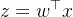

意味着决策边界 z=0 必须经过原点（几何上限制很强）。

加了 b：

决策边界就可以整体平移，不必穿过原点，更灵活、更容易拟合真实数据。

直觉上：

-   b 像“默认倾向/基准阈值”
    
-    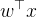 是“看了特征后对这个默认倾向的修正”
    

* * *

## 5) 几何直觉（为什么叫“线性”）

在二维时是一条直线；三维是一张平面；更高维是超平面。  
逻辑回归就是先用这个线性函数把样本分到边界两侧，然后再用 Sigmoid 把“离边界多远”变成概率。

我们就把“更根上”的那层讲透：为什么  也叫 **logit（对数几率）**，以及它怎么必然推出 Sigmoid。

* * *

## 1) 先引入两个概念：概率、几率（odds）

设

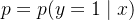

-   **概率**：p∈(0,1)
    
-   **几率（odds）**：
    

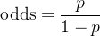

它表示“发生的概率 : 不发生的概率”的比值。

举例：

-   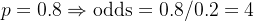（发生是“不发生”的 4 倍）
    
-   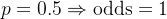（五五开）
    

* * *

## 2) 再取对数：对数几率（log-odds / logit）

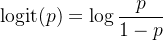

为什么要取 log？

-    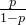 的范围是 (0,∞)
    
-   取对数后范围变成 (−∞,∞)
    

这就非常舒服：**把(0,1)的概率，变成任意实数**，正好适合用线性模型去拟合。

* * *

## 3) 逻辑回归的核心假设

逻辑回归不是直接假设 p 跟特征线性，而是假设：

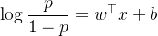

也就是说：**“对数几率”是特征的线性函数**。  
这里右边这坨就是你问的：

所以 z 就是 **logit 值**。

* * *

## 4) 从 logit 推回概率：自然得到 Sigmoid

从

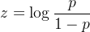

两边取指数：

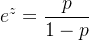

移项解 p：

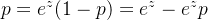

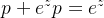

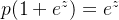

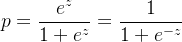

这就是 Sigmoid：

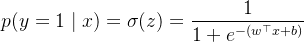

所以你看到的那条 S 型曲线，并不是“硬凑的”，而是从“线性 log-odds”推出来的。

* * *

## 5) 系数  的含义（非常实用）

因为

当某个特征  增加 1（其它不变）时：

-   log-odds 增加 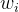 
    
-   odds（几率）会乘上 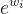 
    

也就是：

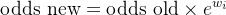

例子：

-   若 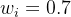，则 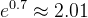：该特征每+1，几率大约翻 **2 倍**
    
-   若 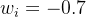，则 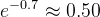：该特征每+1，几率大约 **减半**
    

这也是逻辑回归“可解释性强”的原因。

* * *

## 6) 决策边界也更清晰了

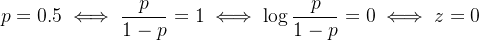

所以阈值 0.5 对应的边界就是：

我们就拿前面算过的两个 z（1.4 和 -2.4）把 **概率 p**、**几率 odds**、**对数几率 log-odds** 串起来走一遍，你会一眼看懂“为什么 z 叫 logit”。

* * *

## 1) 三者的互相换算（记住这三条就够了）

设  

-   **odds（几率）**
    
    
    
-   **log-odds（对数几率 / logit）**
    
    
    
-   **从 z 还原成概率（Sigmoid）**
    
    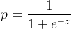
    

* * *

## 2) 例 1：z=1.4（偏向正类）

### (1) 从 z 得到概率

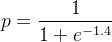

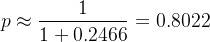

也就是：**是正类的概率约 80.22%**。

### (2) 把概率变成 odds

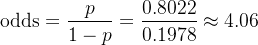

这句话非常直观：

> **“正类发生的可能性 : 负类发生的可能性 ≈ 4.06 : 1”**  
> （正类大概是负类的 4 倍）

### (3) odds 取 log 回到 z

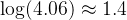

完美对上。

* * *

## 3) 例 2：z=−2.4（偏向负类）

### (1) 概率

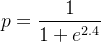

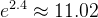

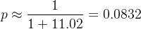

也就是：**是正类的概率约 8.32%**。

### (2) odds

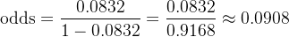

解释成一句话：

> **“正类 : 负类 ≈ 0.0908 : 1”**  
> 等价于 **负类大约是正类的 11 倍**（因为 1/0.0908≈11）

### (3) log-odds

也对上。

* * *

## 4) 这就是“为什么 z 特别好用”

-   概率 p 只能在 0∼1
    
-   但 **log-odds z** 可以是任何实数 (−∞,+∞)
    
-   所以我们用一个线性模型去刻画它：
    
    
    
    再用 Sigmoid 把它“翻译”回概率。
    

* * *

## 5) 顺带点出逻辑回归最“可解释”的地方（系数的意义）

因为

如果某个特征 xi 增加 1（其它不变），那么 z 增加 wi，于是：

odds 会乘上  

用我们之前的权重举例：

-     每 +1，**几率乘 3.32 倍**
    
-   ：x2 每 +1，**几率大约减半**