# 逻辑回归的对数损失

> 原文地址: [https://mp.weixin.qq.com/s/HKS8Xxmliwk5fcyEkl0BlQ](https://mp.weixin.qq.com/s/HKS8Xxmliwk5fcyEkl0BlQ)

## 什么是对数？一句话讲透

 **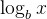 的意思就是：要把 b 乘自己多少次，才能得到 x。**

更正式一点：

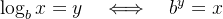

也就是说：**对数是在“反问指数”**。

-   指数：给你 y，算 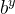 得到 x
    
-   对数：给你 x，反过来问“指数 y 是多少”
    

## 你可以把“对数”当成一种常用的“压缩尺度”

现实里很多量跨度巨大（比如声音分贝、地震震级、数据大小），用对数可以把“乘法增长”变成“加法增长”，更好看、更好比较。

  

### 什么是对数损失（Log Loss）？

对数损失，也叫二元交叉熵损失（Binary Cross-Entropy Loss），是逻辑回归的标准损失函数。它特别适合概率输出，能严厉惩罚错误的自信预测。

对于一个样本，对数损失的公式是：

L(y, p) = - \[y \* log(p) + (1 - y) \* log(1 - p)\]

-   y：真实标签（0或1）。如果是正面类，y=1；负面类，y=0。
    
-   p：模型预测的概率（0到1之间）。
    
-   log：自然对数（以e为底）。
    

通俗地说：

-   如果y=1（真实是正面），损失简化成 -log(p)。如果你预测p接近1（正确），损失接近0；如果p接近0（大错特错），损失会变得很大（因为log(小数)是负的大数，取负后变正的大数）。
    
-   如果y=0（真实是负面），损失简化成 -log(1-p)。预测p接近0（正确），损失小；p接近1（错误），损失大。
    

这就像一个“惩罚机制”：模型越自信地错（p远离y），惩罚越重。正确时，损失接近0。

对于多个样本（假设N个），总损失是所有样本损失的平均：(1/N) \* Σ L(y\_i, p\_i)。

  

下图展示了单个样本的对数损失曲线。当真实y=1时（蓝色曲线），p越接近1，损失越低；当y=0时（橙色曲线），p越接近0，损失越低。注意曲线在错误端急剧上升，这就是“严厉惩罚”的体现。

  

  

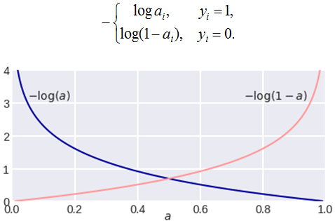编辑

图里讲的就是**逻辑回归（Logistic Regression）最核心的损失函数：对数损失（Log Loss / Logarithmic Loss）**，也叫 **交叉熵损失（Cross Entropy Loss）**。我用很通俗的方式把它讲透。

  

* * *

## 1）逻辑回归到底在输出什么？

逻辑回归不是直接输出“0 或 1”，而是输出一个概率：

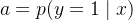

-   a 越接近 1：模型越确信样本是 **1**
    
-   a 越接近 0：模型越确信样本是 **0**
    

这个 a 通常来自 sigmoid：

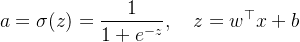

  

* * *

## 2）对数损失长什么样？（图里那两条曲线）

图上有两条曲线：

### ✅ 当真实标签 y=1 时（蓝线）

你希望模型给出 a 越大越好（越接近 1 越对）

损失定义为：

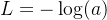

-   如果 a=1：−log⁡(1)=0，**完美，损失 0**
    
-   如果 a=0.1：−log⁡(0.1)≈2.30，**错得很离谱，损失大**
    
-   如果 a→0：−log⁡(a)→+∞，**“自信地错”会被极度惩罚**
    

这就是蓝线左高右低的原因。

* * *

### ✅ 当真实标签 y=0 时（红线）

你希望模型给出 a 越小越好（越接近 0 越对）

此时损失定义为：

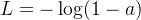

因为 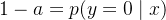 

-   如果 a=0：−log⁡(1)=0，**完美**
    
-   如果 a=0.9：−log⁡(0.1)≈2.30，**错得很离谱**
    
-   如果 a→1：−log⁡(1−a)→+∞，**自信错同样严重**
    

这就是红线右高左低的原因。

  

* * *

## 3）把两种情况合起来，就是一个统一公式

你看到图上那个分段形式：

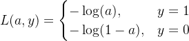

可以合并成一个更常用的形式：

![$\boxed{ L(a,y)= -\left[y\log(a)+(1-y)\log(1-a)\right] }$](https://mmbiz.qpic.cn/mmbiz_png/jlXjovro0tpSUibfdGe2mHDiaAibGBFicl5K1OL9iayFuDzicKq6jbCKpTFQgwVXFcUT4XUohVUtPDeWTNgOzbtuXnag/640?wx_fmt=png&from=appmsg)

这就是**逻辑回归的对数损失 / 交叉熵损失**。

  

* * *

## 4）为什么要用 “log”？直觉非常重要！

你可以把它理解成一句话：

> **模型越“自信地答错”，就罚得越狠。**

### 举个特别直观的例子

真实是 y=1：

预测概率 a

损失 −log⁡(a) 

感觉

0.9

0.105

“基本答对”

0.6

0.511

“有点犹豫”

0.1

2.303

“非常自信但错了”

你会发现：

-   从 0.9 → 0.6，损失增加一点点（还能接受）
    
-   从 0.6 → 0.1，损失暴涨（错得太离谱）
    

这就是 log 的“惩罚加速”效果。

  

* * *

## 5）它其实等价于“最大似然”的推导结果

如果你把模型输出看成概率：

-   当 y=1，模型给出概率 a
    
-   当 y=0，模型给出概率 1−a
    

那么一个样本的“模型认为它发生的概率”可以写成：

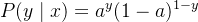

训练时，我们希望“这些真实标签出现的概率尽量大”  
→ **最大化概率（似然）**  
→ 等价于 **最小化负对数似然**

![$-\log P(y\mid x) = -\left[y\log(a)+(1-y)\log(1-a)\right]$](https://mmbiz.qpic.cn/mmbiz_png/jlXjovro0tpSUibfdGe2mHDiaAibGBFicl5KEh6HoWtKnSGSBjc9FD4EvEQBFvibudhmHSwtVsiaiblyGJjz7EAhnPiaUA/640?wx_fmt=png&from=appmsg)

所以对数损失不是拍脑袋定的，它是非常自然、合理的统计结果。

  

* * *

## 6）一句话总结图的含义（你看懂就赢了）

  

-   **蓝线** −log⁡(a)：真实是 1 时，a 越小越惨
    
      
    
-   **红线** −log⁡(1−a)：真实是 0 时，a 越大越惨
    
-   在 0.5 附近两条线交叉：表示“你不确定”时损失都差不多
    

  

我们继续，用一个**超具体、能手算**的小例子，把逻辑回归的 **log loss** 从头算到尾（还顺便看懂“mini-batch 平均损失”）。

* * *

# 1）先定一个 mini-batch：3 个样本

我们假设模型已经算出了每个样本“是正类 y=1”的概率 a。

样本

真实标签 y

模型预测概率 a=p(y=1∣x)

1

1

0.9

2

1

0.6

3

0

0.2

  

* * *

# 2）按公式逐个算 log loss

统一公式：

![$L(a,y)= -\left[y\log(a)+(1-y)\log(1-a)\right]$](https://mmbiz.qpic.cn/mmbiz_png/jlXjovro0tpSUibfdGe2mHDiaAibGBFicl5K7Uxd5gcMtSLiaMgCtjDXsj7lXOJ4HoAspDcz0DzXXGs8hCsftoZcE1Q/640?wx_fmt=png&from=appmsg)

> 默认 log 是自然对数 ln⁡。

* * *

## ✅ 样本1：y=1, a=0.9

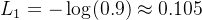

解释：模型预测 90% 是正类，而且真的是正类 → **损失很小**

* * *

## ✅ 样本2：y=1, a=0.6

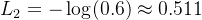

解释：模型也猜对了，但没那么自信 → **损失比样本1大**

* * *

## ✅ 样本3：y=0, a=0.2

注意：真实是 0，就要用 −log⁡(1−a)

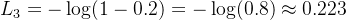

解释：模型给正类概率 0.2，意思是“我觉得你 80% 是负类”  
而真实确实是负类 → **损失也小**

* * *

# 3）mini-batch 的总损失 = 平均损失

逻辑回归训练时最常用的 batch loss：

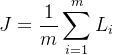

这里 m=3

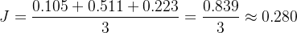

✅ 这就是这一个 mini-batch 的交叉熵损失。

  

* * *

# 4）感受一下“自信错了会被罚爆”的威力

我们把样本3改成一个“很离谱的预测”：

真实仍然 y=0，但模型却给 a=0.99（极度相信它是正类）

那么：

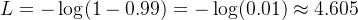

你看：

-   正确且合理：a=0.2 → 损失 0.223
    
-   自信地错：a=0.99 → 损失 4.605（直接爆炸）
    

📌 这就是 log loss 的灵魂：

> **你可以不确定，但你不能“自信地错”。**

* * *

#   

# 5）你图里的两条曲线，现在就完全通了

-   当 y=1：损失 −log⁡(a)
    

-   a→1：损失 →0
    
-   a→0：损失 →+∞
    
      
    

-   当 y=0：损失 −log⁡(1−a)
    

-   a→0：损失 →0
    
-   a→1：损失 →+∞
    
      
    

所以你看到的就是：

-   蓝线（y=1）左边高、右边低
    
-   红线（y=0）左边低、右边高
    

  

* * *

# 6）再送你一个“超级记忆口诀”

你只要记住一句话就够了：

✅ **真实是什么，就看模型给它的概率有多大；概率越小，惩罚越大，而且是 log 级爆炸。**

-   真实是 1 → 看 a
    
-   真实是 0 → 看 1−a
    

我们下一步继续讲更关键的一点：  
为什么逻辑回归训练时，经常会出现一个特别漂亮的结果：

也就是“误差 = 预测 - 真实”，梯度形式极其简洁（反向传播里非常爽）。

我们继续把最关键、最“爽”的一步讲透：

> **为什么逻辑回归 + 对数损失的梯度，会变成超级简洁的：  
> 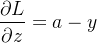**

这一步一旦懂了，你就能真正明白：  
**逻辑回归为什么这么好训练、为什么梯度下降这么顺。**

* * *

# 0）先把变量关系画出来（链式法则通道）

逻辑回归是：

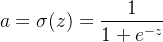

![$L(a,y)= -\left[y\log(a)+(1-y)\log(1-a)\right]$](https://mmbiz.qpic.cn/mmbiz_png/jlXjovro0tpSUibfdGe2mHDiaAibGBFicl5K7Uxd5gcMtSLiaMgCtjDXsj7lXOJ4HoAspDcz0DzXXGs8hCsftoZcE1Q/640?wx_fmt=png&from=appmsg)

所以计算梯度时就是一条链：

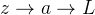

我们想要的是：

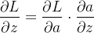

  

* * *

# 1）先求 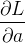 

![$L= -\left[y\log(a)+(1-y)\log(1-a)\right]$](https://mmbiz.qpic.cn/mmbiz_png/jlXjovro0tpSUibfdGe2mHDiaAibGBFicl5KdCTpslibA0OL4LgyRBSs4v4XXMqknbKluRo89P05wON7Gp4FPVMzAaA/640?wx_fmt=png&from=appmsg)

对 a 求导：

-     
    
-   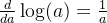
    
-     
    
-   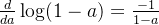
    

所以：

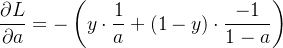

整理一下：

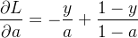

  

* * *

# 2）再求 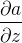（sigmoid 的导数）

### a=σ(z)

一个非常经典的结论：

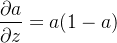

  

* * *

# 3）链式法则相乘：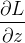

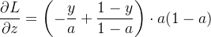

把 a(1−a) 分别乘进去：

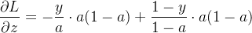

约掉：

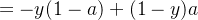

展开：

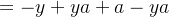

中间 ya 抵消了，剩下：

✅ 这就是神奇的简洁结果！

  

* * *

# 4）这个结果为什么“特别有直觉”？

它说的就是一句话：

> **梯度 = 预测概率 − 真实标签**

-   如果真实 y=1，但你预测 a=0.2  
    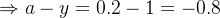（负数很大）  
      👉 说明你应该把 z 往上推（让 a 变大）
    
-   如果真实 y=0，但你预测 a=0.9  
    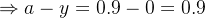（正数很大）  
      👉 说明你应该把 z 往下压（让 a 变小）
    

所以它特别像你熟悉的“误差”：

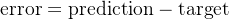

  

* * *

# 5）再进一步：求到 w 和 b 的梯度（训练要用）

因为：

所以：

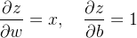

链式法则：

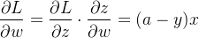

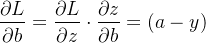

✅ 最终训练更新公式就是：

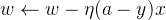

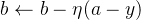

  

* * *

# 6）用一个小数值演示一次更新（直观到爆）

假设某个样本：

-   x=\[2, 1\]
    
-   y=1
    
-   当前模型预测 a=0.3（明显偏低）
    

那么：

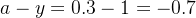

所以：

![$\frac{\partial L}{\partial w}=(a-y)x=-0.7[2,1]=[-1.4,-0.7]$](https://mmbiz.qpic.cn/mmbiz_png/jlXjovro0tpSUibfdGe2mHDiaAibGBFicl5K0BMUYZQialurytnTEtVEMfd0sA6QyyMXib1my26BSbmTaxS0Lia3USGVg/640?wx_fmt=png&from=appmsg)

梯度下降更新 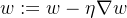：

![$w \leftarrow w-\eta[-1.4,-0.7] = w + \eta[1.4,0.7]$](https://mmbiz.qpic.cn/mmbiz_png/jlXjovro0tpSUibfdGe2mHDiaAibGBFicl5K13kVD28Vbr4sXVUpcVQUMLwxjQsic4HrKX4ZsJFvUfVZZcUGd1nfOdg/640?wx_fmt=png&from=appmsg)

你看到了吗？因为你 **预测太小**，所以更新会让 w **变大**，从而让 z 变大、a 变大 —— 预测更接近 1。

✅ 方向完全符合直觉。

  

* * *

# 7）一句话总结这一段的“核心爽点”

逻辑回归 + 对数损失最漂亮的地方就是：

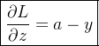

这让反向传播变得极其简单、稳定、好优化。

### 为什么对数损失好用？

想象一下：假如真实是猫（y=1），模型预测概率p=0.9（挺自信正确），损失小≈0.105；但如果p=0.1（自信错误），损失大≈2.3。相比MSE，log loss更敏感于概率极端错误，帮助模型更快学习区分边界。

在实际训练中，我们用梯度下降等优化算法最小化这个损失，让模型的预测概率越来越接近真实标签。