# 马尔可夫链和转移矩阵

> 原文地址: [https://mp.weixin.qq.com/s/LApKp-7SnY9ryM7IvZsqIA](https://mp.weixin.qq.com/s/LApKp-7SnY9ryM7IvZsqIA)

### 马尔可夫链是什么？

想象一下，你在玩一个游戏，游戏里的角色每一步的行动只取决于它现在在哪里，而完全不记得之前走过的路。这就是马尔可夫链（Markov Chain）的核心想法！它是一种数学模型，用来描述随机事件序列，比如天气变化、股票价格或甚至聊天机器人的回复。简单来说，马尔可夫链假设“未来只取决于现在，不取决于过去”。这个特性叫“马尔可夫性质”或“无记忆性”。

为什么叫“链”呢？因为它像一条链条，由一个个“状态”连接而成。每个状态之间有“转移概率”，表示从一个状态跳到另一个状态的可能性。这些概率加起来总是1（因为总得去某个地方）。

马尔可夫链在矩阵中的应用

马尔可夫链的核心数学表示就是通过矩阵来实现的，特别是“转移矩阵”（Transition Matrix）。这个矩阵是一个方阵（行数等于列数），矩阵中的每个元素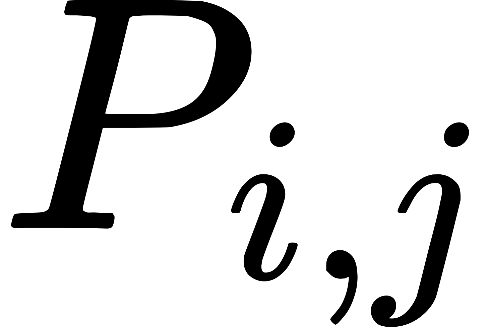 表示从状态i转移到状态j的概率。每一行的概率和必须等于1，因为从任何状态出发，总概率是100%。用矩阵表示后，我们可以用线性代数的方法来计算多步转移概率、长期行为（稳态分布）等。这让马尔可夫链从抽象概念变成可计算的工具，广泛用于预测、模拟和优化。

#### 转移矩阵的基本结构

假设有n个状态，转移矩阵P是一个n×n的矩阵。行代表当前状态，列代表下一个状态。下面是一个简单例子：天气模型（晴天、阴天、雨天）。转移矩阵P如下：

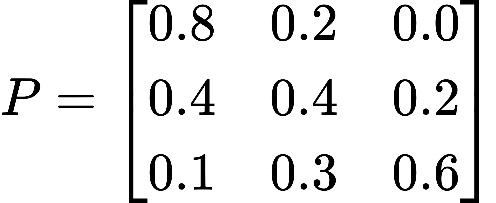

  

-   第一行：从晴天出发，下一天还是晴天的概率0.8，阴天0.2，雨天0。
    
-   每一行和为1。
    

  

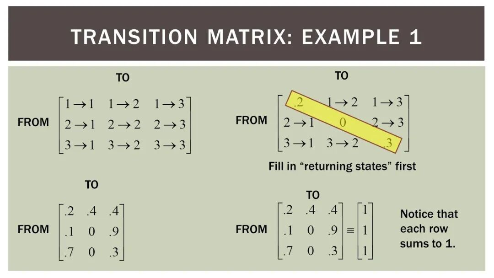

这张图在讲一件事：**马尔可夫链（Markov chain）= “状态” + “按概率跳转的规则”**，而这套“跳转规则”最常用 \*\*转移矩阵（Transition Matrix）\*\*来装起来。

* * *

## 1) 先读懂图里的 From / To：矩阵里每个格子是什么意思？

图中有 3 个状态：1、2、3。

-   左边写 **FROM**：表示“**从哪个状态出发**”（行）
    
-   上面写 **TO**：表示“**跳到哪个状态**”（列）
    

所以矩阵里第  行第 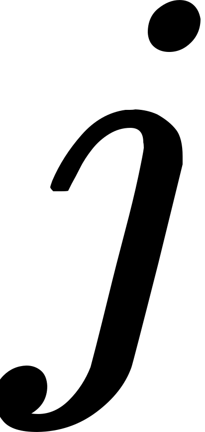 列那个数，含义就是：

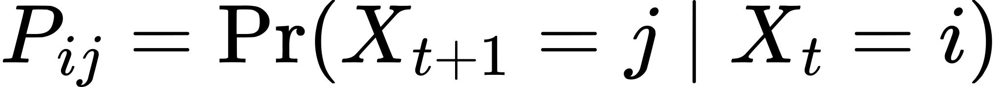

也就是：**“当前在 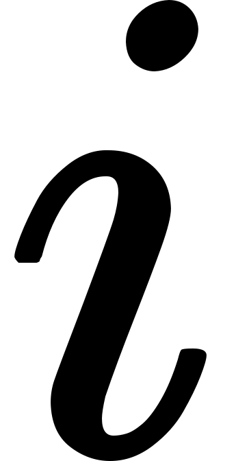，下一步到  的概率”**。

* * *

## 2) 为什么要“先填 returning states（回到原状态）”？

图右上角用黄色标出对角线（1→1、2→2、3→3），并写了：

> Fill in “returning states” first

原因很直观：对角线代表“**下一步还留在原状态**”的概率（自环）。很多实际问题里，“留在原地”的概率容易先确定，比如：

-   天气：今天晴，明天还是晴的概率
    
-   用户：今天在页面 A，明天还在 A 的概率
    
-   设备：正常→仍正常 的概率
    

图里给了：

-   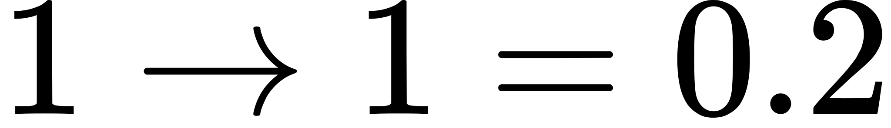
-   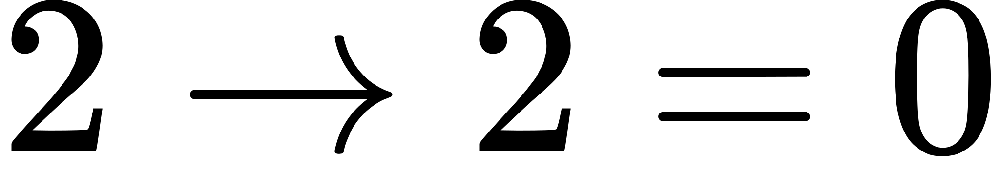
-   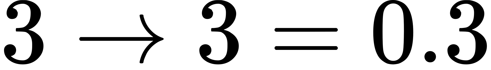

* * *

## 3) 为什么“每一行加起来必须等于 1”？

图右下角强调：

> Notice that each row sums to 1.

因为你**从某个状态出发**，下一步一定会落到某个状态（1、2、3 之一），所以这一行是一个完整的概率分布：

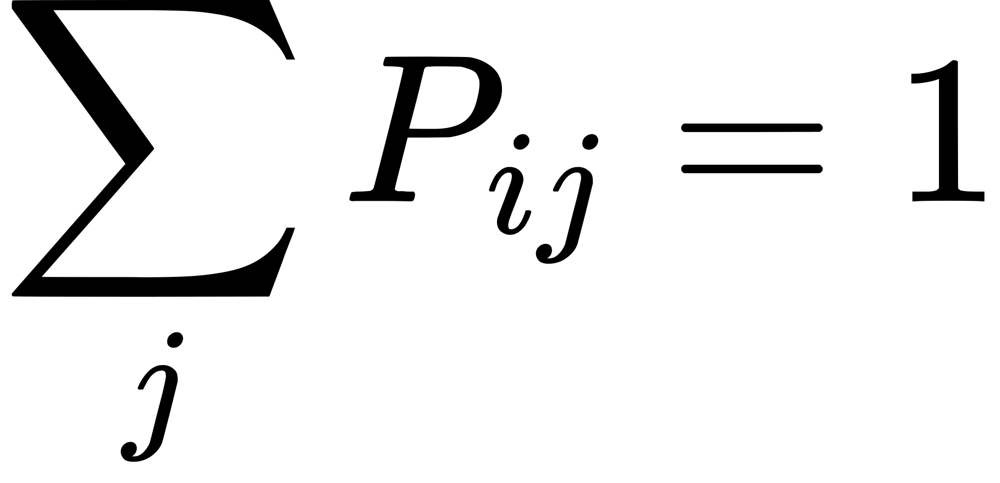

这就解释了“填完对角线以后”，剩下的格子要把这一行“补齐到 1”。

* * *

## 4) 图里的最终转移矩阵是什么？

图左下给出了完整数值矩阵：

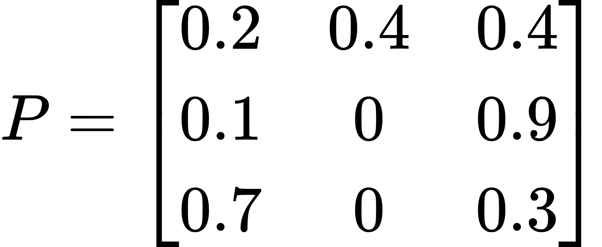

逐行口语解释：

-   **从 1 出发**
    
    20% 留在 1，40% 去 2，40% 去 3
    
-   **从 2 出发**
    
    10% 去 1，0% 留在 2，90% 去 3
    
-   **从 3 出发**
    
    70% 去 1，0% 去 2，30% 留在 3
    

  

你可以检查每行：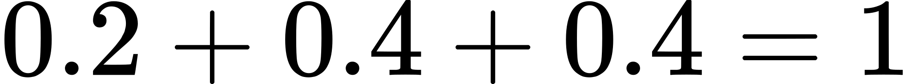，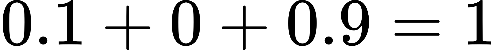，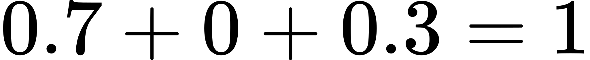。

* * *

## 5) 马尔可夫链的“核心一句话”：只看现在，不看过去

马尔可夫性（无记忆性）就是：

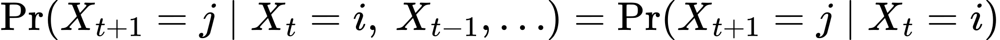

直觉：**下一步怎么走，只由“当前状态”决定**，和你怎么来的无关。

* * *

## 6) 转移矩阵怎么用来“推演未来”？（最关键的算法）

把“当前你在各状态的概率”写成一个分布向量。

因为这张图是“行 = FROM”，最顺手的写法是用**行向量**：

-   当前分布：
    
-   下一步分布：
    

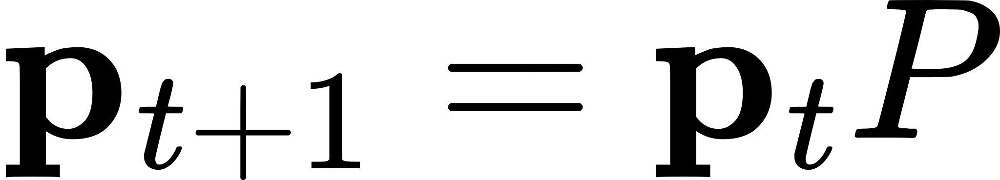

### 一个具体演示（从状态 1 出发）

“确定在 1”就是：

一步后：

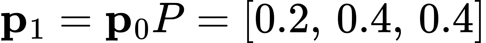

这很直观：从 1 出发的一步分布，就是矩阵**第 1 行**。

两步后三步后（把上一步再乘一次 ）：

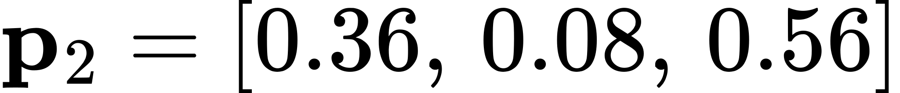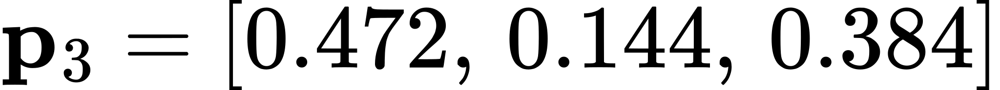

* * *

## 7) 多步转移：为什么会出现 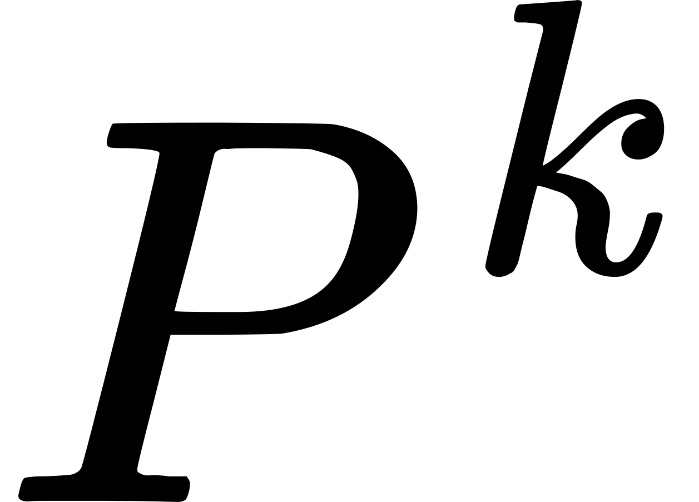？

如果每一步都用同一个转移矩阵 ，那么：

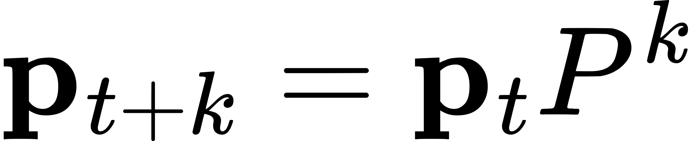

这就是“马尔可夫链 + 线性代数”结合的威力：**长期行为**可以用矩阵幂来研究。

* * *

## 8)（进阶但很常用）稳态分布：久了以后会稳定到什么比例？

很多链在满足一定条件（如“能互相到达”且“不按固定周期跳”）时，会收敛到一个固定分布 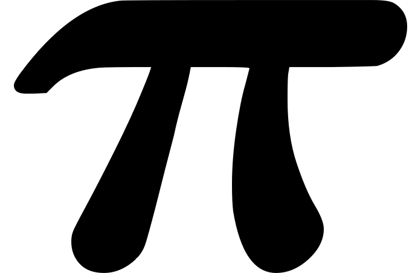，满足：

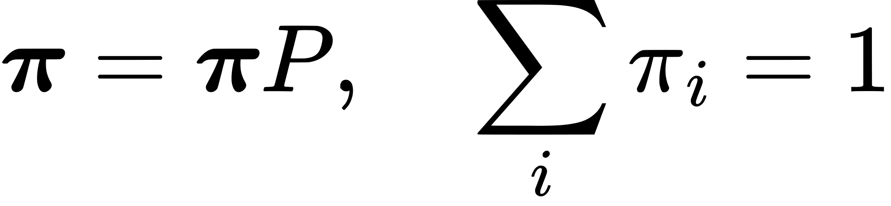

对这张图的矩阵，稳态分布大约是：

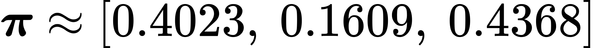

意思是：跑很久以后，系统在 1、2、3 这三个状态上出现的长期比例大概就是这个。

#### 一个经典例子：天气预报

假设我们只有三种天气状态：晴天（Sunny）、多云（Cloudy）和雨天（Rainy）。今天的天气决定了明天的概率，但不管前几天怎么样。

-   如果今天是晴天，明天还是晴天的概率是80%，变成多云的20%，下雨的0%。
    
-   如果今天多云，明天晴天40%、多云40%、雨天20%。
    
-   如果今天雨天，明天晴天10%、多云30%、雨天60%。
    

这个模型就能预测长期天气趋势，比如“如果一直这样下去，晴天的日子大概占多少比例？”。下面是一个简单的天气马尔可夫链图示：

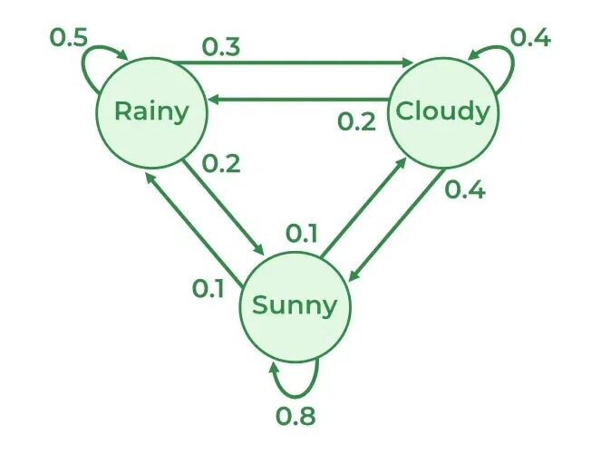

从图中可以看到，圆圈是状态，箭头是转移方向，数字是概率。注意，每个状态出去的箭头概率和总是1。

我们把这张“天气马尔可夫链”当成一个**会自我延续、也会偶尔变脸的城市天气精灵**，讲成一个小故事。你看完故事，再回头看图上的箭头和数字，会立刻“对上号”。

* * *

## 小故事：三位天气精灵轮班

在一个小城里，有三位天气精灵轮流值班：

-   **Sunny（晴天精灵）**
    
    性格稳定，最爱“连着晴”
    
-   **Cloudy（多云精灵）**
    
    有点摇摆，喜欢在“云里进出”
    
-   **Rainy（雨天精灵）**
    
    比较执着，一下雨就可能雨个不停
    

每天晚上 12 点，他们会开一个很短的“交接会”：

> “明天谁来值班？”  
> 他们不看过去发生过什么，只看**今天是谁在值班**，然后按图上的概率做决定。

* * *

## 先把三人的“习惯”翻译成人话（完全对应图上的箭头）

### 1) 今天是 晴天 Sunny

Sunny 很懒，最喜欢继续上班：

-   **80%**
    
    明天还是 Sunny（图里 Sunny 自己指回自己那条 0.8）
    
-   **10%**
    
    明天换 Rainy（Sunny → Rainy 的 0.1）
    
-   **10%**
    
    明天换 Cloudy（Sunny → Cloudy 的 0.1）
    

所以晴天的口头禅是：

> “大概率我还在（0.8），偶尔给你们一点戏份（0.1/0.1）。”

* * *

### 2) 今天是 多云 Cloudy

Cloudy 比较“犹豫”，经常在云和别的天气之间切换：

-   **40%**
    
    明天还 Cloudy（Cloudy 自环 0.4）
    
-   **20%**
    
    明天转 Rainy（Cloudy → Rainy 的 0.2）
    
-   **40%**
    
    明天转 Sunny（Cloudy → Sunny 的 0.4）
    

多云的口头禅：

> “我有一半概率会变（0.2 下雨 + 0.4 放晴），也有 0.4 我继续云着。”

* * *

### 3) 今天是 下雨 Rainy

Rainy 情绪很“黏”，常常雨一来就不走：

-   **50%**
    
    明天还 Rainy（Rainy 自环 0.5）
    
-   **30%**
    
    明天转 Cloudy（Rainy → Cloudy 的 0.3）
    
-   **20%**
    
    明天转 Sunny（Rainy → Sunny 的 0.2）
    

雨天的口头禅：

> “我来了就不一定走（0.5），要走也多半先云一会儿（0.3），直接放晴没那么常见（0.2）。”
> 
> 你也可以顺手检查：每个精灵这三种选择加起来都等于 1（这是“概率总账”）。

* * *

## 真实一点：把它写成“连续几天的日记”

假设今天是星期一，天气是 **Sunny**。晚上交接会：

### 周一晚上（今天 Sunny）

Sunny 掷骰子：大概率继续（0.8）。  
结果：**继续 Sunny**。

### 周二晚上（今天 Sunny）

又掷骰子：这次抽到了 0.1 的分支。  
结果：**变 Cloudy**。

### 周三晚上（今天 Cloudy）

Cloudy 犹豫了一下，抽到 0.2。  
结果：**变 Rainy**。

### 周四晚上（今天 Rainy）

Rainy 很执着，抽到 0.5。  
结果：**继续 Rainy**。

### 周五晚上（今天 Rainy）

这次抽到 0.3。  
结果：**转 Cloudy**。

### 周六晚上（今天 Cloudy）

抽到 0.4。  
结果：**放晴 Sunny**。

你会发现：

-   晴天确实“容易连晴”（0.8 太大了）
    
-   雨天确实“容易连雨”（0.5 也不小）
    
-   多云最像“中转站”（既可能去雨，也可能去晴）
    

这就是马尔可夫链的“具象感”：**每天的明天，都只由今天决定**，图上的每条箭头就是“交接会的概率规则”。

我们就从这张图的规则出发：**今天必定晴（Sunny）**，问“明天/后天/三天后”分别是晴/多云/下雨的概率。

* * *

## 1) 先把图写成转移矩阵 P  

按状态顺序：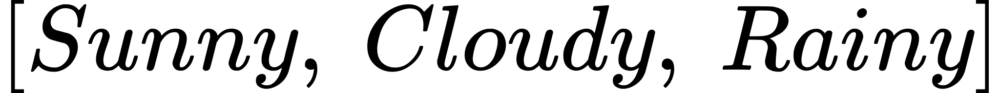，并且“行 = FROM（今天）”，“列 = TO（明天）”。

从图读到的概率是：

-   Sunny → Sunny 0.8，→ Cloudy 0.1，→ Rainy 0.1
    
-   Cloudy → Sunny 0.4，→ Cloudy 0.4，→ Rainy 0.2
    
-   Rainy → Sunny 0.2，→ Cloudy 0.3，→ Rainy 0.5
    

所以

* * *

## 2) “今天必定晴”怎么表示？

用“概率分布向量”（行向量）表示今天的状态：

含义：Sunny 概率 1，另外两个 0。

更新规则是：

* * *

## 3) 明天（一步后）

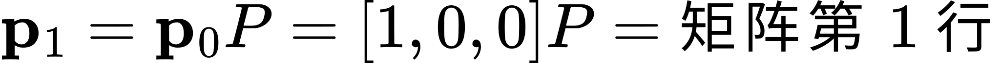  

解释：明天 80% 晴，10% 多云，10% 下雨。

**为什么 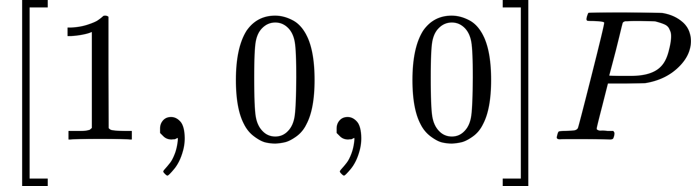 会“挑出”矩阵第 1 行？我用最具象的方式给你拆开——不跳步。**

* * *

## (3.1) 先把符号翻成人话

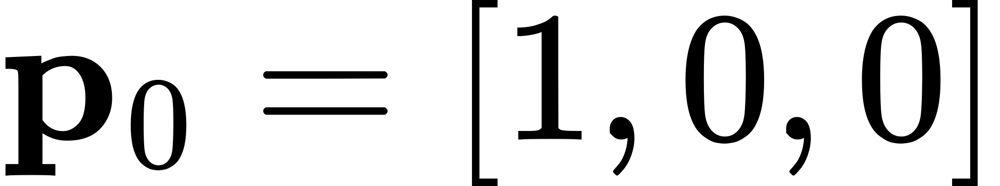

表示：**今天 100% 是 Sunny**，Cloudy 和 Rainy 的概率都是 0。

矩阵 P 的第 1 行（Sunny 那一行）是：

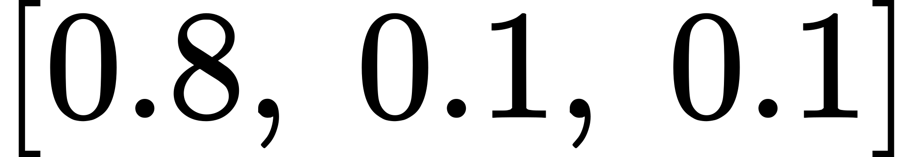

表示：**如果今天是 Sunny**，那么明天 Sunny/Cloudy/Rainy 的概率分别是 0.8/0.1/0.1。

* * *

## (3.2) 行向量乘矩阵到底怎么算？

规则是：

如果 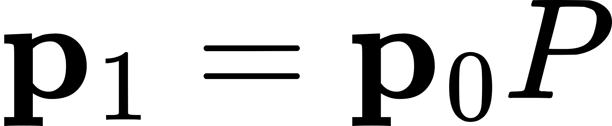，那么 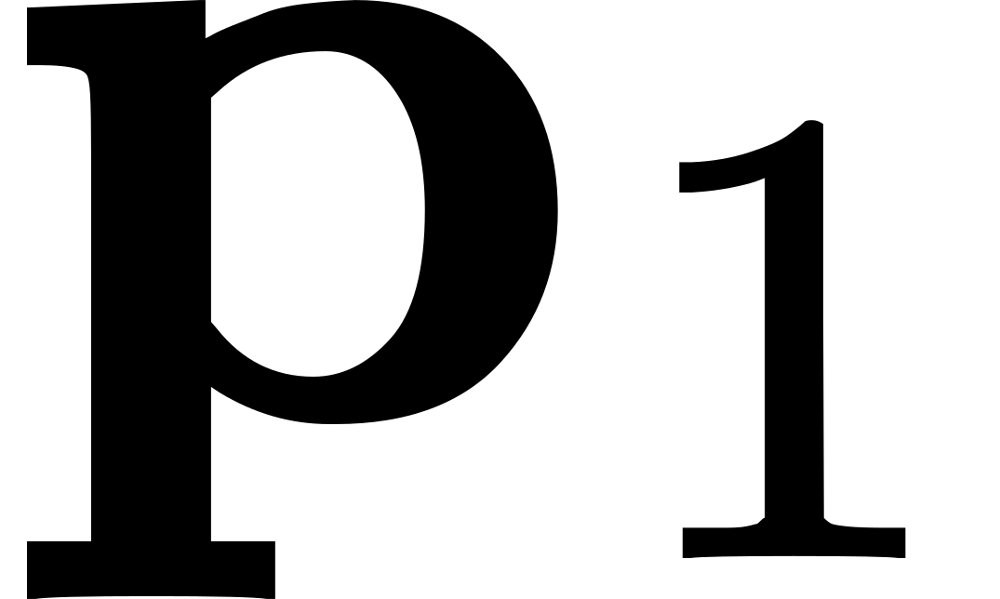 的第  个分量是

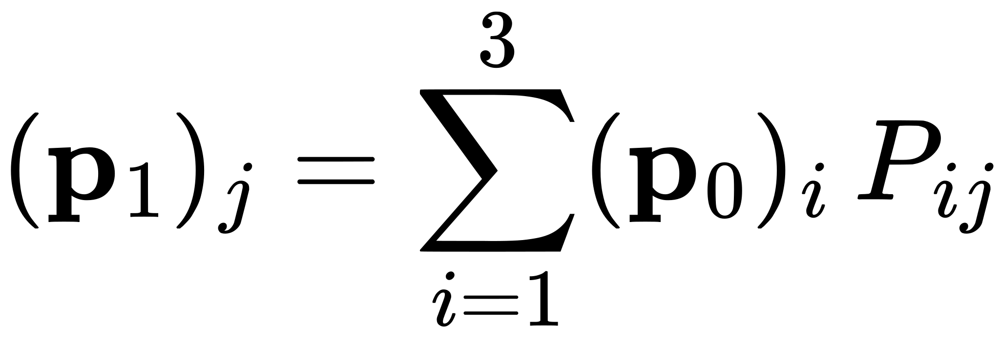

翻译：

> “明天到达状态  的概率”  
> \= 把所有可能的今天状态  的概率 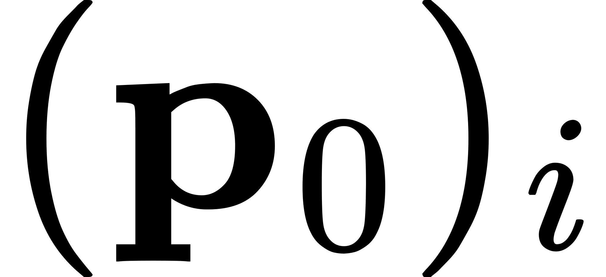  
> 乘上 “从  到 ” 的概率 ，再全部加起来。

这就是**全概率公式**的矩阵版本。

* * *

## (3.3) 现在把它“逐列算”给你看（你会立刻懂）

写出矩阵：

                             

。

### 明天是 Sunny 的概率（第 1 列）

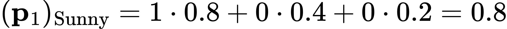

### 明天是 Cloudy 的概率（第 2 列）

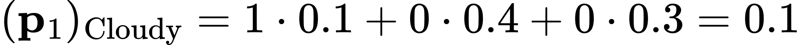

### 明天是 Rainy 的概率（第 3 列）

所以

* * *

## (3.4) 为什么这等于“矩阵第 1 行”？

注意刚才每一列的求和里，都出现了：

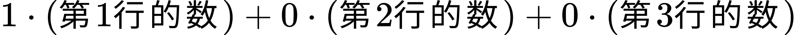

也就是说，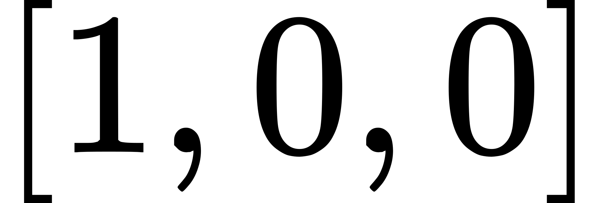 的作用就是：

-   把第 1 行乘 1（保留）
    
-   把第 2 行乘 0（抹掉）
    
-   把第 3 行乘 0（抹掉）
    

所以结果只剩下第 1 行：

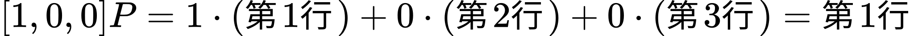

这就是“挑出第 1 行”的本质原因。

* * *

## (3.5) 一个更直观的类比（按比例混合行）

一般地，如果

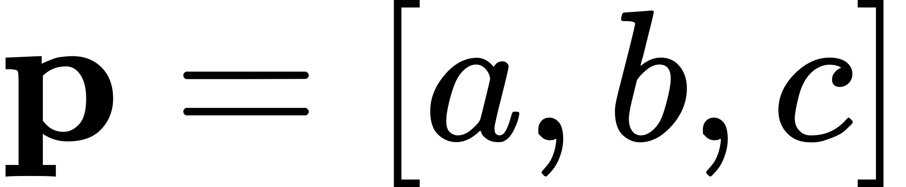

那么

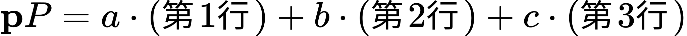

所以当  时，就只剩第 1 行。

  

* * *

## 4) 后天（两步后）——最“具象化”的算法：加权平均三种“明天规则”

## 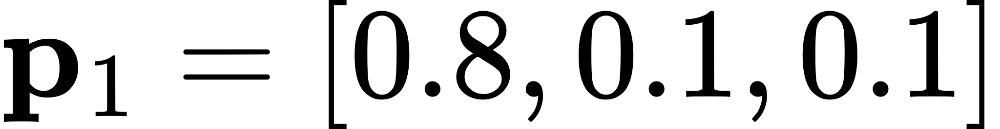

把它写成“混合三种情况”最直观：

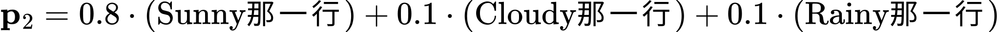

也就是

-   Sunny那一行 = 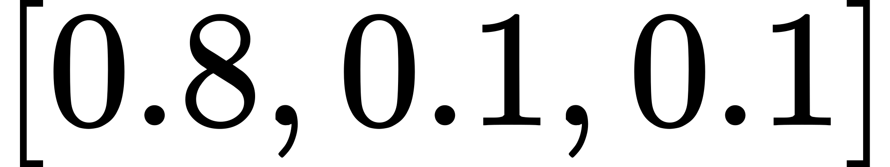
    
-   Cloudy那一行 = 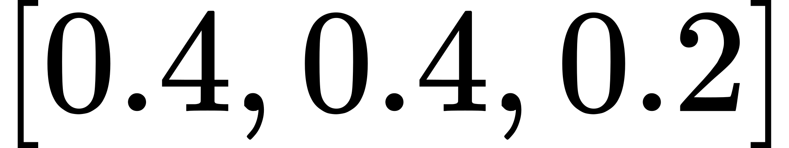
    
-   Rainy那一行 = 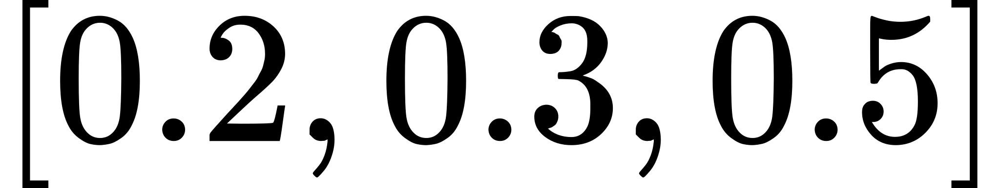
    

逐项算（每一列单独算）：

**Sunny列：**

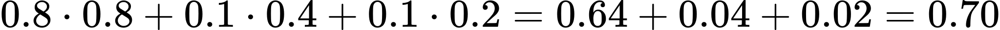

**Cloudy列：**

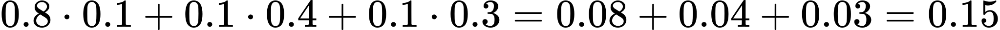

**Rainy列：**

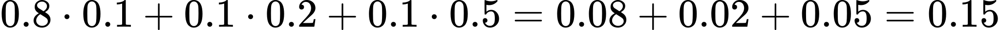

所以

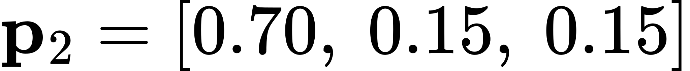

* * *

## 5) 三天后、四天后（继续乘）

继续用 ：

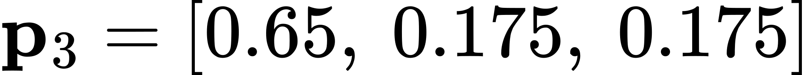  

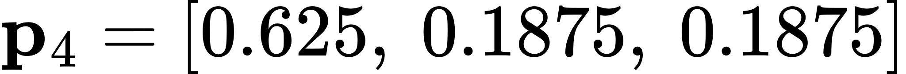

你能看到一个趋势：从“必定晴”出发，随着天数增加，

-   晴的概率从 0.8 → 0.70 → 0.65 → 0.625 … 逐步下降
    
-   云/雨从 0.1 → 0.15 → 0.175 → 0.1875 … 逐步上升
    

* * *

## 6) 顺带一句：它最后会稳定到什么比例？

这张图对应的长期稳态分布（满足 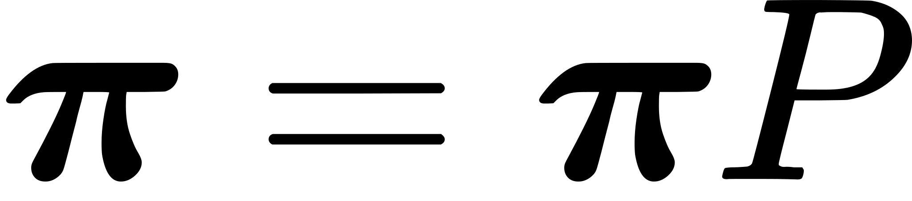）是：

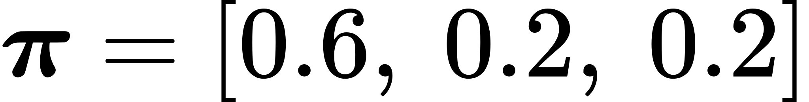

也就是：时间足够久后，长期来看大约 **60% 晴、20% 多云、20% 下雨**。

马尔可夫链的优势是解释性强、计算快，但局限是忽略长距离依赖（现代AI用Transformer补上）。在AI发展中，它是“老前辈”，奠定了许多高级模型的基础。