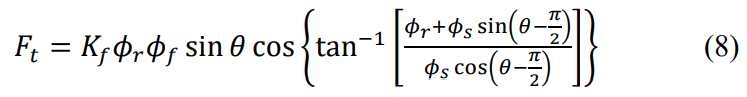
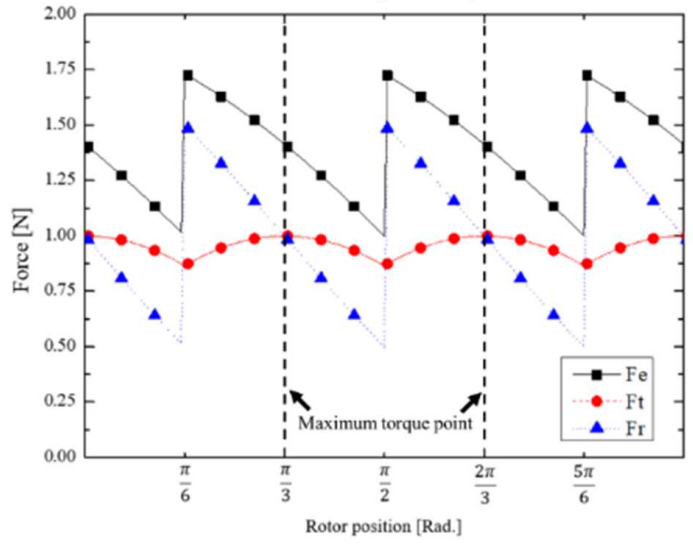
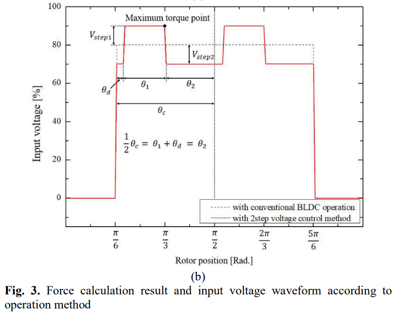
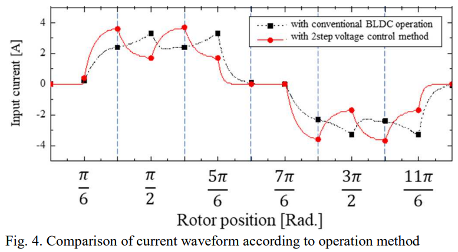
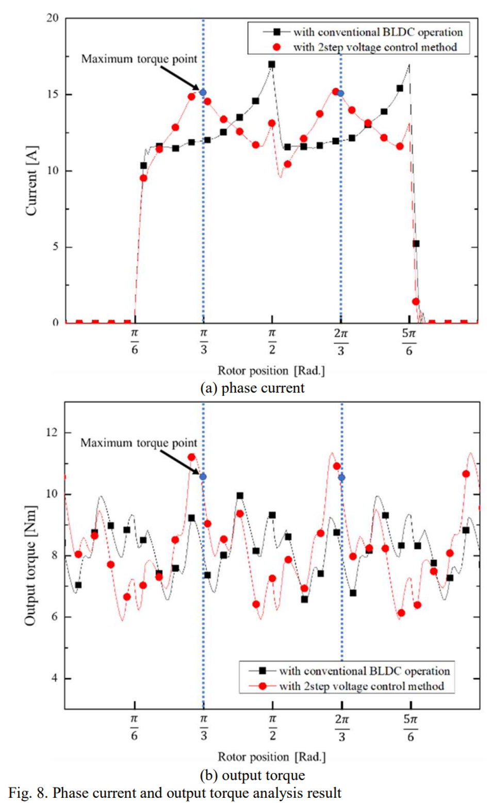
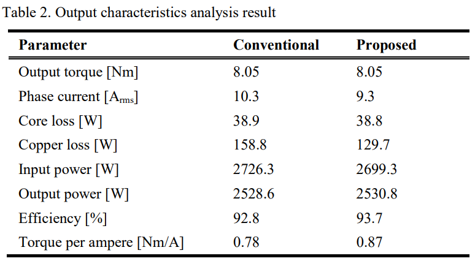

# 1%的效率提升，10%的电流降低：BLDC电机驱动的降本增效魔法

原创 傅存敬 电磁散人 2025-10-06 08:30 广东

> 原文地址: [https://mp.weixin.qq.com/s/AvQZ1az55ZoDJb6fUE8Z3Q](https://mp.weixin.qq.com/s/AvQZ1az55ZoDJb6fUE8Z3Q)

上次咱们聊了怎么[通过“精准推拿”给电机提升效率](https://mp.weixin.qq.com/s?__biz=MzE5MTYzNjgzOA==&mid=2247484207&idx=1&sn=20c66820b9cf6a59f41cc0e17736d170&scene=21#wechat_redirect)，发现了一个绝妙的方法。今天，咱们再来看另一篇“武功秘籍”，来自另一队武林高手。这篇论文叫《A Study on Output Torque Analysis and High Efficiency Driving Method of BLDC Motor（关于无刷直流电机输出转矩分析与高效驱动方法的研究）》。

可能有同仁会说，这题目好像跟上次的差不多啊？没错！英雄所见略同！但他们用的“内功心法”和“招式细节”略有不同，而且这次，他们把效率提升的秘密揭示得更加彻底！

咱们开始吧！

第一幕：温故而知新——“拔河”的精髓

还记得咱们的“磁力拔河”模型吗？定子线圈是拔河队员，转子是被拉的中心选手。我们上次知道了，只有切向力 Ft 才是让转子旋转的“有效力”。

这篇论文的作者也得出了同样的结论，他们用的公式稍微有点不一样，但意思完全相同。看这里：

这个公式再次告诉我们，就算总的磁力不变，Ft 这个有效力也会随着转子角度θ的变化而波动。他们的仿真图也证明了这一点：

大家看，这张图和我们上次看的是不是异曲同工？都清楚地显示，在一次拔河（一个导通周期）中，有一个“黄金发力点”，我们论文里管它叫“最大转矩点”（Maximum torque point）。在这个点上，你使的每一分力气，效果都是最好的！

新的问题来了：我们怎么才能保证，在“黄金发力点”到来时，我们的力气正好也达到顶峰呢？

第二幕：功夫的“延迟”——电感的阻碍

这里，这篇论文的作者提出了一个非常深刻的洞察！他们说，你以为你想发力，就能立刻发出最大的力吗？太天真了！

电机里有个东西叫电感（Inductance），它就像一个特别犟的家伙，总是阻碍电流的变化。

咱们打个比方：你家的水龙头，你把阀门拧到最大，水是不是“哗”一下就立刻达到最大流量了？不是的！它需要一个非常短暂的时间，从零慢慢变大。这个“缓冲”的过程，就和电感的作用非常像。

在电机里，我们给线圈施加电压，想让电流（也就是我们的“力气”）立刻上来，但电感会说：“慢着点！我得先适应一下！”所以，电流的上升总是会有一个延迟。

这个延迟会带来什么后果？

后果就是：当你觉得“黄金发力点”到了，你才开始发力，结果等你真正使出最大力气的时候，“黄金发力点”已经过去了！你完美地错过了最佳时机！

第三幕：顶尖高手的策略——“预判”与“冲刺”

那怎么办？这篇论文的作者想出了一个顶尖高手的策略：“预判时机，提前冲刺！”

这就是他们的“两步电压控制法”。来看如下两张神图：

这个策略分为两步：

1.  “提前冲刺” (在最大转矩点之前 θ₁ 区域):
    
    在“黄金发力点”到来之前，我就预判到它要来了！怎么办？我立刻施加一个更高的电压 (Vstep1)！这就好比赛跑，我在进弯道前就开始猛烈加速，为的就是在出弯道的最佳直线上达到最高速度！这个高电压就是为了克服电感的延迟，强行把电流（力气）提前给顶上去！
    
2.  “功成身退” (在最大转矩点之后 θ₂ 区域):
    
    等我冲过了“黄金发力点”，任务已经完成，此时我就没必要再拼命了。于是我降低电压(Vstep2)，省点力气。
    

你看图4那个红线，这就是用了新方法后的电流波形。它就像一个经验丰富的运动员，在关键点到来之前就开始发力，在最高点完美释放，然后平稳过渡。而黑线代表的传统方法，就像一个后知后觉的选手，总是慢半拍。

第四幕：是骡子是马，拉出来遛遛！

这套“组合拳”打下来，效果到底怎么样？作者们用非常精密的有限元分析（FEA）进行了仿真，相当于在电脑里搭建了一个一模一样的虚拟电机来测试。

我们直接来看最终的“战报”！

上图是电流，下图是转矩。看，红线（新方法）在最大转矩点附近的峰值，明显比黑线（旧方法）要高！这说明我们的“提前冲刺”策略成功了！

最最关键的是这张效率对比表！

这张表告诉了我们效率提升的全部秘密！在输出同样大的力气（8.05 Nm）时：

项目

传统方法

改进方法

结果解读

相电流 (Arms)

10.3

9.3

力气没变，花的劲儿小了！

铜损（W）

158.8

129.7

电流小了，发热就少了，浪费的能量也少了！

效率 (%)

92.8 %

93.7 %

效率实打实提升了将近1%！

单位电流转矩 (Nm/A)

0.78

0.87

每一安培电流，干的活更多了！性价比超高！

同仁们，有没有看出一点感觉？这次的解释更底层了！为什么效率高了？因为我们通过“预判和冲刺”，在关键时刻用更少的总电量（平均电流更低）产生了同样大的力，大大减少了因为电流流过线圈而产生的热量损失（铜损）！

总结

好了，今天我们又进阶了！

如果说上次我们学到的是[要区分“有效力”和“无效力”](https://mp.weixin.qq.com/s?__biz=MzE5MTYzNjgzOA==&mid=2247484207&idx=1&sn=20c66820b9cf6a59f41cc0e17736d170&scene=21#wechat_redirect)，那么今天我们更进一步，学到了时机的重要性！

顶尖高手和普通选手的区别，往往不在于力气有多大，而在于是否能预判时机，在最关键的时刻，用最恰当的方式，爆发出最强的力量。

这篇论文的作者们，就是这样一群懂得“预判”的电机控制高手。他们通过克服电感的“延迟”，让电机在正确的时间做了正确的事，最终实现了效率的飞跃。

从生活到科学，从拔河到控制电机，这些道理都是相通的，是不是很有趣？

  

参考文献：

\[1\] Yoo J H , Jung T U .A Study on Output Torque Analysis and High Efficiency Driving Method of BLDC Motor\[J\].会议论文, 2020, 000(9451203).DOI:10.1109/CEFC46938.2020.9451336.

文档链接：https://pan.baidu.com/s/120zq-jnUnQMIQQSFH0EtLQ?pwd=n4c2 提取码: n4c2