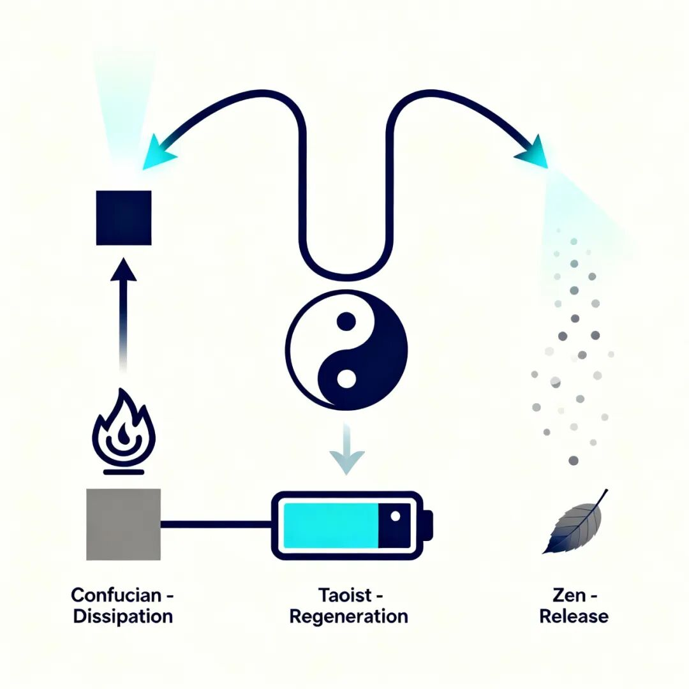

# BLDCM/PMSM制动的三重境界：儒、道、释的技术哲学

原创 傅存敬 电磁散人 2025-10-25 07:06 广东

> 原文地址: [https://mp.weixin.qq.com/s/HqzQkjn1AN3kezj3JaSIXQ](https://mp.weixin.qq.com/s/HqzQkjn1AN3kezj3JaSIXQ)

各位电机与控制器行业的朋友们，大家好。

在我们的日常研发活动中，是否曾静下来思考过一个本质问题：我们让一台BLDCM或PMSM停下来，这背后，究竟有几种哲学？

通常，我们会讨论四象限运行，会比较再生制动与能耗制动的优劣。但今天，我想邀请你，从一个更高的维度，重新审视我们习以为常的技术选择。

**一、 第一重境界：儒家的担当——能耗制动**

儒家士大夫的精神，是“知其不可而为之”。天下滔滔，我独力挽狂澜。如同中流砥柱，以血肉之躯对抗滚滚洪流。

这种精神，完美地体现在**能耗制动**上。

当需要快速制动时，我们让电机发出的强大电流，直接通过制动电阻，或是在电机绕组内部硬扛。这一刻，电阻或绕组化身“士大夫”，以一种自我牺牲的方式，将危险的、多余的机械能，毫无保留地转化为热量消耗掉。

**它的特点是：刚猛、直接、可靠。**不计较自身损耗，但求完成任务。在成本敏感、制动剧烈或作为安全备份的场景里，这种“儒家式的担当”是不可或缺的脊梁。

**但我们要问：所有的洪流，都只能靠“堵”吗？**

**二、 第二重境界：道家的智慧——再生制动**

道家讲“道法自然”。大禹治水，疏而不堵。他不与洪水对抗，而是引导它，顺应它，最终化害为利，流入大海，滋养万物。

这是更高级的智慧，也就是**再生制动**。

当电机需要制动时，我们不视其为需要对抗的“洪水猛兽”，而是承认并尊重它蕴含的巨大惯性动能。通过精巧的控制算法（让逆变器工作于整流状态），我们“疏导”这股能量，让它从机械能形态，平滑地转化为电能，并回馈到我们的直流母线。

这波电能，可以给电池充电，可以供给其他正在工作的电机。**变废为宝，生生不息。**

**它的特点是：智慧、高效、循环。**它追求的不是局部的最优解（停下车），而是系统整体的能量和谐。在电动汽车、高端装备中，这种“道家式的智慧”正是提升能效、实现绿色的关键。

**那么，除了“对抗”和“疏导”，还有第三种可能吗？**

**三、 第三重境界：释家的放下——自由停车**

释家讲“放下执着”，“缘起性空”。不刻意，不强求。风来了，竹子的竹梢扫过月影，风走了，竹子就静静地站在那里。

这对应着电机的**自由停车**。

我们不控制任何电力电子器件动作，不施加任何制动转矩。我们只是“放下”控制，断开与电机的主动连接。然后，依靠系统固有的风阻、摩擦，让电机自然地、缓缓地停下来。不回收能量，也不消耗能量，只是让运动随着因缘的消散而自然寂灭。

**它的特点是：自然、无为、极简。**在对制动时间和位置没有要求的场合，这种“释家式的放下”，是一种成本为零、极其简单的选择。

**小结：你的系统，流淌着哪种哲学？**

朋友们，技术方案的背后，永远是人的选择。而人的选择，深受其思维模式和价值观的影响。

-   如果你的设计哲学是 **“担当”**，你会倾向于使用**能耗制动**，在关键时刻敢于牺牲局部，保全整体。
    
-   如果你的设计哲学是 **“智慧”**，你会崇尚**再生制动**，致力于构建一个能量循环、高效可持续的系统。
    
-   如果你的设计哲学是 **“极简”**，你会在合适的地方采用**自由停车**，不浪费一丝额外的资源。
    

但真正顶级的高手，从不拘泥于一家一派。他们像一位精通“管理”的CEO，深知：

-   要用**儒家的担当（能耗制动）**处理紧急“危机”，确保系统“安全”。
    
-   要用道家的智慧（再生制动）做常规管理，提升系统整体“效益”。
    
-   要用**释家的放下（自由停车）**看待非核心问题，保持系统“简洁”。
    

所以，下一次当你进行电机控制设计时，不妨问问自己：我此刻调用的，是儒、是道、还是释？我们为系统注入的，不仅是电流和算法，更是一种处世哲学。

因为，一切工程问题，最终都是哲学问题。

