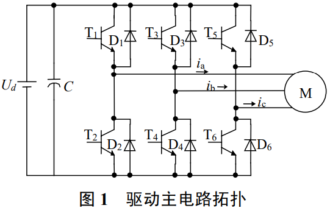
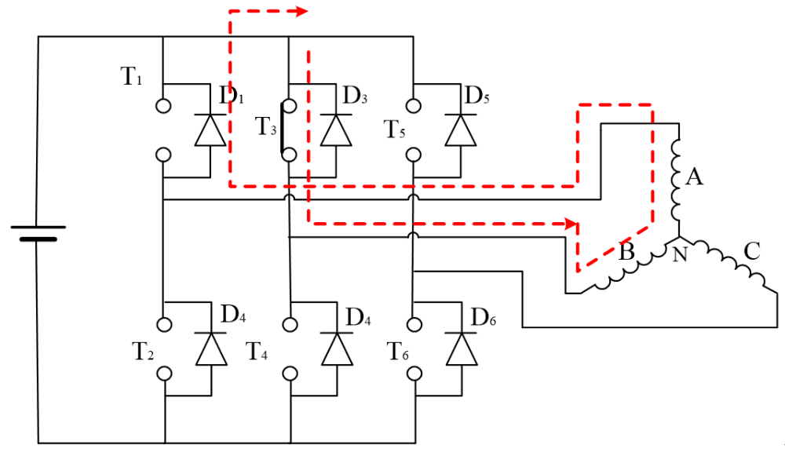
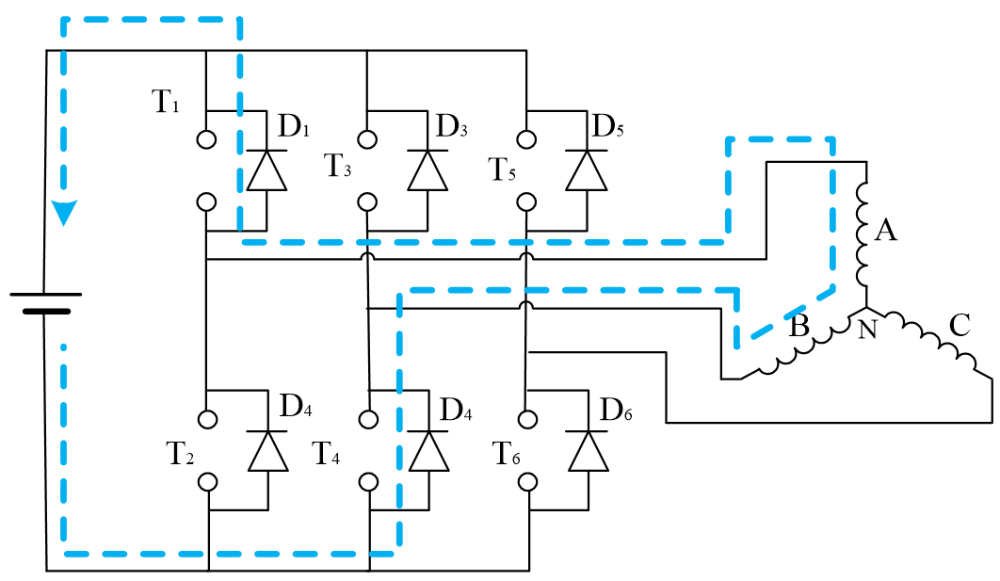
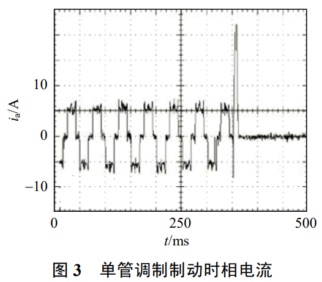
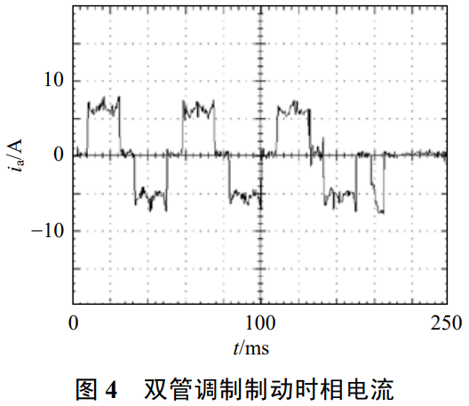

# BLDC电机刹车谜案：是谁在PWM关断的瞬间，引爆了电流炸弹？

原创 傅存敬 电磁散人 2025-10-21 07:06 广东

> 原文地址: [https://mp.weixin.qq.com/s/tzNzFZ0DDhNpaxffL5zeIQ](https://mp.weixin.qq.com/s/tzNzFZ0DDhNpaxffL5zeIQ)

咱们今天要解决一个在电机控制界堪称“史诗级灾难”的大难题！想象一下，你开着一辆电动车，前面突然出现一个障碍物，你猛踩刹车！结果呢？车没停下来，反而“砰”的一声，控制器烧了！你说这吓不吓人？

这就是很多新手工程师都会遇到的“反接制动，原地爆炸”问题！反接制动，本来是想让电机用最猛的力气停下来，结果力气使得太大，把自己给“憋”出内伤了。

今天，咱们就来解剖一篇专门给这个“翻车现场”做“事故分析报告”的经典论文，看看这车到底是怎么翻的，以及老司机们是如何做到既能一脚刹死，又不伤车分毫的！

好了，安全带系好！咱们马上进入事故现场！

第一章：事故现场勘查——两种刹车方案

首先，咱们要知道，BLDC电机刹车主要有两种功夫：

1.  发电制动：像个太极宗师，把机械能变成电，慢慢存回电池里。温柔，但不够猛。
    
2.  反接制动 (Plugging Braking)：像个拼命三郎，电池不但不充电，还反过来使劲，跟电机转动的劲儿对着干！力道最猛，刹车最快，但极其危险！
    

今天这篇论文，就专治这个最猛也最危险的“拼命三郎”——反接制动。

请全体同仁，目光锁定这张案发现场的“电路图”：

这就是咱们的“战场”！一个标准的三相全桥电路。想让它刹车，就得给它反向的驱动信号。按理说，我用PWM波控制开关管的开关时间，不就能控制电流大小了吗？

作者说：天真！问题就出在你的PWM调制方法上！

第二章：事故原因分析——“单管调制”的致命缺陷

当时，很多工程师为了省事，都用一种叫“[单管调制](https://mp.weixin.qq.com/s?__biz=MzE5MTYzNjgzOA==&mid=2247483913&idx=1&sn=4da11a44d0628e7464cc99d31ed3003c&scene=21#wechat_redirect)”的方法。什么意思呢？就是在一个工作状态下，6个开关管里，只有一个“倒霉蛋”在那儿疯狂地开关（PWM），另一个配合它的兄弟就一直躺平（常通）。

这在正转驱动时，岁月静好。可一旦到了反接制动，就酿成了大祸！

我们来看案发瞬间到底发生了什么。假设现在要刹车，我们让T2管进行PWM调制，T3管常通。

-   PWM ON (T2开，T3开)：
    
    电流从电池出来，经过T3，流过电机，再经过T2，回到电池。电池电压和反电动势E是同方向的，一起推着电流往上涨。没毛病。
    
-   PWM OFF (T2关，T3开)：
    
    灾难降临了！T2管一关，电流走投无路，只能从上面的二极管D1续流。但是别忘了，T3管这个“躺平的兄弟”还通着呢！于是，电流形成了一个“D1 -> T3 -> B相 -> A相 -> D1”的内部短路循环！
    

请看这张“犯罪路径图”！

单管调制时，PWM OFF阶段形成的“反电动势短路循环”

看到了吗？问题来了！

在这个小圈圈里，电池已经被踢出局了，只剩下电机自己的反电动势E在当老大。它就像一个永不枯竭的电源，在这个短路回路里，疯狂地、不受任何控制地把电流往上推！

你想用PWM把电流降下来，结果在PWM的OFF阶段，电流反而自己在那儿“嗨”起来了！你踩的哪里是“刹车”，简直是“油门”！电流能不失控吗？能不爆炸吗？

这就是事故的根本原因：单管调制，在PWM关断期间，会形成“反电动势短接回路”，导致再生电流彻底失控。

第三章：老司机的神操作——“双管调制”的力挽狂狂澜

既然知道了问题所在，解决方案就呼之欲出了。那个“躺平的兄弟”（T3管）不是罪魁祸首吗？行，不让你躺了，你也给我起来干活！

这就是作者提出的“[双管调制](https://mp.weixin.qq.com/s?__biz=MzE5MTYzNjgzOA==&mid=2247483913&idx=1&sn=4da11a44d0628e7464cc99d31ed3003c&scene=21#wechat_redirect)”！

定义：配合工作的上下两个管子（比如T2和T3），不再是一个斩波一个躺平，而是俩人一起斩波！用同一个PWM信号，同开同关！

我们再来看一下，“双管调制”下的PWM OFF阶段发生了什么：

PWM OFF (T2和T3同时关)：现在，T3也被关断了，那个可怕的内部短路小圈圈被彻底斩断了！电流无处可去，只能乖乖地从A相出来，经过D1，流回电池正极，再从电池负极出来，经过D4，流回B相。

请看这张“救援成功图”！

双管调制时，PWM OFF阶段形成“反向续流回路”

转机出现了！

在这个新的续流路径里，电池电压Ud和反电动势E不再是同伙了，而是变成了死对头！E想让电流继续流，Ud拼命地把它往回顶！

Ud的力量远大于E，所以在这个阶段，电流会被迅速地压制下去！

于是，一个完美的控制闭环形成了：

-   PWM ON：我让电流涨。
    
-   PWM OFF：我让电流跌。
    

这一涨一跌，尽在掌握！电流就像被拴上了链子的猛兽，收放自如。我们终于可以安心地大力刹车了！

请看这两张至关重要的“现场对比图”——图3和图4！

-   图3：这是“单管调制”的“事故录像”。电流像脱缰的野马，瞬间就冲破了±10A的量程，彻底失控！
    
-   图4：这是“双管调制”的“教科书式操作”。电流被牢牢地摁在了±7A左右，波形平稳，一切尽在掌握！
    

第四章：捎带脚的“小插曲”——[加速退磁技术](https://mp.weixin.qq.com/s?__biz=MzE5MTYzNjgzOA==&mid=2247483866&idx=1&sn=a6dbacab3d7f576680fd0f5f2e484058&scene=21#wechat_redirect)

讲到这里，有同仁可能会联想到我之前提到的另一个技术，就是“[加速退磁](https://mp.weixin.qq.com/s?__biz=MzE5MTYzNjgzOA==&mid=2247483866&idx=1&sn=a6dbacab3d7f576680fd0f5f2e484058&scene=21#wechat_redirect)”，或者叫“[主动续流](https://mp.weixin.qq.com/s?__biz=MzE5MTYzNjgzOA==&mid=2247483866&idx=1&sn=a6dbacab3d7f576680fd0f5f2e484058&scene=21#wechat_redirect)”技术。

那个技术是干嘛的呢？简单说，就是电机在正常转动时，每次换相的瞬间，为了不让上一相的“电流尾巴”（续流）挡住下一相的“路”（过零点检测），我们也需要用一些技巧，在那个即将关断的相上施加一个反向电压，让它的电流尾巴“嗖”地一下消失。

你看，它也用到了“施加反向电压”这一招！

-   加速退磁：是在正常驱动时，为了换相更顺滑，在换相瞬间对单个悬空相使用的“微操”技术。
    
-   反接制动：是在专门制动时，为了让车停下来，对整个导通回路使用的“宏观”控制策略。
    

它俩的关系，就像是“外科手术刀”和“消防高压水枪”。虽然都能用来“切割”，但一个用在精细的缝合手术上，一个用在宏大的救火现场。你不能说它们是同一个东西，但你必须承认，它们都利用了“切割”这个底层原理。

最终章：从“事故报告”到“安全手册”

最后，作者还贴心地研究了换相时的“顿挫感”（转矩脉动）问题。他通过一堆复杂的公式（公式5-13）推导出：在换相的瞬间，只要我们根据当前转速，精确地调整一下PWM占空比D，就能让整个刹车过程如丝般顺滑，毫无顿挫。

所以，这篇论文最终给我们的“安全操作手册”就是：

制动策略

能否控制电流？

能否安全换相？

有无转矩脉动？

单管调制

否！（自爆卡车）

受限制

是！

双管调制

能！（F1赛车）

能！

（通过调D）否！

结论：

本次分享，我们通过一篇经典的“事故分析报告”，彻底搞明白了反接制动中电流失控的物理真相。记住，当你遇到一个看似无法控制的系统时，不要害怕，静下心来，画出它在每个状态下的等效电路图，看看电流到底在跟谁“玩”，是谁在背后“使坏”。

就像这篇论文一样，一旦你揪出了那个“躺平的兄弟”（常通管）和它所形成的“反电动势短路小圈圈”，那么，破局之法，自然就在眼前了！

好了，今天的翻车救援到此结束！希望大家以后都能成为百战百胜的“老司机”！

参考文献：

\[1\]胡庆波,郑继文,吕征宇.混合动力中无刷直流电机反接制动PWM调制方式的研究\[J\].中国电机工程学报, 2007, 27(30):5.DOI:10.3321/j.issn:0258-8013.2007.30.016.

文档链接：https://pan.baidu.com/s/1\_6MqKtDKuYxU3k64iJDv5A?pwd=5jgd 提取码: 5jgd