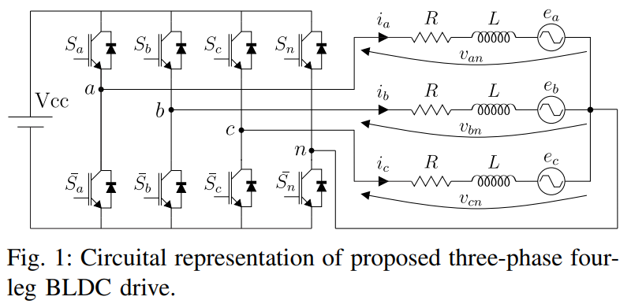
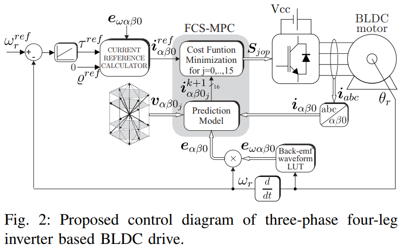
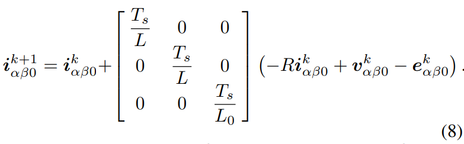
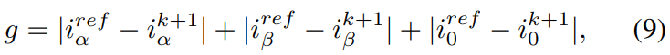
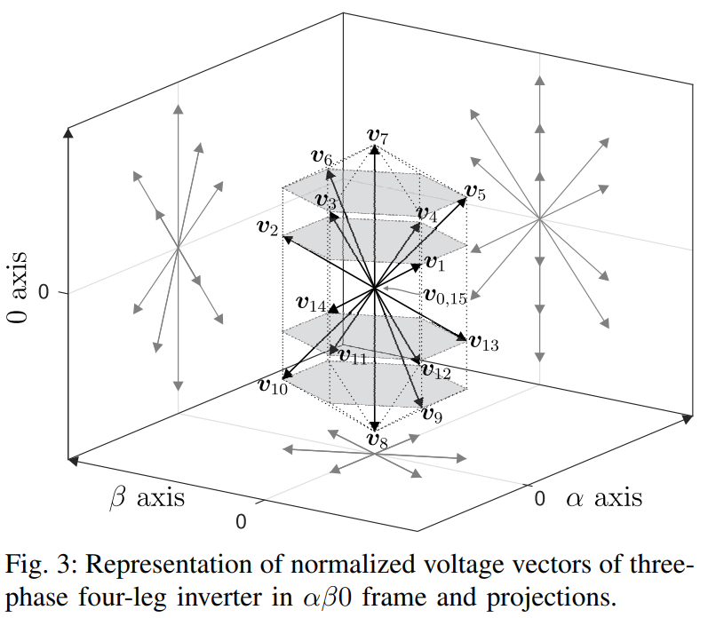
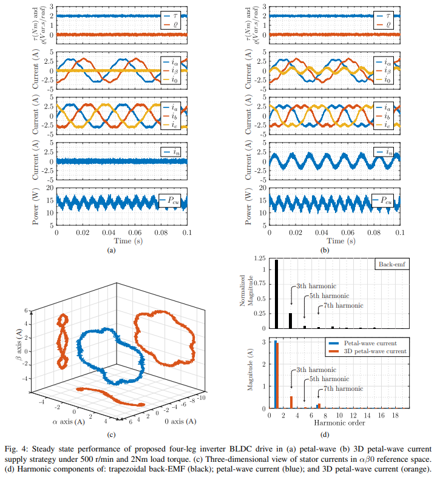
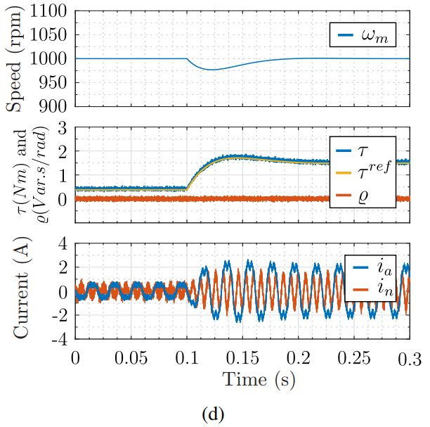

# BLDC电机控制器的“三维坦途”：从FOC的二维枷锁到MPC的软硬件协同革命

原创 傅存敬 电磁散人 2025-10-09 07:05 广东

> 原文地址: [https://mp.weixin.qq.com/s/f2haevWBsEpKXqKX-y1bsw](https://mp.weixin.qq.com/s/f2haevWBsEpKXqKX-y1bsw)

在上一篇文章中，咱们介绍了一本绝世武功秘籍——“[3D](https://mp.weixin.qq.com/s?__biz=MzE5MTYzNjgzOA==&mid=2247484244&idx=1&sn=b29e3a09ee241a2165c7c01ee4a66a3e&scene=21#wechat_redirect)[瓣波电流](https://mp.weixin.qq.com/s?__biz=MzE5MTYzNjgzOA==&mid=2247484244&idx=1&sn=b29e3a09ee241a2165c7c01ee4a66a3e&scene=21#wechat_redirect)”，它能让我们的BLDC电机变得又猛又省电。但是，光有秘籍不行啊，你得有合适的“兵器”和“心法”才能把它练成，对不对？今天这篇论文的第二部分（Part II），就是告诉我们怎么把这门神功，真真正正地练出来！

这就像什么呢？好比咱们知道了一个能让汽车百公里油耗从8升降到6升的“黄金右脚”踩油门大法。但问题是，我们得造一个什么样的油门踏板和发动机电脑（ECU），才能让普通人也能踩出这个效果呢？

第一幕：神功虽好，兵器难寻

我们上篇文章中介绍的神功秘籍“[3D](https://mp.weixin.qq.com/s?__biz=MzE5MTYzNjgzOA==&mid=2247484244&idx=1&sn=b29e3a09ee241a2165c7c01ee4a66a3e&scene=21#wechat_redirect)[瓣波电流](https://mp.weixin.qq.com/s?__biz=MzE5MTYzNjgzOA==&mid=2247484244&idx=1&sn=b29e3a09ee241a2165c7c01ee4a66a3e&scene=21#wechat_redirect)”，最关键的是什么？是要控制一个隐藏的维度——零序电流i₀。

这就好比，我们推秋千，不仅要前后推（αβ电流），还要精准地去踩那个松动的底座（零序电流）。但是，我们常规的电机控制器，是个三相三桥臂逆变器，它只有三只手，分别去推电机的A、B、C三相。这三只手的力气加起来（ia+ib+ic），永远等于零。这就意味着，它天生就没有第四只“脚”去踩那个底座！所以，常规的兵器，练不了这门神功。

怎么办？作者说：别急！没有兵器，咱们就造一个！

第二幕：打造专属神兵——“四桥臂逆变器”！

作者们提出的解决方案，简单粗暴又非常有效：给控制器再加一只“手”，或者说，一只“脚”！这就是图1里画的“三相四桥臂逆变器”。

你看，除了控制 Sa, Sb, Sc三个常规的“手”之外，我们多了一个第四个桥臂Sn！这只“脚”专门连到电机三相绕组的中心点 n 上。

这只“脚”有什么用？它可以独立地控制中性点的电压，从而创造出一个让零序电流i₀自由流动的通路！

打个比方：这就好比我们给秋千系统装了一个液压升降台，通过控制这个升降台，我们就能精准地控制踩底座的那个节奏和力道了！

有了这件神兵，我们硬件上的问题就解决了。现在，我们来看看更关键的“心法”——控制算法。

第三幕：修炼预测神功——FCS-MPC

我们的目标是让电机的实际电流，完美地变成我们想要的那个复杂的“3D瓣波”形状。这可不是简单的PI控制能干好的活。作者们采用了一种更高级、更“智能”的算法，叫做有限控制集模型预测控制（Finite Control-Set Model Predictive Control, FCS-MPC）。

听着名字很吓人是不是？别怕，我给大家翻译成人话。这套算法的逻辑，就像一个超级聪明的围棋大师下棋，它每走一步之前，都会思考一件事：“如果我下一步走在这里，会发生什么？”

你看图2这个控制框图，核心就是那个 FCS-MPC 模块。

它的工作流程是这样的：

1.  “算” (Prediction)：在每个极短的瞬间（比如25微秒），它会想：“我的‘四桥臂’神兵总共有2⁴ = 16种出招方式（开关组合）。如果我用第一招，下一个瞬间电流会变成什么样？如果用第二招呢？...”，它会一口气把16种未来的可能性全都算出来！这个计算的依据，就是原文的公式(8)，一个描述电机行为的数学模型。
    
    
    
2.  “比” (Evaluation)：算出来16个“未来”之后，它会把每一个“未来”的电流，都跟我们心中最完美的那个“3D瓣波”目标电流（iref）去比较。谁离目标最近，谁的“误差”最小，谁就是最好的选择。这个比较的过程，用的就是原文的公式(9)，我们叫它成本函数 g。
    
    
    
    这个公式太直白了，就是计算预测电流和目标电流在三个维度上的误差绝对值之和。g越小，说明这一招打出去，效果越接近完美。
    
3.  “选” (Selection)：从16个“未来”里，选出那个让成本函数 g 最小的“最优招式”。
    
4.  “发” (Actuation)：确认好后，二话不说，立刻执行这一招！
    

这个“算\-比\-选\-发”的过程，每秒钟要重复几万次！就像一个不知疲倦的绝世高手，在每一个瞬间都做出了最优的决策，逼着电机的电流，死死地跟住我们设定的那个完美轨迹。

你看图3，这就是那16种招式（电压矢量）在三维空间中的分布，像一个晶体一样。FCS-MPC算法的本质，就是在每一个瞬间，从这16个点里，选一个最合适的来“推”一下电流，让它往目标方向走。

第四幕：神功练成，效果如何？

理论和方法都有了，那效果到底怎么样？作者用仿真模拟了真实情况。

1. 稳态下的“绣花功夫”

看图4(b)，这简直就是艺术品！最上面是转矩τ，你看它几乎是一条直线，非常平滑！中间是三维电流iα, iβ, i₀，它们都呈现出理论预测的那种复杂的周期性波动。最关键的是零序电流i₀，它不再是0了，而是被精确地控制成了一个特定的波形。

再看图4(c)，这是电流在三维空间中跑出来的真实轨迹。橙色的轨迹，是不是跟我们上节课看到的那个理论上的“[三维灵蛇](https://mp.weixin.qq.com/s?__biz=MzE5MTYzNjgzOA==&mid=2247484244&idx=1&sn=b29e3a09ee241a2165c7c01ee4a66a3e&scene=21#wechat_redirect)”一模一样？这说明，我们的“神兵”和“心法”配合得天衣无缝，完美复现了理论！

最后看图4(d)的谐波分析，橙色的“3D瓣波电流”里，不仅有5次和7次谐波，最重要的是，它成功注入了大量的3次谐波！这就是我们从零序维度里榨取能量的关键！

2. 动态下的“凌波微步”

光稳不行，还得快！作者模拟了负载突然增加的情况，你看图5(d)。

当负载转矩T在0.1秒时突然跳变，我们的控制系统反应极快，几乎是瞬间就调整了电流输出来顶住负载，而整个过程转速ωm的波动非常小。这说明什么？说明我们这套复杂的控制系统，不仅“稳如老狗”，而且“动如脱兔”，动态性能一点没打折扣！

总结一下

好了，今天跟大家分享的文献，让我想到，一个伟大的[理论创新（](https://mp.weixin.qq.com/s?__biz=MzE5MTYzNjgzOA==&mid=2247484244&idx=1&sn=b29e3a09ee241a2165c7c01ee4a66a3e&scene=21#wechat_redirect)[Part I](https://mp.weixin.qq.com/s?__biz=MzE5MTYzNjgzOA==&mid=2247484244&idx=1&sn=b29e3a09ee241a2165c7c01ee4a66a3e&scene=21#wechat_redirect)[）](https://mp.weixin.qq.com/s?__biz=MzE5MTYzNjgzOA==&mid=2247484244&idx=1&sn=b29e3a09ee241a2165c7c01ee4a66a3e&scene=21#wechat_redirect)要真正落地，往往需要硬件（神兵）和软件（心法）的双重突破。

-   硬件上，我们用“四桥臂逆变器”这件专属神兵，打通了控制零序电流的“任督二脉”。
    
-   软件上，我们用FCS-MPC这套预测神功，像一位围棋大师一样，在每个瞬间都做出最优决策，实现了对复杂电流的精准追踪。
    

最终，理论变成了现实，我们得到了一个转矩平滑、效率更高、响应还飞快的超高性能电机驱动系统。这个系统，就是我们未来无人机、电动车、工业机器人里那颗更强大的“心脏”！

所以说，工程的魅力就在于，它不仅是天马行空的理论，更是脚踏实地的创造！

  

参考文献

\[1\] Castro A G D , Guazzelli P R U , Santos S T C A D ,et al.Zero Sequence Power Contribution on BLDC Motor Drives. Part II: A FCS-MPC Current Control of Three-Phase Four-Leg Inverter Based Drive\[C\]//2018 13th IEEE International Conference on Industry Applications (INDUSCON).IEEE, 2018.DOI:10.1109/INDUSCON.2018.8627310.

文档链接：https://pan.baidu.com/s/1Jp1wDDJ28kbU2BGSYa-swg?pwd=9pxg 提取码: 9pxg