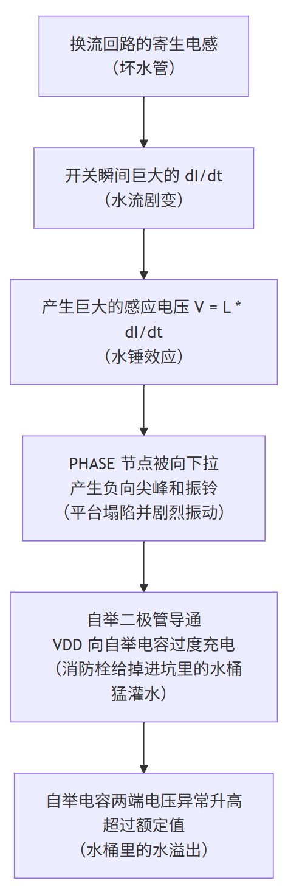
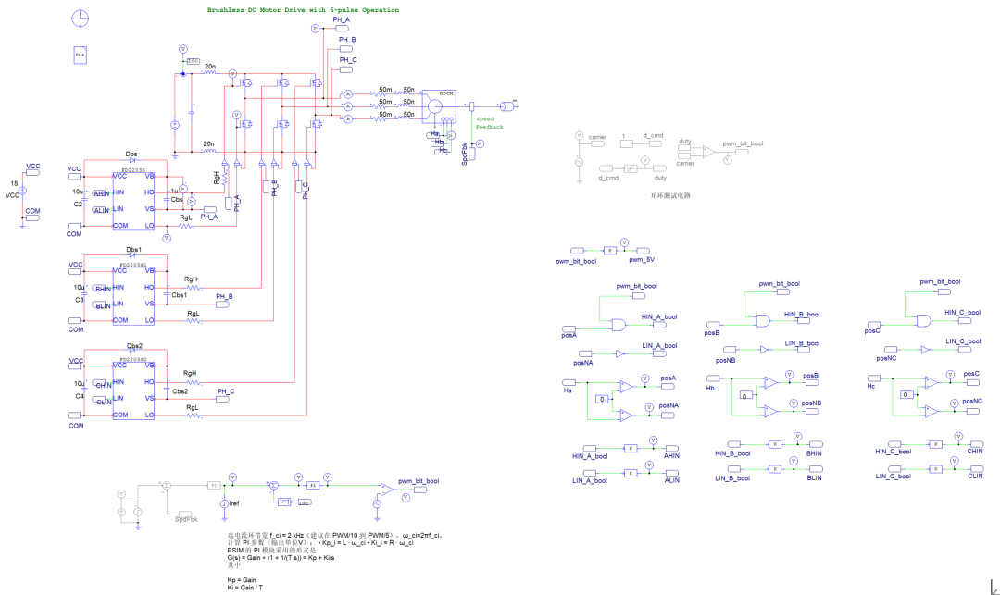
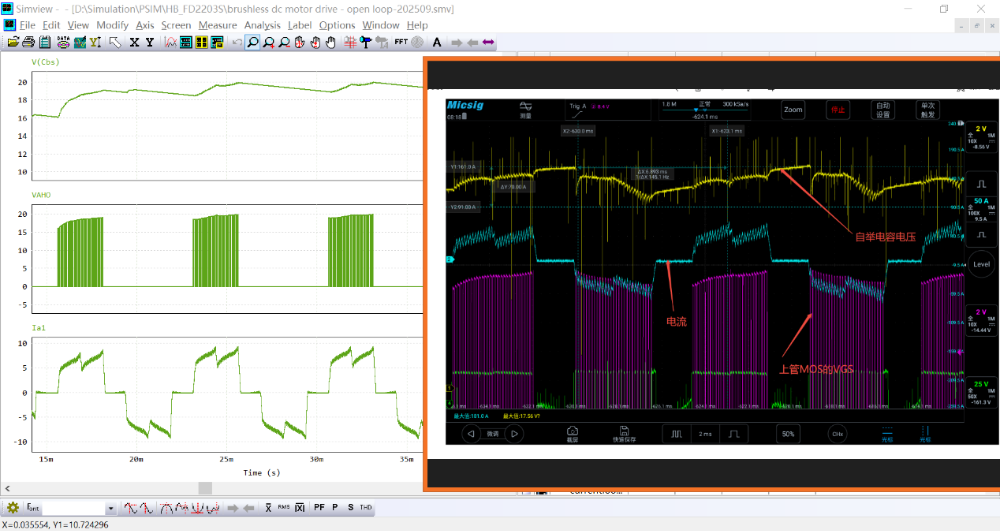
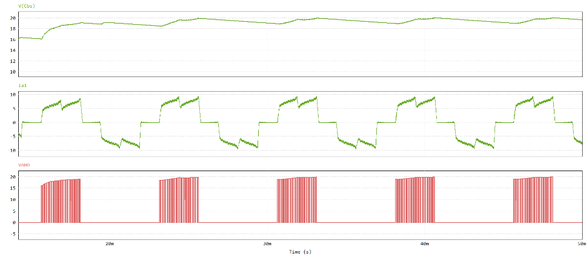

# BLDC电机控制器自举电容电压泵升暂态分析

原创 傅存敬 电磁散人 2025-09-23 19:34 广东

> 原文地址: [https://mp.weixin.qq.com/s/jQnNPQUqrs13cwWnsoCOoQ](https://mp.weixin.qq.com/s/jQnNPQUqrs13cwWnsoCOoQ)

上篇文章讲解了BLDC电机控制器用MOSFET的驱动IC上，自举电容[电压泵升](https://mp.weixin.qq.com/s?__biz=MzE5MTYzNjgzOA==&mid=2247484026&idx=1&sn=e596b36d98e6b58a5b22e6ce4ecc32b5&scene=21#wechat_redirect)的原因及应对措施，但仍有同仁心存疑问——这个异常泵升现象是发生在自举电容上的，为什么核心原因却是（寄生）电感引起的呢？——根据上一次的讲解，这个电压异常泵升发生在从“总水库”（输入电容）到上管，再到下管，最后回到总水库的这个“高频换流回路”，也就是水流变化最剧烈的地方，是寄生电感引起的。

我们继续用“机器人、平台和水管”的比喻，把这个“为什么是别处的管子漏水，却是我家水桶满了”的问题彻底搞明白。

问题核心：为什么是“换流回路（水管）”的特性，决定了“自举电容（小水桶）”的水位？

想象一下我们那个不稳定的平台（PHASE节点）。它不是一块坚实的钢板，而是一块有弹性的“蹦床”。

-   平时：当大电流平稳流过时，蹦床被压得稍微有点下陷，但还算平稳。
    
-   开关瞬间：电流要突然中断或反向，这就像一个体重200斤的胖子，在蹦床上猛地起跳！
    

你猜会发生什么？

蹦床不仅会向上弹，更会因为反作用力，先被猛地向下拉，形成一个深深的凹陷，然后才剧烈地上下振动！

这个“深深的凹陷”，就是PHASE节点的负向电压尖峰。而造成这个“蹦床效应”的罪魁祸首，正是那些“又长又细又拐弯的水管”——也就是高频换流回路的寄生电感。

电感：惯性的“化身”

电感这个东西，在电路里扮演的角色就是“惯性”。它极度讨厌电流发生变化。

-   你让电流增大，它会产生一个反向的电压，拼命抵抗电流增大。
    
-   你让电流减小，它会产生一个同向的电压，拼命维持电流不变。
    

这个“反抗”的激烈程度，可以用物理公式 V = L \* (dI/dt) 来描述。

-   L 是电感量，可以理解为“惯性的大小”（水管越长越细，惯性越大）。
    
-   dI/dt是电流变化的速度，可以理解为“变化的剧烈程度”（胖子跳得越高、越快）。
    

连接到开头的问题：换流回路如何让平台“塌陷”？

让我们回到开关切换的那个惊心动魄的瞬间，特别是下管关断、上管导通的时候：

1.  初始状态：下管的体二极管正导通着一个不小的电流（比如电感续流）。电流方向是从地（GND）流向PHASE平台。
    
2.  切换开始：上管突然导通！高压的 IBUS+ 电源，要建立一条“从上到下”的新路径。这时，下管的体二极管必须立刻关断。
    
3.  “水管惯性”大爆发（dI/dt巨大）：
    
    ● 下管体二极管里的电流，要从一个正值，在几十纳秒内，急速地变为一个很大的负值（反向恢复电流Irr），然后再变为零。这个dI/dt是整个电路中最剧烈的变化之一！
    
    ● 这个剧烈变化的电流，流经了我们说的那个“高频换流回路”：从输入电容出来，经过上管，流到PHASE平台，再穿过下管到地，最后返回输入电容。
    
    ● 这个回路上的所有“水管”（寄生电感Lloop）都极度痛恨这个变化！它们会联合起来，产生一个巨大的反抗电压 V = Lloop \* (dI/dt)。
    
4.  平台“塌陷”：
    
    ● 这个反抗电压的方向，正好是把PHASE平台猛地向下拉！
    
    ● 你想，本来平台准备从0V往上升，结果被这个巨大的“惯性反作用力”拽了一下，瞬间掉进了地底下，变成了 -5V。
    
    ● 这个“塌陷”就是我们看到的 PHASE节点的负向振铃。
    

临门一脚：平台塌陷了，我的小水桶（自举电容）怎么就满了？

现在，画面回到机器人和他的小水桶（自举电容CBOOT）这里：

-   小水桶的底部就放在PHASE这个“蹦床”上。
    
-   小水桶的顶部通过一个“单向阀”（自举二极管）连着一个固定高度为8V的消防栓（VDD电源）。
    

当平台（蹦床）突然“塌陷”到\-5V时：

-   水桶底部跟着掉到了\-5V。
    
-   水桶顶部的消防栓还在+8V。
    
-   于是，消防栓和水桶顶部之间产生了 8V - VBOOT的压差。但更重要的是，因为底部在\-5V，整个水桶被“拽”下去了，顶部和底部之间的压差可以被快速改变。
    
-   关键是单向阀！消防栓的水压（+8V）远远高于水桶顶部被拉低后的电压，于是阀门大开，水（电荷）疯狂涌入水桶。直到水桶顶部被重新抬到接近+8V。
    
-   此时，水桶里的水位差就变成了：顶部(+8V) - 底部(-5V) = 13V！
    

看！这就是“泵升”！别人的“水管”设计不好，导致平台（PHASE）剧烈震动塌陷，结果你放在平台上的“小水桶”（自举电容）却被意外地灌满了水！

结论

所以，你看，整个逻辑链是这样的：

  

因此，虽然异常现象发生在自举电容上，但它的根因却是发生在高频换流回路中的寄生电感。我们解决问题的思路，就是要追本溯源，去优化那个“换流回路”，而不是只盯着“自举电容”本身。

希望这个更进一步的比喻，能让大家彻底理解这个“隔山打牛”的奇妙物理过程！怎么样，这回是不是感觉豁然开朗了？

  

附记：

使用仿真软件PSIM，可以快速且清晰地复现这个过程。在仿真模型中，在母线的正回路和负回路中，加入了20nH的寄生电感；BLDC电机的三相绕组线上加入了50mΩ和50nH的电阻电感串联，用于模拟接触电阻、导线电阻和控制器引线的寄生电感。MOSFET电动驱动IC选用了国产（峰岹）的FD2203S，自举电容选用了105（1uF）。

