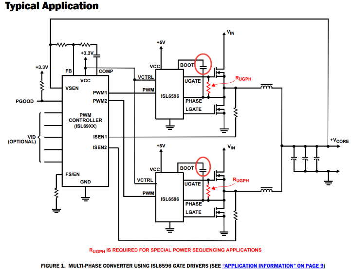
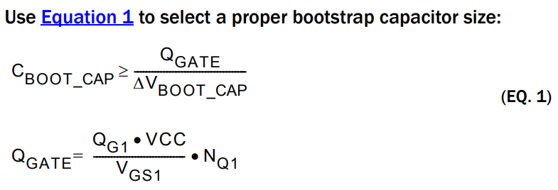
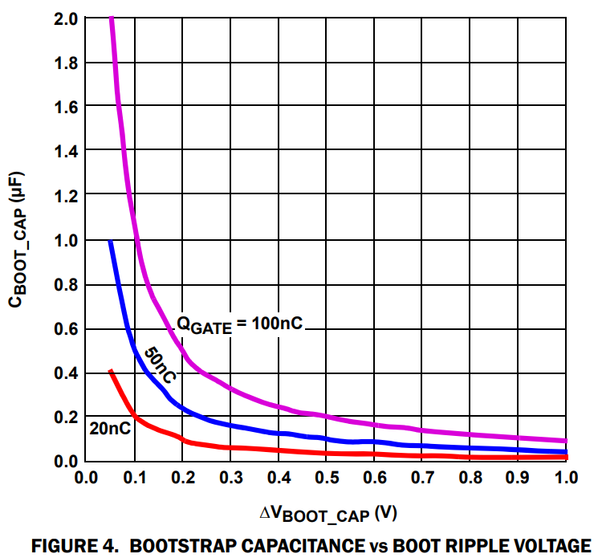
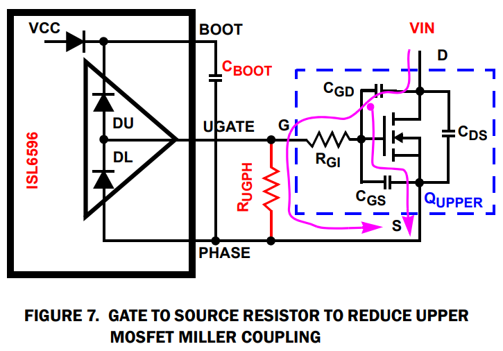
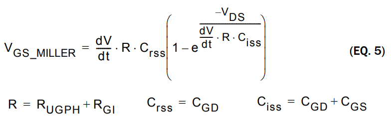
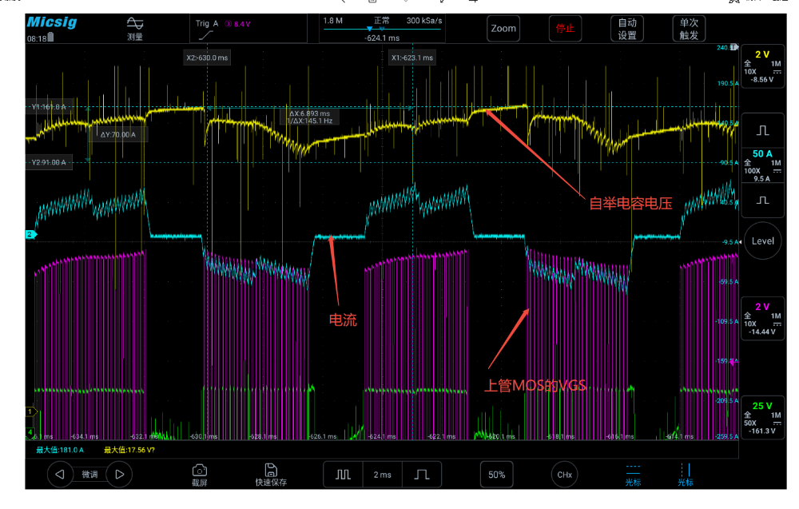

# BLDC电机控制电路自举电容电压泵升原因分析及对策

原创 傅存敬 电磁散人 2025-09-22 22:02 广东

> 原文地址: [https://mp.weixin.qq.com/s/e3g6VwVO-mz\_NZPAmcMrhw](https://mp.weixin.qq.com/s/e3g6VwVO-mz_NZPAmcMrhw)

今天咱们不讲黑洞，也不聊相对论，我们来聊一个方波BLDC电机控制里特别有意思的话题。文末提供了一份芯片的技术文档，叫 ISL6596。这是一个“MOSFET驱动器”，听着很专业是吧？别怕，咱们把它想象成一个能快速开关“电子水龙头”（MOSFET）的智能机器人。

咱们要解决的问题是：这个机器人用一个小水桶（自举电容）给自己“增高”，好去够到高处的水龙头开关，但有时候这个小水桶里的水会莫名其妙地“溢出来”（电压过高），差点把机器人自己给“电”坏了。这是为什么呢？又该怎么办？今天就带大家用形象的比喻，把这个好玩又重要的问题弄得明明白白！

第一步：小水桶（自举电容）是怎么工作的？

首先，我们得知道这个“小水桶”是干啥的。这个机器人的任务是开关两个水龙头，一个在高处（上管MOSFET），一个在低处（下管MOSFET），它们交替开关。

-   开关低处的水龙头很简单，机器人站在地上（GND）就能够到。
    
-   但要开关高处的水龙头，它就得想办法“上楼”。这个楼，就是由水流冲出来的平台，我们叫它PHASE节点。平台的高度一会儿是0（下管开与GND联通），一会儿是几十伏（上管开与负载的节点PHASE联通）。
    

机器人要站在这个不稳定的平台上，再去够到比平台还高的开关（上管的栅极），它怎么办呢？它很聪明，带了个“小水桶”，也就是我们的主角——自举电容。

我们来看文档里的这张核心电路图：

大家看，那个红色椭圆圈起来的电容，就是我们的小水桶（自举电容）。它的工作流程是这样的：

1.  趁平台在低处时打水：当下管开通，PHASE平台降到地面高度时，机器人赶紧从一个固定高度为5V的水龙头（VCC）给小水桶打满水。
    
2.  站在水桶上开高处开关：当上管需要开通，PHASE平台被抬高时，机器人就站到这个装满5V“水”的水桶上。这样，相对于不稳定的平台，它就高出了5V，正好能够到高处的开关！
    

这个小水桶要多大才合适呢？文档里给出了一个核心计算公式：     

     

这个公式告诉我们：水桶的容积 CBOOT\_CAP，必须大于等于开一次高处水龙头需要的“水量”QGATE，除以我们能容忍的水桶“水位下降”ΔVBOOT\_CAP。

咱们来算一道题，文档里举了个例子：假设高处的水龙头（上管MOSFET）需要 10nC 的“水量”（电荷QG1）才能在4.5V的“身高差”下打开，我们现在要并联两个这样的水龙头（NQ1\=2），机器人的供电是5V（VCC）。

1.  总需水量 QGATE = (10nC \* 5V / 4.5V) \* 2 ≈ 22.2nC。（和文档计算的22nC基本一致）
    
2.  选多大的桶：如果我们允许水位下降 0.2V（ΔVBOOT\_CAP\=0.2V），那么 CBOOT\_CAP≥ 22.2nC / 0.2V = 111nF，也就是0.111μF。所以我们选一个比它大的标准电容，比如0.22μF，就很稳妥。
    

为了更直观，文档还给了我们一张图，就像选水杯一样：

这张图告诉我们，对于一定的“需水量”（横轴QGATE），桶越大（CBOOT\_CAP不同曲线），水位下降（纵轴ΔVBOOT\_CAP）就越小。

第二步：为什么水会“溢出来”？（泵升机理）

好了，现在我们知道小水桶正常是怎么工作的。那为什么有时候水会自己变多，甚至溢出来呢？

关键在于：平台（PHASE节点）会“塌陷”！

当开关切换的瞬间，特别是下管关断、上管导通时，电路里那些看不见的“寄生电感”——可以想象成又长又细、还拐来拐去的水管——会捣乱。电流在这个水管里突然改变方向和大小，会产生一个巨大的“水锤效应”（电压尖峰）。这个效应会让PHASE平台不仅不会平稳地从0V升起，反而会瞬间向下“塌陷”出一个深坑，比如掉到 -5V！

这时候发生了什么？

1.  机器人站在地面上，小水桶的底部（PHASE）突然掉进了\-5V的深坑里。
    
2.  小水桶的顶部（BOOT）被一个“单向阀”（自举二极管）连着5V的水龙头（VCC），这个阀门只许水进不许水出。
    
3.  因为水桶底部掉得太低，顶部和5V水龙头之间产生了巨大的“压差”，于是大量的水（电荷）“duang”一下就冲进了水桶！
    
4.  原本水桶里只有5V的水，现在底部在\-5V，顶部被充到了+5V，里外里水位差一下子变成了 5V - (-5V) = 10V！
    
5.  等平台从坑里恢复正常时，这个10V的水位就留在了水桶里。这就叫“泵升”。
    

文末文档的“Absolute Maximum Ratings”里写的很清楚，BOOT到PHASE的电压差，直流不能超过7V，瞬时也不能超过9V。这一下泵到10V，机器人和小水桶是不是就很危险了？

第三步：如何防止平台“塌陷”？（应对措施）

既然知道了是平台“塌陷”搞的鬼，而塌陷又是那些“又长又细的水管”（寄生电感）引起的，那我们的解决方案就非常明确了：

核心思想：把水管换成又粗、又短、又直的！

文档在“Layout Considerations”和“MOSFET Selection”部分给了我们明确的指导：

1.  缩短关键路径：从“总水库”（输入电容）到上管，再到下管，最后回到总水库的这个“高频换流回路”，是水流变化最剧烈的地方。这个环路在PCB上的走线，一定要最短、最宽，环路面积要最小！这就相当于把细长的水管，换成了粗壮的管道。
    
2.  让上下水龙头靠得近一些：上管的源极和下管的漏极，就是PHASE平台的两个主要支点。它们在电路板上的物理距离要尽可能近，之间的连接要短而粗。平台小了，才不容易塌。
    
3.  选用“接口”好的水龙头：文档建议我们用低寄生电感的MOSFET封装，比如SO-8、LFPAK等。要避免用D-PAK这种像带着长长水管接口的封装。好的封装，相当于出厂就自带了短接口，能最大程度减少引入的“水管长度”。
    

一个额外的“保险措施”

文档还提到了一个在“启动时”可能发生的问题，虽然和我们讲的泵升不完全一样，但也是保护高处开关的重要措施。我们可以把它看成是给高处开关加一个“泄压阀”。

大家看，这个图里多了一个电阻 RUGPH，它连接了高处开关的控制端（UGATE）和平台（PHASE）。它的作用就像一个小的“泄压孔”。在系统刚上电，机器人还没开始工作时，如果外部总水源（VIN）突然来一股很猛的水流，可能会通过水龙头内部的“缝隙”（寄生电容CGD）意外把开关冲开。加上这个泄压孔，就能把这点意外的“水压”给放掉，保证安全。

文档里也给出了估算这个“耦合效应”的公式：

这个公式比较复杂，我们不用深究（如确实感兴趣，请留言申请讲解），只需要记住它的物理意义：它描述了外部电压的快速变化（dV/dt）如何通过内部电容（Crss）和电阻（R）引起开关意外开启的风险。加上这个RUGPH电阻，就是为了减小这个风险。

总结一下

今天我们通过“机器人”、“小水桶”、“平台”和“水管”的比喻，把ISL6596这个芯片里自举电容电压泵升的机理和对策讲清楚了。

-   机理：PHASE节点因为“寄生电感”（坏水管）的存在，在开关瞬间产生“负向塌陷”（掉进坑里），导致自举二极管给自举电容（小水桶）过度充电，形成“泵升”。
    
-   对策：核心就是减小寄生电感！通过优化PCB布局（缩短高频回路、减小环路面积），选用低感值封装的MOSFET，把“坏水管”换成“好管道”，从根源上防止平台塌陷。
    

你看，再复杂的工程问题，只要我们找到它背后的物理本质，用形象的思维模型去理解它，是不是就变得简单又有趣了？

  

附记：

实测自居电容电压泵升波形

文档链接：

https://pan.baidu.com/s/1nJeU3bTI4ZVyQrNJBhEa5Q?pwd=e3st 提取码: e3st