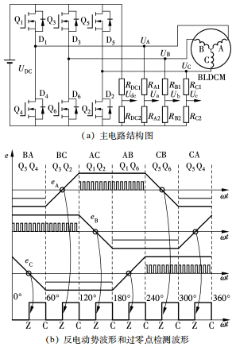
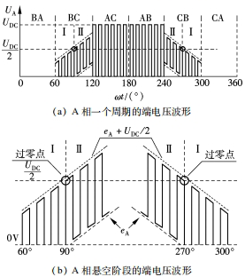
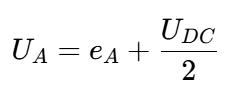
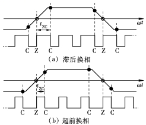
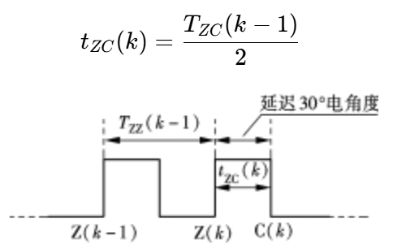
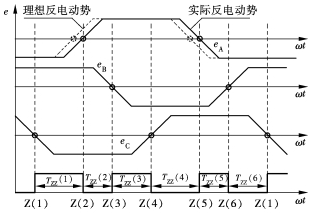
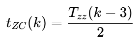
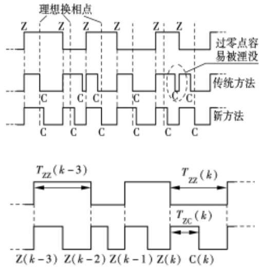
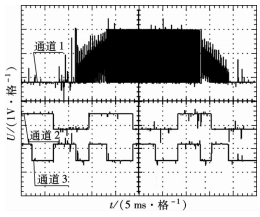

# BLDC电机无感方波控制：H\_PWM-L\_ON模式下的反电势过零点采样解析

原创 傅存敬 电磁散人 2025-09-10 23:47 广东

> 原文地址: [https://mp.weixin.qq.com/s/QLlhq9pBLN6HxSyizF2yeg](https://mp.weixin.qq.com/s/QLlhq9pBLN6HxSyizF2yeg)

一、问题的引出

前几期讨论了[PWM调制方式对BLDC电机无位置传感器控制的影响](https://mp.weixin.qq.com/s?__biz=MzE5MTYzNjgzOA==&mid=2247483913&idx=1&sn=4da11a44d0628e7464cc99d31ed3003c&scene=21#wechat_redirect)，市面上常见的上管PWM下管常通方案之所以流行，是因为它便于与常规硬件（如自举高边驱动、低边采样电阻、模拟地参考）配合，实现稳定、低成本、易于实现的过流保护和电流测量，并降低接地噪声。但是，甘蔗不能两头甜，这种方案也有不足，如对无感方波控制中的悬空相反电动势检测不友好，以及可能导致更大的自由续流路径损耗。

本文推荐一篇文献（文末标题及链接），讲清楚了如何在H\_PWM-L-ON的PWM调制方式下，进行准确换相。

关键规律：每次检测到这个反电动势 **过零点（Z点）后，再等30度电角度（相当于最佳“换挡”时机），就是电机该“换挡”（换相）的最佳时刻（C点）**。看下面图(b)里标注的Z点和C点，它们就像精准的时钟刻度。

二、**“抓零点”的独门绝技：直接端电压采样**

1.调制方式：

 参考文献中采用 **“上臂PWM忙活，下臂一直通”（H\_pwm-L\_on）**的“油门”控制策略（PWM调制）。想象上臂的开关在快速开关（PWM），下臂的开关一直开着。

2.采样时机：

在 **上臂PWM开关“刚关断那一瞬间”** （如下图(b)所示），去测量那个暂时“休息”的相（悬空相）的端电压（比如A相的UA），信号最干净，受开关干扰最小！这就好比在喧闹的课间突然安静的那一刹那，听清楚老师点名。

  

3.抓零点核心公式：

  

这个公式告诉我们：**在选定的采样时刻（PWM刚关断时），悬空相的端电压UA 等于它的反电动势 eA 加上直流总线电压 UDC的一半。**

  

**抓零点秘诀：** 当你测到UA 正好等于 UDC/2时，就意味着eA = 0！这就是我们梦寐以求的反电动势过零点（Z点）！就像看温度计，水银柱指到0度就是冰点。看上图(b)里BC区的II时段波形，是不是正好在 UDC/2上下波动？零点就在中间穿过。

  

4.硬件省钱大法：

只需要几个电阻分压，把高电压按比例缩小到芯片能测量的安全范围，不需要复杂的滤波电路，也不需要重建电机的“心脏”（中性点），成本大大降低！软件里做个小计算（判断UA是否等于UDC/2）就能抓到零点。

  

**三、“换挡”不准的烦恼：早换 vs 晚换**

抓住了零点（Z点），怎么确保30度后准时“换挡”（换相到C点）？这里有两个大麻烦：

  

1.“换挡”时机不对的恶果：

-   •
    
    **换早了（超前换相）：** 转子还没到位你就让它“转身”，相当于自行车没蹬到位就换挡，会“咔哒”一声，电机颤抖、力气（转矩）不稳。看下图左部分，端电压波形左侧被“吃掉”一部分。
    
-   •
    
    **换晚了（滞后换相）：** 转子都冲过头了你才让它“转身”，更糟糕！不仅颤抖，下次的零点（Z点）可能直接被淹没，导致电机彻底“迷路”（失步）。看下图右部分，端电压波形右侧被“吃掉”，甚至看不到下次过零点了！
    
-   
    
      
    
-   2.传统“等时差”法的局限：
    
    以前常用的方法是：**这次零点（Z(k)）到下次换相点（C(k)）的等待时间（`tZC(k)`），等于上一次零点间隔（Z(k-1)到Z(k)的时间 `TZC(k-1)`）的一半**。
    
-   
    
    这个方法在电机“呼吸均匀”（反电动势对称，零点间隔相等）时挺好用。但 **现实很骨感！** 电机做出来不可能完全对称，反电动势波形可能有点“歪”，导致 **相邻过零点之间的间隔时间（`Tzz`）并不相等！** 如果用老方法，在某些地方换相点就会严重偏离理想位置，特别是高速时容易丢零点、导致失步。
    

**四、破局妙招：“周期性等时差”换相法**

文献作者发现了新大陆！他们观察到，虽然相邻间隔不一样，但 **过零点间隔存在“周期性规律”**：**每相隔180度电角度（也就是同一相的下一个过零点），间隔时间是基本相同的！** 看下图，比如 `Tzz(1)`和 `Tzz(4)`就差不多相等。

**基于此，文献作者发明了新的“换挡”等待时间算法：**

**核心思想：** 当你抓住当前这个零点 `Z(k)`时，你不再看紧挨着的前一个间隔 `Tzz(k-1)`，而是**往回数三个，找到那个具有“周期性相似”的间隔 `Tzz(k-3)`，用它的一半时间作为等待时间**。

**为什么妙？**

1.  1.
    
    **利用周期性：**`Tzz(k-3)`和当前这个 `Z(k)`所属的波形段（比如都是A相上升沿或下降沿过零）在形态上是相似的，间隔时间也接近。
    
2.  2.
    
    **精准居中：** 这样算出来的换相点 `C(k)`会 **稳稳地落在前一个零点 `Z(k-1)`和当前零点 `Z(k)`的正中间位置**（如下图），这才是理论上的最佳换相点（距离前后零点各30度）！无论波形怎么歪，换相点都在中间，大大降低了丢零点和失步的风险。
    

**效果如何？看图说话！** 下图是实测的端电压波形。上面是用老方法（传统延迟），波形不对称，换相点（通道3的下降沿）偏离中心。**下面是用新方法（新延迟）**，波形明显对称多了，换相点稳稳地在两个过零点（通道2的上升沿和下降沿）中间！这就是精准换相的直观体现。

**五、总结：省钱又靠谱的“无感”驾驶方案**

总结一下这篇“武林秘籍”的精髓：

1.  1.
    
    **“抓零点”神技：** 在 **PWM刚关闭的瞬间（最佳时机）**，采样悬空相端电压 `UA`。利用 **核心公式 `UA = eA + UDC/2`**，当 `UA`测到等于 `UDC/2`时，就锁定了反电动势过零点（Z点）！**硬件简单（分压电阻就行），全靠软件计算，成本低。**
    
2.  2.
    
    **“换挡”不准的克星：** 传统等间隔延迟法（`tZC(k) = TZC(k-1)/2`）在波形“歪”时会失灵。文献作者发现了 **零点间隔的周期性规律**（`Tzz(k) ≈ Tzz(k-3)`）。
    
3.  3.
    
    **“周期性等时差”换相法：** 创新性地提出 **`tZC(k) = Tzz(k-3)/2`**。此招一出，换相点 **`C(k)`必落在 `Z(k-1)`和 `Z(k)`正中间**，真正实现**精准换相**！实测波形对称完美，电机运行平稳可靠，高速也不怕丢零点。
    
4.  4.
    
    **最终效果：** 实验充分验证，这套“**软件抓零点 + 周期性居中换相**”的组合拳，让无刷直流电机在 **没有位置传感器** 的情况下，实现了 **低成本、高精度的“无感”顺畅运行！**
    

技术的魅力就在于，用聪明的算法去弥补硬件的不足或者降低硬件的成本！这篇论文就是非常好的一个例子。希望通过本篇的讲解，能让大家对无刷电机的“隐形眼睛”和“精准换挡”有了更形象的理解！

  

参考文献：

\[1\]林明耀,周谷庆,刘文勇.基于直接反电动势法的无刷直流电机准确换相新方法\[J\].东南大学学报：自然科学版, 2010(1):6.DOI:10.3969/j.issn.1001-0505.2010.01.017.

  

链接: https://pan.baidu.com/s/1ssksJHQzPyllPld83vpp8A?pwd=86fc 提取码: 86fc