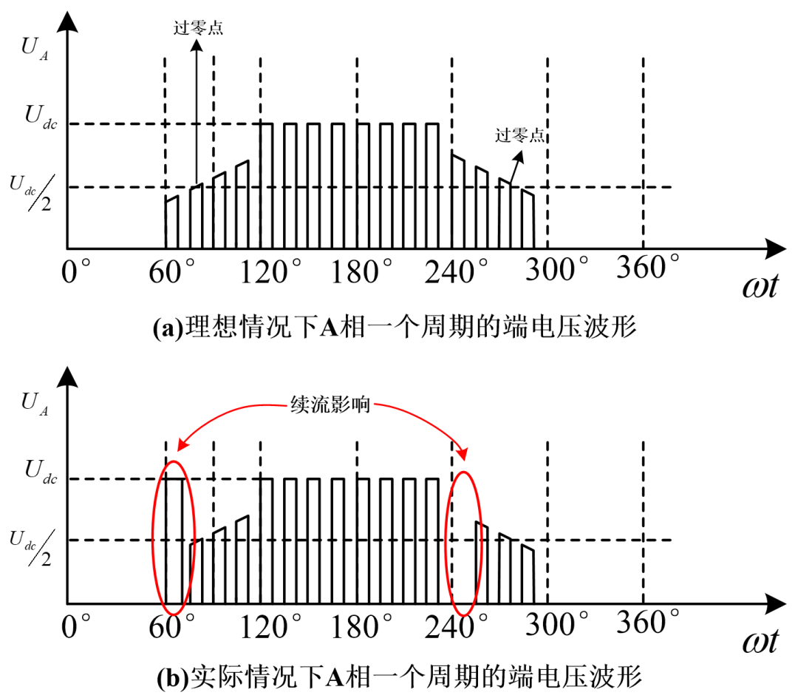
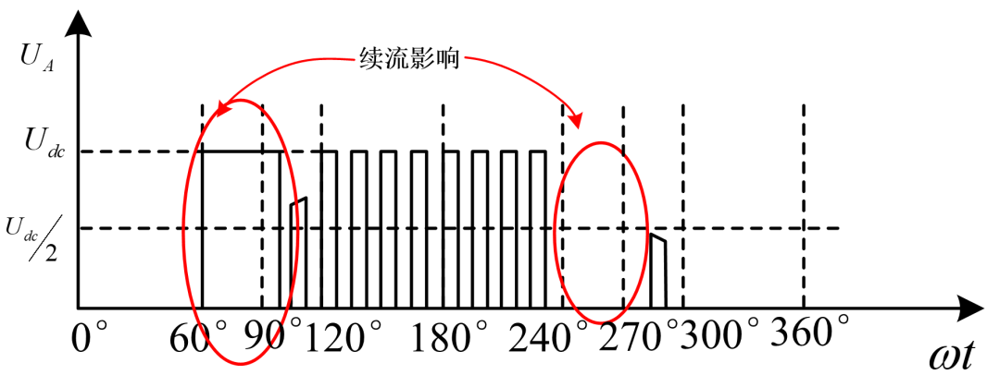

# 一种BLDC电机无感方波控制失效分析：因急加速造成的反电势过零点检测失效

原创 傅存敬 电磁散人 2025-09-09 22:01 广东

> 原文地址: [https://mp.weixin.qq.com/s/rN7CnqXfL0TyV5ZeqFULFQ](https://mp.weixin.qq.com/s/rN7CnqXfL0TyV5ZeqFULFQ)

假定阅读此篇文章的读者已具备了基于反电势过零点检测的无感方波BLDC电机控制的理论基础，仅分析在调试电机时会遇到的一种失效模式：电机急加速时造成了过零点检测失效。

先说造成该种失效的一种根因：急加速条件下导致PWM占空比剧增，绕组续流时间过长，湮没掉反电势过零点，致使换相失效。

  

01.原因分析

  

突然将转速（占空比）指令给到最（极）大，电机急速加速，会发生漏检或错检反电势过零点的情况，致使电机换相失败，进而引起大电流烧机。

以A相绕组端电压为例，如下图:

如图(b)所示，续流的影响会湮没掉过零点（续流时间超过30°/ω，ω为角速度，单位为rad/s），特别是在控制端电压的占空比急剧增加的情况下。如下图所示：

一旦过零点被湮没，造成过零点漏(错)检会导致电机错误换相，严重时产生大电流烧机。

  

02.解决方案

  

在控制算法中杜绝占空比剧增的情况。

-   如有PI调节的速度环，尽量将P参数调小，不允许有超调的情况出现；
    

-   将速度指令做平滑处理——即使用户在整机上电时直接给出了最大转速指令，驱动器也不允许突加最大占空比，而是要按照一定的加速度缓慢加速至指令转速;
    

-   提高过流保护的响应速度。
    

电机的急加速响应的快速性和稳定性是一对矛盾——为了让电机快速加速，需要突加很大的端电压，但端电压越大，续流时间就越长，长到可能会影响到电机可靠换相。