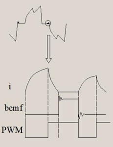
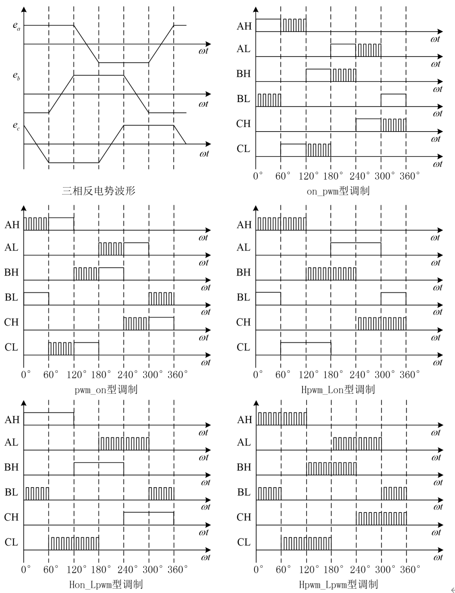
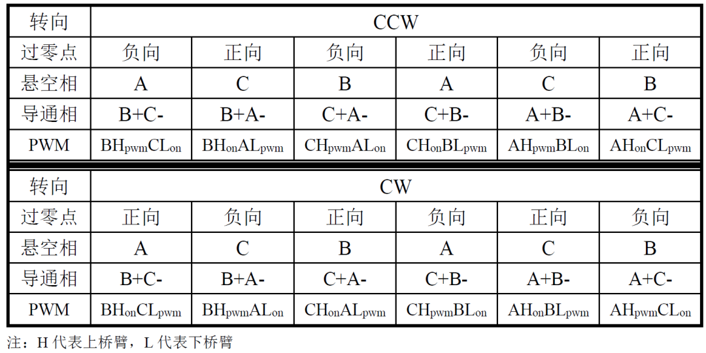

# 一种BLDC电机无霍尔方波控制失效分析：因非导通相反电势震荡造成的反电势检测失效

原创 傅存敬 电磁散人 2025-09-04 23:30 广东

> 原文地址: [https://mp.weixin.qq.com/s/08ihKUf0amGfS74jMHFBZw](https://mp.weixin.qq.com/s/08ihKUf0amGfS74jMHFBZw)

基于BLDC的反电动势检测实现的120°导通方波无感控制策略，反电势过零点检测成功与否，是电机能否正常换相的关键。前文分析了[一种因为相绕组续流导致的反电势过零点检测失效原因及应对措施](https://mp.weixin.qq.com/s?__biz=MzE5MTYzNjgzOA==&mid=2247483866&idx=1&sn=a6dbacab3d7f576680fd0f5f2e484058&scene=21#wechat_redirect)，本文继续分析一种失效方式：因非导通相反电势震荡早餐的反电势检测失效原因及应对措施。

原因分析：

对于某些电气时间常数 τ（τ = L/R）较大的电机，采用无霍尔方波120°导通控制方式时，电机非导通相在非换相区间存在严重的反电势电流续流问题，这种续流会湮没掉非导通相反电势的过零点，致使换相失败。

非导通相的相反电势的震荡，严重时会湮没掉过零点。

相反电势的震荡，和相电流的续流相关。详细分析过程如下：

在无刷直流电机无霍尔控制系统中，根据排列组合不同，PWM调制方式有五种类型，即：

(1)on\_pwm型：各管前60°恒通、后60°PWM调制；

(2)pwm\_on型：各管前60°PWM调制，后60°恒通；

(3)Hpwm\_Lon型：上桥臂PWM调制，下桥臂恒通；

(4)Hon\_Lpwm型：上桥臂恒通、下桥臂PWM调制；

(5)Hpwm\_Lpwm型：上下桥臂各管皆为PWM调制方式。

其中，(1)、(2)、(3)、(4)又称为单边（管）调制方式，即在任意一个60°扇区内，只有上桥臂或下桥臂进行斩波调制。(5)称为双边（管）调制方式，即在任意一个60°扇区内，上、下桥臂同时进行斩波调制。

在双边（管）调制方式中，功率开关动态功耗是单边（管）调制方式中的两倍。与单边（管）调制方式相比，双边（管）调制方式降低系统效率，给散热带来困难。同时，与单边（管）调制方式相比，双边（管）调制方式在PWM信号关断时电流下降率快，导致在相同的直流母线电压和占空比条件下，稳态时平均电流小，从而平均转矩和实际的转速也小\[1\]。

随着PWM调制方式的不同，在每一相关断期间，关断相反电动势电流出现的时间和幅值也不一样，如下图所示。

结论：

-   在不同的换相区间采用不同的PWM调试方式，可以有效降低（但不能消除）反电动势电流对反电势的影响。
    
-   推荐优先采用on-pwm调制方式，若效果欠佳，推荐采用pwm-on模式。
    

实现方法：

定义非导通相反电势过零点分为正向过零点（反电势的变化由负变正时产生的过零点）和负向过零点（反电势的变化由正变负时产生的过零点）。 

然后，按照如下方式实现电机的换相：

  

参考文献

\[1\]李自成,程善美,秦忆.不同PWM调制方式下无刷直流电机电磁转矩的计算\[J\].微电机, 2010, 43(3):4.DOI:10.3969/j.issn.1001-6848.2010.03.004.

链接: https://pan.baidu.com/s/1FobH7RxGI4u6vrmQB0zr8g?pwd=s8m9 提取码: s8m9