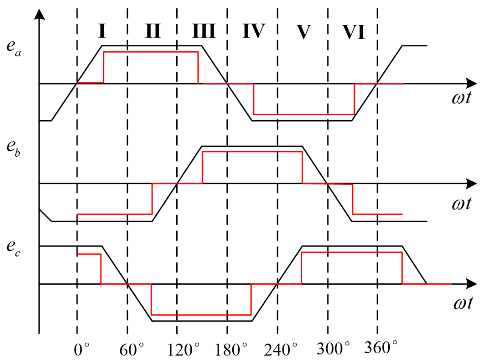
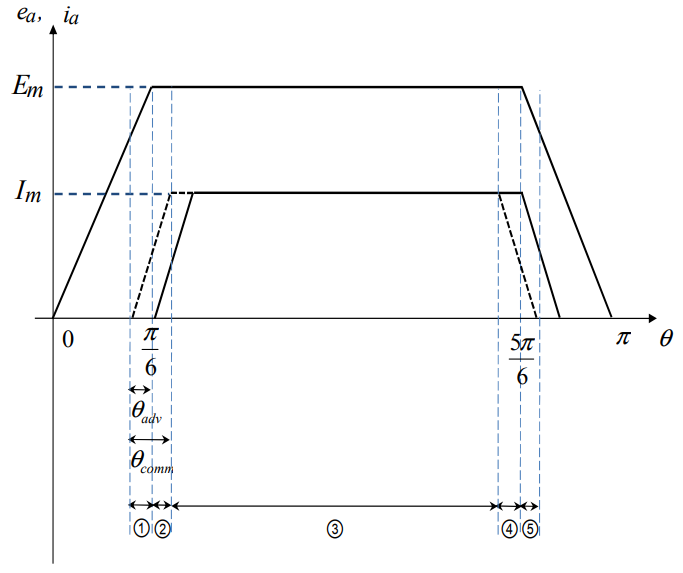
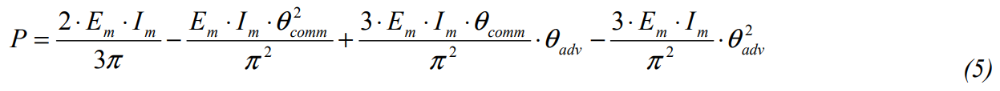
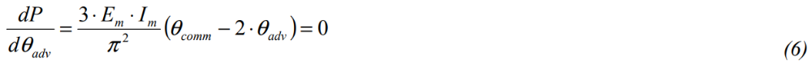
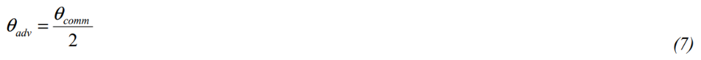
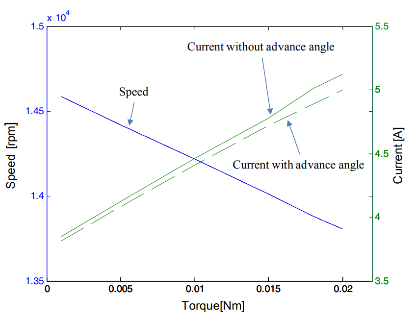

# 你的BLDC电机“摸鱼”了吗？——把换相损耗的电流榨干，提效2.3%的秘密

原创 傅存敬 电磁散人 2025-10-01 21:39 广东

> 原文地址: [https://mp.weixin.qq.com/s/1DAovoxhJ1Vx8bDr5LRL0A](https://mp.weixin.qq.com/s/1DAovoxhJ1Vx8bDr5LRL0A)

今天我们继续来聊无刷直流电机（BLDC Motor），尝试着讨论下如何进一步提高其转矩输出能力。

（一）一个完美主义的电机

首先，啥叫无刷直流电机？简单说，它就是个力气大、寿命长、还不用怎么维护的“三好学生”。它是怎么转起来的呢？

我们可以把它想象成一个旋转的木马，你在外面推它。为了让木马转得最快，你肯定要在最合适的时机、用最大的力气去推，对吧？

这个电机也是一样。它内部有磁铁（相当于木马上的座位），外面有线圈（相当于推马的你）。我们给线圈通上电，线圈就变成了电磁铁，跟里面的磁铁相互作用（推或拉），电机就转起来了。这个“电”不是一直通着，而是像咱们推木马一样，要一下一下地、在最合适的时机通电。

在最理想的情况下，我们给它的“指令”（电流）是一个很完美的“方波”，就像下面这张图里画的一样（黑色波形为相反电势波形，红色波形为相电流波形）。

你看，当反电动势e（可以理解成电机转动时产生的、代表“推力时机”的信号）达到一个平台时，我们就给它一个同样是平台的电流i。e和i的形状完全匹配，方向相同，根据物理学，这时候电机产生的力气（转矩）就是最大的！就像你每次都在木马最需要力的时候，用尽全力推了一把！

（二）“懒惰”的电感，让事情变得不完美

但是！现实世界总有摩擦和阻力，对不对？在电机里，这个“捣蛋鬼”叫做电感。

电感这家伙有个什么毛病呢？它特别“懒”，或者说有“惯性”。当你想让电流“蹭”地一下从0变成最大值时，电感会说：“别急别急，让我慢慢来……”；当你想让电流“啪”地一下关掉时，它又会说：“哎呀，我这儿还有点儿呢，别着急……”

所以，因为电感这个“懒家伙”的存在，我们发出的完美方波指令，到了电机那里就变成了下面这个样子：

请看上面这张图，这是本次引用论文的核心！

那个梯形的波浪线 e，就是我们说的“最佳推力时机”信号。

我们理想中想给的电流，应该是像虚线画的那种方方正正的波形。

但实际上，因为电感的“懒惰”，电流波形变成了那个带有斜坡的实线波形。你看，它启动的时候要慢慢爬坡，结束的时候又要慢慢滑下来。

这就出问题了！本来应该力气最大的平顶区域，电流并没有达到最大值，而在某些地方，电流和“时机”信号甚至方向相反，产生了反作用力！这就好比你推木马，不仅没在最佳时机用上力，甚至在木马转过来的时候还顶了它一下，这不就白白浪费力气了嘛！

这个电流爬坡和滑坡的阶段，就叫做换相区间（Commutation Interval），在图里用θcomm表示。这个区间越长，浪费的能量就越多，电机的效率就越低，也就是我们常说的“转矩\-电流比”下降了。

（三）道高一尺魔高一丈：什么是“提前角”？

那怎么办呢？聪明的工程师就想了一个绝妙的办法：你不是慢吗？那我干脆就提前开始！

这就好比你知道你家孩子早上起床特别磨蹭，要花10分钟才能穿好衣服。为了让他8点准时出门，你肯定不会8点才叫他起床，而是会提前10分钟，7点50就叫他，对不对？

这个“提前量”，在电机里就叫做提前换相角（Advance Angle），用θadv表示。

我们再回头看刚才那张图。图里的虚线部分，就是作者画出的“提前”之后的电流波形。你看，整个电流波形都往左平移了一点点。虽然它还是“懒洋洋”的斜坡，但通过提前启动，正好让它在“最佳推力时机”e到来的时候，电流也爬到了峰值！这样一来，大部分时间里，电流和反电动势都能很好地匹配，浪费的力气就大大减少了！

（四）究竟要提前多少？数学告诉你答案！

好了，最关键的问题来了：到底要提前多少才是最完美的呢？提前太多，电流又冲到前面去了；提前太少，还是慢半拍。

这时候，就轮到我们最强大的工具——数学出场了！

作者的目标是让电机的平均功率（P）最大化，因为功率大就意味着转矩大。他通过一系列复杂的积分运算，得到了一个表示平均功率P和提前角θadv关系的公式。我们直接来看这个关键的“藏宝图”：

大家请看这个公式，是不是有点头大？别怕！我们把它翻译一下。Em和Im是电压和电流的最大值，是常数。真正影响结果的，是我们能控制的θadv（提前角）和电机固有的θcomm（懒惰时间）。

我们仔细看，P 和我们想求的θadv是个什么关系？你看，这里有θadv的平方项，这里有θadv的一次项。这不就是我们初中学的二次函数嘛！一个开口向上的抛物线！我们要求它的最大值，就要找这个抛物线的顶点！

求极值我们用什么方法？求导！我们对上面那个公式求关于θadv的导数，并让它等于0：

原文公式 (6) 推演:

我们来解这个方程。把常数项 (3EmIm/π²) 约掉，就得到：

2\*θadv - θcomm = 0

移项一下，我们就得到了一个无比简洁、无比优美的结论！

多么漂亮的结论啊！它告诉我们：最佳的提前时间，正好是电机“犯懒”时间的一半！

这个结论太有用了！就像你知道孩子磨蹭10分钟，你不需要提前10分钟，也不需要提前2分钟，你只要提前5分钟叫他，效果就是最好的！这就是科学的艺术！

（五）实践是检验真理的唯一标准

作者算出了这个结论，然后就在电脑上用仿真软件试了一下。结果怎么样呢？

请看这张图。横轴是电机输出的力气（Torque），纵轴是消耗的电流（Current）。

-   实线（Current without advance angle）：没有用咱们这个聪明办法时，消耗的电流。
    
-   虚线（Current with advance angle）：用了“提前一半懒惰时间”这个办法后，消耗的电流。
    

很明显，在输出同样大小的力气时，虚线始终在实线的下方！这意味着什么？这意味着，用了咱们这个方法后，电机更省电了！论文里说，平均效率提升了1.3%，最高能提升2.3%！

别小看这2.3%，对于需要长时间运行的设备，日积月累能省下非常可观的电能！

总结

好了，我们来回顾一下今天的故事：

我们有一个很厉害的无刷直流电机，但它有个“懒惰”的毛病叫“电感”，导致它工作效率不高。为了治好这个毛病，我们想出了“提前开工”的办法。通过严谨的数学推导，我们找到了一个黄金法则：提前的时间 = 懒惰时间的一半。最后通过仿真运算证明，这个方法确实有效，能让电机更省电、更有力！

所以你看，生活中的很多问题，看似复杂，但只要我们抓住了底层的物理规律，用数学这个强大的工具去分析它，往往就能找到一个像θadv = θcomm / 2这样，既简单、又优美的解决方案。

这就是科学的魅力！好了，今天我们掰扯了这么多，你听懂了吗？

  

参考文献：

\[1\]Changphil,Shin,and,et al.Advance Angle Calculation for Improvement of the Torque-to-Current Ratio of Brushless DC Motor Drives\[J\].Energy Procedia, 2012.DOI:10.1016/j.egypro.2011.12.1110.

文档链接：https://pan.baidu.com/s/1b-vzYXIyGdSY0BftBBfZsg?pwd=m6ut 提取码: m6ut