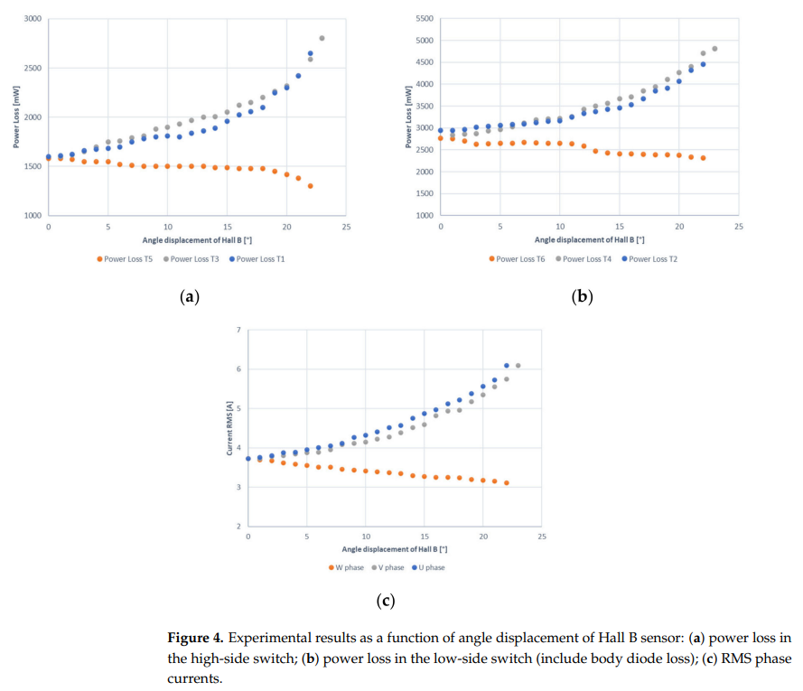
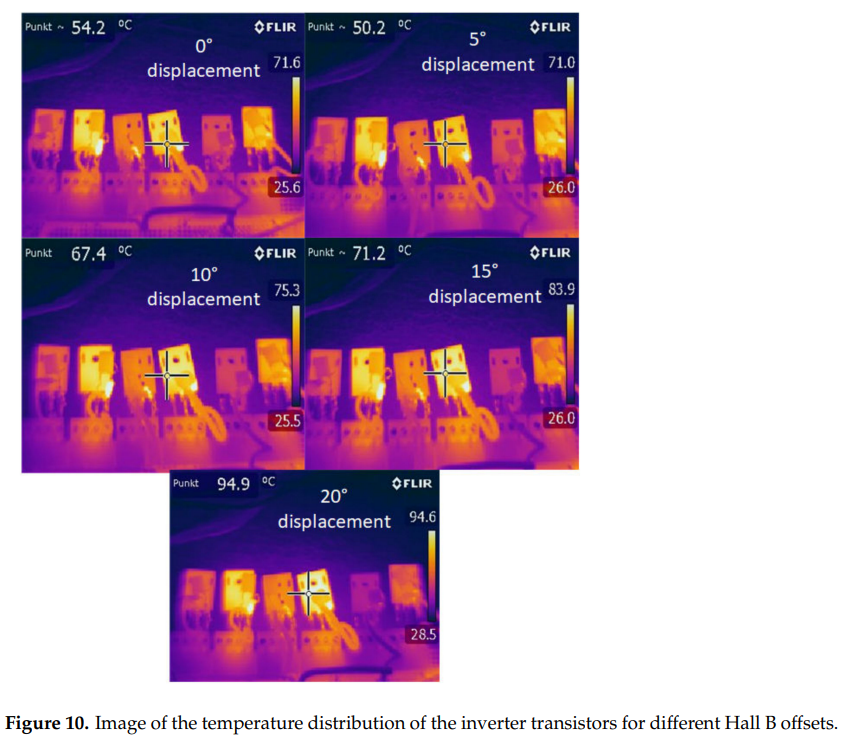
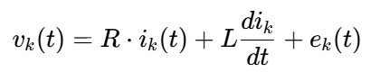

# 无刷直流电机霍尔传感器放置精度对逆变器晶体管损耗的影响

原创 傅存敬 电磁散人 2025-09-17 21:46 广东

> 原文地址: [https://mp.weixin.qq.com/s/Q0JVBmQVY-Thh2JAzroBdw](https://mp.weixin.qq.com/s/Q0JVBmQVY-Thh2JAzroBdw)

今天我们来讲一个有趣又实用的工程问题——如果把电动自行车里的无刷电机拆开，装回去时霍尔传感器歪了一点，会有什么后果？ 这篇来自波兰工程师们的研究论文，就用严谨的实验告诉我们：装歪一点，电机控制器里的“开关管”可能就要“发烧”甚至烧坏！ 让我们用生活中常见的现象来理解它。

  

* * *

  

第一幕：电机里的“交通指挥员”——霍尔传感器

想象一下，无刷电机就像一支需要精确配合的交响乐团：

转子（含磁铁） = 演奏家（比如钢琴家）

定子线圈 = 乐器（比如钢琴）

逆变器（控制器） = 指挥家 

霍尔传感器 = 指挥棒上的刻度标尺

关键点： 指挥家（逆变器）需要知道钢琴家（转子磁铁）弹奏的琴谱演奏到哪里了的精确时刻，才能准确指挥对应的乐器（定子线圈）通电发声（产生磁力推动转子）。霍尔传感器就是告诉指挥家“现在该轮到哪个乐器演奏了”的刻度标尺。

问题来了： 如果装电机时，这个“标尺”歪了一点（比如标记“该A乐器演奏”的时刻，其实钢琴家还没完全到位），会发生什么？

* * *

  

第二幕：装歪的后果——“乐器”乱套，“指挥家”累坏！

论文通过精密的实验（能精确调整到0.044度！）发现：

“乐器”电流失调：

当传感器歪了（比如负责“B乐器”的传感器偏移），原本应该均匀工作的三相电流（U, V, W）变得严重不平衡。

看图说话（图4c）： 随着传感器偏移角度增大（横轴），U相和V相的电流（RMS值）像爬坡一样蹭蹭往上涨（最高到6A），而W相的电流却像滑滑梯一样往下掉（最低到3.1A）。

这就像： 指挥家提前让B乐器演奏，导致A和C乐器被迫加大音量（电流增大）来弥补节奏错误，而B乐器反而没充分发力（电流减小）。

“开关管”累得发烫——功率损耗剧增！

逆变器里控制电流通断的“开关管”（MOSFET晶体管）就像舞台的电闸管理员。电流突然变大、通电时间变长，他们会累得满头大汗（发热）。

关键数据（图4a & 4b）：

当传感器偏移20度时，负责U相和V相的上管损耗暴增43%（约700mW）！

下管的损耗也跟着猛涨50%（比如T4管从2800mW涨到4200mW）。

这就像： 因为指挥错误，负责开合A/C舞台电闸的管理员（开关管）需要频繁操作、承受更大电流，体力消耗（功率损耗）激增。

“电闸管理员”集体发烧——温度飙升！

损耗集中在某些开关管上，导致它们温度急剧升高，而其他开关管却“凉快”得多。

红外实拍（图10）： 当传感器偏移20度时，最辛苦的那个开关管（T4）表面温度从54.2°C 直接飙升到 95°C！

严重后果： 长期高温工作会加速老化，甚至直接烧毁这个倒霉的开关管，导致整个控制器罢工！好比管理员累倒，舞台断电。

* * *

  

第三幕：为什么会这样？——核心公式揭秘

为什么传感器歪一点，电流和损耗就失控？关键在于电机的“反电动势”！我们用论文里的核心公式(1) 来解释：

vk(t)= 控制器给线圈加的电压（指挥家的指令强度）

R·ik(t)= 电流流过线圈电阻的损耗（电线发热）

L dik/dt\= 电流变化时电感产生的阻力（惯性）

ek(t)= 反电动势（转子磁铁切割线圈产生的“反向电压”）—— 核心角色！

关键原理： 在最佳换相点，控制器加电压 vk时，线圈产生的反电动势 ek正好能抵消大部分外加电压，所以只需较小的电流 ik就能产生需要的推力（就像顺风骑车）。

传感器装歪了： 控制器在错误的时间给线圈通电。这时转子磁铁位置不对，产生的反电动势 ek很小甚至方向不对。为了产生同样的推力，控制器只能拼命加大电压 vk，导致公式里的电流 ik被迫增大（就像逆风骑车，费劲！）。

结果： 电流 ik猛增 → 电阻损耗 R·ik平方级增加 → 开关管（控制电流的闸门）发热剧增！

* * *

  

第四幕：怎么办？——工程师的忠告

制造要精细： 装电机时，霍尔传感器的位置误差必须控制在2.5度以内（论文结论），否则隐患巨大。这就像指挥棒刻度必须精确到毫米。

设计留余量： 如果电机本身传感器精度不高（很多便宜电机都这样），设计控制器时开关管的功率必须留充足余量，防止个别管子“累倒”。

智能“纠偏”： 高级方案是用软件算法实时检测并补偿传感器安装误差（论文提到一些方法），就像给指挥棒装个“自动校准仪”。但这需要更复杂的控制系统。

* * *

  

总结

这篇论文用扎实的实验和清晰的数据告诉我们：

无刷电机里小小的霍尔传感器，装歪一点点（>2.5度），就会像交响乐团里刻度歪掉的指挥棒，导致“乐器”（线圈）电流失调、“电闸管理员”（开关管）累到发烧（损耗剧增、温度飙升），最终可能让整个“舞台”（控制器）瘫痪！

所以，无论是生产电机还是设计控制器，这个小零件的安装精度绝对不可轻视！这就是 “差之毫厘，谬以千里” 在电力电子领域的生动体现。

  

参考文献：

\[1\] Kolano K , Moradewicz A J , Drzymaa B ,et al.Influence of the Placement Accuracy of the Brushless DC Motor Hall Sensor on Inverter Transistor Losses\[J\].Energies, 2022, 15.DOI:10.3390/en15051822.

获取链接：https://pan.baidu.com/s/1mm3PklVSD-RsJ5DZUscE-Q?pwd=p9uq 提取码: p9uq