# 电动车用BLDC电机控制器的心脏手术：PID老矣，尚能饭否？

原创 傅存敬 电磁散人 2025-10-13 07:06 广东

> 原文地址: [https://mp.weixin.qq.com/s/bt9BVnlpfB5ZUowM0aWetw](https://mp.weixin.qq.com/s/bt9BVnlpfB5ZUowM0aWetw)

今天咱们聊一聊现在满大街跑的电动汽车。不知道大家有没有想过，你一脚“电门”踩下去，车“嗖”地一下就蹿出去了，又快又稳，这背后是什么在控制呢？今天，我们就来揭秘一下电动汽车的“最强大脑”——电机控制器，看看科学家们是如何让它变得更聪明、更高效的！

第一部分：问题来了——我的车为啥不够“丝滑”？

电动车的核心是啥？是电池、电控和电机，对吧？电池是粮仓，电机是肌肉。但光有肌肉不行啊，还得有个聪明的大脑来指挥肌肉怎么发力。这个“大脑”就是控制器。

目前最常见的控制器叫PID控制器。这个PID啊，是个老实人，勤勤恳恳干了几十年了。它是怎么工作的呢？

-   P（Proportional，比例）：看“现在”的差距。比如你想让车速到80，现在只有60，差了20。P就说：“差距大，多给点电！”差距小，就少给点。简单直接！
    
-   I（Integral，积分）：算“过去”的总账。假如路上有个小上坡，P加了电还是到不了80，总差那么一点点。I就说：“我瞅你半天了，老是欠着速度，不行，我得额外再给你加点电，把欠的账补上！”它专门解决这种持续存在的小误差。
    
-   D（Derivative，微分）：预测“未来”的趋势。假如你马上要到80了，速度还在猛增。D就说：“刹车！刹车！要超了！”它能提前预判，防止速度过冲，也就是我们开车时那种“一蹿一蹿”的感觉。
    

这么一听，PID是不是挺完美的？嗯...在大部分情况下是。但你想想，开车的路况多复杂啊？突然来个大上坡，突然前面有车要急刹，PID这个“老实人”有时候就反应不过来了。他可能会：

1.  反应慢：给电不及时，车子有点“肉”。
    
2.  控制抖：给电给猛了，或者刹车刹猛了，车子开起来“一顿一顿”的，不丝滑，坐着不舒服。
    
3.  浪费电：控制得不精细，就像一个新手司机，油门刹车乱踩，肯定费油，哦不，是费电！
    

所以，科学家们就想：能不能找个更聪明的“司机”来代替PID呢？

第二部分：天才登场——TID控制器闪亮来袭！

于是，本篇论文的主角——TID（Tilt Integral Derivative，倾斜积分微分）控制器，就登场了！

我们先来看它的“基因序列”，也就是数学公式。别怕，很简单！

这是我们老朋友PID的公式：

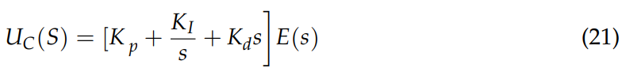

-   Uc(s) 是控制器要给电机的指令。
    
-   E(s) 是目标速度和当前速度的差距。
    
-   Kp, Ki, Kd分别是P、I、D三个环节的“力道大小”。
    

现在，看天才TID的公式：

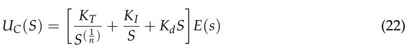

大家发现区别了吗？

对！就是第一项不一样了！PID的Kp（比例项）被换成了一个奇怪的 KT/s^(1/n)。这个1/s^(1/n) 是什么鬼？

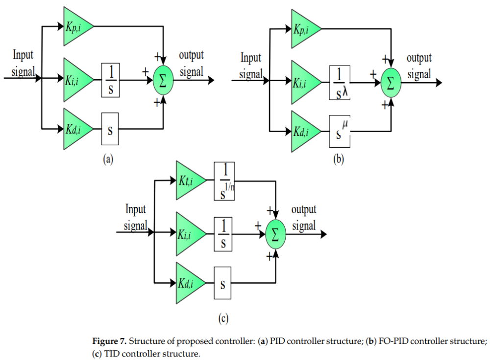

图(a)是PID，图(c)就是我们的主角TID。看，就是P环节那里动了手脚

这个东西在数学上叫分数阶微积分，听着很吓人，但我们把它想象成一种“直觉”或者“预判PLUS”功能！

-   PID的P：“眼看手勿动”，只看当前差距，做出线性的反应。像个机器人。
    
-   TID的T（Tilt，倾斜）：它不光看当前差距，还带有一种“倾斜的视角”和“短暂的记忆”。它会根据误差在极短时间内的变化“感觉”出一个趋势n。这个n值越大，它的这种“感觉”就越敏锐！
    

我打个比方：你想用手把一个倒下的瓶子扶正。

-   PID：看到瓶子歪了（P），就推一下。发现还没正（I），就再加点力。感觉快正了要倒向另一边了（D），就赶紧收力。
    
-   TID：它在推的那一瞬间，就能通过手上的感觉（那个“T”环节）判断出瓶子的重心、材质和晃动的趋势，然后用一个极其平滑、恰到好处、一次到位的力道把瓶子稳稳扶正，绝不多晃一下！
    

所以，TID这个“天才司机”，开车更稳、更省、反应更快！

第三部分：是骡子是马，拉出来遛遛！——看数据！

光说不练假把式！这篇论文的科学家们做了大量的计算机仿真，我们来看几张关键的“成绩单”。在这些图里，红色是PI（一个简化的PID），蓝色是PID，绿色是我们的天才TID！

成绩单1：赛道追踪能力

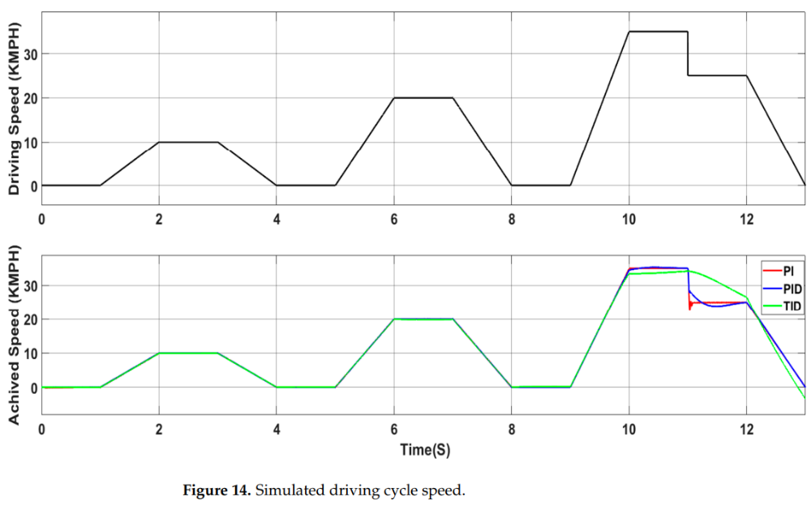

这张图的上半部分是“目标赛道”（预设的速度变化），下半部分是三位“司机”的实际表现。大家看！绿色的TID线，绝不会发生速度突变的情况！而红色和蓝色的线，虽然准确跟上了速度指令的节奏，但坐在车上的司机容易晕车哪。

结论：TID虽慢但稳，主打一个舒适！

成绩单2：能量消耗

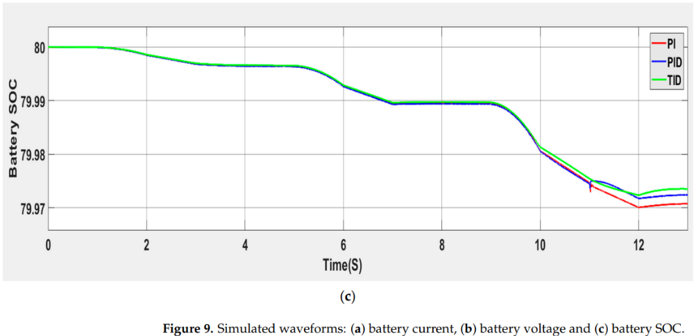

这张图是电池剩余电量（SOC）的变化。线越高，说明越省电。在比赛的后半段，绿色的TID线明显在最上面！

结论：TID不仅跑得稳，还吃得少！是个省钱的好伙计！

成绩单3：乘坐舒适度

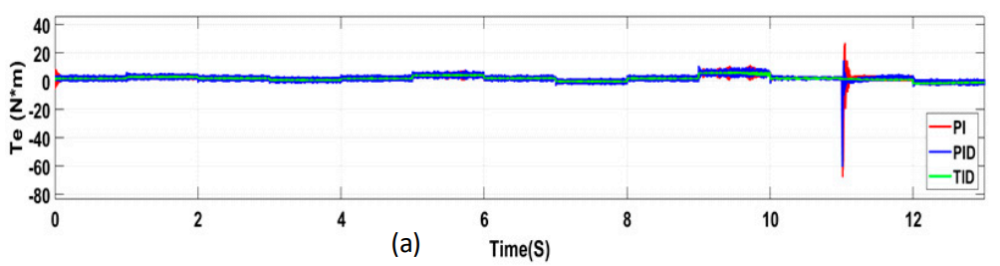

这张图是电机的输出力矩（转矩）。这个力矩越平滑，车子开起来就越稳，不会“蹿”。你们看，蓝色和红色的线有很多“毛刺”，一抖一抖的。而绿色的TID线，像丝一样顺滑！

结论：坐TID控制的车，就像坐高级轿车，稳！

第四部分：从理论到现实——动手做实验！

工程师们说：“电脑上跑得好有啥用？我得把它真做出来！”于是他们就用Arduino（一个大家都能玩的微型电脑板）和一些电路元件，搭了一个真实的实验台。

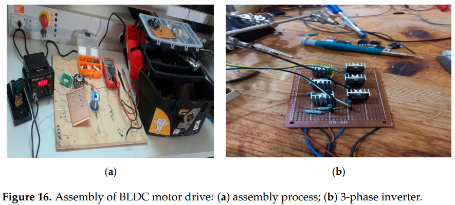

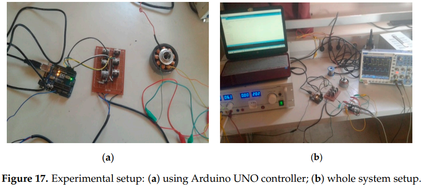

这就是他们DIY的“最强大脑”和驱动系统。看着是不是有点简陋？但高手在民间，功能强大就行！

他们把电机接上，用示波器一看，嚯！

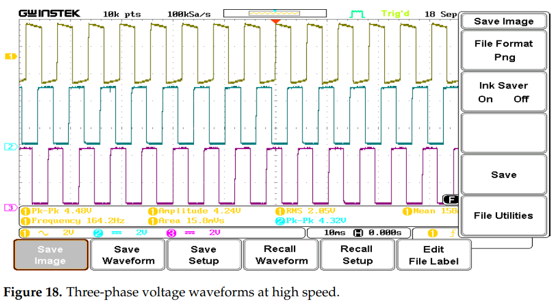

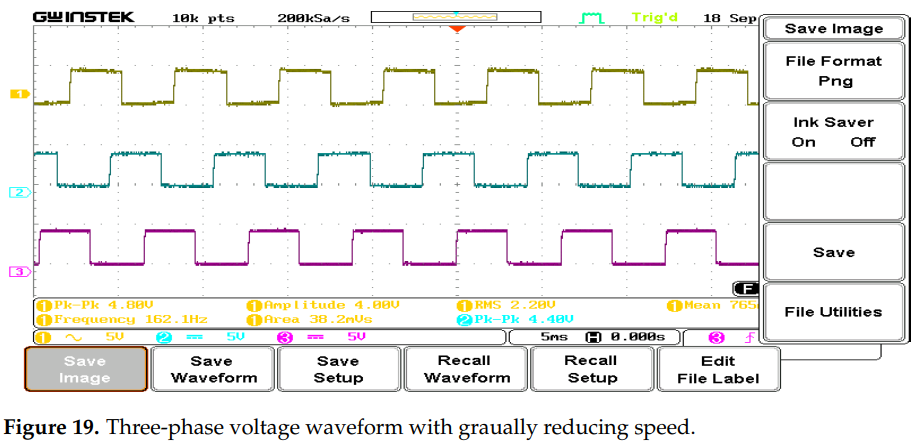

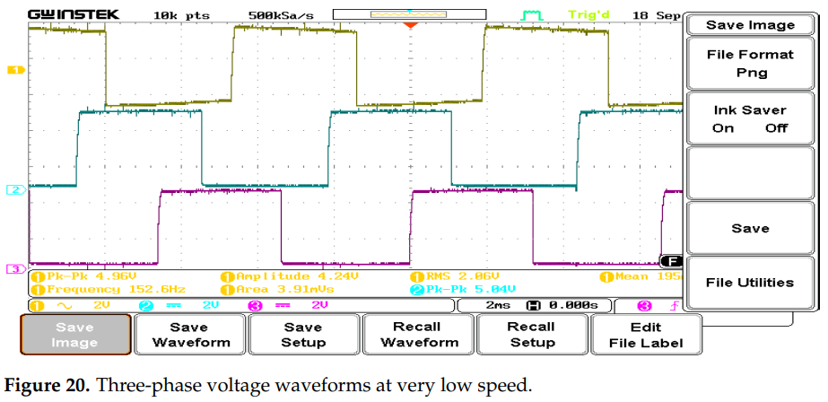

这三张图是在不同速度下，示波器捕捉到的三相电压波形。你们看，这波形是不是很规整？三个波峰之间正好差了120度，就像奔驰的标志一样完美。这说明，他们DIY的TID控制器，成功地、精确地指挥着电机在转动。而且，实验结果和电脑仿真的结果高度吻合！

这就证明了，TID控制器不仅在理论上是个天才，在现实世界里也是个能干的实力派！

总结：TID到底牛在哪？

今天我们通过一篇非常硬核的科研论文，了解了电动汽车控制器的一次重大升级。让我们来总结一下，为什么说TID是比PID更聪明的“司机”：

1.  更精准：它能让车子“人车合一”，你想多快，它就多快，不拖沓、不超速。
    
2.  更节能：因为它控制得精细，避免了不必要的能量浪费，让你的电动车能跑得更远。
    
3.  更舒适：它让电机的发力如丝般顺滑，告别了顿挫感，提升了驾驶和乘坐体验。
    
4.  更强壮：在面对爬坡、急刹等突发情况时，它的鲁棒性更好，系统更稳定。
    

当然啦，TID也不是没有缺点。它更复杂，对“大脑”的计算能力要求更高，调校起来也需要更多经验，就像一个天才总有点自己的小脾气。但科技总是在进步的，随着芯片技术的发展，这些问题都会被解决。

所以，下一次当你坐上一辆启动特别平顺、加速特别线性、感觉特别舒服的电动车时，你就可以跟身边的人自豪地说：“这里面，可能就用到了类似TID这样的高级控制算法！这个知识点，我学过！”

科学与技术的世界就是这样，从一个小小的不完美出发，通过严谨的数学推导和反复的实验验证，最终推动了我们整个世界的进步。希望今天的内容能让大家对我们身边的科技有更深的理解。

  

参考文献

\[1\] Sayed K , El-Zohri H H , Ahmed A ,et al.Application of Tilt Integral Derivative for Efficient Speed Control and Operation of BLDC Motor Drive for Electric Vehicles\[J\].Fractal & Fractional, 2024, 8(1).DOI:10.3390/fractalfract8010061.

文献链接：https://pan.baidu.com/s/1rY3KTtPjq\_OjWB\_D606iow?pwd=85ep 提取码: 85ep