# 被忽略的中性点电压：解锁传统BLDC电机控制器实现伪正弦波驱动的钥匙

原创 傅存敬 电磁散人 2025-09-30 22:35 广东

> 原文地址: [https://mp.weixin.qq.com/s/HHsRmg\_tcmXZ3\_rb24StHg](https://mp.weixin.qq.com/s/HHsRmg_tcmXZ3_rb24StHg)

不知道大家有没有这样的感觉，你骑自己买的电动车，感觉“嗡嗡嗡”的，加速的时候还有点一冲一冲的。但你骑同事新买的电动车，就感觉特别安静、特别平顺，这是为什么呢？难道是电机更贵吗？

不一定！今天我们就来看一个非常有意思的思路，几位学者想了一个绝妙的办法，不增加电机的成本，就能让它变得更高效、更安静。文末有原文出处，我们今天就把它掰开揉碎了讲清楚。

第一部分：电机为啥会转？——“推秋千”的艺术

首先，无刷直流电机（BLDCM）为啥会转？我们可以把它想象成一个大型的旋转秋千。

-   转子（Rotor）：就是坐在秋千上的人，它上面有几块永久磁铁（就像人自带磁场一样）。
    
-   定子（Stator）：就是外面一圈固定的线圈，像几个站在不同位置准备推秋千的人。
    

（下图右侧插入永磁体的可以转的部分就是转子，左侧缠着铜线圈的部分就是定子。）

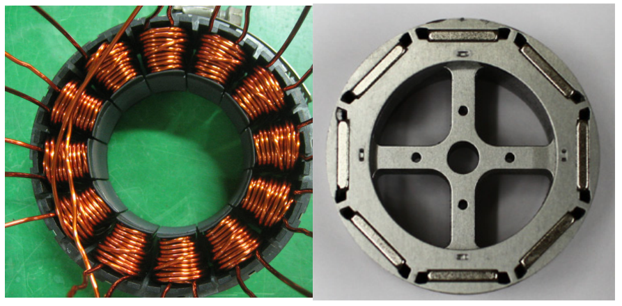

怎么让秋千一直转起来呢？你得在正确的时间、正确的方向去推它。你不能等它荡到最高点再推，也不能逆着它推，对吧？

在电机里，这个“推”的动作，就是给某个线圈通上电流，让它产生磁场，然后去“推”或者“拉”转子上的磁铁。而这个在正确的时间给正确的线圈通电的过程，就叫做“换向”。

第二部分：传统方法有什么问题？——“大力出奇迹”但很粗糙

最传统、最简单的方法叫120°换向法。它是怎么工作的呢？

想象一下，有6个推手（A+, A-, B+, B-, C+, C-）围着秋千。120°换向法就是每次找两个人，一个在前面“猛拉”，一个在后面“猛推”，而且一推就是一大段距离（120°电角度）。然后立刻换另外两个人来推。

这种方法简单粗暴，就像开车只知道踩死油门和一脚刹车。

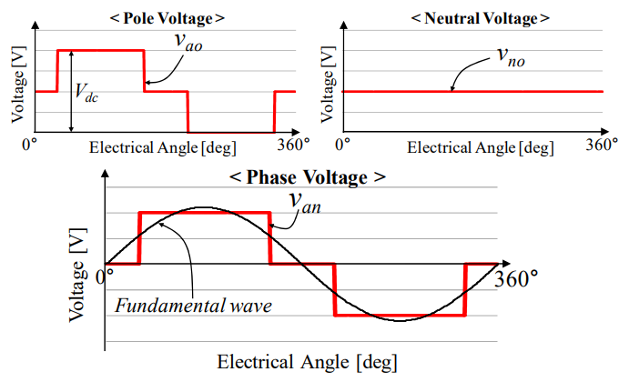

-   极电压（Pole Voltage）：这就是我们给推手的“指令”，你看，要么是满格的力（+Vdc），要么是没力（0）。这种波形，我们叫它方波。
    
-   相电压（Phase voltage）：这是秋千（线圈）实际感受到的合力。你看它像一个楼梯，一阶一阶的，很不平滑。
    

这种不平滑的“推力”会带来两个大问题：

-   浪费能量（效率低）：你猛推一下，再猛停一下，很多力气都变成了震动和热量，而不是平稳的旋转。这就是为什么你的电动车跑不远。
    
-   噪音和振动大：这种“顿挫感”反映在电机上，就是转矩脉动（Torque Ripple），听起来就是“嗡嗡嗡”的噪音，骑起来感觉一冲一冲的。
    

第三部分：新方法的精髓——如何“温柔地”推秋千？

那么，怎么才能让推力变得平滑呢？最理想的推力，应该像一条完美的正弦波，由弱到强，再由强到弱，非常自然。

要得到正弦波的推力，我们首先得理解推力是怎么来的。大家看原文的核心公式(3)，可以配合下图来理解：

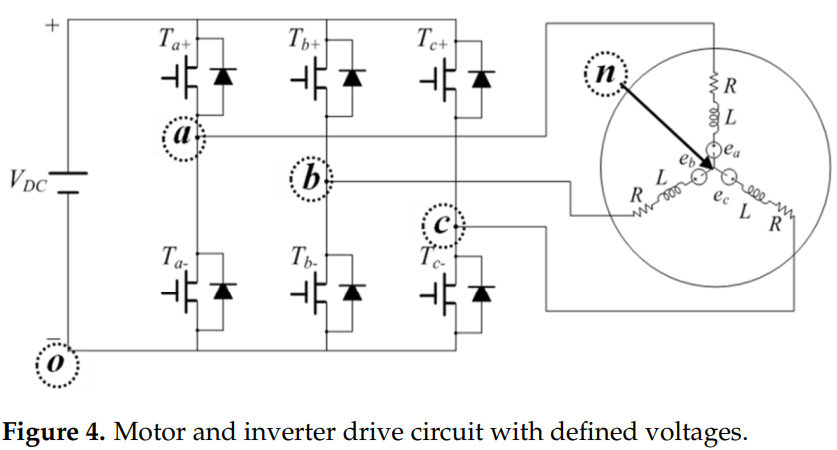

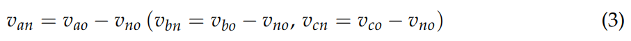

用大白话讲就是：

线圈感受到的最终推力 (相电压Vph) = 控制器给的原始推力 (极电压Vpole) \-一个公共的背景力 (中性点电压Vno)

这个公式是这篇文章的“题眼”！它告诉我们一个惊人的事实：要想让“最终推力”Vph变得平滑，我们不一定非得让“原始推力”Vpole变得平滑。我们可以通过巧妙地设计Vpole，让它减去那个不规则的Vno之后，剩下的结果恰好是一条平滑的正弦波！

这就是这篇论文最牛的地方！他们提出的“改进的150°换向法”就是这么干的。我们来看原文出现的下图：

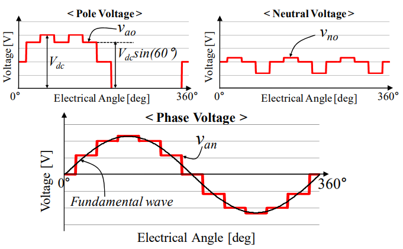

请大家仔细看这个Vpole的波形，它不再是简单的“开”或“关”了。在波形的“肩膀”位置（比如15°到45°区间），它给的不是满格的力，而是一个不大不小的力。这个力是多少呢？论文里写了，是Vdc \* sin(60°)。

我们来验算一下，sin(60°) 约等于0.866。也就是说，在这些“肩膀”区间，控制器给出的推力大约是满格推力的86.6%。

回到我们推秋千的比喻：

-   传统120°法：“猛推！停！换人猛推！停！”
    
-   改进150°法：“先用八成力预热，然后全力猛推，最后再用八成力缓冲收尾。”
    

是不是感觉后者优雅多了？

最关键的问题来了：怎么实现这个“八成力”呢？要不要加新零件？

不需要！

这就是这个方法最妙的地方！电机控制器里本来就有一种技术叫PWM（脉宽调制）。它就像一个反应超快的水龙头开关，通过一秒钟内开关几万次，来控制总的出水量。通过调节每次“开”的时间占总时间的比例（占空比），就可以精确地模拟出任意大小的电压，比如这个86.6%的电压。

所以，这个新方法没有增加任何硬件成本！它只是通过更新控制器的“软件”算法，让本来就有的开关用一种更聪明的方式去工作，就实现了“温柔地推秋千”这个高难度的动作！

第四部分：效果怎么样？——用数据说话

光说不练假把式。这篇论文用仿真和实验证明了它的效果。

1.  转矩更平稳：看下图的仿真结果，传统120°法的转矩曲线抖动得像得了帕金森（脉动率24.1%），而改进150°法的曲线平滑多了（脉动率12.03%），几乎减少了一半！
    
    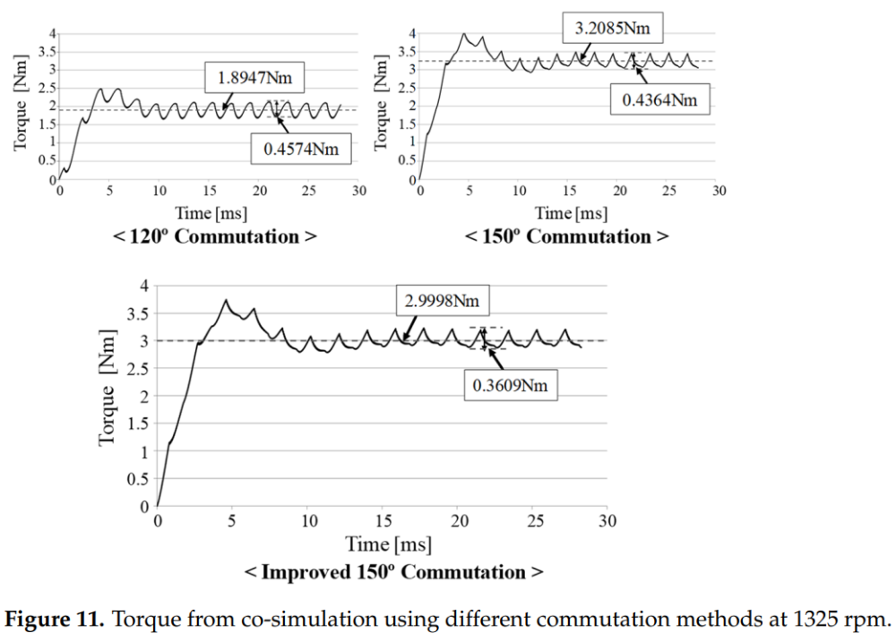
    
2.  效率更高：看下表的数据，在同样的工况下：
    
    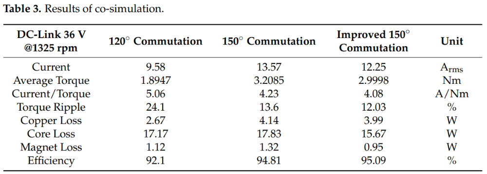
    
            i. 120°法效率：92.1%
    
            ii. 改进150°法效率：95.09%
    
    别小看这3%的提升，对于天天跑的电动车，一年下来能省不少电费呢！
    
3.  电流更平滑，谐波更小：看下图的实验图，改进150°法的电流波形（右下角那个）明显比右上角的更圆润，更像正弦波。
    
    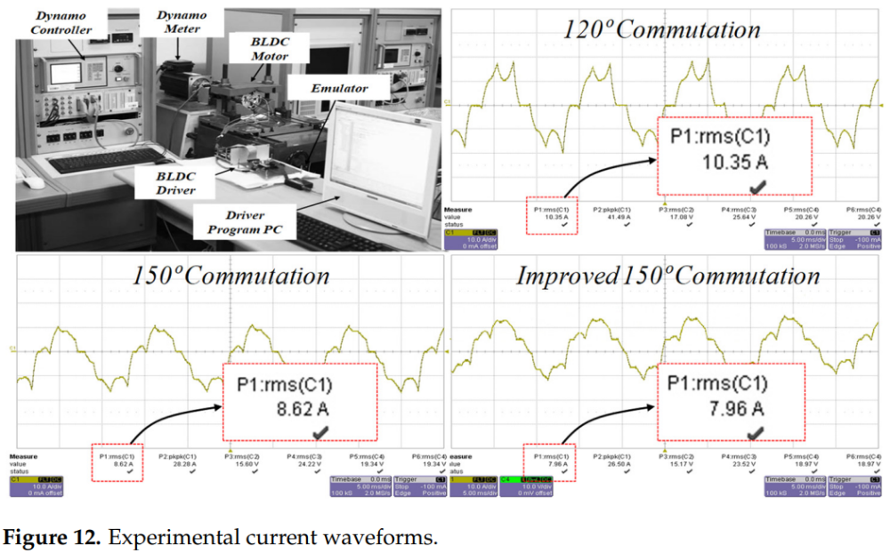
    
    再看它的总谐波失真（THD）只有0.055，而120°法高达0.287，差了整整5倍！谐波就是噪音和振动的元凶。
    
    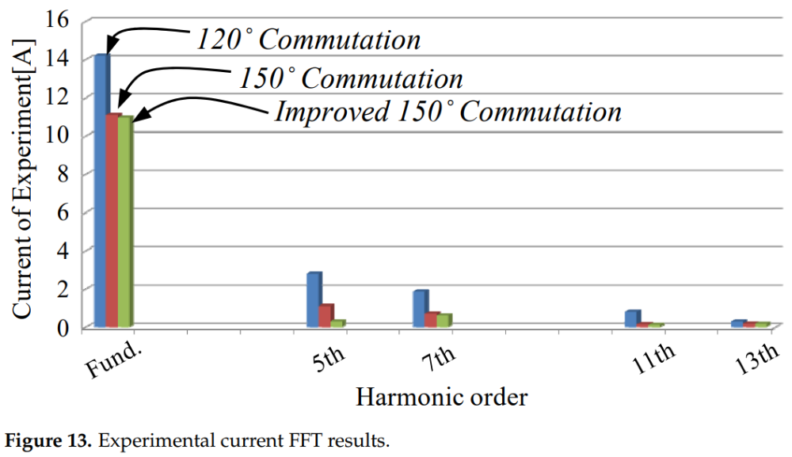
    
    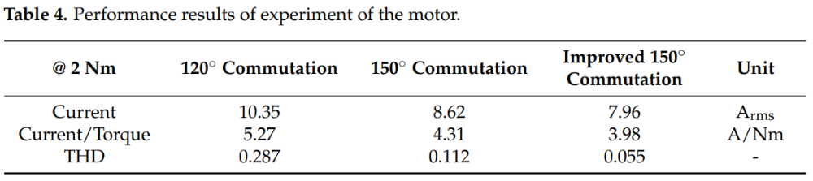
    
4.  噪音更小：最后，科学家们把它放进消音室里“听诊”，看下表的数据：  
    
    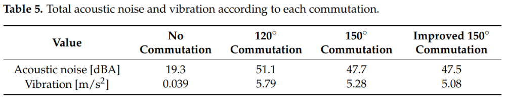
    

1.  120°法噪音：51.1 dBA  
    
2.  改进150°法噪音：47.5 dBA
    

这看似只低了3.6 dBA，但在人耳听来，安静程度的改善是非常明显的！

总结

好了，我们来总结一下。今天我们学习了一个让BLDC电机更安静、更省电的“黑科技”。它的核心思想就是：

通过软件算法的优化，巧妙地控制电机控制器中已有的开关（PWM），在不增加任何硬件成本的前提下，让驱动电机的“推力”变得更平滑、更接近理想的正弦波。

这就像一个武林高手，他不需要换更重的武器，只需要改变自己的内力心法，就能让同样的招式发挥出几倍的威力。

科学的魅力就在于此。很多时候，推动技术进步的，不一定是更昂贵的材料或更复杂的机器，而可能仅仅是一个更聪明的想法，一个更优雅的数学模型。这就是智慧的力量！

  

  

参考文献：

\[1\] Jin C S , Kim C M , Kim I J ,et al.Proposed Commutation Method for Performance Improvement of Brushless DC Motor\[J\].Energies, 2021, 14.DOI:10.3390/en14196023.

文档链接： https://pan.baidu.com/s/1hGSzmhMrwKzivi4lEzgSeQ?pwd=1cxr 提取码: 1cxr