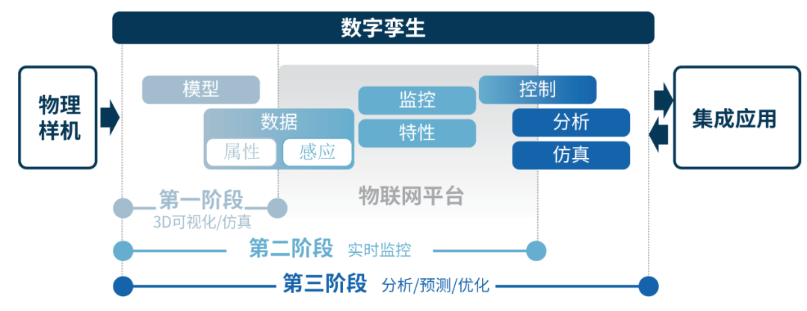
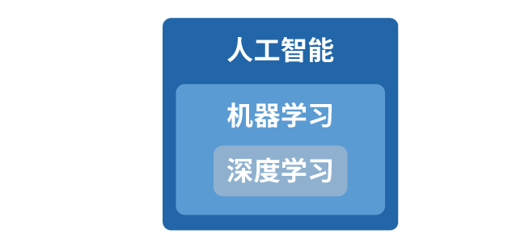
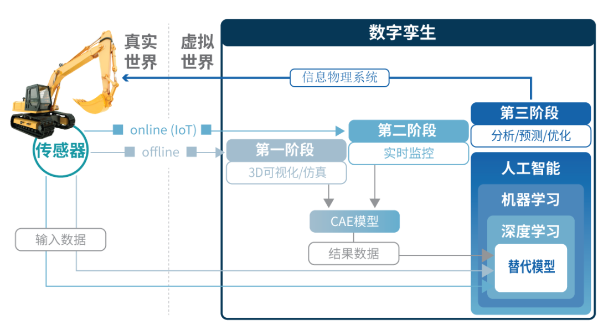

# CAE与人工智能

> 原文地址: [https://mp.weixin.qq.com/s/yhEbOG2fQYjDXxQaDL28pg](https://mp.weixin.qq.com/s/yhEbOG2fQYjDXxQaDL28pg)

CAE有哪些术语呢？虽然我们无法估算确切的时间，但是从某一个时刻开始在脑海中有关CAE这个词语的性质貌似发生了一些变化。之前提到CAE脑子里就会浮现出诸如有限元，多体动力学，疲劳分析，计算热流体分析，优化设计，自动化等词语。现在再提到CAE的话，出现的则是人工智能，机器学习，数据科学，物联网（loT），未来战士模型等词汇。  

把这些词语联合在一起观察后我们可以发现它们还是有一些区别的。它们其中的一部分可以归为“CAE术语”而另一部分则可以归为“第四次工业革命的术语”中去。

第四次工程革命中的这些术语与CAE有什么关系？为了回答这个问题，作者尝试着总结了一些相关术语的定义。在此，从事CAE领域的工程师可以将此文与自身业务的内容相结合进行一些业务创新的思考。即使是刚刚听到CAE的朋友们也可以通过此文了解一下最近经常从媒体中听到这些词语到底是什么意思，希望此文可以使大家对CAE领域有一些初步的认识。

  

#### 1\. 仿真 (Simulation)

在网上搜索“仿真”这个词会有“使用物理或抽象系统模型模仿真实系统进行试验研究。它是基于实际模型的物理仿真和数学模型在计算机上进行的仿真分析。一般用于工程设计和社会现象的分析，是一种只能通过计算机处理的高速解析大量数值计算的实时仿真分析。”等类似的表达。

这里说的仿真，也可以说是“模拟试验”。在模拟试验中，基于计算机的模拟称为计算机仿真。特别是用于设计和分析的计算机仿真成为计算机辅助工程(Computer Aided Engineering, CAE) 的产品。换句话说，CAE可以简单的总结成是计算机仿真中的一种。

  

#### 2\. 数字孪生 (Digital Twin)

数字孪生是美国通用电气最开始倡导的概念，该技术通过在计算机上创建与真实物理样机相同的“孪生模型”并模拟在现实生活中可能出现的情况，以这种方法进行计算机仿真来预测结果。  

无独有偶，高德纳咨询公司(Gartner)的资料也给出了数字孪生的现实阶段应分为 1\. 3D可视化阶段；2. 实时监控阶段；3. 分析、预测、优化阶段。  

区分第一阶段和第二阶段主要看获取模型中输入数据的方法是否联机在线。在脱机状态下应用以预先仿真及相关3D可视化的工作视为第一阶段。通过传感器获得的数据通过物联网(loT)平台联机在线反映在模型中的阶段视为第二阶段。在此阶段，物理样机与模型所经历的开始变的完全相同，最终完成1:1匹配。第三阶段是指工程师可以通过已知的数据来预测下一步的结果。  

  

  

( [https://blog.lgcns.com/1864](https://blog.lgcns.com/1864) )  

<实现数字孪生的各个阶段 > 参考: Gartner, Use the IoT Platform Reference Model to Plan Your IoT business solutions, ’16.09.17>

  

#### 3\. 信息物理系统(Cyber Physical System, CPS)

信息物理系统不像数字孪生那样耳熟能详，但是CPS却是它的特属术语。CPS是指利用计算机通讯控制物理系统的综合系统。如果要更详细的说明，那就是用计算机算法控制机制或者监控整个系统。在CPS中实际物理系统和软件也可以相互作用。

对于CPS的解释与数字孪生看似相近，但是二者又有何不同呢？KCERN主办的“数字孪生与智能转换”为主题的论坛资料中介绍了二者的不同之处。

-   在数据化部分，积累所收集的数据并构筑与现实1:1的虚拟世界的是数字孪生。
    
-   与数字孪生构筑虚拟世界的方式不同，CPS是在数字孪生的基础上进一步扩展，将虚拟世界与现实紧密连接起来。
    
-   CPS是将数字孪生在虚拟世界中优化的价值现实化的过程。该过程应用的就是分析数据人工智能和将虚拟世界现实化的技术。
    

根据以上说明，我们可以说数字孪生是将现实虚拟化，而CPS则是把虚拟现实化。 

  

#### 4\. 元模型 (Meta Model)

之前提及的CPS可以称为系统的系统(system of systems)。与此相反，在这个章节中我们说明的是元模型(Meta Model)和替代模型( Surrogate Model)被称作模型的模型(a model of a model)。在此，系统中的系统是指将系统捆绑在一起，视系统的复杂度增加。但是模型中的模型则是指把模型变的简单。人们使用近似法(Approximation method)以便使模型变的简单。因为有时人们也称元模型为 近似模型(Approximation model) 。也就是说近似模型是指将模型再次简化的意思。

近似模型多用于优化中，在优化过程中，由于利用实际模型计算的反复次数增加，所需要的时间可能会很长，所以利用近似模型来缩短计算时间。  

上面说明过的CAE使用的模型，目的是要得出正确的结果。因此如果使用计算密集型方法，即尽量精确的进行细致的模型设计而导致计算量和计算时间增大的计算密集型(computation-intensive)方法进行优化的话，根据情况，所需的时间会延长到几个月，如此长的计算时间在工作中是非常难实现的。  

因此在优化设计中使用的是近似模型，而不是计算密集型模型。通过使用这种近似模型，可以大幅减少优化所需要的时间。特别是优化使用的近似模型称之为元模型。  

制作元模型时，不管使用了什么样的仿真模型和方法，我们只关注和使用这个系统的反应。输入和反应生成元模型，并以此执行优化，这种方法被称为基于近似的优化法（approximation based optimization）

  

#### 5\. 替代模型 (Surrogate Model)

替代模型与元模型，响应面模型都被称为是近似模型(Response surface model)的方法之一。与介绍元模型的形式类似，近似模型是原始模型再进行一次建模的模型。

替代模型以数据为基础，使用bottom-up方法。同时它不关注仿真内部逻辑如何工作，而只关注输入和输出的结果。使用设计变量的结果构成模型。因为这些特性，又称行为建模(Behavioral modeling)或黑箱建模(Black-box modeling)。在这种情况下，如果设计变量只有一个，就称为曲线拟合(curve fitting) -  引自, 维基百科

元模型与替代模型在概念上的意义相同。虽然是意义相同的术语，但是元模型在优化设计中使用的比较多，替代模型的话相比优化设计来讲，它更多的应用于广义的工程领域中。

  

#### 6\. 深度学习 (Deep learning)

美国印第安纳大学(IU)的Cho教授在<大家的深度学习>一书中对人工智能，机器学习以及深度学习等等做出了如下说明：

深度学习是数十年来研究人员创造人工智能研究成果的结晶。在研究人工智能做出类似于人类决策时，我们发现使用现存数据预测未来情况的机器学习技术是非常有效的。在此，机器学习计算机中有几个算法，其中效果表现优秀的是深度学习。人工智能，机器学习和深度学习之间的关系，如下图所示。机器学习属于人工智能的一大类，深度学习又是其中的一部分。

  

       < 人工智能, 机器学习, 深度学习的关系 >

  

#### 7\. 机器学习 (Machine learning)

机器学习是人工智能的一个领域，它是使计算机能够学习的算法和技术。例如，机器学习可以训练用户识别接收的电子邮件是否是垃圾邮件，通过使其学习大量仿真结果，可以开发一个算法来判断结果的优良与否。

机器学习和数据挖掘(Data Mining)使用的是相同的方法。在计算机科学中被称为机器学习，但是在统计学中则被称为数据挖掘。如果一定要将机器学习和数据挖掘区分开的话，那么数据挖掘的目的是在现存的数据中心发现图像和特性，而机器学习的目的则是通过现存的数据进行学习后， 得到对新数据的预测值 。-  引自 维基书籍, Kim Eui Joong著 《人工智能，机器学习和深度学习入门》

  

#### 8\. 人工智能 (Artificial Intelligence, AI)

对于人工智能，许多专家根据不同的观点给出了多种定义。斯图尔特·罗素和彼得·诺维克在《人工智能：现代方法：A Modern Approach》一书中将人工智能定义为四个：

类似于人类的思维系统

类似于人类的行为系统

理想的思维系统

理想的行为系统

  

迄今为止，人工智能研究最活跃的领域是“类似于人类的行为系统”。例如，自然语言处理，图像识别，语音识别，机器翻译，计算机视觉，机器人等。

事实上人工智能已经比我们想象的更贴近我们的生活了。从手机上给花朵拍照就能知道花朵的名字，再到iPhone上的Siri等语言处理语音助理系统，都是使用人工智能的解决方案。

但是最重要的是，人工智能为人们所熟知的原因是美国谷歌公司的人工智能产品-AlphaGo与人类的围棋比赛。在这场人机对抗中，人工智能完胜人类的同时也给一些人造成了危机感，从而使整个社会产生了一种对于危机意识。

  

#### 9\. 预测与健康管理 (Prognostics and Health Management, PHM)

PHM技术师一种通过收集一些机器，设备，航空，发电厂等状态信息来检测系统异常情况，并通过分析和预测提前预判故障点来优化设施管理的技术 。-  引自, 韩国PHM学会网站 [http://www.phm.or.kr/](http://www.phm.or.kr/)

   PHM是实时监控机器状态，以预先检测振动和磨损等异常情况，并预测将来可能发生的故障。提前预测故障的好处是可以预先采取适当的操作，减少不必要的维护成本并提高可靠性。

为了实时监控，与数字孪生和网络物理系统一样，在PHM中传感器和loT也很重要。并且人工智能在其中也尤为重要，特别是机器学习可以被用来预测。

1980年英国民航局(CAA)的某型直升机事故率是普通飞机的30倍，为了解决其安全性问题，进行了PHM研究。CAA开发出了一种观察直升机安全性的HUMS (Health & Usage Monitoring System)系统，并将其应用于该型直升机上，结果事故率下降了50%。

基于以上这9个术语的定义，我们总结了下面的图片和说明

< CAE与人工智能>

  

-   仿真将现实世界中的目标带入虚拟世界并进行模拟试验。
    
-   将现实世界的目标带入虚拟世界的方法是创建模型。
    
-   因此，将现实世界与虚拟世界分来的标准是模型。
    
-   从CAE的角度来看，虚拟世界是数字孪生。
    
-   数字孪生有三个步骤。
    
-   当下的CAE可以视为第一阶段，因为大多数CAE都是脱机接收并输入的数据。
    
-   第二阶段如第一阶段同样计算密集型CAE模型，但却是通过loT在线接收输入数据。
    
-   第三阶段则是从模型结果进行预测。
    
-   预测使用机器学习进行。机器学习是人工智能的一个分支。
    
-   机器学习与替代模型一样，通过分析给定输入和输出数据之间的相关性来预测。
    
-   机器学习需要持续的提供新的数据来使其一直学习。
    
-   CAE可用于提供给机器学习所需的数据集。
    
-   信息物理系统(CPS)负责将数字孪生预测的结果应用于现实世界。
    
-   例如，数字孪生负责检测机器或者工厂的故障情况并预测故障(PHM)，信息物理系统则负责根据预测的内容降低速度或停止工作来避免出现问题。
    

  

从目前的情况来看，CAE在预防事故和故障以及确保用户和机器安全方面的重要性越来越大。将来的CAE将会包含在人工智能中的一个部分。由于通过人工智能进行预测的执行阶段需要快速响应速度，因此模型的模型(替代模型)很可能将被使用。此时，机器学习需要通过持续学习来扩充其模型，以提高预测的准确性。为此，我们必须使用高精度的CAE来提供可靠的数据。

作为结尾语，CAE终究将会被植入到人工智能中去。CAE也会一直在人工智能中存在和发挥不可替代的重要作用。

  

  

作者: FunctionBay总部 中国事业本部长 车泰辂

  

* * *

  

