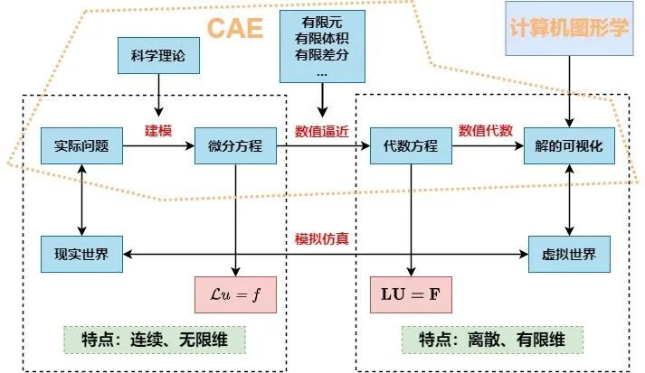

# CAE数值模拟仿真本质上是计算机图形学技术的延伸吗？

> 原文地址: [https://mp.weixin.qq.com/s/OUec03o9WoIcPvaK9p1QLw](https://mp.weixin.qq.com/s/OUec03o9WoIcPvaK9p1QLw)

## 

  

# 提问

个人理解，在计算机图形学构建的3D建模基础上，赋予每一个点除xyz三轴坐标以外的其他属性，比如质量、温度、弹性、动量等物理量作为重要度量，并且赋予重力加速度、电场、磁场等环境场力的作用，如此一来就可以模拟仿真出整体物体的运动状态、碰撞体积等要素。

这样来看，是否能认为CAE数值模拟仿真跟计算机图形学在本质上是一类技术，只不过可能CAE的物理仿真要更加完整？

# 一己之见，欢迎拍砖

CAE数值模拟仿真（Computer Aided Engineering）和计算机图形学是两个不同的领域，将其中一个说成是另一个的延伸肯定是不合理的。它们之间存在一些明显的区别，可以从目标、方法、输出结果和应用领域 4 个方面来分析。

## 目标差异

-   **CAE数值模拟仿真**：CAE的主要目标是通过数值方法来模拟和分析物理现象，如结构的力学行为、流体动力学、热传导等。它侧重于预测和优化产品或结构在实际使用中的表现。
    
-   **计算机图形学**：计算机图形学的目标是创建和操作图像和几何模型，以及将这些模型转换为视觉图像。它侧重于图形的生成、渲染、动画和交互，以及提供视觉上吸引人的输出。
    

## 方法差异

-   **CAE数值模拟仿真**：CAE使用数学模型和算法来模拟现实世界中的物理过程。这通常涉及到有限元分析（FEA）、计算流体动力学（CFD）等技术，以及对物理定律（如牛顿运动定律、热力学定律）的数值解。
    
-   **计算机图形学**：计算机图形学使用几何建模、图形算法和渲染技术来处理和显示图形。这包括使用光线追踪、光栅化、纹理映射等技术来生成逼真的图像和动画。
    

## 输出结果差异

-   **CAE数值模拟仿真**：CAE的输出通常是数据和图表，如应力分布图、位移云图、温度分布等，这些输出对于工程师分析和理解结构性能至关重要。
    
-   **计算机图形学**：计算机图形学的输出是视觉图像，这些图像可以是静态的或动态的，用于展示模型的外观、场景的视觉效果或动画的播放。
    

## 应用领域差异

-   **CAE数值模拟仿真**：CAE的应用主要集中在工程领域，如机械工程、土木工程、航空航天工程等，用于产品设计、性能测试和优化。
    
-   **计算机图形学**：计算机图形学的应用更为广泛，不仅在工程领域，还包括电影和游戏制作、虚拟现实、数据可视化、用户界面设计等多个领域。
    

 

尽管CAE和计算机图形学在目标和方法上有所不同，但它们在实际应用中往往是**互补的**。例如，在产品设计过程中，CAE可以提供结构分析的结果，而计算机图形学则可以将这些结果以图形的形式展现出来，使得设计和分析过程更加直观和高效。同样，一些图形学软件也开始集成简单的CAE数值分析工具，制作某些特殊场景的视觉效果。

一图抵千言，从数值仿真的角度出发，CAE和计算机图形学之间的关系大概是下面的样子，希望能对你有所启发。

说明：此图源自林群老师的《微分方程数值解法基础教程》，略加修改。

#   

  推荐阅读