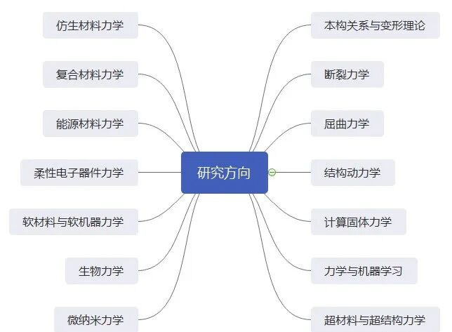
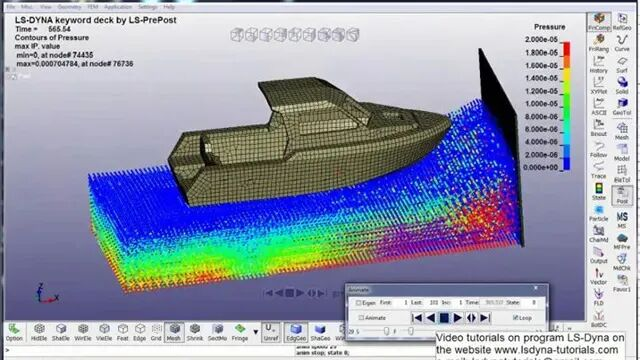
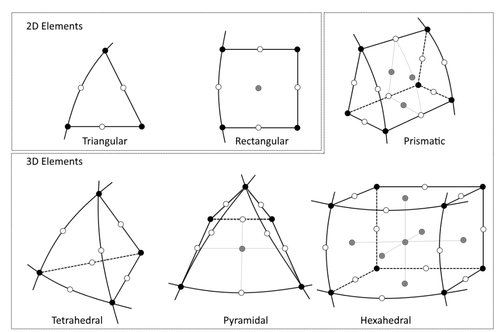
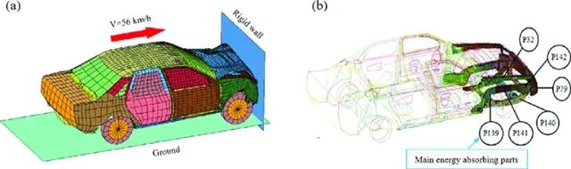

# 如何成为一位卓越的CAE工程师

> 原文地址: [https://mp.weixin.qq.com/s/stAwfT9whu0bUJft0tXofg](https://mp.weixin.qq.com/s/stAwfT9whu0bUJft0tXofg)

点击上方「蓝字」关注我们

 嗨，朋友们，在这个科技日新月异的时代，有一群幕后英雄正以他们的智慧之光引领着产品设计与优化的革命，他们就是我们今天要探讨的主角——计算机辅助工程（CAE）工程师。他们是数字世界的塑造者，利用尖端的仿真技术揭开材料性能、结构强度、振动特性等复杂工程问题的秘密。那么，如何才能在CAE的广阔天地里成长为一名杰出的工程师呢？让我们一起探索那些必备的技能与知识吧！

## 坚实的基础，成功的基石

如同大厦之于地基，深厚的理论知识是CAE工程师不可或缺的起点。你需要深入骨髓地掌握固体力学、结构力学、材料科学的基础理论，就如同它们是你身体的一部分。同时，透彻理解不同的材料行为、载荷类型以及边界条件的应用原理，特别是当你面临结构优化、疲劳分析等多学科交叉的挑战时，这些知识将成为你手中的利剑。

  

## 软件操作，技艺精通

如同名厨之于厨具，CAE工程师对于仿真软件的熟练操作至关重要。无论是ANSYS、ABAQUS、SolidWorks Simulation还是NX Nastran，你都应如臂使指，灵活运用。从几何建模到网格划分，从求解设置到结果后处理，每一步都要精雕细琢，做到游刃有余。

## 数值方法与编程，硬核实力

CAE仿真常常伴随着复杂的数学运算，因此，掌握Fortran、MATLAB或Python等编程语言是必备技能。了解有限元分析、有限体积法等数值计算的核心，能够让你在实战中快速定位最佳路径，精准调优，确保模拟结果既准确又高效。

## 数据解读，洞见未来

完成仿真只是第一步，从浩瀚的数据中提炼出金子才是关键。你需具备敏锐的数据分析能力，利用可视化工具清晰展示结果，结合实际工况做深度解读，提出创新的改进方案，这考验着你的综合分析智慧。

## 持续学习，与时俱进

CAE领域不断进步，新材料、新算法、新工具层出不穷。优秀的CAE工程师应具备自主学习的意愿和能力，紧跟行业脉搏，不断充实自我，保持专业素养的领先。

## 实战经验，解决问题的钥匙

理论与实践并重，CAE工程师需积累丰富的案例经验，将理论知识融入实际问题，找到最优化的设计方案。每一次实战都是能力的磨砺，每一次成功都是经验的累积。

## 科学精神与逻辑思维

CAE工作容不得半点马虎，每一项参数的设定、每一次结果的解读都需要严谨的科学态度和严密的逻辑推理。评估模型的合理性和验证结果的准确性，进行敏感性分析，这些都需要你具备批判性的思考。

## 有效沟通与项目管理

优秀的CAE工程师不仅是技术专家，也是沟通高手。清晰的报告撰写和成果展示能力，使得非专业人士也能快速理解仿真价值，推动项目高效执行。同时，团队协作与项目管理能力让你在跨部门合作中游刃有余，确保技术方案的无缝对接与落地。

* * *

综上所述，成为一名卓越的CAE工程师，既要有坚实的理论基础，也要具备实战的软件操作与编程技能；既要有数据分析的洞察力，也需要良好的团队协作与项目管理能力。在这个充满挑战的CAE领域，唯有不断学习与实践，方能在技术的浪潮中乘风破浪，成为真正的“大师”。

  

## 推荐阅读

  

**FEtch 系统**是笔者团队开发的新一代有限元软件开发平台。只需按照有限元语言格式填写脚本文件，即可在线自动生成基于**现代 Fortran** 的有限元计算程序，从而大幅提高 CAE 软件的开发效率。欢迎私信交流。

有任何疑问或建议，欢迎加Q群 "**FEtch有限元开发系统(519166061)**" 留言讨论。我们长期开展 FEtch 系统的试用活动，感兴趣的朋友入群后可直接联系管理员，免费获取**许可证文件**。