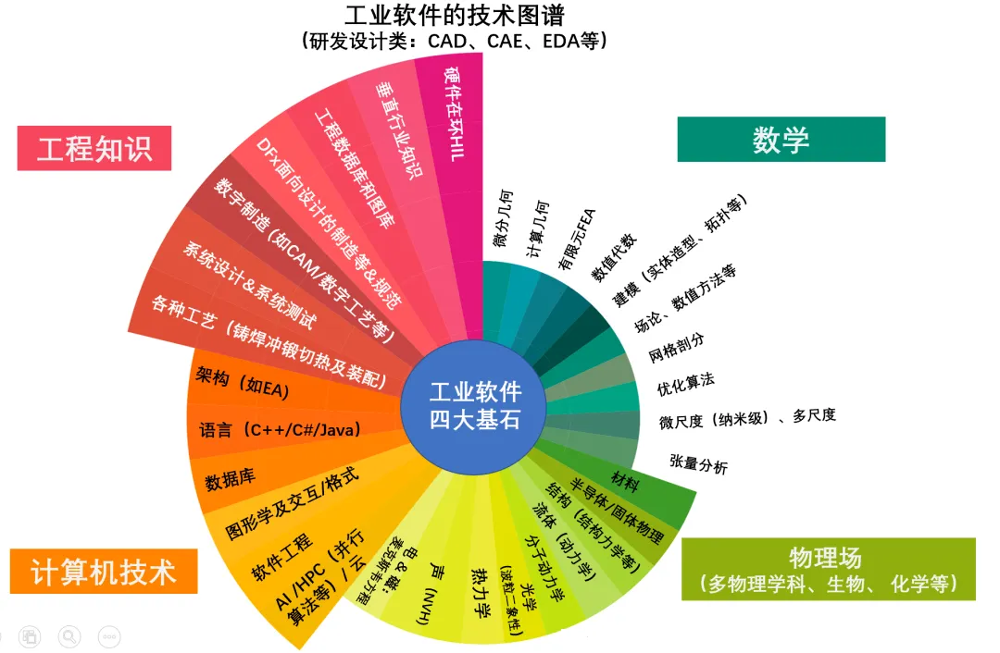
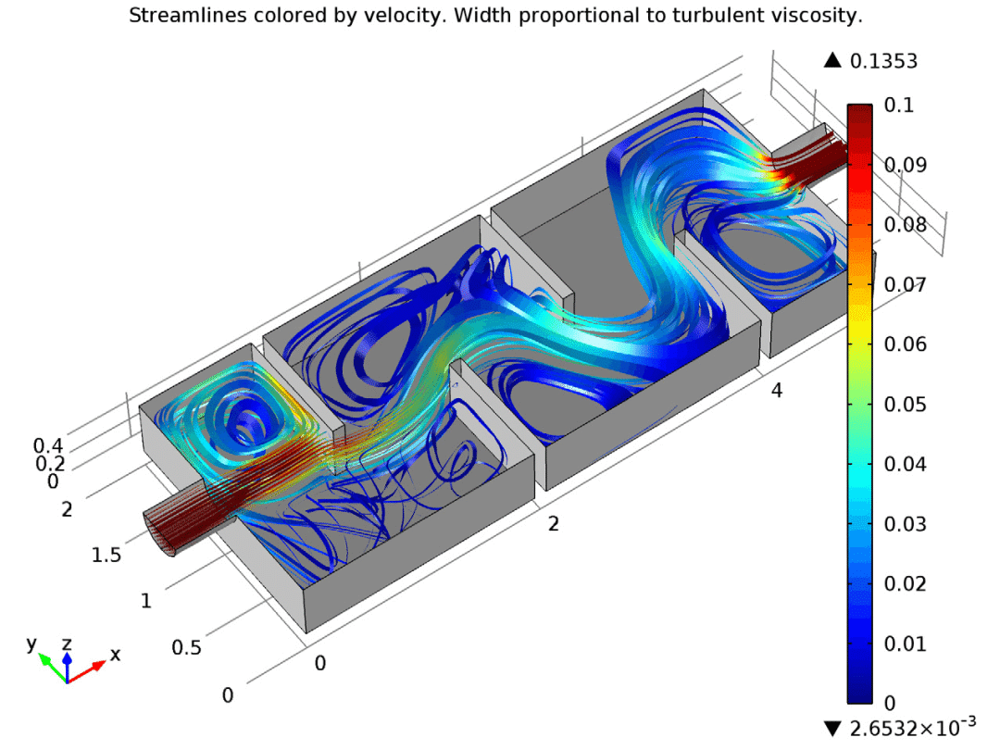
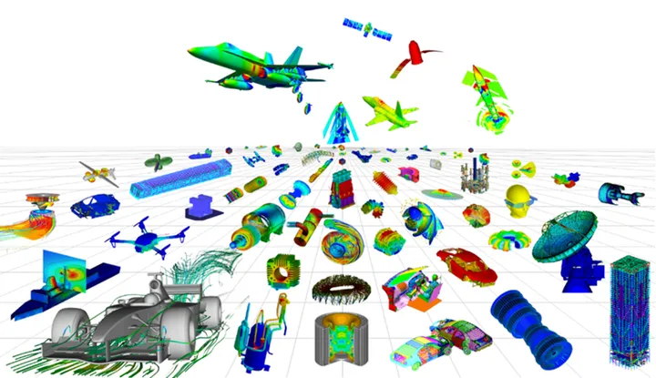
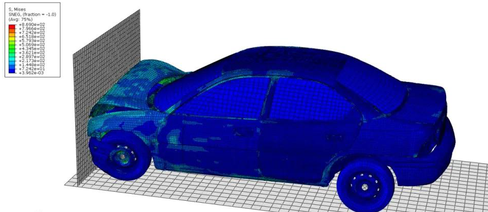
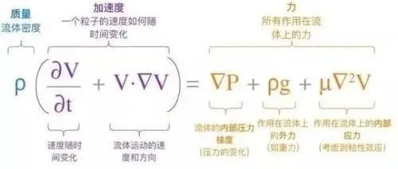
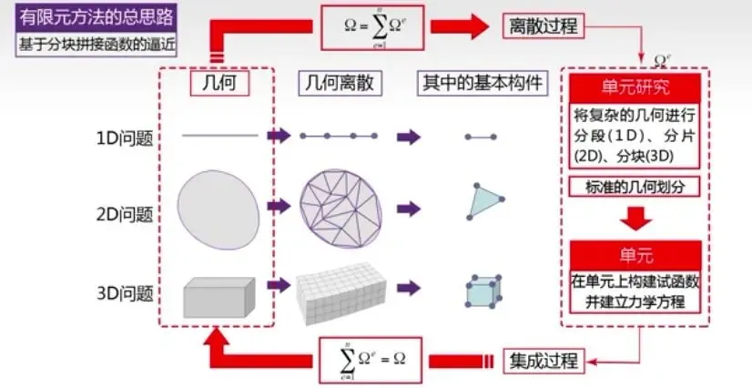
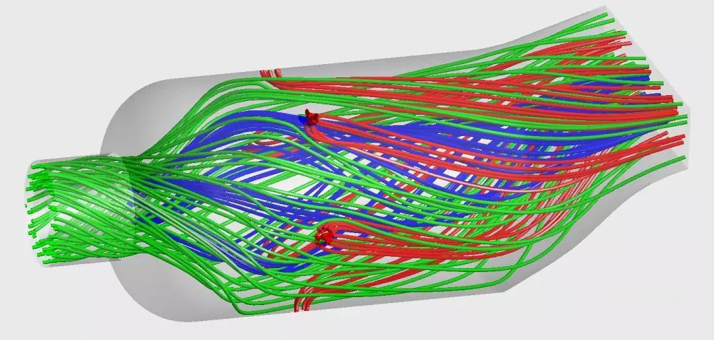
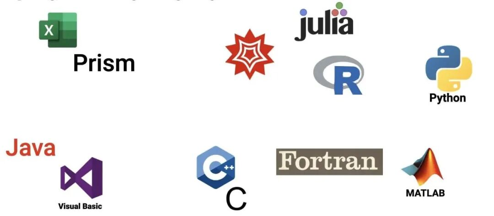
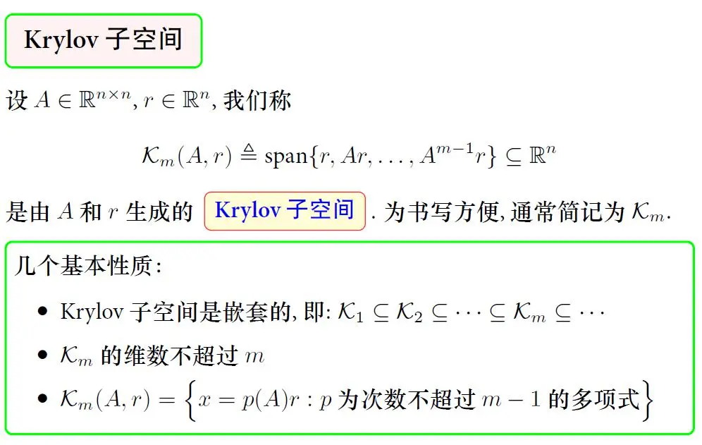
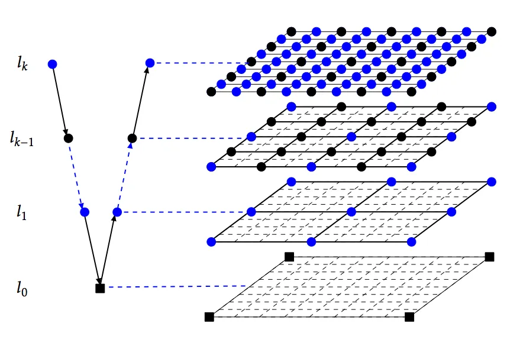

# 工业CAE软件的底层内核——求解器

> 原文地址: [https://mp.weixin.qq.com/s/NXO7lDc3rCHUNTVP5X9AsQ](https://mp.weixin.qq.com/s/NXO7lDc3rCHUNTVP5X9AsQ)

  

工业CAE（计算机辅助工程）软件在现代制造业和科学研究中扮演着至关重要的角色。这些软件通过模拟物理现象，如流体流动、温度传播和结构变形等，帮助工程师和科学家们预测并优化产品设计。然而，尽管用户界面、图形展示和数据库管理等功能是工业CAE软件的重要组成部分，真正决定其核心竞争力的是其最底层的技术——求解器。本文将深入探讨工业CAE软件的这一关键组成部分，揭示其背后的“黑科技”。

## 求解器的基本概念

求解器的工作原理可以类比于日常生活中使用的计算器，但其内部运作机制要复杂得多。当我们在计算器上输入若干数字和运算符后，计算器会自动进行计算并显示结果。这个过程中，所有与计算相关的操作都在计算器内部完成，使用者无法直接观察或监控具体的运算步骤，就像一个“黑盒子”。类似地，工业CAE软件中的求解器也具有这种特性，只不过它的计算任务更加繁重和复杂。

具体来说，求解器的任务是对物理问题进行数值模拟。以流体力学为例，求解器的目标是模拟液体或气体在三维空间中的流动行为。这意味着它不仅要处理大量的代数运算，还需要考虑时间维度上的变化。每一个小的局部位置在特定时间点上都涉及到复杂的物理方程组的求解。例如，流体力学中的Navier-Stokes方程（NS方程）和连续性方程，它们描述了流体的速度、压力和质量守恒关系。求解器必须将这些方程转化为适合计算机处理的形式，并通过数值方法逐步逼近真实解。

与简单的计算器相比，求解器面临的挑战在于其计算规模巨大。以不可压缩流体为例，如果一个物理模型经过网格离散后获得了1000万个网格单元，那么相应的描述物理现象的方程组就有1000万套。这意味着在每一个演化步中，求解器需要同时求解大量方程组，这不仅要求高效的算法设计，还需要强大的计算资源支持。此外，求解器还需具备良好的稳定性和收敛性，以确保在面对复杂物理现象时仍能给出可靠的计算结果。

总的来说，求解器的工作原理不仅涵盖了从物理原理到数学方程再到数值算法的全过程，还需要结合高性能计算技术，才能实现对真实物理现象的高精度模拟。正是由于这些复杂而精细的设计，求解器才得以成为工业CAE软件中不可或缺的核心组件。

## 发展历程与应用背景

求解器的发展历程可以追溯到20世纪中叶，当时科学家们开始尝试用数值方法来解决流体力学和其他物理问题。早期的研究主要集中在简化模型上，如线性方程组和二维问题，随着计算机技术的进步，逐渐扩展到更复杂的三维非线性问题。例如，1960年代，NASA在阿波罗计划中首次使用有限元法进行结构分析，这标志着现代求解器的雏形诞生。

在工业应用方面，求解器的应用范围极其广泛。以汽车制造业为例，求解器可以帮助工程师们模拟车辆碰撞时的安全性能，评估材料强度，优化车身结构。在航空航天领域，求解器则用于分析飞行器在不同环境下的气动特性，确保其在极端条件下的稳定性和可靠性。此外，建筑行业利用求解器进行风洞测试，模拟建筑物在强风作用下的响应，以提升建筑设计的安全性和舒适性。

求解器之所以成为CAE软件的核心，是因为它直接决定了模拟结果的准确性和可靠性。一个优秀的求解器不仅能够高效处理大规模数据，还能在多种复杂条件下保持稳定性。因此，研究和开发高性能的求解器一直是学术界和工业界的共同目标。

## 流体力学求解器的开发过程

为了更好地理解求解器的开发过程，我们可以以流体力学求解器为例进行详细解析。流体力学求解器的主要任务是模拟流体在三维空间中的运动特性，包括速度、压力和形态等随时间的演化过程。这一过程涉及多个步骤，从物理原理的理解到数学方法的选择，再到具体的数值计算实现。

首先，开发者需要深入理解描述流动过程的物理原理。对于液体流动而言，最基本的物理规律是动量守恒和质量守恒。这些物理规律可以通过两个核心方程来描述：Navier-Stokes方程（NS方程）和连续性方程。NS方程描述了流体在空间中的动量变化，而连续性方程则保证了流体的质量守恒。由于自然界中的流动通常发生在三维空间中，因此需要将NS方程分解为沿X、Y、Z三个坐标轴的速度变量，形成一套完备的偏微分方程组。

接下来，如何求解这套方程组成为了关键问题。传统上，人们希望通过理论推导获得精确解，但在大多数实际情况下，这种方法难以实现。因此，数值计算成为主流手段。数值计算一般分为三个环节：模型离散、条件设定和求解过程本身。

**模型离散**是将复杂的物理模型转换为计算机可处理的形式。这一过程通常采用有限差分法、有限元法或有限体积法等方法。无论采用哪种方法，其目的都是将连续的空间分割成许多小的离散单元。这些单元构成了所谓的网格，类似于人体与细胞的关系。每个单元内部的物理属性被假设为均匀分布，从而简化了原本复杂的连续问题。例如，在模拟空气动力学问题时，可以将飞机周围的空气域划分为数百万个小立方体，每个立方体内的流速、压力等参数都可以独立计算。

**条件设定**是数值计算中的另一个关键步骤。它包括设置材料的热物性参数、初始条件和边界条件等。初始条件指的是模拟开始时的状态，如初始流速和压力分布；边界条件则定义了计算区域边缘的物理状态，如进出口的流速和压力。正确的边界条件设定对于避免“垃圾进-垃圾出”的问题至关重要。例如，在模拟燃烧室内的火焰传播时，如果未能准确设定燃料和氧气的供应速率，整个模拟结果将会严重失真。

**求解过程本身**则是通过编码的数值算法在计算机硬件上的逐步运行。这个过程通常涉及大量的代数运算和矩阵求解。以泊松方程为例，它是许多流体力学问题求解的核心部分。泊松方程属于椭圆型偏微分方程，其求解难度较大，尤其是在高维空间中。为此，研究人员开发了多种高效算法，如GMRES算法和多重网格算法。尽管这些算法在某些情况下表现出色，但它们仍然面临一些挑战，特别是在处理奇异矩阵和大尺度问题时。

以上三个环节中，只有条件设定是完全依托于使用者的，模型离散和求解过程都可以且应该实现自动化。

我们把以上两个过程（描述物理规律的偏微分方程和数值算法）联系起来，通过计算机编码（如C、C++和Fortran）实现成计算机可以识别的语言，也就是计算机程序，最终通过特定计算机硬件平台和操作系统就可以实现对物理问题的求解了。

在实际应用中，求解器的**鲁棒性**和**计算效率**往往成为制约其性能的关键因素。一方面，求解器需要具备良好的鲁棒性，能够在各种复杂条件下保持稳定，避免因系数矩阵奇异而导致计算中断。另一方面，计算效率也是不可忽视的因素，尤其是在处理大规模工程问题时，如何在合理的时间内完成计算变得尤为重要。为此，研究人员不断探索新的算法和技术，力求在保持准确性的同时提高计算速度。

总的来说，数值计算的各个环节相互依存，任何一个环节出现问题都会影响最终的模拟结果。因此，在开发求解器的过程中，必须注重细节，确保每个环节都得到妥善处理，这样才能为工业应用提供可靠的支撑。

## 高效求解方法及其挑战

在求解器的开发过程中，高效求解方法的选择至关重要。当前，两种广泛应用的方法是GMRES算法和多重网格算法。这两种算法各有特点，适用于不同的应用场景，但也面临着各自的挑战。

**GMRES算法**（Generalized Minimal Residual Method）是一种基于 Krylov 子空间方法的迭代求解器，特别适合于求解大型稀疏线性方程组。该算法的核心思想是通过建立正交坐标系来表达最终的解。具体来说，GMRES算法在每次迭代过程中，构建一个Krylov子空间，并在这个子空间内寻找最佳近似解。该算法的主要优点在于其收敛速度快，尤其在处理中小型问题时表现尤为出色。然而，随着问题规模的增大，GMRES算法的效率会显著下降，这是因为正交坐标系的构建过程变得越来越复杂，尤其是在处理大规模稀疏矩阵时，计算精度和效率之间的平衡变得更加困难。

**多重网格算法**（Multigrid Method）则采取了一种截然不同的策略，通过引入不同尺寸的网格层级来提高求解效率。这种多级网格结构允许算法在粗网格上消除较大的误差，而在细网格上修正较小的误差，类似于电视屏幕分辨率的概念。具体来说，当分辨率较低时，图像显得粗糙，而高分辨率则能呈现清晰的画面。多重网格算法巧妙地利用了这一点，在求解线性方程组时能够更加高效地滤除计算误差，从而显著加快求解速度。然而，多重网格算法也有其局限性，尤其是在处理奇异性较强的矩阵时，收敛性问题依然存在。此外，多重网格算法的实现相对复杂，需要精心设计网格层次和转移算子，增加了开发难度。

除了上述两种算法外，其他经典算法如共轭梯度法、SVD分解和幂指数迭代法也在特定场景下表现出色。共轭梯度法适用于对称正定矩阵的求解，具有较快的收敛速度和较低的存储需求；SVD分解则擅长处理欠定或超定方程组，常用于数据分析和信号处理领域；幂指数迭代法则适用于特征值问题，广泛应用于量子力学和振动分析等领域。然而，这些算法同样面临各自的挑战，如共轭梯度法对矩阵性质要求较高，SVD分解计算复杂度较高等。

综上所述，尽管现有的高效求解方法在一定程度上提高了计算效率，但面对实际工程问题中的复杂性和多样性，仍然存在诸多挑战。未来的研究方向应着眼于开发更具通用性和鲁棒性的算法，同时结合硬件加速技术（如GPU并行计算），以应对日益增长的大规模计算需求。

## 总结与展望

通过对工业CAE软件求解器的深入探讨，我们可以看到，求解器作为CAE软件的核心组件，其性能直接影响到模拟结果的准确性和可靠性。无论是流体力学、结构力学还是热传导等领域，求解器都在模拟和优化复杂物理现象中发挥着关键作用。然而，开发一个“完美”的求解器是一项极具挑战性的任务，尤其在处理多相紊流、激波等复杂现象时，现有商业软件仍存在诸多不足之处。

未来的发展趋势将聚焦于以下几个方面：首先，算法创新将继续是研究的重点，旨在提高求解器的计算效率和鲁棒性，特别是针对大规模复杂问题。其次，硬件加速技术（如GPU并行计算）的应用将进一步提升求解器的性能，缩短计算时间。此外，人工智能和机器学习技术有望为求解器带来新的突破，通过智能优化和自适应调整，进一步提高模拟精度和稳定性。

总之，工业CAE软件求解器的研发是一个持续演进的过程，伴随着科学技术的进步，求解器将在未来的工程实践中扮演越来越重要的角色，助力各行业实现更高的设计水平和创新能力。

  

往期推荐

[

数值线性代数：科学与工程计算的核心

](http://mp.weixin.qq.com/s?__biz=Mzk0MzI0NDU2NQ==&mid=2247490796&idx=1&sn=85b715aed259b51c4d35ef2d1a5f3b06&chksm=c3378896f440018050c510c0128b281dfc2e4f208a3d6a1d511c99ff7dfaabe975915da2e3fe&scene=21#wechat_redirect)

[

网格剖分：寻找最优解的探索

](http://mp.weixin.qq.com/s?__biz=Mzk0MzI0NDU2NQ==&mid=2247489337&idx=1&sn=a07b1d7fac502a7b7e68ebea1efe3f84&chksm=c3378343f4400a556cfe49992b991e20ec0a9b53ba09d056c8ac67c1d6b667cea380ef4fa3fc&scene=21#wechat_redirect)

[

浅析CAE软件的发展方向：通用与专用之争

](http://mp.weixin.qq.com/s?__biz=Mzk0MzI0NDU2NQ==&mid=2247488140&idx=1&sn=2600421a068a63b25aa21872887a0554&chksm=c33786f6f4400fe052ab0bb93d084c35a6285b76c7e11c75ca272e62104545551aa31169d3d4&scene=21#wechat_redirect)

  

## 推荐阅读

  

  

  

‍

  

  

  

**给我一组控制方程，还你一套专业软件。**我们长期从事多场耦合有限元算法和软件的研发工作，掌握全流程的 CAE 软件开发技能。如果您需要相关的技术服务，非常欢迎私信交流和扫码咨询。

**喜欢****作者******，请点********赞********和在看********

****