# 工业软件三座大山之CAE：全球五大CAE仿真巨头及其仿真软件

> 原文地址: [https://mp.weixin.qq.com/s/S-hRtK9ssngzUD-jNcJGbA](https://mp.weixin.qq.com/s/S-hRtK9ssngzUD-jNcJGbA)

自1963年第一个商业有限元软件公司MSC Software在美国加州诞生以来，经过大约60年的蓬勃发展，各软件公司通过不断的收购与合并，最终形成了少数几家巨头垄断的局面。目前，仿真分析行业基本被五大巨头所垄断：ANSYS、Dassault Systèmes、Altair、MSC Software以及Siemens Industry Software。这些公司不仅在技术上占据领先地位，而且通过不断的收购扩张，形成了涵盖结构、流体、多体动力学、电磁等多个领域的全面产品线。  

#### **1\. 五大CAE软件巨头之ANSYS**

ANSYS 目前市值超过324亿美元，相当于约2100亿人民币，这是一家纯粹依靠软件销售取得如此巨大成就的企业。ANSYS最广为人知的产品是Workbench，这款软件以其简洁易用的界面著称，即使是复杂耦合仿真也能轻松实现。除此之外，ANSYS的核心产品还包括：

-   LS-DYNA：一款强大的显式动力学分析软件，适用于高速碰撞和冲击事件的仿真。
    
-   nCode：专为疲劳分析设计，帮助预测材料在循环载荷下的寿命。
    
-   Fluent：通用流体动力学分析软件，广泛应用于航空航天、汽车、生物医学等领域。
    
-   Maxwell：用于电磁场分析，尤其适合电机、传感器和其他电气设备的设计。
    
    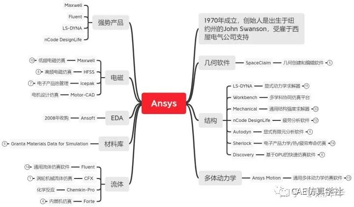
    

####   

#### **2\. 五大CAE软件巨头之Dassault Systèmes**

提到 Dassault Systèmes，很多人首先想到的是制造阵风战斗机的Dassault Aviation，实际上两者同属法国达索集团。Dassault Systèmes最为人熟知的产品包括：

-   ABAQUS：一款广泛应用于汽车、手机等行业的结构分析软件，2015年被Dassault Systèmes收购。
    
-   PowerFLOW：主要用于汽车外流场仿真的流体动力学软件，价格昂贵，通常采用租赁形式。
    
-   CST Studio Suite：用于电磁场仿真的软件，广泛应用于汽车、通信等行业。
    
    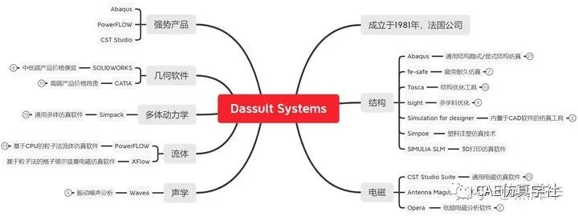
    
      
    

#### **3\. 五大CAE软件巨头之Altair**

Altair 成立于1985年的美国底特律，最初为汽车企业提供咨询服务。随着业务的发展，Altair逐渐涉足软件开发，并凭借独特的商业模式和创新的产品获得了市场认可。其核心产品包括：

-   HyperMesh：一款高性能的前处理工具，因其出色的网格划分能力而闻名。
    
-   OptiStruct：结构优化软件，能够帮助工程师更好地指导设计过程。
    
-   EDEM：用于离散元素方法仿真的工具，适用于颗粒物流动分析。
    
-   PBS：高性能计算管理平台，支持大规模计算任务的调度和监控。
    
    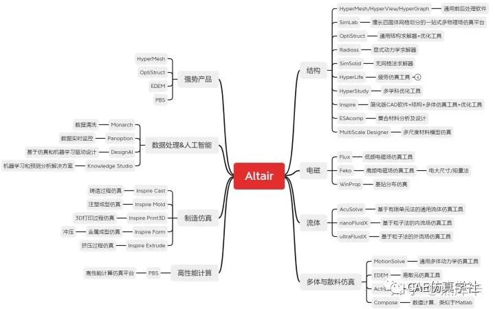  
    

####   

#### **4\. 五大CAE软件巨头之MSC Software**

MSC Software 作为世界上第一个商业有限元软件公司，成立于1963年，曾是NASA的合作伙伴。2017年，MSC Software被瑞典的Hexagon AB以8亿美元的价格收购，但其技术和产品实力依然强大。MSC Software的主要产品包括：

-   MSC.Nastran：汽车、航空以及造船行业的标准仿真分析软件。
    
-   Adams：多体动力学分析软件，广泛应用于汽车、重工和航空航天等领域。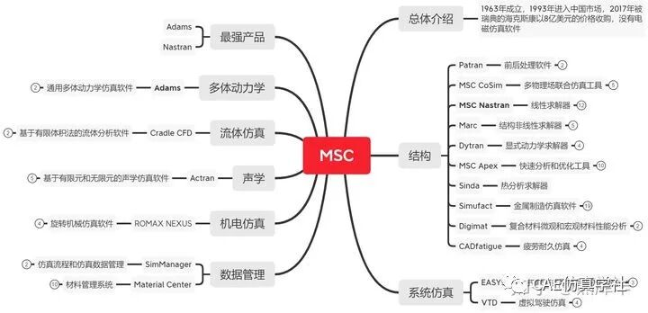
    

#### 

#### **5\. 五大CAE软件巨头之Siemens Industry Software**

作为一家以硬件为主导的德国企业， Siemens Industry Software 在仿真软件领域同样有着重要的影响力。Siemens通过一系列关键收购，构建了自己的仿真软件生态系统。其主要产品包括：

-   STAR-CCM+：广泛用于汽车外流场分析的流体动力学软件。
    
-   Flotherm：专门用于电子产品热分析的软件，特别适用于PCB板的设计。
    
-   NX UG：一款强大的CAD软件，与仿真软件紧密集成，提供一体化解决方案。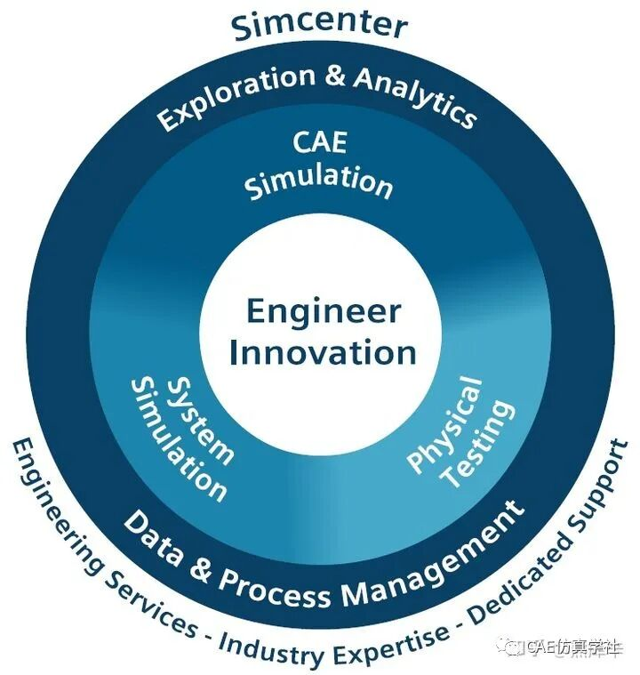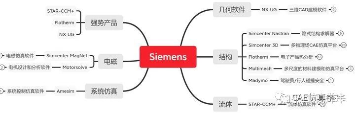
    

####   

#### **行业垄断与技术壁垒**

通过几十年的不断收购与整合，**五大巨头基本上形成了结构+流体+多体+电磁全系列仿真软件的格局**。每个巨头都有自己的拳头产品，这些产品的护城河非常高，后来者想要进入这个市场变得极其困难。例如，ANSYS的LS-DYNA在显式动力学分析领域几乎无人能敌，而Dassault Systèmes的ABAQUS在非线性结构分析方面也有着极高的声誉。

#### **结论**

随着技术的进步和行业需求的变化，这些仿真软件巨头不断进化和完善自己的产品线，以满足日益复杂的工程问题。尽管面临着来自新兴技术和开源软件的挑战，但这些巨头凭借深厚的技术积累和强大的市场地位，仍然主导着仿真分析行业的发展方向。对于希望在这个领域有所建树的新进入者来说，了解这些巨头的历史、产品和技术优势是非常重要的一步。

来源：CAE仿真学社

[

全球10大顶尖软件技术：西门子、达索、PTC等工业软件巨头在列

2024-08-09

](https://mp.weixin.qq.com/s?__biz=MzIwMjMxODAzNA==&mid=2247610557&idx=1&sn=7b364a318aa2866b5dc12eafa0af2905&chksm=96e3f900a1947016272d7c2621753a6f7bb7b6caecf3a01e8c81916bf1675e2e349509c9a07e&scene=21#wechat_redirect)

[

西门子数字化工厂解决方案v2.2 PPT

2024-08-07

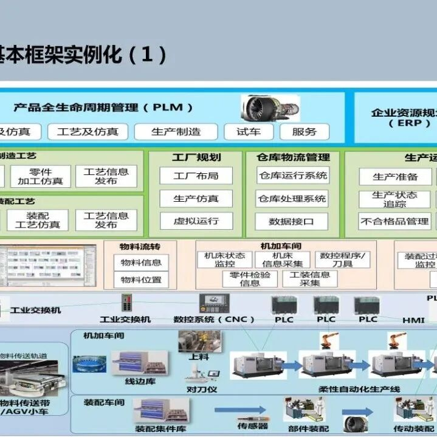

](https://mp.weixin.qq.com/s?__biz=MzIwMjMxODAzNA==&mid=2247610546&idx=1&sn=26380e9ae7b546fcad98773ea1f8ede9&chksm=96e3f90fa1947019c094de0b9ee07ad0fb2882bb04ae6d18ddbcc235091149fd366423e416a4&scene=21#wechat_redirect)

[

91页，中国智能制造产业深度报告

2024-08-05

](https://mp.weixin.qq.com/s?__biz=MzIwMjMxODAzNA==&mid=2247610316&idx=1&sn=196f5bce4f8c2daeb50c23005bc6b117&chksm=96e3e671a1946f67a0caba9441185b9319fdf178c22ede62cd5419591fc975afd67e9f1a199d&scene=21#wechat_redirect)

[

MES行业，就是个大草台班子

2024-08-04

](https://mp.weixin.qq.com/s?__biz=MzIwMjMxODAzNA==&mid=2247610266&idx=1&sn=1418b1e06df473e65ab80e5b383a8731&chksm=96e3e627a1946f3188690477737db6864ad4f0310b6c124c728689d8fa7c9a7add7b2e9bdc74&scene=21#wechat_redirect)

[

MES/MOM系统架构与功能解析

2024-07-30

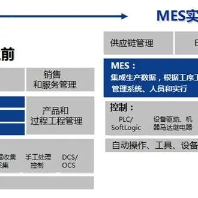

](https://mp.weixin.qq.com/s?__biz=MzIwMjMxODAzNA==&mid=2247610181&idx=1&sn=1828d5fa4a7758cbd3cf30ea2effd6ba&chksm=96e3e6f8a1946feee4f533e08b4e9fa2ecfdf85edc933daf7ca8ab1551f2092578a7c5673bdf&scene=21#wechat_redirect)

[

PLC领域技术人才百万年薪之路

2024-07-31

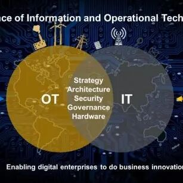

](https://mp.weixin.qq.com/s?__biz=MzIwMjMxODAzNA==&mid=2247610182&idx=1&sn=2c9df1c25e44d9414c4ec65343494cde&chksm=96e3e6fba1946fed47bddee32a7bc4d862160c8a8427761254e9d0e0771b4fa9470e81b9f340&scene=21#wechat_redirect)

[

自动化的苦：IT不懂

2024-07-25

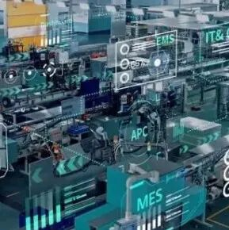

](https://mp.weixin.qq.com/s?__biz=MzIwMjMxODAzNA==&mid=2247610098&idx=1&sn=a4f6bc8ac86cbf8d13318873fc2d6a39&chksm=96e3e74fa1946e59322c3843dbf3c9f7b708f499ec9a81e21d73d468318debd75b8e7b59f282&scene=21#wechat_redirect)

[

大型制造企业数字化工厂数字孪生解决方案ppt

2024-07-24

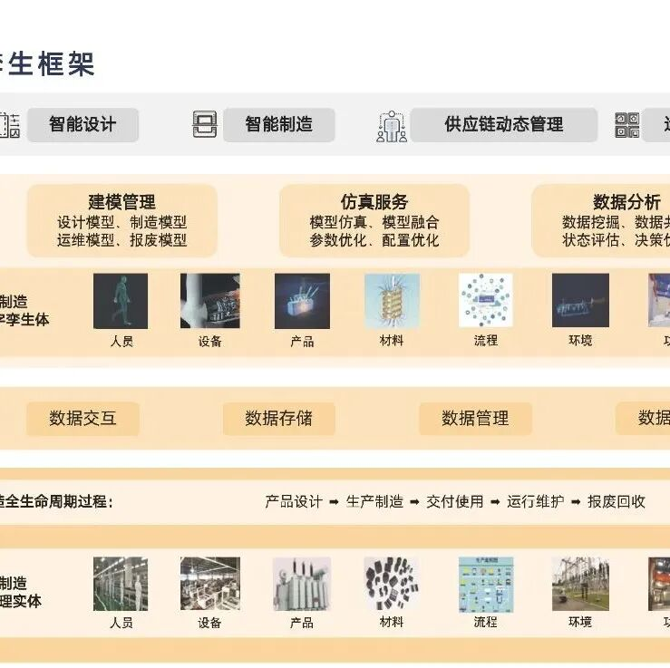

](https://mp.weixin.qq.com/s?__biz=MzIwMjMxODAzNA==&mid=2247610065&idx=1&sn=d4e082ceafcefcf6d85b86c49c23b67f&chksm=96e3e76ca1946e7a738223419bf6872a765c49c751faa7cab238de71be199e7e3705fddb9746&scene=21#wechat_redirect)

[

53页数字工厂顶层设计方案PPT

2024-07-20

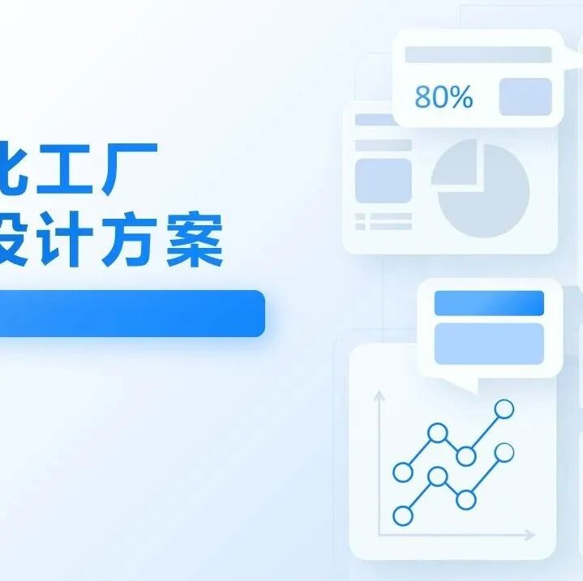

](https://mp.weixin.qq.com/s?__biz=MzIwMjMxODAzNA==&mid=2247609941&idx=1&sn=462862e61b0f9fb9457d8f56f25cc587&chksm=96e3e7e8a1946efef010e70a493a9a7a8c232f163544a3b8d91179ed04469a2bd8aec6471f6a&scene=21#wechat_redirect)

[

全球工业软件三座大山之CAD：美国军方开源CAD介绍

2024-07-19

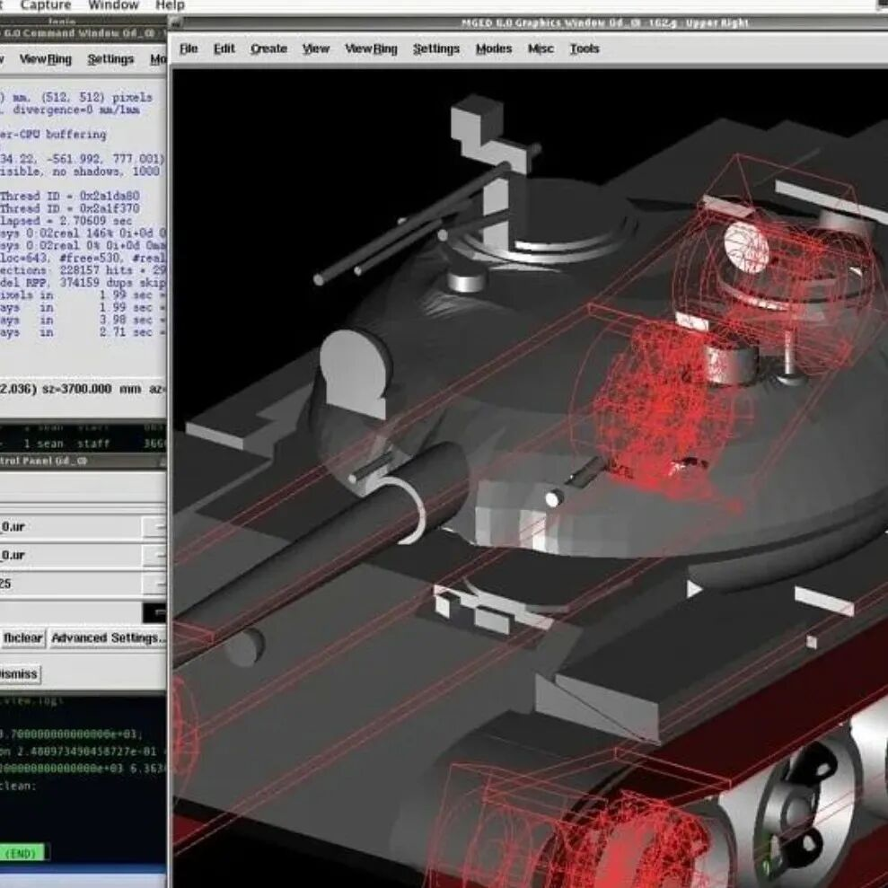

](https://mp.weixin.qq.com/s?__biz=MzIwMjMxODAzNA==&mid=2247609821&idx=2&sn=fb6c3a71494bddf8126599f56af52225&chksm=96e3e460a1946d76e645c96953aa1f30142a1e30af57af449b566cce2673a6f28904e42fdfb6&scene=21#wechat_redirect)

[当PLC遇见IT：未来PLC该拥有的“五项绝技”](https://mp.weixin.qq.com/s?__biz=MzIwMjMxODAzNA==&mid=2247609722&idx=1&sn=8b635a92d03c4c047f71c50d435b8535&chksm=96e3e4c7a1946dd1265f1bbd93cd6a21aac3c0342495f9c71d80e32845cbf2e1034d418f9688&scene=21#wechat_redirect)

[2024-07-17](https://mp.weixin.qq.com/s?__biz=MzIwMjMxODAzNA==&mid=2247609722&idx=1&sn=8b635a92d03c4c047f71c50d435b8535&chksm=96e3e4c7a1946dd1265f1bbd93cd6a21aac3c0342495f9c71d80e32845cbf2e1034d418f9688&scene=21#wechat_redirect)

[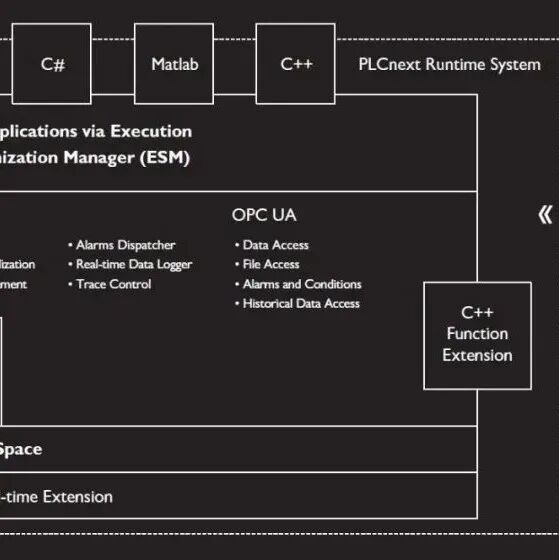](https://mp.weixin.qq.com/s?__biz=MzIwMjMxODAzNA==&mid=2247609722&idx=1&sn=8b635a92d03c4c047f71c50d435b8535&chksm=96e3e4c7a1946dd1265f1bbd93cd6a21aac3c0342495f9c71d80e32845cbf2e1034d418f9688&scene=21#wechat_redirect)