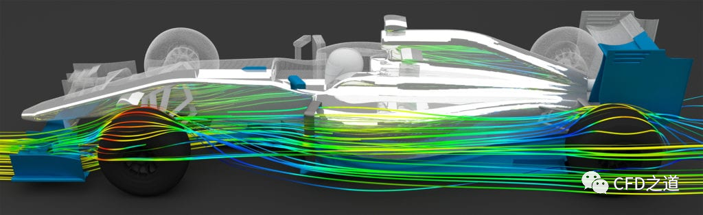
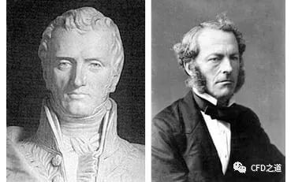
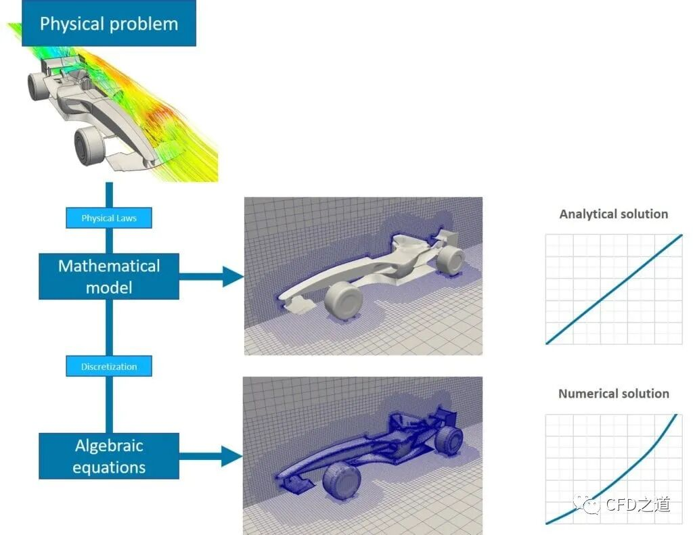
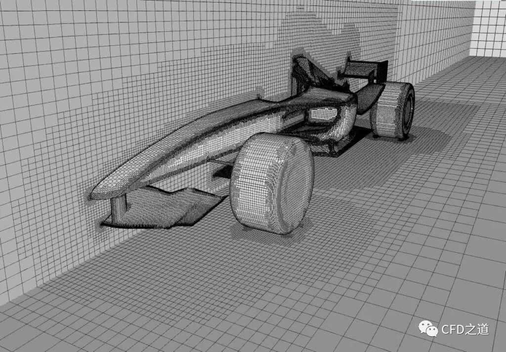
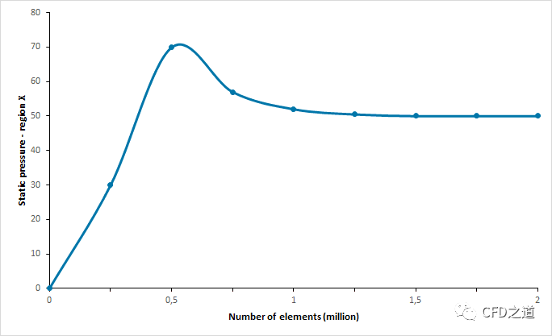

# CFD萌新入门｜何谓CFD？

> 原文地址: [https://mp.weixin.qq.com/s/ZMgQvp2TmjTxBrqovuzdOg](https://mp.weixin.qq.com/s/ZMgQvp2TmjTxBrqovuzdOg)

本文简要描述有关CFD的一些常识性的概念。

* * *

计算流体动力学（CFD）是一种通过数学计算，利用计算机求解控制方程，对物理流体流动进行预测的方法。在工程师设计新产品时，例如为新赛季设计一辆赛车，空气动力学对整体设计性能具有重要影响。然而，在概念设计阶段，空气动力学性能并不容易量化。

传统上，工程师只能通过物理测试原型产品来优化设计。但随着计算机技术的发展（得益于摩尔定律），CFD 已逐渐成为预测真实物理世界的常用工具。在 CFD 软件分析中，流体流动及其相关物理特性，如速度、压力、粘度、密度和温度，均根据设定的工作条件进行计算。为获得准确的物理解决方案，这些量需要同时计算。

无论商用还是开源，每种 CFD 工具都依赖数学模型和数值方法来预测所需的流动物理特性。最常见的 CFD 工具基于纳维 - 斯托克斯（N-S）方程。虽然纳维 - 斯托克斯方程中的大部分项保持不变，但根据物理学原理，可以添加或删除更多的项。例如，若需要考虑热量传递、相变或化学反应，就在控制方程中引入更多的项。

为了进行准确且成功的 CFD 分析，选择适当的运行条件、数值方法和物理因素十分重要。如果分析得当，就能迅速获得关于性能的洞察，并最终得到性能更优、效率更高的产品。

图1 利用 N-S 方程获得的F1赛车周围气流流线图

# 1 CFD的历史

自古以来，人类始终渴望解释流体流动的观察结果。那么，计算流体动力学（CFD）究竟有多古老呢？事实上，CFD 的历史可以追溯到 20 世纪初。然而，CFD 领域的一个显著缺点是其计算成本较高，这导致在计算能力取得显著改进之前，该领域的进展较为有限。在此之前，科学家和工程师主要致力于改进数学模型和数值方法，以降低计算成本。随着计算机技术的不断发展，计算能力在成本和性能方面取得了重大改进，从而使得 CFD 方法在近年来得到了广泛应用和快速发展。现在，CFD 已经成为预测和优化流体流动现象的重要工具，对于许多行业领域，包括航空航天、汽车制造和建筑设计等，都具有重要意义。

计算流体力学的发展历程可以概括为以下几个阶段：

-   1910 年之前：这一阶段主要集中在数学模型和数值方法的改进。
    
-   1910 - 1940 年：此阶段侧重于整合模型和方法，以实现在手工计算基础上的数值解。
    
-   1940 - 1950 年：这一时期从手工计算向计算机计算过渡，1953 年，Kawaguti 首次使用机械台式计算器求解圆柱体周围的流动。
    
-   1950 - 1960 年：美国洛斯阿拉莫斯国家实验室开始根据纳维 - 斯托克斯方程利用计算机对流体流动进行建模研究。此阶段还实现了全球首次二维、瞬态、不可压缩流动的模拟。
    
-   1960 - 1970 年：Hess 和 Smith 发表了关于三维体计算分析的第一篇科学论文，商用代码开始出现。这一时期还涌现出了许多重要的方法，如 k-ε 湍流模型、任意拉格朗日-欧拉模型和 SIMPLE 算法，这些方法至今仍在广泛应用。
    
-   1970 - 1980 年：波音公司、美国国家航空航天局（NASA）等机构发布的代码开始在多个领域，如潜艇、水面舰艇、汽车、直升机和飞机等应用中得到使用。
    
-   1980 - 1990 年：Jameson 等人改进了三维情况下跨音速流动的精确解法，学术界和工业界开始广泛应用商业代码。
    
-   1990 年至今：随着信息技术的全面发展，计算流体动力学在全球范围内的应用范围几乎覆盖了所有领域。
    

# 2 纳维-斯托克斯方程的兴起

纳维 - 斯托克斯方程是流体动力学理论模型的核心数学描述，它描绘了粘性流体领域的运动规律。该方程的发现历程颇具趣味。纳维 - 斯托克斯方程这一著名的数学模型是由 Claude-Louis Navier（1785-1836 年）和 Sir George Gabriel Stokes 爵士（1819-1903 年）共同提出的，令人惊讶的是，这两位学者从未曾见过面，这真是一个奇妙的巧合。

最初，1822年之前，Navier 对部分方程进行了研究。后来 1845 年Stokes 爵士对方程进行了调整，并最终确定了我们所熟知的纳维 - 斯托克斯方程。

图2 Navier(左)和Stokes(右)

# 3 控制方程

热流体研究的核心是基于流体物理特性守恒定律的控制方程。这些基本方程包括三个守恒定律：

-   质量守恒：连续性方程
    
-   动量守恒：牛顿第二定律
    
-   能量守恒：热力学第一定律或能量方程
    

这些原理表明，在封闭系统中，质量、动量和能量都是稳定的常数，换言之，一切都必须保持守恒。

对于涉及热变化的流体流动研究，需要考虑某些物理特性。从这三个基本守恒方程中，我们可以同时求解出三个未知数：速度、压力和温度。而  和  被认为是两个必要的独立热力学变量。

守恒方程的最终形式还包括另外四个热力学变量：密度ρ、焓 、粘度 μ 和热导率 ；其中后两个也是传输特性。这四种性质由  和  的值唯一决定。在分析流体流动时，需要了解流态中每一点的 、 和 。此外，基于流体运动特性的流动观测方法也是一个基本问题。

流体运动的研究方法主要有拉格朗日法和欧拉法。

-   拉格朗日法是通过跟踪足够多的流体粒子来检测其特性。这种方法需要检查流体粒子在时的初始坐标和在时的坐标。然而，要跟踪数百万个独立粒子的运动轨迹几乎是不可能的。
    
-   相反，欧拉法并不跟踪任何特定粒子的路径，而是将速度场作为空间和时间的函数进行研究。
    

总的来说：

-   拉格朗日法是从区域的起点开始，追踪每个点的轨迹，直到它到达终点。
    
-   欧拉法则是在区域中考虑一个窗口（控制体积），并分析该体积内的粒子流。
    

目前，基于 NS 方程（Navier-Stokes 方程）的流体流动与传热控制方程的基本形式如下：

-   连续方程
    

-   动量方程
    

-   能量方程
    

> 注：流体控制方程的具体形式及推导过程可参见任何一本计算流体力学教材，此处略过。
> 
> ”

# 4 偏微分方程 (PDE)

数学模型为我们揭示了整个过程中传输参数之间的相互关系。尽管这些方程中的每一项都会对物理现象产生影响，但在考虑参数变化时，我们需要借助数值解法来同时处理微分方程、矢量和张量符号。

多变量微分方程涉及一个或多个变量，用表示。如果方程的推导用表示，那么这类方程被称为常微分方程（ODE），它包含一个变量及其导数。在求解偏微分方程（PDE）时，需要将微分算子转化为代数算子。传热、流体动力学、声学、电子学和量子力学等领域广泛应用 PDE 来求解问题。

# 5 离散

数值解法是一种基于离散化的方法，可以求解那些无法通过解析方法得到的复杂问题的近似解。如下图所示，如果没有离散化，我们只能得到精确但简单的解析解。

另外，数值解法的精度在很大程度上取决于离散化的质量。有许多常用的离散化方法，如有限差分法、有限体积法、有限元法、谱（元）法和边界元法。这些方法都可以用来提高数值解法的精度。

图3 精确的数值离散化有助于使PDE线性化并捕捉敏感变量梯度

# 6 网格

多任务处理确实是许多现代人面临的挑战之一，往往会导致拖延或失败。因此，有计划、分阶段、有顺序地完成任务对于实现目标更为合适，这对计算流体动力学（CFD）也同样适用。

在进行 CFD 分析时，我们通常会将解域划分为多个子域，这些子域被称为单元。这些单元在计算结构中的组合被称为网格。通过将整个计算域划分为多个网格，我们可以更有效地分析和求解问题。这种方法有助于我们更好地理解流体流动、传热和其他物理现象在不同区域和条件下的表现。

图4 F1 赛车上不同的网格密度（细化程度）有助于捕捉与流动特性相关的变化

网格划分是将领域离散成小单元或元素的过程，以便在每个单元的线性假设下应用数学模型。这意味着我们需要确保需要求解的变量的行为在每个单元内都是线性的。这一要求还意味着，对于需要预测的物理属性疑似高度变化的区域，需要更精细的网格。

# 7 网格误差与网格独立性研究

网格误差是导致数值求解不准确或模拟失败的常见问题。这主要是由于网格过于粗糙，无法在较大的单元格区域内捕捉到流动物理特性。为了解决这个问题，我们需要进行网格独立性研究，以确保网格不会对求解产生显著影响。

网格独立性研究的步骤如下：

1.  首先，我们需要生成一个能够准确捕捉几何图形的初始网格，并通过目视检查确保计算区域内有足够的网格单元和网格密度。
    
2.  接下来，我们重新生成网格，在感兴趣的区域增加网格数量和网格密度。然后，再次进行计算流体动力学（CFD）分析，并比较结果。例如，如果我们要检查流经通道的内部流动情况，我们可以通过比较临界区域的压降来很好地衡量网格的灵敏度。
    
3.  我们不断细化网格，直到结果和关键物理特性（如压降、最大流速等）与之前粗网格的 CFD 分析结果基本一致。
    

通过这种方法，我们可以消除基于网格结构的误差，并获得最佳的元素数量，从而提高计算效率。下图显示了随着网格元素数量的增加，假想区域 X 的静压变化情况。如图所示，大约需要 100 万个网格才能进行可靠的研究。

图5 这一网格收敛分析示例显示了选择最佳网格尺寸对节省计算费用的重要性

# 8 CFD的收敛

创作雕塑的过程确实需要一位富有才华的艺术家，他能从一开始就想象出最终的作品。就像一块简单的岩石最终可能成为一件非凡的艺术品一样，CFD 分析也有类似的过程，依靠逐渐变化的结果，最终得出满意的解。

在 CFD 分析过程中，初始猜测被用作起点，就像艺术家开始时使用的石块。然后通过数值迭代，解场会从初始猜测变为最终的流场。但需要注意的是，虽然数值迭代负责得出最终解，但结果的精度仍然完全取决于网格的精确度。

收敛性是计算分析的首要问题。由于流体运动具有非线性数学模型，其中包含各种复杂的模型，如湍流、相变和传质，所以收敛性在很大程度上受到这些模型的影响。除了解析解，数值解还采用迭代方法，通过减少前几个阶段之间的误差来获得结果。当最后两个解之间的差异达到一定的程度，我们就可以认为结果已经收敛，也就是说，结果的可靠性增加，结果收敛到稳定的解。

总的来说，无论是创作雕塑还是进行 CFD 分析，都需要精确的过程控制和细致的结果观察，只有这样，才能得到理想的结果。

# 9 何时求解收敛

求解过程通过不断地迭代来达到解场停止变化的状态。这对于稳态模拟和瞬态模拟都是必要的。

在瞬态模拟中，我们必须在每个时间步长都取得收敛，这就好像它是一个稳态模拟。这是因为在瞬态模拟中，我们需要捕捉流体在不同时间点的变化，所以每个时间步长的收敛都是关键的。只有这样，我们才能获得准确的流体运动动态过程。

总的来说，无论是稳态模拟还是瞬态模拟，迭代求解的过程都需要不断地进行，直到解场达到收敛，这样才能获得准确的模拟结果。

# 10 收敛标准

方程的残差就像雕塑中剩余的石头，在每次迭代过程中逐渐减少。当迭代达到设定的阈值时，收敛便得以实现，这个过程类似于艺术家从雕塑中移除最后一块石头。关于收敛，还有以下几点需要注意：

1.  可以通过调整初始条件、选择合适的松弛因子和库朗数等参数来加速收敛。
    
2.  即使求解收敛了，结果也不一定完全正确。数学模型和网格质量不佳可能导致收敛但不正确的结果。
    
3.  为使计算求解更稳定，可采取一些方法，如确保网格质量合理、进行网格细化、使用一阶到二阶的离散格式等。
    
4.  如有需要，确保求解过程可重复，从而避免结果模糊不清。
    

* * *

> 原文地址：https://www.simscale.com/docs/simwiki/cfd-computational-fluid-dynamics/what-is-cfd-computational-fluid-dynamics/ 。本文采用 DeepL翻译，智谱清言进行文本润色。
> 
> ”

* * *

(完）

