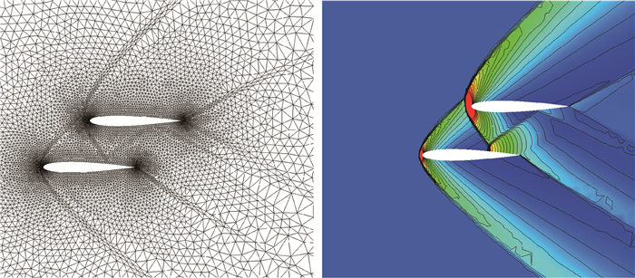

# 为什么CFD中少有基于有限差分的商业软件或者开源代码？

> 原文地址: [https://mp.weixin.qq.com/s/abQX0r5hzlqbSA9x\_xpiAA](https://mp.weixin.qq.com/s/abQX0r5hzlqbSA9x_xpiAA)

## 

# 提问

有限差分在CFD中应用十分广泛，为什么却少有基于FDM的商业软件或者开源代码/工具箱呢？是因为编程太简单了么？

# 一己之见，欢迎拍砖

尽管有限差分方法(FDM)在计算流体动力学(CFD)领域有着广泛的应用，并且在某些特定情况下展示出了优异的数值和工程性能，包括精度、稳定性和处理复杂几何的能力，但相比于有限体积法(FVM)和有限元法(FEM)，基于FDM的商业软件或开源代码确实相对较少。

个人认为，导致出现这种情况的因素主要是以下 **3 点**：

-   **网格适应性**：这应该是最主要的原因。FVM和FEM在处理非均匀和复杂网格时更为自然和灵活，因为能直接基于控制体积计算通量，这使得FVM和FEM在模拟具有复杂几何特征的流场时更受欢迎。
    
-   **耗散与稳定性**：高阶差分格式虽然可以提供较高的精度，但在网格变化剧烈或存在激波等极端流动条件下，可能会导致低耗散特性，从而影响稳定性和收敛性。FVM和FEM通过直接求解守恒方程，在处理这些情况时通常更为稳健。
    
-   **并行计算**：基于时间推进的FVM和FEM特别适合并行计算，因为FVM和FEM在离散化过程中自然地产生稀疏矩阵，这些矩阵可以很好地分割成多个子域，每个子域可以在不同的处理器上独立求解。这对于现代高性能计算(HPC)环境下的大规模模拟尤为重要。相比之下，FDM虽然也可以并行化，但由于其通常使用的紧致差分格式导致的数据局部性，可能会遇到更多的数据通信开销，尤其是在处理复杂的几何形状或非结构化网格时。
    

因此，尽管有限差分方法在理论和特定应用中具有一定优势，但在网格处理的灵活性、数值稳定性、计算效率等方面，与他方法相比的仍然具有比较大的局限性，这可能是其在CFD商业软件和开源代码中不那么常见的原因。当然，随着算法和技术的不断进步，未来也许会看到更多基于FDM的高效工具和软件出现。

#   

  推荐阅读

**FEtch 系统**是笔者团队开发的新一代有限元软件开发平台。只需按照有限元语言格式填写脚本文件，即可在线自动生成基于**现代 Fortran** 的有限元计算程序，从而大幅提高 CAE 软件的开发效率。欢迎私信交流。

有任何疑问或建议，欢迎加Q群 "**FEtch有限元开发系统(519166061)**" 留言讨论。我们长期开展 FEtch 系统的试用活动，感兴趣的朋友入群后可直接联系管理员，免费获取**许可证文件**。