# 流体力学基础知识图谱—流体与力的“N-S方程”详解

> 原文地址: [https://mp.weixin.qq.com/s/qVOS4M9TV3bHr5Esv94DYg](https://mp.weixin.qq.com/s/qVOS4M9TV3bHr5Esv94DYg)

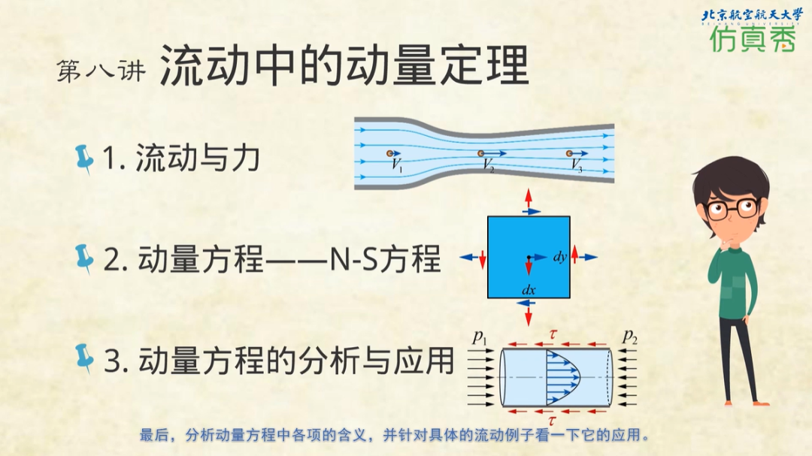

点击文尾阅读原文查看

**作者 |** 王洪伟 北京航空航天大学

**首发 |** 仿真秀App

### ─ ☕ ─

**导读：**本文由王洪伟老师原创，发布在《飞行器动力工程专业虚拟教研室》流体力学基础知识图谱，向公众免费开放阅读。它详细介绍了流体力学基础的知识，包括重要假设、基本方程、数学关系、热力学、运动学、流体性质、流动相似、可压流体、一维流体、静力学、粘性流动和势流法等。它是一个流体力学知识网页，内容将逐步添加并保持更新。这个知识图谱也将在仿真秀官网和APP同步更新，欢迎读者朋友点击文尾阅读原文查看更多。

本文节选自**流体力学基础知识图谱-基本方程-动量方程**。以下是正文：

## **一、积分形式的动量方程**

动量方程也就是牛顿第二定律，其数学表述为

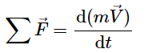

对于一个由流体质点系组成的体系来说，其更一般的表述形式为

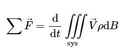（1）

式中的𝑩表示体积（Body的简写，为了和速度区分，不使用𝑽）

式(1)中的左端项为体系所受到的合力，如果取某一时刻该体系所占据的空间为控制体，则体系所受的力就是控制体所受的力：

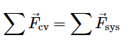 （2）

可以通过雷诺输运定理将体系的动量变化转化为针对控制体的变化。令雷诺输运定理中的𝝓代表单位体积的动量  则有

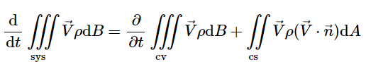（3）

**式中：**

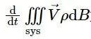为体系的动量随时间的变化；

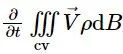为控制体内流体的动量随时间的变化；

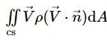为净流出控制体的动量。

把式（2）和式（3）代入式（1）中，得

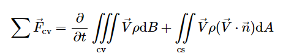（4）

式（4）就是针对控制体的积分形式的动量方程。这个公式的意义更多是用于理论推导，工程中用到最多的是针对准一维流动的，这时，公式右端两项中的密度和速度项可以用平均值来表示。经过这样的简化后,可以得到一维流动的动量方程为

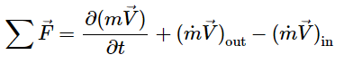

上式表示了这样的物理意义：**作用于控制体的合外力可能会产生两个效果，一个是控制体内的动量有所增加**，另一个是一部分动量会被“推出”控制体。如果公式右端的后两项为零，相当于把控制体封闭起来，不让动量进出，这时控制体所受的力只引起控制体内流体动量的变化，这样的控制体就相当于体系。如果公式右端的第一项为零，则相当于定常流动，控制体内的动量保持不变，作用于控制体的力产生的动量增量完全被排出控制体。

工程上很多常见的流动都是定常流动，此时动量方程简化为

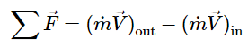（5）

式（5）的用途很广，大量实际流动的问题都可以用该式求解，只要这些流动的进出口可以看作一维流动即可。对于那些进出口处的流动比较复杂，或者那些没有明确的进出口的流动，显然应该使用更一般的公式。特别地，如果我们想进一步知道流场中具体 位置的性质与受力的关系，比如机翼表面某处的压力大小，就不该用积分形式的方程，而是使用微分形式的方程。

## **二、微分形式的动量方程**

和前面连续方程的推导一样，通过积分变换可以从积分形式的动量方程直接得到其微分形式，也可以通过对微控制体进行分析来得到微分形式的动量方程。显然第二种方式的物理意义更为明确，因此这里微分形式的动量方程将只通过对微控制体进行分析来得到。

取一个随其它流体一起运动的六面体流体微团，应用牛顿第二定律，得

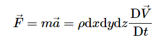（6）

流体微团所受的力可以分为体积力和表面力

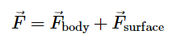（7）

其中的体积力可以用单位质量的体积力与流体微团质量的乘积表示如下：

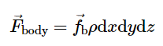（8）

显然，表面力更加复杂一些，下面我们来分析图1中流体微团6个面上的表面力。图中为了清晰，只表示出了与𝒙轴和𝒚轴垂直的两对面上的表面力，与𝒛轴垂直的一对面上的表面力和体积力都未画出。按照一般约定取拉力为正，压力为负。与𝒙轴垂直的两个面中，左侧面上的表面力为表面应力与面积的乘积，若用表示这个表面应力（注意，这里的下标𝒙指的是作用于相应表面的力，而不代表方向，因此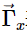沿三个坐标方向都有分量），则左侧面的表面力为

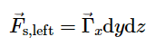

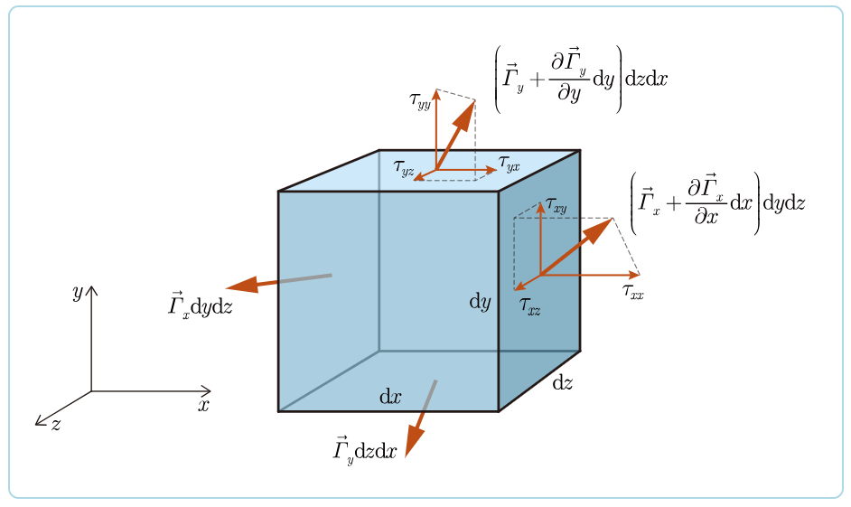

图1 作用于流体微团上的表面力

右侧面的表面力可以表示为

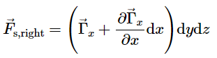

这两个面上表面力的合力为

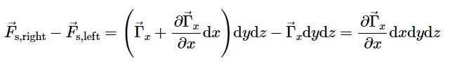

同理，另外两对儿平面上表面力的合力分别为

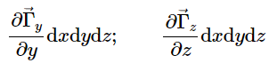

流体微团6个面上所有表面力的合力为

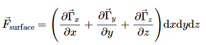（9）

将式（7）、式（8）和式（9）代入牛顿第二定律（6）中，就得到了针对流体微团的应力形式的动量方程：

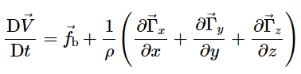（10）

此公式的物理意义非常明确，其左侧为流体微团单位质量的动量变化（即加速度），右侧第一项为单位质量流体所受的体积力，右侧第二项为单位质量流体所受的表面力。

要想应用动量方程解决问题，就要将其中的表面力表达成跟流动有关的形式才行。从图1中可以看出，任一表面应力可以分解成3个应力分量，包含一个正应力和两个切应力，即

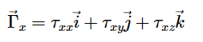（11）

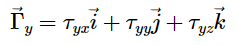（12）  

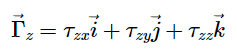（13）

在上述公式中，𝝉为表面应力分量，其下标中的第一个字母代表应力作用的表面，第二个字母代表应力的作用方向。例如，表示了作用在图1中的微元体的左右两个表面上的力，方向是沿𝒛轴。若作用面的法向为沿𝒙轴正方向（即图1中的右侧面），则的正方向是沿𝒛轴的正方向；若作用面的法向为沿𝒙轴负方向（即图1中的右侧面），则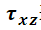的正方向是沿𝒛轴的负方向

将应力的分量形式式（11）~式（13）代入应力形式的动量方程（10）中，得到应力分量形式的动量方程如下：

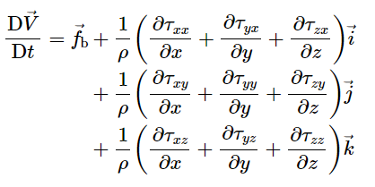（14）

式（14）用张量来表示更为简洁：

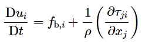（15）

可以证明9个应力分量存在如下关系（相关证明请参见角动量方程部分）

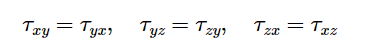

因此，应力分量一共有6个独立的变量。即

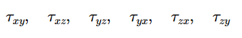

纳维 和泊松等人都对式（15）进行了研究。这个式子对固体和流体都成立，对于固体，可以代入应力和应变的关系得到有用的关系式。对于流体，欧拉 在1755年给出了无黏流动的关系式。无黏流动中切应力等于零，正应力等于压力

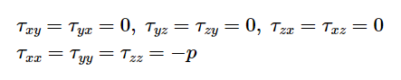

把上面的关系式代入（15）中，得

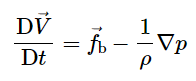（16）

这就是**无粘流动的动量方程**，因为是欧拉最早给出的，所以称为**欧拉方程。**

在欧拉方程（16）中，左端项是单位质量流体动量的改变，右端第一项是体积力，右端第二项是压差力。其物理意义为：当流动为无黏时，流体的动量改变只由两种力产生，体积力和压差力。对于体积力为重力的无粘流动，如果一个流体质点在加速，要么它是在下落，要么它是在从高压区流向低压区。

对于有黏性的流动，还是需要解决式（15）中的应力的问题。流体与固体不同，构成剪切应力的黏性力不是由应变决定的，而是与流动有关，其中牛顿流体的黏性力与应变率成正比。我们在第1章讨论流体的黏性时，已经给出了对于平行流动，黏性应力与应变率的关系，即牛顿内摩擦定律

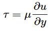

这个关系式是基于牛顿黏性力实验得到的，如图2左图所示，剪切力表示的是作用在与𝒚轴垂直的平面上，指向𝒙轴方向的，确切地说应写成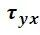。当流动不是沿𝒙方向流动时，剪切力不仅与𝒙方向的速度𝒖的变化有关，还与𝒚方向的速度𝒗的变化有关。对于图2右图所示的一般情况的剪切流动，牛顿流体剪切力的表达式为：

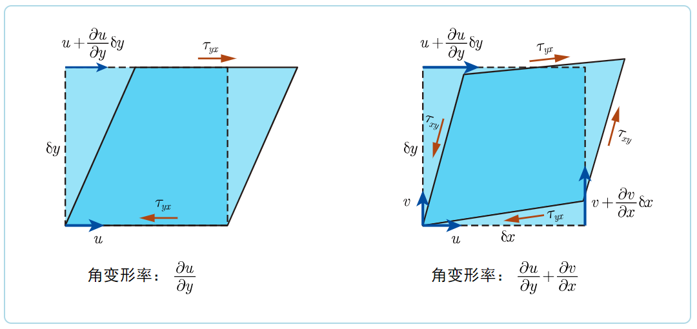

图2 微团的变形和剪切力

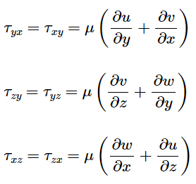（17）

可见，牛顿黏性力实验得到的关系式只是一般的剪切力关系的一个特例。实际上图2左图的变形包括了剪切和旋转，把式（17）中的第一个关系式进行一下坐标旋转，就可以得到牛顿内摩擦定律关系式，这个工作留给感兴趣的读者自己去推导。

正应力不像切应力那样容易得到，除了压力，黏性也产生一部分正应力，否则微元体就不满足力的平衡关系了。这个关系式最早是由斯托克斯得出的，具体推导过程见**牛顿流体的本构方程**。3个正应力的关系式如下

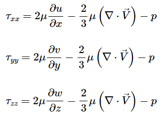（18）

由式（18）可以看到，流体微团所受的正应力包含黏性力的贡献，以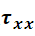为例，其中的黏性正应力为

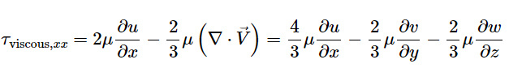

对于不可压缩流动，，黏性正应力与x方向的伸长率成正比，对于可压缩流动，黏性正应力还与体积变化相关。不过即使是可压缩流动，体积变化引起的黏性力一般也要小于伸长引起的黏性力，所以有些书中就直接忽略这一项，而将黏性正应力直接写为

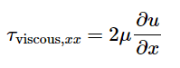

多数情况下黏性正应力都是正的，也就是体现为拉力，在牛顿流体中，黏性正应力几乎总是远远小于压力，所以基本上可以忽略。

式（17）和式（18）分别给出了牛顿流体在任意流动状态下的应力和应变率，是牛顿流体的本构方程，因为其是牛顿内摩擦定律的推广，所以又称为广义牛顿内摩擦定律。需要注意的是，其中的正应力表达式（18）并不是完全精确的，斯托克斯在此引入了一些假设。不过对于一般常见的流动，式（18）是足够精确的。

牛顿流体的本构方程中，9个应力构成一个二阶张量：

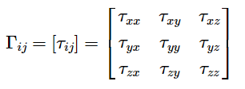（19）

包含应变率和转动的9个流动分量也构成一个二阶张量，表示为

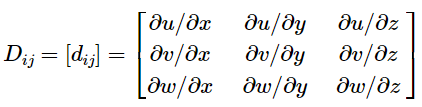（20）

广义牛顿内摩擦定律建立起了应力和应变率的关系，因此称为本构方程。对于固体，本构方程是应力与应变的关系，对于有些非牛顿流体，本构方程可能与应变和应变率都相关，或者还与作用时间长度相关。

将牛顿流体的本构方程（17）和（18）代入应力形式的动量方程（15）中，就可以得到最终形式的动量方程：

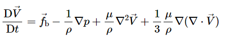（21）

该式称为纳维—斯托克斯（Navier-Stokes）方程，简称N-S方程。其中各项的物理意义列出如下：

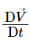—— 流体的动量随时间的变化，或称之为惯性力项

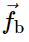—— 体积力项

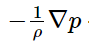—— 压差力项

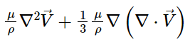—— 黏性力项

N-S方程的展开形式可以写为

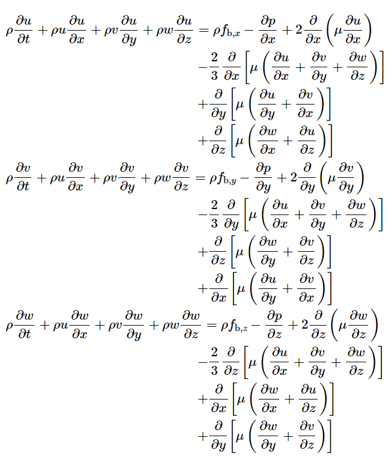

这个方程看起来很复杂，但这不是求解的障碍，其不易求解的主要原因是其中的对流加速度是非线性的。实际上黏性力项也应该是非线性的，式（21）中，若忽略黏性系数随温度的变化，黏性力项就可以认为是线性的。

在实际应用中，只要流体不是处于强压缩（如强激波内部）流动，式（21）的最后一项就可以忽略，因此有些书上的N-S方程直接写成如下形式

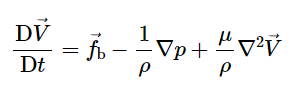

**三、****流体中的动量定理视频教程**

为了更好的理解N-S方程，推荐读者观看《流体力学基础21讲》视频课程第八期\-**流体中的动量定理**。这是北京航空航天大学王洪伟老师原创的系列流体力学教学视频，一共有21讲。该视频不与任何课程或者书籍完全对应，但与王洪伟老师编著的《我所理解的流体力学》有较多相同的内容。

王老师讲课形象、生动、具体、大气磅礴，条理极其清晰，独立制作画面效果堪比纪录片！自上线以来，深受用户五星好评，目前在仿真秀视频播放量已突破了27万次！

**本课程完全免费，播放地址：**

https://www.fangzhenxiu.com/course/166459

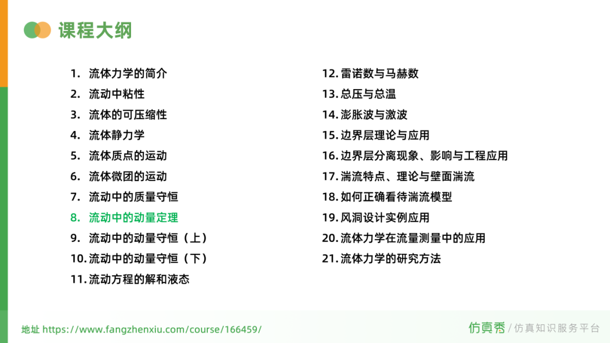

**喜欢****作者******，请点********赞********和在看********

****