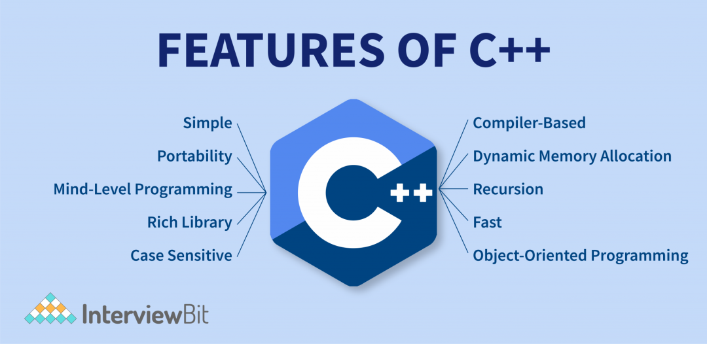
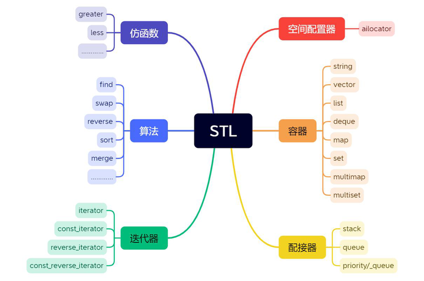
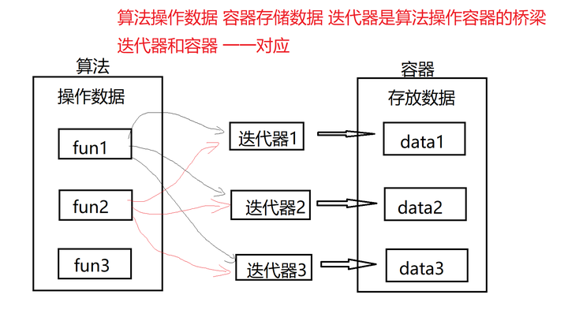

# C/C++学习笔记：STL标准库简介

> 原文地址: [https://mp.weixin.qq.com/s/39JbmPkVFDBLDW6mgJIsQw](https://mp.weixin.qq.com/s/39JbmPkVFDBLDW6mgJIsQw)

### 

点击上方「蓝字」关注我们

在C++的世界里，有一把钥匙能开启高效编程的大门，那就是STL（Standard Template Library，标准模板库）。STL不仅提供了丰富的容器类型，还囊括了算法和迭代器，几乎涵盖了所有常见的数据结构与算法需求，极大地简化了程序设计过程，提高了开发效率。本文将带你初步了解STL的核心组件，包括容器、算法和迭代器，并通过实例代码展示它们的使用方法。

## STL概述

STL是C++标准库的一部分，它由三个主要部分组成：**容器**（Containers）、**算法**（Algorithms）和**迭代器**（Iterators）。这三个部分紧密协作，共同构成了一个功能强大的编程工具箱。容器用于存储数据，算法提供了处理数据的方法，而迭代器则充当了两者之间的桥梁，使得算法能够遍历容器中的元素。

## 容器

容器是STL中最直观的部分，它们用于存储各种类型的数据。STL提供了多种类型的容器，每种容器都有其特定的用途和性能特点。以下是几种常用的STL容器及其简要介绍。

### 向量（vector）

向量是一个动态数组，支持随机访问，可以在末尾高效地添加或删除元素。它非常适合需要频繁访问元素的场景。例如：

`#include <vector>   #include <iostream>      int main() {    // 创建一个整型向量    std::vector<int> vec;       // 在向量末尾添加元素    vec.push_back(1);    vec.push_back(2);    vec.push_back(3);       // 访问向量中的元素    std::cout << vec[0] << " " << vec[1] << " " << vec[2] << std::endl;       // 获取向量的大小    std::cout << "size: " << vec.size() << std::endl;       // 删除向量中的元素    vec.pop_back();       std::cout << "size: " << vec.size() << std::endl;       return 0;   }   `

### 链表（list）

链表是一个双向链表，支持在任意位置高效地插入和删除元素，但不支持随机访问。它适合需要频繁插入和删除元素的场景。例如：

`#include <list>   #include <iostream>      int main() {    // 创建一个整型链表    std::list<int> lst;       // 在链表末尾添加元素    lst.push_back(1);    lst.push_back(2);    lst.push_back(3);       // 访问链表中的元素    std::cout << lst.front() << " " << lst.back() << std::endl;       // 获取链表的大小    std::cout << "size: " << lst.size() << std::endl;       // 删除链表中的元素    lst.pop_back();       std::cout << "size: " << lst.size() << std::endl;       return 0;   }   `

### 映射（map）

映射是一种键值对数据结构，可以通过键来查找值。它支持高效的查找、插入和删除操作。例如：

`#include <map>   #include <iostream>      int main() {    std::map<std::string, int> m = {{"one", 1}, {"two", 2}, {"three", 3}};    m["four"] = 4;  // 插入键值对    std::cout << "Value of 'one': " << m["one"] << std::endl;  // 访问值    if (m.find("two") != m.end()) {        std::cout << "Key 'two' exists" << std::endl;  // 查找键    }    m.erase("three");  // 删除键值对    return 0;   }   `

### 集合（set）

集合是一种用于存储唯一元素的数据结构，不允许有重复的元素。它支持高效的插入、删除和查找操作。例如：

`#include <set>   #include <iostream>      int main() {       std::set<int> s = {1, 2, 3};       s.insert(4);  // 插入元素       if (s.find(2) != s.end()) {           std::cout << "Element 2 exists" << std::endl;  // 查找元素       }       s.erase(3);  // 删除元素       return 0;   }   `

## 算法

STL提供的算法是一系列通用的函数模板，可以应用于任何支持迭代器的容器。这些算法包括排序、查找、复制、删除等，大大简化了数据处理的复杂度。以下是一些常用的算法及其示例：

### 排序（sort）

`sort`算法用于对容器中的元素进行排序。例如：

`#include <algorithm>   #include <vector>   #include <iostream>      int main() {    std::vector<int> vec = {3, 1, 4, 1, 5, 9};    std::sort(vec.begin(), vec.end());  // 排序    for (int i : vec) {        std::cout << i << " ";    }    return 0;   }   `

### 查找（find）

`find`算法用于在容器中查找特定的元素。例如：

`#include <algorithm>   #include <vector>   #include <iostream>      int main() {    std::vector<int> vec = {1, 2, 3, 4, 5};    auto it = std::find(vec.begin(), vec.end(), 3);  // 查找元素    if (it != vec.end()) {        std::cout << "Element found at index: " << std::distance(vec.begin(), it) << std::endl;    }    return 0;   }   `

### 复制（copy）

`copy`算法用于将一个容器中的元素复制到另一个容器中。例如：

`#include <algorithm>   #include <vector>   #include <iostream>      int main() {       std::vector<int> src = {1, 2, 3, 4, 5};       std::vector<int> dest(src.size());       std::copy(src.begin(), src.end(), dest.begin());  // 复制       for (int i : dest) {           std::cout << i << " ";       }       return 0;   }   `

## 迭代器

迭代器是STL中的一个重要概念，它提供了一种统一的方式来访问容器中的元素。迭代器类似于指针，但更加灵活，可以用于不同类型的容器。通过迭代器，算法可以遍历容器中的元素，执行各种操作。

****

以下是一些常用的迭代器操作：

### 遍历容器

使用迭代器遍历容器中的元素。例如：

`#include <vector>   #include <iostream>      int main() {    std::vector<int> vec = {1, 2, 3, 4, 5};    for (auto it = vec.begin(); it != vec.end(); ++it) {        std::cout << *it << " ";    }    return 0;   }   `

### 修改元素

使用迭代器修改容器中的元素。例如：

`#include <vector>   #include <iostream>      int main() {       std::vector<int> vec = {1, 2, 3, 4, 5};       for (auto it = vec.begin(); it != vec.end(); ++it) {           *it += 2;  // 修改元素       }       for (int i : vec) {           std::cout << i << " ";       }       return 0;   }   `

## 小结

STL作为C++标准库的重要组成部分，提供了丰富的容器、算法和迭代器，极大地简化了程序设计过程，提高了开发效率。通过本文的介绍，相信你已经对STL有了一个初步的了解。无论是初学者还是经验丰富的开发者，掌握STL都是提高编程技能的关键一步。希望本文能帮助你在C++编程的道路上更进一步。

# 推荐阅读

  

  

 

  

