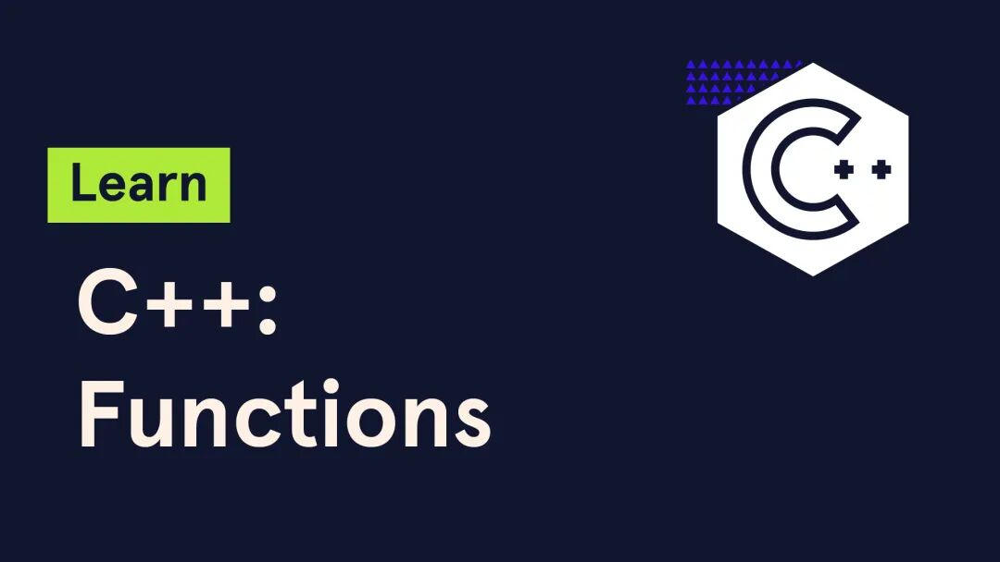

# C++中的函数应用：从基础到高级

> 原文地址: [https://mp.weixin.qq.com/s/m-iFHlzMRQF-CnWScmAx6g](https://mp.weixin.qq.com/s/m-iFHlzMRQF-CnWScmAx6g)

C++是一种静态类型的、编译式的、通用的、大小写敏感的编程语言，支持过程化编程、面向对象编程和泛型编程。在C++中，函数是构建程序的基本单元之一，它能够执行一系列操作并返回结果。本文将从基础开始，逐步深入探讨C++函数的高级应用，包括函数指针、Lambda表达式、函数对象以及它们在STL中的使用等。

## 函数的基础

在C++中，定义一个简单的函数如下：

`int add(int a, int b) {       return a + b;   }   `

此函数接收两个整数参数，并返回它们的和。调用这个函数也非常简单：

`int result = add(3, 4); // result will be 7   `

## 函数指针

函数指针可以用来存储函数的地址，通过函数指针调用函数可以增加代码的灵活性。例如，我们可以定义一个函数指针类型：

`typedef int (*FuncPtr)(int, int);   `

然后，将`add`函数的地址赋给一个函数指针变量：

`FuncPtr ptr = &add;   int res = ptr(5, 6); // res will be 11   `

使用函数指针的一个常见场景是在排序算法中传递比较函数。例如，使用`qsort`函数时，可以通过传递不同的比较函数来实现升序或降序排序。

## 函数模板

函数模板允许我们编写通用的函数，这些函数可以处理不同类型的参数。定义一个函数模板的语法如下：

`template <typename T>   T max(T a, T b) {       return (a > b) ? a : b;   }   `

在这个例子中，`max`函数可以接受任何类型（只要该类型支持大于运算符）的参数，并返回较大的那个。调用时，编译器会根据传入的参数类型自动生成相应的函数实例：

`int i = max(3, 4); // i will be 4   double d = max(3.14, 2.71); // d will be 3.14   `

## Lambda表达式

Lambda表达式是从C++11标准开始引入的一种匿名函数，它可以在需要的地方直接定义和使用，无需提前声明。Lambda表达式的一般形式如下：

`[捕获列表] (参数列表) -> 返回类型 { 函数体 }   `

例如，定义一个简单的Lambda表达式来计算两个数的和：

`auto sum =  { return a + b; };   int result = sum(3, 4); // result will be 7   `

Lambda表达式特别适用于需要简短函数的情况，如在STL算法中作为比较器或谓词。例如，使用`std::sort`对数组进行降序排序：

`int arr[] = {5, 3, 4, 1, 2};   std::sort(std::begin(arr), std::end(arr),  { return a > b; });   `

## 函数对象(仿函数)

函数对象（也称为仿函数）是重载了函数调用操作符`operator()`的对象。这意味着你可以像调用普通函数一样调用这些对象。函数对象的一个主要优点是它们可以携带状态信息。例如，定义一个计数器函数对象：

`class Counter {   public:       int count = 0;       void operator()() { ++count; }   };      Counter c;   c(); // count is now 1   c(); // count is now 2   `

在STL中，许多算法接受函数对象作为参数，这使得我们可以轻松地实现复杂的逻辑。例如，使用`std::find_if`查找第一个满足条件的元素：

`class isEven {   public:       bool operator()(int n) const {            return n % 2 == 0;        }   };      std::vector<int> vec = {1, 2, 3, 4, 5};   auto it = std::find_if(vec.begin(), vec.end(), isEven());   // it指向vec中的第一个偶数元素   `

## 高阶函数

高阶函数是指接受函数作为参数或返回函数的函数。C++ 标准库中的许多算法函数都是高阶函数，例如 `std::for_each`、`std::transform` 和 `std::sort` 等。

`void square(int& x) {       x = x * x;   }      std::vector<int> numbers = {1, 2, 3, 4, 5};   // 使用 std::for_each 应用平方函数   std::for_each(numbers.begin(), numbers.end(), square);      for (int num : numbers) {      std::cout << num << " ";  // 输出: 1 4 9 16 25   }   `

## 小结

本文从基础的函数定义开始，逐步介绍了函数指针、函数模板、Lambda表达式、函数对象已经高阶函数的应用。通过这些高级特性，我们可以编写更加灵活、高效且易于维护的C++代码。希望本文能够帮助读者更好地理解和应用C++中的函数技术。

# 推荐阅读

  

